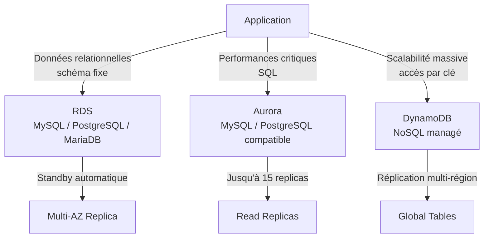

# Bases de données AWS — RDS, Aurora, DynamoDB

## Objectifs pédagogiques

À l'issue de ce module, tu seras capable de :

- Distinguer RDS, Aurora et DynamoDB selon leur modèle de données et leurs garanties opérationnelles
- Sélectionner le service de base de données adapté à un cas d'usage précis
- Configurer la haute disponibilité avec Multi-AZ et les read replicas
- Identifier les causes courantes de dégradation de performance sur une base AWS managée
- Dimensionner une architecture de données pour un contexte applicatif réel

---

## Pourquoi les bases de données managées changent tout

Faire tourner une base de données sur une instance EC2 brute, c'est techniquement faisable. C'est aussi prendre en charge les sauvegardes, les patchs moteur, la réplication, le failover et le monitoring des métriques internes — en plus du reste. Sur des équipes réduites ou des projets qui évoluent vite, ce coût opérationnel est rarement justifiable.

AWS a résolu ce problème en proposant plusieurs services managés, chacun taillé pour un profil d'usage différent. Mais "managé" ne veut pas dire "interchangeable" : choisir DynamoDB à la place d'Aurora par confort ou par habitude peut faire exploser les coûts ou introduire des contraintes de modélisation invisibles au démarrage.

Ce module couvre les trois piliers du stockage relationnel et NoSQL sur AWS — et surtout, comment choisir entre eux.

---

## Les trois services en perspective

Avant d'entrer dans les détails, voici la grille de lecture globale :

| Service | Modèle | Cas d'usage typique | Point fort |
|---|---|---|---|
| **RDS** | Relationnel SQL | Apps classiques, migrations on-prem | Compatibilité moteur, simplicité |
| **Aurora** | Relationnel SQL optimisé | Hautes performances, workloads critiques | 5× MySQL, 3× PostgreSQL, HA native |
| **DynamoDB** | NoSQL clé-valeur / document | Sessions, IoT, catalogue, événements | Scalabilité illimitée, latence <10 ms |



---

## RDS — Le SQL managé sans surprises

RDS (Relational Database Service) prend en charge les moteurs que tu connais déjà : MySQL, PostgreSQL, MariaDB, Oracle, SQL Server. L'idée centrale est simple : AWS gère l'infrastructure, tu gères les données et les requêtes.

Ce que RDS fait en arrière-plan, sans intervention de ta part : backups quotidiens vers S3 (rétention configurable de 1 à 35 jours), application des patchs moteur pendant les fenêtres de maintenance, surveillance via CloudWatch (CPU, connexions, IOPS, latence), chiffrement at-rest et in-transit.

**Limite de stockage importante** : RDS utilise des volumes EBS standard. Avec InnoDB (le moteur par défaut de MySQL/MariaDB), chaque table est stockée dans son propre tablespace avec une limite de **16 To par table**. Le volume total peut aller jusqu'à 64 To, mais au-delà de 16 To par table il faut partitionner manuellement — ce qui ajoute de la complexité opérationnelle. Le stockage RDS ne grandit **pas automatiquement** de façon transparente comme Aurora : tu définis une taille maximale et RDS alloue dans cette limite. Si ta base de données dépasse 50 To ou est en forte croissance, Aurora est un meilleur choix grâce à son stockage distribué qui scale automatiquement jusqu'à 128 To sans intervention.

### Multi-AZ : disponibilité sans compromis

Quand tu actives Multi-AZ, AWS crée un standby synchrone dans une autre zone de disponibilité. Ce standby n'est **pas accessible en lecture** — il sert uniquement au failover.

**Comment le failover fonctionne concrètement** : en cas de panne de l'instance primaire, AWS bascule le **CNAME** (canonical name record / enregistrement DNS) de l'endpoint RDS pour pointer vers l'instance standby, qui est alors promue en nouvelle primaire. C'est un switch DNS, pas un changement d'IP — les adresses IP sont liées aux subnets et les subnets ne traversent pas les AZ. L'application ne voit aucun changement si elle utilise l'endpoint DNS fourni par RDS (et non une IP en dur). Le basculement prend entre 60 et 120 secondes.

Ce mécanisme a deux conséquences importantes :
- Ton application doit **toujours utiliser l'endpoint DNS** RDS, jamais l'IP directe — sinon le failover est silencieusement ignoré
- Le standby n'est **pas créé au moment de la panne** — il existe déjà, avec les données synchronisées. Le failover est une promotion instantanée, pas une reconstruction

⚠️ Confondre Multi-AZ et read replica est l'erreur classique. Multi-AZ = haute disponibilité (failover automatique, standby synchrone, même région). Read replica = montée en charge en lecture (réplication asynchrone, peut être cross-region). **Multi-AZ n'améliore pas les performances** — le standby n'est pas lisible tant qu'il n'est pas promu.

### Read replicas : délester les lectures

Un read replica reçoit la réplication asynchrone depuis l'instance principale. Il répond aux SELECT pendant que le primary gère les INSERT/UPDATE/DELETE. Sur une application web standard où 70 à 80 % du trafic est en lecture, ajouter un replica peut diviser la charge du primary sans toucher au schéma ni à la couche applicative.

RDS supporte jusqu'à 5 read replicas par instance. Ils peuvent aussi être promus en instance indépendante pour une migration ou une urgence.

```bash
# Lister toutes les instances RDS du compte
aws rds describe-db-instances \
  --query "DBInstances[*].{ID:DBInstanceIdentifier,Engine:Engine,Status:DBInstanceStatus,AZ:AvailabilityZone}"

# Créer une instance RDS PostgreSQL avec Multi-AZ activé
aws rds create-db-instance \
  --db-instance-identifier <INSTANCE_ID> \
  --db-instance-class <INSTANCE_CLASS> \
  --engine <ENGINE> \
  --master-username <DB_USER> \
  --master-user-password <DB_PASSWORD> \
  --allocated-storage <STORAGE_GB> \
  --multi-az

# Créer un read replica depuis une instance existante
aws rds create-db-instance-read-replica \
  --db-instance-identifier <REPLICA_ID> \
  --source-db-instance-identifier <SOURCE_INSTANCE_ID>
```

---

## Aurora — Quand RDS ne suffit plus

Aurora n'est pas "juste un RDS plus rapide". Son architecture interne est fondamentalement différente — et c'est ce qui explique ses performances.

Là où RDS attache un volume EBS classique à chaque instance, Aurora utilise un **stockage distribué partagé** répliqué sur 6 nœuds répartis dans 3 zones de disponibilité. Les données sont écrites simultanément sur 4 des 6 nœuds avant d'être considérées comme validées (quorum d'écriture). Résultat : même si deux nœuds de stockage tombent simultanément, Aurora continue de fonctionner sans perte de données.

Ce découplage calcul/stockage change plusieurs choses concrètes :

- **Failover en moins de 30 secondes** contre 1-2 minutes pour RDS Multi-AZ — Aurora n'a pas à promouvoir un standby, le stockage est déjà partagé entre tous les nœuds
- **Jusqu'à 15 read replicas** contre 5 pour RDS, tous connectés au même volume — pas de décalage de réplication lié aux I/O disque
- **Auto-scaling du stockage** de 10 Go jusqu'à 128 To par incréments de 10 Go, sans intervention manuelle ni downtime — c'est la raison principale pour laquelle Aurora est le bon choix dès qu'une base OLTP dépasse les dizaines de To ou est en forte croissance, là où RDS serait limité par la taille maximale de ses tablespaces EBS
- **Performances** annoncées à 5× MySQL et 3× PostgreSQL standard — les benchmarks indépendants confirment en général un facteur 2 à 4× selon le workload

Aurora propose également un mode **Serverless v2** : la capacité de calcul s'ajuste automatiquement en fractions d'ACU (Aurora Capacity Units) selon la charge réelle. Utile pour des environnements à trafic imprévisible ou des bases de développement inactives la nuit.

**Migrer de Aurora Provisioned vers Serverless** : on ne peut pas simplement changer l'instance class d'un cluster existant de Provisioned à Serverless — ce sont deux types de clusters distincts. Pour migrer avec un downtime minimal, il faut utiliser **AWS DMS** (Database Migration Service) avec la réplication continue (CDC) vers un nouveau cluster Aurora Serverless. DMS réplique les données en temps réel depuis la source vers la cible : tu bascules l'application quand le lag est proche de zéro. L'alternative par snapshot (arrêter la base → snapshot → restaurer en Serverless) fonctionne mais impose un downtime pendant toute la restauration.

```bash
# Lister les clusters Aurora avec leur statut
aws rds describe-db-clusters \
  --query "DBClusters[*].{Cluster:DBClusterIdentifier,Engine:Engine,Status:Status}"

# Ajouter un read replica Aurora à un cluster existant
aws rds create-db-instance \
  --db-instance-identifier <REPLICA_INSTANCE_ID> \
  --db-cluster-identifier <CLUSTER_ID> \
  --db-instance-class <INSTANCE_CLASS> \
  --engine <AURORA_ENGINE>
```

🧠 Aurora coûte environ 20 % de plus qu'une instance RDS équivalente. Ce surcoût devient négligeable dès que la charge dépasse ~500 connexions simultanées ou ~1 000 req/s — là où RDS commence à montrer ses limites et où les opérations manuelles de réplication se multiplient. En dessous de ce seuil, RDS est souvent le bon choix.

> **SAA-C03** — Aurora = **MySQL et PostgreSQL uniquement**. Si Oracle ou SQL Server → **RDS**. "Serverless + relational + intermittent" → **Aurora Serverless v2**.

---

## DynamoDB — Le NoSQL qui ne connaît pas les limites

DynamoDB repose sur un modèle radicalement différent : pas de schéma, pas de jointures, pas de transactions complexes par défaut. En échange, il offre une latence en lecture de l'ordre de quelques millisecondes quelle que soit la taille de la table — que tu stockes 10 000 ou 10 milliards d'entrées.

### Structure de base

Chaque item DynamoDB est identifié par une **partition key** obligatoire et, optionnellement, une **sort key**. La combinaison des deux forme la clé primaire. Le reste des attributs est entièrement libre — deux items dans la même table peuvent avoir des structures totalement différentes.

```
Table: sessions
{
  "user_id":    "u-4821",          ← partition key
  "created_at": "2024-03-15",      ← sort key
  "token":      "eyJhbGci...",
  "ip":         "203.0.113.42",
  "ttl":        1741996800         ← expiration automatique (TTL)
}
```

### Modes de capacité

DynamoDB fonctionne selon deux modes qui correspondent à deux profils de charge différents :

- **On-demand** : tu paies à la requête, AWS absorbe les pics automatiquement. Idéal pour les charges imprévisibles ou les démarrages sans historique de trafic.
- **Provisioned** : tu définis un nombre de RCU (Read Capacity Units) et WCU (Write Capacity Units). Moins coûteux à charge stable et prévisible, mais risque de throttling si sous-dimensionné.

```bash
# Lister les tables DynamoDB d'une région
aws dynamodb list-tables --region <REGION>

# Créer une table avec partition key et sort key, en mode on-demand
aws dynamodb create-table \
  --table-name <TABLE_NAME> \
  --attribute-definitions \
      AttributeName=<PARTITION_KEY>,AttributeType=S \
      AttributeName=<SORT_KEY>,AttributeType=S \
  --key-schema \
      AttributeName=<PARTITION_KEY>,KeyType=HASH \
      AttributeName=<SORT_KEY>,KeyType=RANGE \
  --billing-mode PAY_PER_REQUEST

# Écrire un item dans une table
aws dynamodb put-item \
  --table-name <TABLE_NAME> \
  --item '{"<PARTITION_KEY>": {"S": "<VALUE>"}, "data": {"S": "<DATA>"}}'

# Lire un item par clé primaire
aws dynamodb get-item \
  --table-name <TABLE_NAME> \
  --key '{"<PARTITION_KEY>": {"S": "<VALUE>"}}'
```

💡 **TTL (Time to Live)** : DynamoDB permet de définir un attribut numérique contenant un timestamp Unix sur chaque item. Une fois l'heure dépassée, l'item est automatiquement supprimé — gratuitement. C'est l'outil naturel pour les sessions, les paniers abandonnés ou les données temporaires sans avoir à gérer une purge applicative.

⚠️ **Le piège de la partition key** : si tous tes items partagent la même partition key — ou des valeurs peu distribuées comme un `user_id` séquentiel — DynamoDB concentre toute la charge sur une seule partition physique. C'est le "hot partition" : throttling et latence dégradée malgré une charge globale apparemment faible. Une bonne partition key présente une cardinalité élevée : UUID v4, hash d'identifiant, combinaison d'attributs.

> **SAA-C03** — "react to DynamoDB changes in real-time / réagir aux changements" → **DynamoDB Streams** + Lambda trigger. "multi-region / global replication" → **Global Tables**. Les consumers Kinesis Data Streams peuvent stocker les résultats dans **S3**, **Redshift** ou **DynamoDB** (pas Athena, pas Glue — ce ne sont pas des destinations de stockage).

---

## Cas réel — Migration d'une plateforme e-commerce

**Contexte :** Une marketplace comptant 800 000 utilisateurs actifs tourne sur une instance MySQL auto-hébergée sur EC2. Les pics de charge (soldes, événements flash) font saturer la base. La latence sur la page catalogue monte à 4-5 secondes. L'équipe doit migrer sans downtime.

**Analyse du besoin :** Deux types de données coexistent dans la base existante. D'un côté, le catalogue produits, les commandes et les comptes utilisateurs — des données relationnelles avec jointures complexes et contraintes d'intégrité. De l'autre, les sessions utilisateurs, les paniers temporaires et les événements de navigation — des données à courte durée de vie, accessibles par clé, sans aucune jointure.

**Solution :**

Le catalogue et les commandes migrent vers **Aurora MySQL** via AWS DMS (Database Migration Service) en réplication continue. La bascule finale est planifiée un dimanche à 2h : 8 minutes de fenêtre de maintenance, zéro perte de données.

Les sessions et paniers sont extraits vers **DynamoDB** avec un TTL de 24h sur les paniers abandonnés. Un Global Secondary Index permet de retrouver les paniers par email pour le tunnel de relance marketing.

**Résultats après 30 jours :**
- Latence page catalogue : de 4,2 s à 380 ms (−91 %)
- Charge CPU Aurora pendant les pics promotionnels : 34 % vs 94 % sur l'ancienne instance
- Coût sessions DynamoDB on-demand à trafic modéré : ~40 €/mois (vs infrastructure MySQL dédiée)
- Zéro incident de disponibilité lors des deux pics suivants — contre 3 incidents l'année précédente à la même période

---

## Bonnes pratiques

**1. Multi-AZ est obligatoire en production, sans exception**
Une instance sans standby expose l'application à une indisponibilité de 15 à 45 minutes en cas de panne matérielle — le temps qu'AWS récupère l'instance depuis un backup. Le coût du Multi-AZ est fixe et prévisible. Le coût d'un incident de production un lundi matin ne l'est pas.

**2. Séparer les endpoints lecture et écriture au niveau applicatif**
Aurora génère automatiquement un endpoint reader distinct du cluster endpoint. Connecter les pools de lecture sur cet endpoint et les écritures sur le cluster endpoint évite de saturer le primary avec des SELECT qui pourraient être absorbés par les replicas.

**3. Configurer la rétention des backups selon la criticité métier**
La valeur par défaut de 7 jours est souvent insuffisante. Pour une base financière ou transactionnelle, 30 jours minimum. Les snapshots manuels, eux, sont conservés indéfiniment jusqu'à suppression explicite — utile avant une migration ou une opération risquée.

**4. Ne choisir DynamoDB qu'en connaissant les patterns d'accès à l'avance**
Contrairement à SQL où tu peux interroger n'importe quelle colonne après coup, DynamoDB demande de modéliser la table autour des requêtes que tu vas réellement exécuter. Migrer un schéma DynamoDB mal conçu une fois en production est coûteux — en temps et en refactoring applicatif.

**5. Activer Performance Insights sur RDS et Aurora**
Performance Insights expose les top SQL par charge, les types de wait events, le nombre de sessions actives — directement dans la console AWS. C'est le premier outil à ouvrir face à une dégradation de performances, avant même d'envisager un accès SSH ou une analyse de logs.

**6. Isoler les bases dans des Security Groups dédiés**
Une base de données ne doit jamais être exposée à `0.0.0.0/0`. Le Security Group de la base n'autorise que le port moteur (3306 pour MySQL, 5432 pour PostgreSQL) depuis le Security Group des instances applicatives. Aucune règle entrante depuis Internet, sans exception.

**7. Dimensionner la partition key DynamoDB pour la distribution**
Tester la distribution des valeurs avant la mise en production. Une table de sessions utilise `session_id` (UUID v4) comme partition key — pas `user_id` qui peut être séquentiel ou peu varié sur de petites bases. La distribution des données dépend entièrement de ce choix initial.

---

## Résumé

RDS est le point d'entrée naturel pour une migration SQL depuis l'on-premise : compatibilité moteur maximale, opérationnel réduit, comportement prévisible. Aurora pousse plus loin avec un stockage distribué natif, un failover sous 30 secondes et des performances nettement supérieures pour les workloads intensifs — au prix d'un léger surcoût qui se justifie rapidement à charge élevée. DynamoDB sort du modèle relationnel pour offrir une scalabilité sans limite sur des accès par clé, à condition de modéliser les données autour des patterns de lecture dès le départ.

Le prochain module aborde Route 53 et CloudFront — la couche DNS et CDN qui s'intercale entre tes utilisateurs et cette infrastructure de données.

---

<!-- snippet
id: aws_rds_concept
type: concept
tech: aws
level: intermediate
importance: high
format: knowledge
tags: aws,rds,database,sql
title: RDS — base de données relationnelle managée AWS
content: RDS prend en charge MySQL, PostgreSQL, MariaDB, Oracle et SQL Server. AWS gère les backups, patchs, réplication et failover. Tu gardes le contrôle du schéma, des requêtes et de la configuration moteur.
description: Service SQL managé AWS — compatibilité moteur maximale, opérationnel réduit
-->

<!-- snippet
id: aws_rds_multiaz_concept
type: concept
tech: aws
level: intermediate
importance: high
format: knowledge
tags: aws,rds,multiaz,haute-disponibilite
title: Multi-AZ RDS — standby synchrone pour le failover
content: Multi-AZ crée un standby dans une AZ différente avec réplication synchrone. Il ne répond pas aux requêtes — il sert uniquement au failover automatique en 60-120s. Ne pas confondre avec un read replica qui améliore les performances en lecture mais ne garantit pas la disponibilité.
description: Multi-AZ = HA, pas performance — le standby est invisible jusqu'à la panne
-->

<!-- snippet
id: aws_aurora_architecture_concept
type: concept
tech: aws
level: intermediate
importance: high
format: knowledge
tags: aws,aurora,stockage-distribue,haute-disponibilite
title: Aurora — stockage distribué sur 6 nœuds en 3 AZ
content: Aurora découple le calcul du stockage. Les données sont répliquées sur 6 nœuds dans 3 AZ avec un quorum d'écriture à 4/6. Le failover prend moins de 30 secondes car tous les replicas partagent le même volume de stockage — aucune promotion de standby nécessaire.
description: Architecture Aurora radicalement différente de RDS — failover <30s, 15 replicas possibles
-->

<!-- snippet
id: aws_rds_describe_instances
type: command
tech: aws
level: intermediate
importance: medium
format: knowledge
tags: aws,rds,cli
title: Lister les instances RDS avec leur statut et leur zone
command: aws rds describe-db-instances --query "DBInstances[*].{ID:DBInstanceIdentifier,Engine:Engine,Status:DBInstanceStatus,AZ:AvailabilityZone}"
description: Affiche l'identifiant, le moteur, le statut et la zone de chaque instance RDS du compte
-->

<!-- snippet
id: aws_rds_create_instance
type: command
tech: aws
level: intermediate
importance: high
format: knowledge
tags: aws,rds,cli,creation
title: Créer une instance RDS avec Multi-AZ activé
command: aws rds create-db-instance --db-instance-identifier <INSTANCE_ID> --db-instance-class <INSTANCE_CLASS> --engine <ENGINE> --master-username <DB_USER> --master-user-password <DB_PASSWORD> --allocated-storage <STORAGE_GB> --multi-az
example: aws rds create-db-instance --db-instance-identifier prod-postgres --db-instance-class db.t3.medium --engine postgres --master-username admin --master-user-password S3cr3tP@ss --allocated-storage 100 --multi-az
description: Déploie une instance RDS avec standby Multi-AZ activé dès la création
-->

<!-- snippet
id: aws_rds_read_replica_tip
type: tip
tech: aws
level: intermediate
importance: high
format: knowledge
tags: aws,rds,aurora,read-replica,performance
title: Read replica — délester les lectures sans toucher au schéma
content: 70 à 80 % des requêtes d'une application web sont des SELECT. Un read replica RDS ou Aurora reçoit la réplication asynchrone depuis le primary et répond aux lectures — sans modifier le schéma ni gérer la réplication manuellement. Aurora génère automatiquement un endpoint reader distinct pour le pool de connexions en lecture.
description: Read replica améliore les performances en lecture, pas la disponibilité — différent du Multi-AZ
-->

<!-- snippet
id: aws_dynamodb_list_tables
type: command
tech: aws
level: intermediate
importance: medium
format: knowledge
tags: aws,dynamodb,cli
title: Lister les tables DynamoDB d'une région
command: aws dynamodb list-tables --region <REGION>
example: aws dynamodb list-tables --region eu-west-1
description: Retourne la liste des noms de tables DynamoDB dans la région spécifiée
-->

<!-- snippet
id: aws_dynamodb_create_table
type: command
tech: aws
level: intermediate
importance: high
format: knowledge
tags: aws,dynamodb,cli,creation
title: Créer une table DynamoDB en mode on-demand
command: aws dynamodb create-table --table-name <TABLE_NAME> --attribute-definitions AttributeName=<PARTITION_KEY>,AttributeType=S --key-schema AttributeName=<PARTITION_KEY>,KeyType=HASH --billing-mode PAY_PER_REQUEST
example: aws dynamodb create-table --table-name sessions --attribute-definitions AttributeName=session_id,AttributeType=S --key-schema AttributeName=session_id,KeyType=HASH --billing-mode PAY_PER_REQUEST
description: Crée une table DynamoDB sans capacité provisionnée — AWS absorbe les pics automatiquement
-->

<!-- snippet
id: aws_dynamodb_hot_partition_warning
type: warning
tech: aws
level: intermediate
importance: high
format: knowledge
tags: aws,dynamodb,partition-key,performance
title: Hot partition DynamoDB — le piège d'une mauvaise partition key
content: Si tous les items partagent la même partition key ou des valeurs peu distribuées (user_id séquentiel, statut booléen), DynamoDB concentre toute la charge sur une seule partition physique. Résultat : throttling et latence dégradée malgré une charge globale faible. Utiliser une valeur à forte cardinalité — UUID v4 ou hash d'identifiant — comme partition key.
description: Une partition key mal choisie crée un goulot d'étranglement invisible jusqu'au premier pic de charge
-->

<!-- snippet
id: aws_db_multiaz_missing_warning
type: warning
tech: aws
level: intermediate
importance: high
format: knowledge
tags: aws,rds,aurora,disponibilite,incident
title: Base sans Multi-AZ — risque critique en production
content: Une instance RDS sans Multi-AZ n'a pas de standby. En cas de panne matérielle ou de défaillance d'AZ, AWS doit recréer l'instance depuis un backup — ce qui peut prendre 15 à 45 minutes. Activer Multi-AZ dès le déploiement initial coûte moins cher qu'un incident de production non planifié.
description: Multi-AZ obligatoire en production — le coût du downtime dépasse largement celui du standby
-->

<!-- snippet
id: aws_aurora_vs_rds_choice
type: tip
tech: aws
level: intermediate
importance: medium
format: knowledge
tags: aws,aurora,rds,choix-architecture
title: Quand choisir Aurora plutôt que RDS
content: RDS couvre la plupart des charges inférieures à 500 connexions simultanées ou 1000 req/s. Au-delà, Aurora devient pertinent grâce à son stockage distribué, ses 15 replicas et son failover sub-30s. Aurora coûte environ 20% de plus que RDS, mais élimine plusieurs opérations manuelles de gestion de la réplication à charge élevée.
description: Aurora n'est pas un upgrade automatique de RDS — évaluer le besoin réel avant de migrer
-->
