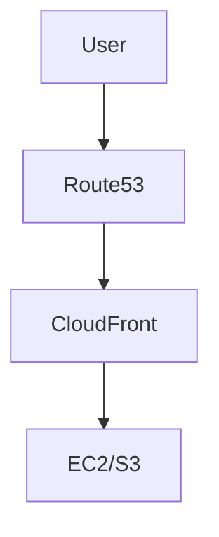

# DNS & CDN — Route 53 et CloudFront

## Objectifs pédagogiques

- Comprendre le fonctionnement du DNS
- Configurer Route 53 efficacement
- Comprendre les différents routing policies
- Utiliser CloudFront comme CDN
- Optimiser performance et latence

## Contexte et problématique

Sans DNS :

- Impossible d'accéder aux services via nom
- Gestion IP complexe

Sans CDN :

- Latence élevée
- Mauvaise performance globale

## Architecture

| Composant | Rôle | Exemple |
|-----------|------|---------|
| Route 53 | DNS AWS | example.com |
| Hosted Zone | Zone DNS | domaine |
| Record | Entrée DNS | A, CNAME |
| CloudFront | CDN | distribution |
| Edge Location | Cache | global |



## Commandes essentielles

```bash
aws route53 list-hosted-zones
```

```bash
aws route53 list-resource-record-sets --hosted-zone-id <ID>
```

```bash
aws cloudfront list-distributions
```

## Fonctionnement interne

1. User fait requête DNS
2. Route53 répond avec IP
3. CloudFront sert contenu cache
4. Sinon requête vers origin

🧠 Concept clé  
→ DNS = résolution nom → IP

💡 Astuce  
→ Utiliser CloudFront pour réduire latence

⚠️ Erreur fréquente  
→ TTL trop élevé → propagation lente  
Correction : réduire TTL

## Cas réel en entreprise

Contexte :

Site web international.

Solution :

- Route53 pour DNS
- CloudFront pour CDN

Résultat :

- Réduction latence globale
- Meilleure expérience utilisateur

## Bonnes pratiques

- Utiliser Route53 health checks
- Configurer failover routing
- Réduire TTL en phase de migration
- Utiliser CloudFront pour contenu statique
- Sécuriser avec HTTPS
- Monitorer latence
- Tester routing policies

## Résumé

Route53 gère le DNS AWS.  
CloudFront distribue le contenu globalement.  
Ensemble, ils améliorent performance et disponibilité.

---

## SNIPPETS DE RÉVISION

<!-- snippet
id: aws_dns_definition
type: concept
tech: aws
level: intermediate
importance: high
format: knowledge
tags: aws,dns,route53
title: DNS définition
content: Le DNS permet de traduire un nom de domaine en adresse IP
description: Base réseau
-->

<!-- snippet
id: aws_route53_definition
type: concept
tech: aws
level: intermediate
importance: high
format: knowledge
tags: aws,route53,dns
title: Route53 rôle
content: Route53 est le service DNS AWS permettant de gérer les noms de domaine et le routage
description: DNS AWS
-->

<!-- snippet
id: aws_cloudfront_definition
type: concept
tech: aws
level: intermediate
importance: high
format: knowledge
tags: aws,cdn,cloudfront
title: CloudFront rôle
content: CloudFront est un CDN permettant de distribuer du contenu avec faible latence via cache global
description: CDN AWS
-->

<!-- snippet
id: aws_dns_ttl_warning
type: warning
tech: aws
level: intermediate
importance: high
format: knowledge
tags: aws,dns,error
title: TTL trop élevé
content: Un TTL élevé ralentit les changements DNS, réduire le TTL avant modification
description: Piège DNS classique
-->

<!-- snippet
id: aws_route53_command
type: command
tech: aws
level: intermediate
importance: medium
format: knowledge
tags: aws,cli,dns
title: Lister zones DNS
command: aws route53 list-hosted-zones
description: Permet de voir les zones DNS
-->

<!-- snippet
id: aws_cdn_tip
type: tip
tech: aws
level: intermediate
importance: medium
format: knowledge
tags: aws,cdn,performance
title: Utiliser CDN
content: Utiliser un CDN permet de réduire la latence et améliorer la performance utilisateur
description: Optimisation clé web
-->

<!-- snippet
id: aws_dns_error
type: error
tech: aws
level: intermediate
importance: high
format: knowledge
tags: aws,dns,incident
title: Mauvaise résolution DNS
content: Symptôme site inaccessible, cause mauvaise config DNS, correction vérifier records et propagation
description: Incident fréquent
-->
