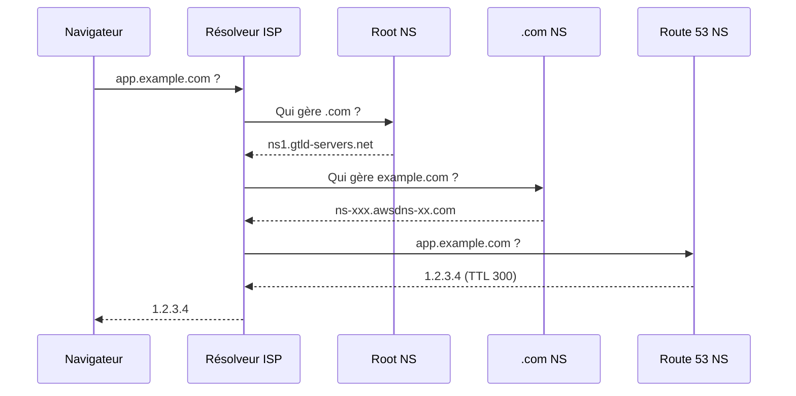
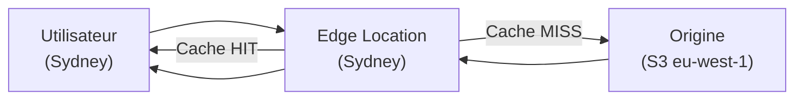

# DNS & CDN — Route 53 et CloudFront

## Objectifs pédagogiques

À la fin de ce module, tu seras capable de :

- Expliquer la chaîne de résolution DNS et l'impact concret du TTL sur les migrations
- Créer et gérer des zones hébergées et des records dans Route 53 via la CLI
- Choisir la routing policy adaptée à chaque besoin (latency, failover, weighted, geolocation)
- Déployer une distribution CloudFront devant une origine S3 ou EC2
- Combiner Route 53 et CloudFront pour réduire la latence et les coûts de transfert sortant

---

## Pourquoi ce module existe

Imagine une application déployée sur EC2 en `eu-west-1`. Un utilisateur en Australie charge ta page : chaque requête traverse l'océan Pacifique et l'océan Indien pour atteindre Paris, puis revient. Résultat : 200 à 400 ms de latence rien que pour le premier octet — avant même que le serveur commence à traiter la requête.

Le problème est en réalité double. Les utilisateurs n'accèdent pas à des adresses IP — ils tapent des noms comme `app.example.com`. Il faut donc un mécanisme pour traduire ce nom en adresse joignable : c'est le DNS. Mais même avec la bonne IP, la distance physique crée une latence incompressible. C'est là qu'intervient un CDN (Content Delivery Network).

AWS répond à ces deux problèmes avec **Route 53** pour le DNS et **CloudFront** pour la mise en cache distribuée. Utilisés ensemble, ils permettent à un site servi depuis une seule région de paraître local pour des utilisateurs sur n'importe quel continent.

---

## Comment fonctionne le DNS — et pourquoi le TTL compte

Avant de configurer quoi que ce soit dans Route 53, il faut comprendre ce qui se passe quand un navigateur résout `app.example.com`.



La chaîne complète prend de quelques millisecondes à quelques secondes — mais elle ne se produit **qu'une fois par TTL**. Si le TTL d'un record est à 86 400 secondes (24h), le résolveur de l'ISP (Internet Service Provider) met l'IP en cache pendant 24h. Si tu changes l'IP entre-temps, les utilisateurs dont le cache n'a pas expiré continuent de pointer vers l'ancienne adresse.

🧠 **Règle pratique** : en production stable, un TTL de 300 à 3 600 secondes est raisonnable. Avant une migration ou un basculement planifié, descends à 60 secondes **48h à l'avance** pour vider les caches distribués. Après stabilisation, remonte le TTL.

---

## Route 53 — Structure et composants

Route 53 s'organise autour de quelques objets fondamentaux :

| Objet | Rôle | Exemple concret |
|---|---|---|
| **Hosted Zone** | Conteneur DNS pour un domaine | `example.com` |
| **Record** | Entrée qui mappe un nom à une valeur | `app.example.com → 1.2.3.4` |
| **Routing Policy** | Logique de sélection de la réponse | Latency, Failover, Weighted… |
| **Health Check** | Sonde la disponibilité d'un endpoint | HTTP 200 toutes les 30s |

### Types de records courants

- **A** : nom → IPv4. Le plus courant pour les serveurs.
- **AAAA** : nom → IPv6.
- **CNAME** (Canonical Name) : nom → autre nom. Ne peut pas être placé à la racine du domaine (`example.com` sans sous-domaine).
- **Alias** : spécifique à Route 53 — mappe un nom vers une ressource AWS (ELB, CloudFront, S3). Peut être placé à la racine. Aucun coût de requête DNS supplémentaire.

⚠️ Un Alias vers un ELB ou CloudFront est toujours préférable à un CNAME : il se résout en interne, sans round-trip supplémentaire, et il suit automatiquement les changements d'IP de la ressource cible.

### Routing policies — choisir la bonne

Route 53 propose plusieurs stratégies de routage. Chacune répond à un besoin distinct :

| Policy | Cas d'usage | Mécanisme |
|---|---|---|
| **Simple** | Un seul endpoint | Retourne toujours la même valeur |
| **Weighted** | A/B testing, migration progressive | Répartit le trafic en % |
| **Latency** | Multi-région, UX optimisée | Route vers la région AWS la plus rapide |
| **Failover** | Haute disponibilité active/passive | Bascule si le health check échoue |
| **Geolocation** | Conformité légale, contenu localisé | Route selon le pays ou continent de l'utilisateur |
| **Geoproximity** | Contrôle fin du routage géographique | Route + biais configurable |
| **Multivalue** | Résilience basique sans ELB | Retourne jusqu'à 8 IPs valides |

---

## Commandes essentielles Route 53

```bash
# Lister toutes les hosted zones du compte
aws route53 list-hosted-zones
```

```bash
# Lister les records d'une zone spécifique
aws route53 list-resource-record-sets --hosted-zone-id <ZONE_ID>
```

```bash
# Créer ou modifier un record via un fichier de changement
aws route53 change-resource-record-sets \
  --hosted-zone-id <ZONE_ID> \
  --change-batch file://<CHANGESET_FILE>
```

```bash
# Vérifier le statut d'un changement (propagation DNS)
aws route53 get-change --id <CHANGE_ID>
```

Le fichier de changement JSON pour créer un record A :

```json
{
  "Changes": [{
    "Action": "UPSERT",
    "ResourceRecordSet": {
      "Name": "app.example.com",
      "Type": "A",
      "TTL": 300,
      "ResourceRecords": [{ "Value": "1.2.3.4" }]
    }
  }]
}
```

💡 `UPSERT` crée le record s'il n'existe pas, le modifie s'il existe déjà. C'est l'action à privilégier dans les scripts d'automatisation — elle est idempotente.

---

## CloudFront — Mettre le contenu au plus près des utilisateurs

CloudFront est un réseau de distribution de contenu (CDN) composé de plus de 400 **Points of Presence** (PoP) répartis sur tous les continents. Quand un utilisateur en Australie demande une image hébergée sur un bucket S3 en `eu-west-1`, voici ce qui se passe :



Au premier accès (cache MISS), la requête voyage jusqu'à Paris pour récupérer l'objet, qui est ensuite stocké dans le PoP de Sydney. Tous les accès suivants (cache HIT) sont servis localement en quelques millisecondes.

### Concepts clés d'une distribution CloudFront

| Concept | Description |
|---|---|
| **Distribution** | L'entité CloudFront — une URL `*.cloudfront.net` assignée automatiquement |
| **Origin** | La source des données : S3, ELB, EC2, API Gateway… |
| **Behavior** | Règle qui définit quels chemins mettre en cache et comment |
| **Cache Policy** | Durée et clés de cache (headers, cookies, query strings) |
| **TTL CloudFront** | Distinct du TTL DNS — durée de vie d'un objet dans le cache Edge |
| **Invalidation** | Force le rechargement d'un objet dans tous les PoP |

---

## Commandes essentielles CloudFront

```bash
# Lister toutes les distributions CloudFront du compte
aws cloudfront list-distributions
```

```bash
# Obtenir la configuration complète d'une distribution
aws cloudfront get-distribution --id <DISTRIBUTION_ID>
```

```bash
# Invalider un chemin spécifique dans le cache
aws cloudfront create-invalidation \
  --distribution-id <DISTRIBUTION_ID> \
  --paths "/<PATH>"
```

```bash
# Invalider tous les objets (à utiliser avec précaution)
aws cloudfront create-invalidation \
  --distribution-id <DISTRIBUTION_ID> \
  --paths "/*"
```

⚠️ Les invalidations ont un coût : les 1 000 premières par mois sont gratuites, les suivantes sont facturées. En production, préfère une stratégie de versionning des fichiers (`app.a3f9c.js` plutôt que `app.js`) pour éviter les invalidations massives.

---

## Cas réel : migration d'une boutique e-commerce vers une architecture distribuée

**Contexte** : une boutique en ligne française avec ~50 000 visiteurs/jour constate des abandons de panier élevés sur ses marchés en Amérique du Nord et en Asie du Sud-Est. Les analytics montrent un TTFB (Time to First Byte) moyen de 380 ms pour ces zones, contre 45 ms en France.

**Diagnostic** : toute l'infrastructure est sur `eu-west-3` (Paris). Les assets statiques — images produits, CSS, JS — sont servis directement depuis le serveur applicatif, sans cache et sans CDN.

**Solution mise en place en trois étapes** :

1. Migration des assets statiques vers S3
2. Distribution CloudFront devant S3 avec TTL de 86 400s pour les images et 300s pour le HTML
3. Record DNS Alias dans Route 53 pointant `www.example.com` vers la distribution CloudFront
4. Routing policy **Latency** pour l'API dynamique, répliquée dans trois régions

**Résultats mesurés après deux semaines** :

| Marché | TTFB avant | TTFB après | Gain |
|---|---|---|---|
| Amérique du Nord | 380 ms | 42 ms | -89% |
| Asie du Sud-Est | 410 ms | 38 ms | -91% |

En parallèle : taux d'abandon panier en baisse de 23% sur ces marchés, et coûts de transfert sortant depuis EC2 réduits de 67% — le trafic statique passant désormais par CloudFront.

Le point clé : la logique de l'application n'a pas changé d'une ligne. Seul le routage DNS et la mise en cache des assets ont été modifiés.

---

## Bonnes pratiques

**1. Toujours utiliser un Alias plutôt qu'un CNAME pour les ressources AWS**
Un CNAME génère une résolution DNS supplémentaire et ne peut pas être placé à la racine du domaine. Un Alias se résout directement en interne, sans surcoût ni limitation.

**2. Descendre le TTL 48h avant toute migration**
Les caches DNS distribués ignorent les changements tant que le TTL n'a pas expiré. Prévoir ce délai évite des incidents de trafic perdu post-migration. Après stabilisation, remonter le TTL à une valeur normale.

**3. Activer les health checks sur les endpoints Failover et Multivalue**
Sans health check, Route 53 continue de router vers un endpoint tombé. Le test doit être significatif — une URL applicative qui exerce la stack, pas juste un ping TCP.

**4. Versionner les assets statiques plutôt qu'invalider**
Nommer les fichiers avec un hash de contenu (`bundle.a3f9c.js`) permet de définir des TTL très longs (jusqu'à un an) sans jamais avoir besoin d'invalidation. Chaque déploiement crée de nouveaux noms de fichiers, et l'ancien cache devient simplement inatteignable.

**5. Restreindre l'accès à l'origine S3 via OAC (Origin Access Control)**
Sans restriction, le bucket S3 reste accessible directement via son URL publique, contournant CloudFront et ses règles de sécurité. L'OAC rend le bucket totalement privé et n'autorise l'accès qu'à la distribution CloudFront.

**6. Séparer les behaviors selon la nature du contenu**
Un behavior pour `/api/*` sans cache (TTL = 0), un autre pour `/static/*` avec TTL long. Appliquer le même TTL à toute l'application est l'erreur la plus fréquente — elle cache des réponses dynamiques qui ne devraient pas l'être.

**7. Activer la compression automatique dans CloudFront**
CloudFront compresse en Gzip ou Brotli à la volée. Sur les behaviors qui servent du texte (HTML, CSS, JS), c'est un gain de 60 à 80% sur la taille transférée, sans modifier l'origine.

---

## Résumé

Route 53 traduit les noms de domaine en adresses IP et offre des politiques de routage avancées — latency, failover, geolocation — qui permettent de diriger le trafic intelligemment selon la disponibilité et la géographie. CloudFront complète le tableau en mettant le contenu en cache au plus près des utilisateurs dans 400+ PoP mondiaux, réduisant à la fois la latence perçue et les coûts de transfert sortant.

Combinés — un Alias Route 53 pointant vers une distribution CloudFront devant une origine S3 ou EC2 — ils forment la colonne vertébrale de toute application web à destination d'un public international. L'essentiel à retenir : le TTL DNS contrôle la vitesse de propagation des changements, et le ratio cache HIT/MISS de CloudFront mesure l'efficacité du CDN.

Le module suivant aborde la sécurité avancée avec KMS, Secrets Manager, WAF et Shield — des services qui s'intègrent directement avec CloudFront pour protéger les applications exposées sur internet.

---

<!-- snippet
id: aws_dns_resolution_chain
type: concept
tech: aws
level: intermediate
importance: high
format: knowledge
tags: aws,dns,route53,ttl
title: Résolution DNS — chaîne complète et TTL
content: Quand un navigateur résout app.example.com, il interroge un résolveur (ISP ou 8.8.8.8) qui remonte la chaîne root → .com → NS de la zone. La réponse est mise en cache selon le TTL du record. Un TTL à 86400s (24h) signifie que les changements DNS mettent jusqu'à 24h à être visibles pour tous les utilisateurs. Réduire le TTL à 60s au moins 48h avant une migration pour vider les caches distribués.
description: Le TTL contrôle la durée de propagation d'un changement DNS — le réduire 48h avant toute migration évite le trafic perdu.
-->

<!-- snippet
id: aws_route53_alias_vs_cname
type: concept
tech: aws
level: intermediate
importance: high
format: knowledge
tags: aws,route53,dns,alias,cname
title: Alias vs CNAME — quand utiliser quoi
content: Un CNAME mappe un nom vers un autre nom et génère une résolution DNS supplémentaire. Il ne peut pas être placé à la racine du domaine (example.com sans sous-domaine). Un Alias est spécifique à Route 53 : il mappe directement vers une ressource AWS (ELB, CloudFront, S3), peut être placé à la racine, et ne génère aucun coût de requête DNS supplémentaire. Pour toute ressource AWS, toujours préférer l'Alias.
description: Toujours utiliser un record Alias plutôt qu'un CNAME pour pointer vers une ressource AWS — plus rapide, gratuit et utilisable à la racine du domaine.
-->

<!-- snippet
id: aws_route53_routing_policies
type: concept
tech: aws
level: intermediate
importance: high
format: knowledge
tags: aws,route53,routing,failover,latency
title: Routing policies Route 53 — synthèse
content: Simple = un endpoint fixe. Weighted = répartition en % (A/B testing, migration). Latency = route vers la région AWS la plus rapide pour l'utilisateur. Failover = bascule sur le secondaire si le health check échoue. Geolocation = route selon le pays ou continent. Multivalue = retourne jusqu'à 8 IPs valides (résilience basique). Chaque policy peut être combinée avec un health check pour exclure automatiquement les endpoints défaillants.
description: Choisir la routing policy selon le besoin : Latency pour l'UX, Failover pour la disponibilité, Weighted pour les migrations progressives.
-->

<!-- snippet
id: aws_route53_list_zones
type: command
tech: aws
level: intermediate
importance: medium
format: knowledge
tags: aws,cli,route53,dns
title: Lister les hosted zones Route 53
command: aws route53 list-hosted-zones
description: Retourne toutes les zones DNS hébergées dans le compte avec leur ID et leur nom de domaine.
-->

<!-- snippet
id: aws_route53_list_records
type: command
tech: aws
level: intermediate
importance: medium
format: knowledge
tags: aws,cli,route53,dns
title: Lister les records DNS d'une zone
command: aws route53 list-resource-record-sets --hosted-zone-id <ZONE_ID>
example: aws route53 list-resource-record-sets --hosted-zone-id Z1D633PJN98FT9
description: Affiche tous les records (A, CNAME, Alias, MX…) d'une hosted zone spécifique.
-->

<!-- snippet
id: aws_route53_upsert_record
type: command
tech: aws
level: intermediate
importance: high
format: knowledge
tags: aws,cli,route53,dns,automation
title: Créer ou modifier un record DNS avec UPSERT
command: aws route53 change-resource-record-sets --hosted-zone-id <ZONE_ID> --change-batch file://<CHANGESET_FILE>
example: aws route53 change-resource-record-sets --hosted-zone-id Z1D633PJN98FT9 --change-batch file://record.json
description: UPSERT crée le record s'il n'existe pas et le modifie sinon — idempotent et adapté aux scripts d'automatisation.
-->

<!-- snippet
id: aws_route53_ttl_migration_warning
type: warning
tech: aws
level: intermediate
importance: high
format: knowledge
tags: aws,dns,route53,ttl,migration
title: Réduire le TTL avant une migration DNS
content: Si le TTL d'un record est à 86400s (24h) et que tu changes l'IP sans le réduire d'abord, les utilisateurs dont le cache n'a pas expiré continuent de pointer vers l'ancienne adresse pendant 24h. Procédure correcte : descendre le TTL à 60s au moins 48h avant la migration, effectuer le changement, puis remonter le TTL après stabilisation.
description: Un TTL élevé rend les changements DNS lents à propager — toujours le réduire 48h avant une migration critique.
-->

<!-- snippet
id: aws_cloudfront_cache_hit_miss
type: concept
tech: aws
level: intermediate
importance: high
format: knowledge
tags: aws,cloudfront,cdn,cache,performance
title: CloudFront — cache HIT vs cache MISS
content: Au premier accès (MISS), la requête voyage de l'utilisateur jusqu'à l'origine (S3, EC2…), l'objet est servi puis stocké dans le PoP Edge local. Les accès suivants (HIT) sont servis directement depuis le PoP sans contacter l'origine. Le ratio HIT/MISS est visible dans les métriques CloudFront. Un ratio HIT faible signifie que la cache policy est trop restrictive ou que le TTL est trop court.
description: Un cache HIT élevé (>80%) indique une configuration CloudFront efficace — surveiller ce ratio dans CloudWatch.
-->

<!-- snippet
id: aws_cloudfront_invalidation_warning
type: warning
tech: aws
level: intermediate
importance: high
format: knowledge
tags: aws,cloudfront,cache,invalidation,cost
title: Invalidations CloudFront — coût et alternatives
content: Les 1000 premières invalidations par mois sont gratuites, les suivantes sont facturées. Une invalidation /* force le rechargement de tous les objets dans tous les PoP, ce qui peut prendre plusieurs minutes. Alternative recommandée : versionner les fichiers statiques avec un hash de contenu (bundle.a3f9c.js). Cela permet un TTL d'un an sans jamais invalider, et chaque déploiement crée de nouveaux noms de fichiers.
description: Éviter les invalidations massives en adoptant une stratégie de versionning des assets — plus rapide, gratuit et déterministe.
-->

<!-- snippet
id: aws_cloudfront_invalidate_path
type: command
tech: aws
level: intermediate
importance: medium
format: knowledge
tags: aws,cli,cloudfront,cache,invalidation
title: Invalider un chemin dans le cache CloudFront
command: aws cloudfront create-invalidation --distribution-id <DISTRIBUTION_ID> --paths "/<PATH>"
example: aws cloudfront create-invalidation --distribution-id E1A2B3C4D5E6F7 --paths "/index.html"
description: Force le rechargement d'un fichier ou d'un répertoire dans tous les Edge Locations de la distribution.
-->

<!-- snippet
id: aws_cloudfront_oac_tip
type: tip
tech: aws
level: intermediate
importance: high
format: knowledge
tags: aws,cloudfront,s3,security,oac
title: Restreindre l'accès S3 via Origin Access Control
content: Sans restriction, un bucket S3 utilisé comme origine CloudFront reste accessible directement via son URL S3, contournant CloudFront et ses règles de sécurité (WAF, headers, geo-restriction). L'Origin Access Control (OAC) permet de rendre le bucket totalement privé et de n'autoriser l'accès qu'à la distribution CloudFront via une policy S3 générée automatiquement.
description: Activer l'OAC sur l'origine S3 pour forcer tout le trafic à passer par CloudFront et empêcher l'accès direct au bucket.
-->
