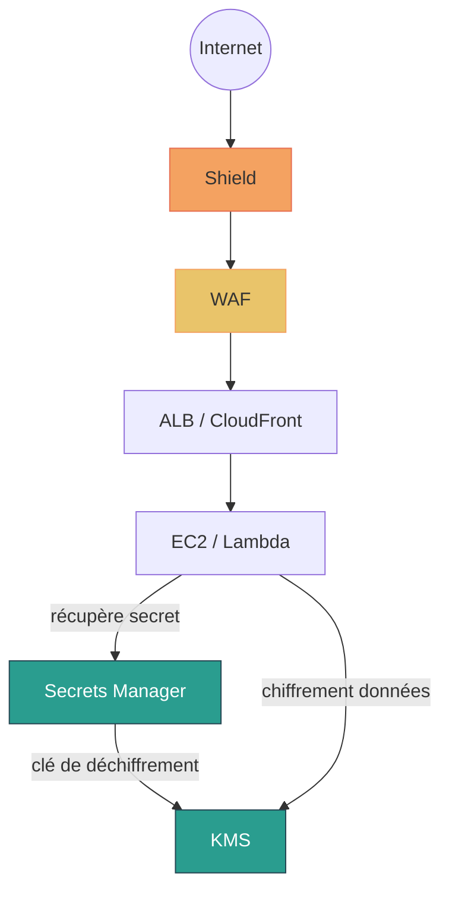

# Sécurité avancée AWS — KMS, Secrets Manager, WAF, Shield

## Objectifs pédagogiques

À l'issue de ce module, tu seras capable de :

- Expliquer le mécanisme de chiffrement par enveloppe de KMS et créer des clés dédiées par contexte
- Stocker et injecter des credentials applicatifs via Secrets Manager en éliminant tout secret dans le code
- Configurer une Web ACL WAF et choisir la bonne séquence de déploiement pour éviter les faux positifs
- Distinguer Shield Standard de Shield Advanced et justifier le recours à l'un ou l'autre
- Combiner ces quatre services en une architecture de défense en profondeur cohérente

---

## Pourquoi ces quatre services, et pourquoi maintenant

Tu as vu comment IAM contrôle *qui* peut faire *quoi* dans ton compte. C'est une fondation solide — mais IAM seul ne répond pas à trois menaces concrètes que les équipes rencontrent systématiquement en production.

**Les données au repos ne sont pas chiffrées.** Un bucket S3 mal configuré, un snapshot EBS exposé par erreur — si quelqu'un y accède, il lit tout en clair. KMS résout ça en gérant les clés de chiffrement de façon centralisée et auditée.

**Les credentials finissent dans le code.** Mot de passe de base de données hardcodé dans un fichier de config, versionné dans Git, visible dans les logs de CI — c'est l'erreur la plus fréquente et la plus difficile à corriger après coup. Secrets Manager est fait pour ça : stocker les secrets hors du code, les injecter à l'exécution, les renouveler automatiquement.

**Les applications sont exposées à Internet sans filtrage.** SQL injection, XSS (Cross-Site Scripting), scans automatisés, attaques DDoS volumétriques — une ALB nue n'a aucun mécanisme de filtrage applicatif. WAF (Web Application Firewall) et Shield comblent ce vide à deux niveaux différents.

Ces quatre services forment ensemble une stratégie de **défense en profondeur** : chaque couche protège contre un vecteur d'attaque distinct, de sorte qu'un attaquant qui en contourne une tombe sur la suivante.

---

## Architecture de défense en profondeur

| Service | Couche protégée | Problème résolu |
|---|---|---|
| **Shield** | Réseau (L3/L4) | Attaques DDoS (Distributed Denial of Service) volumétriques et par état |
| **WAF** | Applicatif (L7) | SQL injection, XSS, rate limiting par IP |
| **Secrets Manager** | Accès applicatif | Credentials hors du code, rotation automatique |
| **KMS** | Données au repos | Chiffrement des objets S3, volumes EBS, secrets |



Le flux se lit de l'extérieur vers l'intérieur : Shield absorbe les attaques volumétriques en amont, WAF filtre le trafic HTTP malveillant avant qu'il atteigne ton application, Secrets Manager contrôle ce que l'application peut consommer comme credentials, KMS garantit que les données stockées restent illisibles sans autorisation explicite.

---

## KMS — Gestion des clés de chiffrement

### Le mécanisme d'enveloppe

KMS ne chiffre pas tes données directement — il gère des **clés maîtres** (CMK, Customer Master Key) qui servent à chiffrer des clés de données éphémères. Ces clés de données éphémères chiffrent tes données réelles. C'est le schéma d'enveloppe.

L'avantage concret : la CMK ne quitte jamais KMS. Ton application ne la manipule jamais en clair. Chaque opération de chiffrement ou déchiffrement passe par l'API KMS, est vérifiée par IAM, et tracée dans CloudTrail. Si tu veux révoquer l'accès à tes données, tu désactives la clé — pas besoin de rechiffrer quoi que ce soit.

```bash
# Lister les clés disponibles dans la région
aws kms list-keys

# Créer une CMK avec description
aws kms create-key --description "<DESCRIPTION>"

# Chiffrer un fichier local avec une clé existante
aws kms encrypt \
  --key-id <KEY_ID> \
  --plaintext fileb://<FICHIER_SOURCE> \
  --output text \
  --query CiphertextBlob | base64 --decode > <FICHIER_CHIFFRE>

# Déchiffrer
aws kms decrypt \
  --ciphertext-blob fileb://<FICHIER_CHIFFRE> \
  --output text \
  --query Plaintext | base64 --decode
```

🧠 **CMK custom vs clé gérée par AWS** — AWS crée automatiquement des clés pour ses services (`aws/s3`, `aws/ebs`, `aws/rds`…). Pratiques, mais tu n'en contrôles pas la politique d'accès et tu ne peux pas les désactiver. Pour les données sensibles, crée des CMK dédiées : tu choisis qui peut les utiliser, tu peux les désactiver immédiatement en cas d'incident, et tu as un audit granulaire par contexte.

💡 **Utilise des alias plutôt que les ARN bruts** — Attribue un alias à tes clés (`alias/prod-app-db`) dans le code et les scripts. Si tu dois un jour changer de clé, tu mets à jour l'alias dans KMS — pas une ligne d'application à modifier.

---

## Secrets Manager — Zéro credential dans le code

### Pourquoi les variables d'environnement ne suffisent pas

Le mot de passe de ta base RDS doit arriver quelque part dans ton application au moment de l'exécution. Les approches courantes — variable d'environnement dans le Dockerfile, fichier `.env` dans le repo, SSM Parameter Store non chiffré — ont toutes le même problème : le secret est présent quelque part dans un artefact de build ou dans un fichier versionné. Il suffit d'un accès au registre Docker ou au repo Git pour l'extraire.

Secrets Manager rompt ce lien. L'application appelle l'API à l'exécution, récupère la valeur déchiffrée (KMS intervient en coulisse via le rôle IAM de l'instance), et ne la stocke nulle part. Le code source peut être public — il n'y a rien à voler.

```bash
# Créer un secret (format JSON pour des credentials multichamps)
aws secretsmanager create-secret \
  --name "<NOM_SECRET>" \
  --description "<DESCRIPTION>" \
  --secret-string '{"username":"<USER>","password":"<PASSWORD>"}'

# Récupérer la valeur — c'est exactement ce que ton application fait
aws secretsmanager get-secret-value \
  --secret-id "<NOM_SECRET>" \
  --query SecretString \
  --output text

# Activer la rotation automatique
aws secretsmanager rotate-secret \
  --secret-id "<NOM_SECRET>" \
  --rotation-rules AutomaticallyAfterDays=<JOURS>

# Lister les secrets existants
aws secretsmanager list-secrets
```

⚠️ **La rotation ne fonctionne pas seule** — Secrets Manager invoque une fonction Lambda pour renouveler le credential à la source (se connecte à RDS, crée le nouveau mot de passe, valide qu'il fonctionne, met à jour le secret). AWS fournit des Lambdas prêtes à l'emploi pour RDS, Redshift et DocumentDB. Mais si cette Lambda n'a pas accès réseau à ta base (VPC, security group), la rotation échoue silencieusement. Teste le processus complet en staging avant la prod.

🧠 **Secrets Manager vs SSM Parameter Store** — SSM Parameter Store (tier Standard) est gratuit et suffisant pour des configurations non-critiques. Secrets Manager coûte ~0,40 $/secret/mois mais apporte la rotation native, la réplication multi-région, et une intégration directe avec RDS. Pour des credentials de production, ce coût est négligeable face au risque d'exposition.

> **SAA-C03** — Rotation automatique + DB credentials → **Secrets Manager**. Config gratuite non sensible → **SSM Parameter Store** (Standard).

---

## WAF — Filtrage applicatif HTTP

### Ce que WAF fait — et ce qu'il ne fait pas

WAF agit au niveau 7 du modèle OSI : il inspecte le contenu des requêtes HTTP/HTTPS (headers, body, query strings, URI) et applique des règles pour bloquer ou compter les requêtes malveillantes. Il peut bloquer une requête contenant `' OR 1=1` dans un paramètre, limiter à 100 requêtes par minute par IP, ou rejeter les user-agents connus des scanners automatisés.

Ce qu'il ne fait pas : absorber une attaque volumétrique réseau L3/L4. Si quelqu'un t'envoie 50 Gbps de trafic UDP, WAF ne voit même pas passer les paquets — c'est le rôle de Shield. Les deux sont complémentaires, pas substituables.

WAF s'attache à une **ALB**, une **API Gateway**, ou une distribution **CloudFront**. Les règles sont regroupées dans une Web ACL (Access Control List).

```bash
# Créer une Web ACL (REGIONAL pour ALB/API Gateway, CLOUDFRONT pour CF)
aws wafv2 create-web-acl \
  --name "<NOM_ACL>" \
  --scope REGIONAL \
  --region <REGION> \
  --default-action Allow={} \
  --visibility-config SampledRequestsEnabled=true,CloudWatchMetricsEnabled=true,MetricName=<NOM_METRIC>

# Lister les Web ACLs existantes
aws wafv2 list-web-acls \
  --scope REGIONAL \
  --region <REGION>

# Associer une Web ACL à une ALB
aws wafv2 associate-web-acl \
  --web-acl-arn <ARN_ACL> \
  --resource-arn <ARN_ALB>
```

💡 **Commence par les Managed Rule Groups AWS, en mode Count** — AWS maintient des groupes de règles prêts à l'emploi : `AWSManagedRulesCommonRuleSet` (OWASP Top 10)*, `AWSManagedRulesAmazonIpReputationList` (IP malveillantes connues), `AWSManagedRulesSQLiRuleSet`. Active-les en mode *Count* d'abord — WAF log les correspondances sans bloquer. Après 72h de trafic réel, analyse les requêtes échantillonnées dans CloudWatch, identifie les faux positifs, ajuste, puis passe en *Block*. Sans cette étape, tu risques de bloquer des utilisateurs légitimes dès le jour 1.

*OWASP (Open Web Application Security Project) : organisation de référence qui publie un classement des 10 vulnérabilités web les plus critiques.

⚠️ **L'ordre des règles a un impact sur les coûts** — WAF facture par requête traitée et évalue les règles dans l'ordre. Place une règle IP reputation en tête : elle rejette les bots connus avant qu'ils atteignent les règles OWASP, qui sont plus coûteuses à évaluer. Sur un fort trafic, cet ordre peut réduire la facture WAF de 20 à 40 %.

---

## Shield — Protection contre les DDoS

### Standard est activé par défaut. Advanced est un choix délibéré.

**Shield Standard** est actif sur tous les comptes AWS sans configuration ni frais supplémentaires. Il absorbe les attaques L3/L4 les plus courantes — floods SYN, UDP reflection, fragmentation de paquets — sur les ressources AWS exposées.

**Shield Advanced** (~3 000 $/mois, engagement 1 an) est un autre niveau d'engagement :
- Protection L7 coordonnée avec WAF
- Accès à la **DRT** (DDoS Response Team) AWS 24/7 pendant une attaque
- Remboursement automatique des surcoûts EC2 et data transfer causés par l'attaque
- Rapports détaillés post-incident

```bash
# Vérifier si Shield Advanced est activé sur le compte
aws shield describe-subscription

# Lister les ressources sous protection Shield Advanced
aws shield list-protections

# Activer la protection Shield Advanced sur une ressource spécifique
aws shield create-protection \
  --name "<NOM_PROTECTION>" \
  --resource-arn <ARN_RESSOURCE>
```

🧠 **Qui a réellement besoin de Shield Advanced ?** Les applications avec un SLA strict sur la disponibilité, les plateformes e-commerce pendant les pics de trafic planifiés (Black Friday, lancement produit), les médias ou services financiers ciblés historiquement. Pour une startup, un environnement interne, ou une application à trafic modéré, Shield Standard combiné à un WAF correctement configuré couvre l'essentiel — sans les 3 000 $/mois.

> **SAA-C03** — Shield Standard = gratuit, automatique (L3/L4). Shield Advanced = 24/7 DRT + cost protection + L7 coordination ($3 000/mois).

Un point souvent oublié : si tu sais qu'une campagne approche, active Shield Advanced **48 heures avant**, pas pendant l'attaque. Les protections prennent du temps à se propager.

---

## ACM — Certificats SSL/TLS managés

AWS Certificate Manager (ACM) est le service qui te permet de provisionner, gérer et déployer des certificats SSL/TLS sans jamais manipuler de fichiers `.pem` ou de clés privées toi-même. Tu demandes un certificat, tu prouves que le domaine t'appartient, et AWS s'occupe du reste — y compris du renouvellement.

### Certificats publics vs privés

ACM propose deux types de certificats. Les **certificats publics** sont émis par l'autorité de certification Amazon et reconnus par tous les navigateurs — c'est ce que tu utilises pour exposer tes applications en HTTPS sur Internet. Ils sont **entièrement gratuits** lorsqu'ils sont utilisés avec des services AWS compatibles : ALB, CloudFront, API Gateway, Elastic Beanstalk. Les **certificats privés** (via AWS Private CA) servent au chiffrement interne entre services dans un VPC ou entre microservices — ils ont un coût (~400 $/mois pour la CA privée) et ne sont reconnus que par les systèmes que tu configures explicitement.

💡 **Certificats publics gratuits** — Le coût d'un certificat SSL n'est plus une excuse pour ne pas chiffrer le trafic. ACM fournit des certificats publics sans frais, avec renouvellement automatique. La seule condition : les utiliser avec un service AWS compatible (ALB, CloudFront, API Gateway).

### Ce qui fonctionne — et ce qui ne fonctionne pas

ACM s'intègre nativement avec ALB, CloudFront, API Gateway et Elastic Beanstalk. Tu attaches le certificat au listener HTTPS de ton ALB ou à ta distribution CloudFront, et le trafic est chiffré de bout en bout côté client.

⚠️ **ACM ne fonctionne PAS avec EC2 directement.** Tu ne peux pas exporter un certificat ACM public pour l'installer sur un serveur Apache ou Nginx tournant sur une instance EC2. Si tu as besoin d'un certificat sur EC2, tu dois soit passer par un ALB devant l'instance (solution recommandée), soit gérer ton propre certificat (Let's Encrypt, par exemple). C'est un piège classique à l'examen — retiens que ACM est un service d'intégration avec les services managés AWS, pas un gestionnaire de certificats généraliste.

### Renouvellement automatique

Les certificats ACM validés par DNS se renouvellent automatiquement avant expiration, sans aucune intervention de ta part. C'est un avantage considérable par rapport à la gestion manuelle de certificats : plus de risque d'oubli de renouvellement, plus de downtime surprise à 3h du matin parce qu'un certificat a expiré. La seule condition : que l'enregistrement CNAME de validation DNS reste en place dans ta zone.

### Contrainte régionale

ACM est un service **régional**. Un certificat créé dans `eu-west-1` ne peut être utilisé que par des ressources dans cette même région. Il y a une exception importante : **CloudFront exige que le certificat soit dans `us-east-1`** (N. Virginia), quelle que soit la localisation de ton origine. Pour une ALB dans `eu-west-3`, tu crées le certificat dans `eu-west-3`. Pour CloudFront, tu le crées dans `us-east-1`. Si tu oublies cette règle, CloudFront refuse simplement d'associer le certificat.

🧠 **Validation DNS avec Route 53** — Lors de la demande de certificat, ACM te propose deux méthodes de validation : email ou DNS. Choisis systématiquement la validation DNS. ACM te donne un enregistrement CNAME à créer dans ta zone DNS. Si tu utilises Route 53, un seul clic dans la console (ou une commande CLI) crée l'enregistrement automatiquement. L'avantage décisif : tant que le CNAME existe, ACM renouvelle le certificat automatiquement. Avec la validation email, tu dois répondre manuellement à chaque renouvellement.

```bash
# Lister les certificats ACM dans une région
aws acm list-certificates --region <REGION>

# Demander un certificat public avec validation DNS
aws acm request-certificate \
  --domain-name <DOMAINE> \
  --validation-method DNS \
  --region <REGION>

# Voir les détails d'un certificat (statut, expiration, domaines)
aws acm describe-certificate \
  --certificate-arn <ARN_CERTIFICAT> \
  --region <REGION>
```

---

## Cas réel : sécurisation d'une API e-commerce

**Contexte** — Une plateforme de vente en ligne héberge son API sur ALB + EC2, exposée publiquement. Sur un trimestre, l'équipe sécurité documente trois incidents distincts : 3 credentials exposés dans des pull requests GitHub (dont un mot de passe RDS prod), une tentative d'injection SQL détectée manuellement dans les logs applicatifs, et un vendredi soir de dégradation de service due à une saturation de l'ALB.

**Mise en place progressive**

L'équipe choisit de déployer les quatre services en deux semaines, dans l'ordre des risques identifiés.

**Semaine 1 — Éliminer les secrets exposés.** Migration de 8 credentials (RDS prod, RDS staging, 5 API keys tierces) depuis les variables d'environnement vers Secrets Manager. Deux CMK KMS créées : une pour les données clients S3, une dédiée à Secrets Manager. Rotation automatique à 30 jours activée sur les 3 secrets RDS avec les Lambdas AWS fournies. Les instances EC2 récupèrent les secrets via leur instance role — aucune clé statique en dur.

**Semaine 2 — Filtrage du trafic.** Web ACL WAF attachée à l'ALB avec `AWSManagedRulesCommonRuleSet` + `AWSManagedRulesSQLiRuleSet` + `AWSManagedRulesAmazonIpReputationList`. Rate limiting à 500 req/5min par IP. 72h en mode Count → 2 règles ajustées (faux positifs sur l'API de recherche avec des paramètres contenant des apostrophes) → passage en Block. Shield Advanced activé sur l'ALB principale et les 2 adresses IP Elastic de l'API mobile, 48h avant une campagne marketing planifiée.

**Résultats à 60 jours**

- 0 credential exposé dans un repo (vs 3 incidents sur la période précédente)
- 2 847 requêtes bloquées par les règles SQLi WAF en 30 jours
- Un incident de saturation two semaines après déploiement (attaque SYN flood identifiée) : absorbé par Shield Advanced sans dégradation visible côté utilisateurs, rapport d'incident reçu en 4h par la DRT

---

## Bonnes pratiques

**Une CMK par contexte de données, pas une pour tout le compte.** Si une clé est compromise ou doit être révoquée, le blast radius est limité. Sépare au minimum : données clients, secrets applicatifs, logs d'audit. Révoquer une clé partagée entre tout le compte, c'est potentiellement rendre illisible des données dont tu as encore besoin.

**Jamais de secret dans une image Docker — même en variable d'environnement.** Les images sont partagées entre environnements et stockées dans des registres. Un secret dans une variable `ENV` du Dockerfile finit dans l'historique des layers et dans chaque registre qui héberge l'image. Injecte les secrets à l'exécution via le rôle IAM et l'API Secrets Manager.

**Teste la rotation avant de l'activer en prod.** La rotation Secrets Manager échoue silencieusement si la Lambda de rotation n'a pas accès réseau à ta base (VPC, security group mal configuré, route manquante). Un échec de rotation signifie que le secret en base et le secret dans Secrets Manager divergent — l'application casse au prochain redémarrage. Valide le processus complet en staging, avec un monitoring des erreurs Lambda de rotation.

**Mode Count avant Block, sans exception.** 72h de monitoring suffisent pour identifier les faux positifs sur la plupart des applications. C'est le temps que tu perds au déploiement versus l'incident de production que tu évites.

**Ordonne tes règles WAF du plus restrictif au plus général.** IP reputation en tête, puis les règles OWASP. WAF évalue dans l'ordre et s'arrête à la première correspondance — les bots rejetés par IP reputation n'atteignent jamais les règles plus coûteuses.

**Surveille les appels KMS dans CloudTrail.** Un pic de `kms:Decrypt` depuis une IP inconnue ou un rôle inattendu est un signal d'intrusion potentielle. Configure une alarme CloudWatch sur les erreurs `AccessDeniedException` KMS — elles indiquent souvent une tentative d'accès non autorisée à des données chiffrées.

**Anticipe les événements à risque pour Shield Advanced.** L'activation nécessite un délai de propagation. Si tu connais une date critique (lancement produit, campagne marketing, période de soldes), active Shield Advanced 48h avant — pas en réaction à une attaque en cours.

---

## Résumé

KMS, Secrets Manager, WAF et Shield ne se substituent pas l'un à l'autre — ils s'empilent. KMS sécurise les données stockées en gérant les clés de chiffrement de façon centralisée et auditée. Secrets Manager élimine les credentials dans le code et les renouvelle sans redéploiement. WAF filtre les requêtes HTTP malveillantes avant qu'elles atteignent ton application. Shield absorbe les attaques volumétriques réseau que WAF ne voit même pas.

L'idée centrale : la compromission d'une couche ne suffit pas à atteindre les données. Un attaquant qui passe WAF tombe sur IAM. Un token IAM volé ne donne pas accès aux données sans la clé KMS. C'est ça, la défense en profondeur.

La suite du cours aborde Terraform et CloudFormation — ces quatre services y seront provisionnés comme briques dans des stacks d'infrastructure complètes et reproductibles.

---

<!-- snippet
id: aws_kms_envelope_concept
type: concept
tech: aws
level: intermediate
importance: high
format: knowledge
tags: aws,kms,encryption,security
title: KMS — chiffrement par enveloppe
content: KMS gère des clés maîtres (CMK) qui chiffrent des clés de données éphémères, elles-mêmes utilisées pour chiffrer tes données réelles. La CMK ne quitte jamais KMS : chaque opération passe par l'API KMS, est vérifiée par IAM, et tracée dans CloudTrail. L'application ne manipule jamais la CMK en clair — révoquer la clé suffit à rendre les données inaccessibles, sans rechiffrement.
description: KMS centralise la gestion des clés avec audit complet — la CMK n'est jamais exposée directement à l'application.
-->

<!-- snippet
id: aws_kms_list_keys
type: command
tech: aws
level: intermediate
importance: medium
format: knowledge
tags: aws,kms,cli
title: Lister les clés KMS disponibles
command: aws kms list-keys
description: Retourne la liste des ARN de toutes les CMK du compte dans la région courante.
-->

<!-- snippet
id: aws_kms_create_key
type: command
tech: aws
level: intermediate
importance: medium
format: knowledge
tags: aws,kms,cli
title: Créer une CMK KMS avec description
command: aws kms create-key --description "<DESCRIPTION>"
example: aws kms create-key --description "Clé chiffrement données clients prod"
description: Crée une clé maître symétrique dans KMS. L'ARN retourné est utilisé pour chiffrer des ressources S3, EBS, Secrets Manager.
-->

<!-- snippet
id: aws_kms_custom_vs_managed_tip
type: tip
tech: aws
level: intermediate
importance: medium
format: knowledge
tags: aws,kms,security,best-practice
title: CMK custom vs clés gérées AWS — quand choisir
content: AWS crée automatiquement des clés pour ses services (aws/s3, aws/ebs, aws/rds). Pratiques, mais tu ne contrôles pas leur politique d'accès et tu ne peux pas les désactiver. Pour les données sensibles, crée des CMK dédiées par contexte (données clients, secrets, logs). Tu peux les désactiver immédiatement en cas d'incident et obtenir un audit granulaire par usage.
description: Les clés AWS gérées sont pratiques mais non contrôlables — créer des CMK dédiées pour les données sensibles permet une révocation et un audit précis.
-->

<!-- snippet
id: aws_secrets_manager_get
type: command
tech: aws
level: intermediate
importance: high
format: knowledge
tags: aws,secrets,cli
title: Récupérer la valeur d'un secret
command: aws secretsmanager get-secret-value --secret-id "<NOM_SECRET>" --query SecretString --output text
example: aws secretsmanager get-secret-value --secret-id "prod/app/db" --query SecretString --output text
description: Retourne la valeur déchiffrée du secret. Nécessite secretsmanager:GetSecretValue et kms:Decrypt sur le rôle IAM appelant.
-->

<!-- snippet
id: aws_secrets_hardcoded_warning
type: warning
tech: aws
level: intermediate
importance: high
format: knowledge
tags: aws,security,secrets,docker
title: Credential dans le code ou une image Docker — vecteur d'exposition critique
content: Un credential dans le code source, une variable ENV Dockerfile, ou un fichier .env versionné est exposé à toute personne ayant accès au repo, au registre Docker, ou aux logs de build. Même supprimé, il reste dans l'historique Git et dans les layers Docker. La correction n'est pas de chiffrer le fichier — c'est d'externaliser le secret dans Secrets Manager et de le consommer via l'API à l'exécution.
description: Un secret dans le code ou une image Docker est compromis dès que le repo ou le registre est accessible — utiliser Secrets Manager sans exception.
-->

<!-- snippet
id: aws_secrets_rotation_warning
type: warning
tech: aws
level: intermediate
importance: high
format: knowledge
tags: aws,secrets,rotation,lambda
title: Rotation Secrets Manager — tester avant la prod
content: La rotation invoque une Lambda qui se connecte à la source (ex. RDS), crée le nouveau credential, valide qu'il fonctionne, puis met à jour le secret. Si la Lambda n'a pas accès réseau à la base (VPC, security group, route), la rotation échoue silencieusement et le secret diverge de la base. L'application casse au prochain redémarrage. Tester le processus complet en staging avec monitoring des erreurs Lambda est obligatoire.
description: Un échec silencieux de rotation crée une divergence entre le secret stocké et la base réelle — valider en staging avant d'activer en production.
-->

<!-- snippet
id: aws_waf_count_before_block_tip
type: tip
tech: aws
level: intermediate
importance: high
format: knowledge
tags: aws,waf,configuration,best-practice
title: Déployer WAF en mode Count avant Block
content: Activer directement les règles WAF en mode Block risque de bloquer des requêtes légitimes dès le premier jour. Déploie en mode Count pendant 72h, analyse les requêtes échantillonnées dans CloudWatch, identifie les faux positifs, ajuste les règles concernées, puis passe en Block. Sans cette étape, WAF lui-même peut causer un incident de production.
description: Le mode Count permet de mesurer l'impact des règles sans bloquer le trafic — étape obligatoire avant de passer en Block en production.
-->

<!-- snippet
id: aws_shield_standard_vs_advanced_concept
type: concept
tech: aws
level: intermediate
importance: high
format: knowledge
tags: aws,shield,ddos,security
title: Shield Standard vs Shield Advanced
content: Shield Standard est actif par défaut sur tous les comptes AWS sans frais — il protège contre les attaques DDoS L3/L4 courantes (SYN floods, UDP reflection). Shield Advanced (~3000$/mois, engagement 1 an) ajoute la protection L7 coordonnée avec WAF, l'accès à la DRT AWS 24/7, le remboursement des surcoûts liés à une attaque, et des rapports d'incident détaillés. Shield Advanced se justifie pour les applications critiques avec SLA strict ou historiquement ciblées.
description: Shield Standard couvre les attaques volumétriques basiques sans configuration. Shield Advanced est justifié pour les SLA critiques ou les cibles récurrentes.
-->

<!-- snippet
id: aws_defense_in_depth_tip
type: tip
tech: aws
level: intermediate
importance: high
format: knowledge
tags: aws,security,architecture,best-practice
title: Défense en profondeur — quatre couches indépendantes
content: Shield absorbe les attaques réseau L3/L4 avant qu'elles atteignent l'application. WAF filtre les requêtes HTTP malveillantes L7. IAM contrôle les actions autorisées dans le compte. KMS rend les données illisibles sans autorisation explicite sur la clé. Un attaquant qui contourne WAF tombe sur IAM ; un token IAM volé ne donne pas accès aux données sans la clé KMS. Chaque couche protège contre un vecteur différent — aucune n'est suffisante seule.
description: La sécurité AWS efficace combine Shield, WAF, IAM et KMS en couches indépendantes — la compromission d'une couche ne suffit pas à atteindre les données.
-->

<!-- snippet
id: aws_acm_concept
type: concept
tech: aws
level: intermediate
importance: high
format: knowledge
tags: aws,acm,ssl,tls,security,certificate
title: ACM — certificats SSL/TLS managés par AWS
content: AWS Certificate Manager (ACM) provisionne, gère et renouvelle automatiquement les certificats SSL/TLS. Les certificats publics sont gratuits lorsqu'ils sont utilisés avec ALB, CloudFront ou API Gateway. ACM est régional : les certificats pour CloudFront doivent être créés dans us-east-1, ceux pour ALB dans la région de l'ALB. La validation DNS (CNAME via Route 53) permet le renouvellement automatique sans intervention manuelle.
description: ACM fournit des certificats SSL/TLS gratuits avec renouvellement automatique pour les services AWS managés — régional sauf CloudFront qui exige us-east-1.
-->

<!-- snippet
id: aws_acm_ec2_warning
type: warning
tech: aws
level: intermediate
importance: high
format: knowledge
tags: aws,acm,ec2,ssl,exam
title: ACM ne fonctionne pas avec EC2 directement
content: Les certificats publics ACM ne peuvent pas être exportés ni installés sur une instance EC2 (Apache, Nginx). ACM s'intègre uniquement avec les services managés AWS (ALB, CloudFront, API Gateway). Pour du HTTPS sur EC2, il faut soit placer un ALB devant l'instance et y attacher le certificat ACM, soit gérer un certificat indépendant (Let's Encrypt). C'est un piège fréquent à l'examen AWS.
description: ACM ne supporte pas EC2 directement — utiliser un ALB devant l'instance ou gérer un certificat séparé (Let's Encrypt).
-->

<!-- snippet
id: aws_acm_list_certificates
type: command
tech: aws
level: intermediate
importance: medium
format: knowledge
tags: aws,acm,cli,certificate
title: Lister les certificats ACM dans une région
command: aws acm list-certificates --region <REGION>
example: aws acm list-certificates --region eu-west-3
description: Retourne la liste des certificats ACM (ARN, domaine, statut) dans la région spécifiée. Utile pour vérifier les certificats disponibles avant d'associer à un ALB ou CloudFront.
-->
