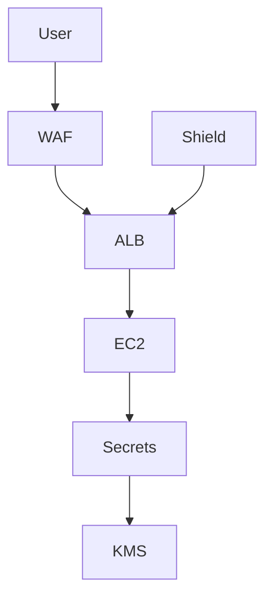

# Sécurité avancée AWS — KMS, Secrets Manager, WAF, Shield

## Objectifs pédagogiques

- Comprendre le chiffrement dans AWS avec KMS
- Gérer les secrets de manière sécurisée
- Protéger une application web avec WAF
- Comprendre les protections DDoS avec Shield
- Concevoir une architecture sécurisée en production

## Contexte et problématique

En production, les risques évoluent :

- Fuite de données sensibles
- Attaques web (SQL injection, XSS)
- Attaques DDoS
- Mauvaise gestion des secrets

Les outils de base ne suffisent plus → sécurité avancée nécessaire.

## Architecture

| Composant | Rôle | Exemple |
|-----------|------|---------|
| KMS | Gestion des clés | chiffrement S3 |
| Secrets Manager | Stockage secrets | DB password |
| WAF | Firewall applicatif | HTTP filtering |
| Shield | Protection DDoS | attaque volumétrique |



## Commandes essentielles

```bash
aws kms list-keys
```

```bash
aws secretsmanager list-secrets
```

```bash
aws wafv2 list-web-acls
```

## Fonctionnement interne

### KMS
- Génère et gère les clés
- Chiffrement intégré AWS

### Secrets Manager
- Stockage sécurisé
- Rotation automatique

### WAF
- Filtrage HTTP
- règles custom

### Shield
- Protection DDoS automatique

🧠 Concept clé  
→ Ne jamais stocker de secrets en clair

💡 Astuce  
→ Utiliser Secrets Manager + IAM role

⚠️ Erreur fréquente  
→ Mettre credentials dans code  
Correction : utiliser Secrets Manager

## Cas réel en entreprise

Contexte :

Application exposée Internet.

Solution :

- WAF protège endpoints
- Secrets Manager pour credentials
- KMS pour chiffrement

Résultat :

- Réduction des attaques
- Sécurité renforcée

## Bonnes pratiques

- Utiliser KMS pour chiffrement
- Ne jamais hardcoder secrets
- Activer rotation secrets
- Configurer WAF règles
- Monitorer attaques
- Utiliser Shield
- Restreindre accès IAM

## Résumé

La sécurité avancée AWS repose sur plusieurs couches.  
KMS protège les données, Secrets Manager sécurise les accès.  
WAF et Shield protègent contre les attaques externes.

---

## SNIPPETS DE RÉVISION

<!-- snippet
id: aws_kms_role
tech: aws
level: intermediate
importance: high
format: knowledge
tags: aws,kms,encryption
title: KMS rôle
content: KMS gère les clés de chiffrement utilisées pour sécuriser les données AWS
description: Base du chiffrement AWS
-->

<!-- snippet
id: aws_secrets_manager_definition
tech: aws
level: intermediate
importance: high
format: knowledge
tags: aws,secrets,security
title: Secrets Manager rôle
content: Secrets Manager permet de stocker et gérer les credentials de manière sécurisée avec rotation automatique
description: Gestion sécurisée des secrets
-->

<!-- snippet
id: aws_waf_definition
tech: aws
level: intermediate
importance: high
format: knowledge
tags: aws,waf,security
title: WAF rôle
content: WAF filtre les requêtes HTTP pour bloquer les attaques comme SQL injection ou XSS
description: Protection applicative
-->

<!-- snippet
id: aws_secret_warning
tech: aws
level: intermediate
importance: high
format: knowledge
tags: aws,security,error
title: Secret en clair
content: Stocker un secret en clair expose à des fuites, utiliser Secrets Manager
description: Erreur critique sécurité
-->

<!-- snippet
id: aws_kms_command
tech: aws
level: intermediate
importance: medium
format: knowledge
tags: aws,kms,cli
title: Lister clés KMS
command: aws kms list-keys
description: Permet de voir les clés KMS disponibles
-->

<!-- snippet
id: aws_security_layer_tip
tech: aws
level: intermediate
importance: medium
format: knowledge
tags: aws,security,architecture
title: Sécurité en couches
content: Combiner KMS, WAF et IAM permet une défense en profondeur efficace
description: Bonne pratique sécurité
-->

<!-- snippet
id: aws_ddos_error
tech: aws
level: intermediate
importance: high
format: knowledge
tags: aws,security,incident
title: Attaque DDoS
content: Symptôme surcharge service, cause attaque DDoS, correction utiliser Shield et WAF
description: Incident critique production
-->
