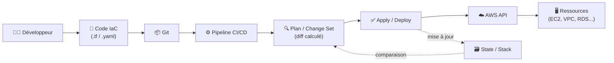

# Infrastructure as Code — Terraform & CloudFormation

## Objectifs pédagogiques

À l'issue de ce module, tu seras capable de :

- Expliquer ce qu'est l'IaC et pourquoi elle remplace la gestion manuelle d'infrastructure
- Distinguer les cas d'usage de Terraform et CloudFormation selon le contexte
- Écrire et exécuter un workflow Terraform complet (init → plan → apply)
- Déployer une stack CloudFormation via AWS CLI
- Identifier et corriger les erreurs les plus courantes liées au state Terraform

---

## Pourquoi gérer l'infrastructure comme du code ?

Imagine qu'un incident détruit ton environnement de production un vendredi soir. Sans IaC, tu passes le week-end à reconstruire de mémoire — et tu obtiens quelque chose de légèrement différent de l'original, parce que personne ne se souvient exactement des options cochées dans la console six mois plus tôt.

C'est exactement le problème que l'IaC résout. L'idée est simple : l'infrastructure est décrite dans des fichiers texte, versionnés dans Git, et déployée automatiquement par un outil. Si un environnement disparaît, tu relances une commande et tu obtiens une copie exacte — pas une approximation.

Concrètement, l'IaC élimine trois catégories de problèmes :

- **Les erreurs humaines** liées aux clics dans la console — une case mal cochée, une règle de sécurité oubliée
- **La dérive de configuration** — quand le code dit une chose et la réalité en fait une autre
- **L'impossibilité de reproduire** — passer de dev à prod devrait être une variable, pas une reconstruction complète

Sur AWS, deux outils dominent : **Terraform** (open source, multi-cloud, édité par HashiCorp) et **CloudFormation** (natif AWS, entièrement managé). Ils résolvent le même problème avec des philosophies différentes — on y revient plus bas.

---

## Comment ça fonctionne : l'état désiré comme contrat

Quel que soit l'outil, le mécanisme repose sur une idée centrale : tu décris un **état désiré**, l'outil calcule le **diff** avec l'état actuel, et n'applique que les changements nécessaires. Comme un `git diff` appliqué à ton infrastructure.

| Composant | Rôle | Terraform | CloudFormation |
|-----------|------|-----------|----------------|
| Template / Code | Description de l'état désiré | Fichiers `.tf` (HCL — HashiCorp Configuration Language) | Template YAML ou JSON |
| State / Stack | Représentation de l'état actuel | `terraform.tfstate` | Stack AWS managée |
| Provider | Interface vers l'API cloud | `hashicorp/aws` | Natif (pas de provider) |
| Plan / Change set | Prévisualisation des changements | `terraform plan` | Change set CloudFormation |
| Exécution | Application des changements | `terraform apply` | `aws cloudformation deploy` |



Le **state** est l'élément le plus sensible de tout ce pipeline — on y revient en détail dans la section Terraform.

---

## Terraform en pratique

### Le cycle en quatre commandes

Terraform suit toujours le même workflow. Dans l'ordre strict :

```bash
terraform init
```

Initialise le projet : télécharge les providers déclarés, configure le backend de state. À lancer une seule fois par projet — ou après l'ajout d'un nouveau provider.

```bash
terraform plan -out=<PLAN_FILE>
```

Compare le code avec le state et affiche ce qui sera créé, modifié ou détruit. L'option `-out` sauvegarde le plan pour un apply déterministe : ce que tu as relu est exactement ce qui sera appliqué, même cinq minutes plus tard.

```bash
terraform apply <PLAN_FILE>
```

Applique le plan calculé. Sans argument, Terraform recalcule un plan et demande confirmation interactive. En CI/CD, toujours passer un plan sauvegardé avec `-auto-approve`.

```bash
terraform destroy
```

Détruit toutes les ressources gérées par le state courant. Demande confirmation — irréversible en production.

### Un exemple concret : instance EC2 avec remote state

```hcl
# main.tf
terraform {
  required_providers {
    aws = {
      source  = "hashicorp/aws"
      version = "~> 5.0"
    }
  }
  backend "s3" {
    bucket         = "my-terraform-state"
    key            = "prod/ec2/terraform.tfstate"
    region         = "eu-west-1"
    dynamodb_table = "terraform-lock"
    encrypt        = true
  }
}

provider "aws" {
  region = var.aws_region
}

resource "aws_instance" "web" {
  ami           = var.ami_id
  instance_type = var.instance_type

  tags = {
    Name        = "${var.env}-web-server"
    Environment = var.env
    ManagedBy   = "terraform"
  }
}
```

```hcl
# variables.tf
variable "aws_region"    { default = "eu-west-1" }
variable "ami_id"        {}
variable "instance_type" { default = "t3.micro" }
variable "env"           {}
```

Ce qui frappe en lisant ce code : tout est déclaratif. Tu dis *quoi*, pas *comment*. Terraform interroge l'API AWS pour savoir ce qui existe déjà, calcule le diff, et ne touche que ce qui change.

### Le state : la pièce la plus fragile

Le fichier `terraform.tfstate` est la carte que Terraform utilise pour savoir ce qu'il a déployé. Sans lui, Terraform ne peut pas calculer de diff — il perdrait la trace de tout ce qu'il gère.

💡 **Par défaut, le state est local.** C'est pratique pour expérimenter, mais inutilisable en équipe : deux personnes ne peuvent pas travailler en parallèle, et le state est perdu si le poste est endommagé ou supprimé.

⚠️ **Perdre le state ne supprime pas l'infrastructure** — les ressources AWS continuent de tourner et de facturer. Mais Terraform ne peut plus les gérer : chaque `plan` voit tout comme "à créer". Récupérer un state perdu via `terraform import` est possible, mais long et fastidieux.

La solution standard : **remote state sur S3 + DynamoDB** pour le locking. DynamoDB empêche deux `apply` simultanés d'écraser le state mutuellement.

```bash
terraform init \
  -backend-config="bucket=<STATE_BUCKET>" \
  -backend-config="key=<STATE_KEY>" \
  -backend-config="region=<AWS_REGION>" \
  -backend-config="dynamodb_table=<LOCK_TABLE>"
```

🧠 Le bucket S3 doit avoir le **versioning activé** : en cas de state corrompu, tu peux revenir à une version précédente en quelques secondes. C'est la différence entre un incident de 5 minutes et une nuit blanche.

---

## CloudFormation en pratique

CloudFormation est l'approche native AWS : tu fournis un template YAML ou JSON, AWS crée une **stack** et gère tout le cycle de vie — création, mise à jour, rollback automatique en cas d'erreur. Pas de state à gérer, pas de backend à configurer.

### Déployer une stack

```bash
aws cloudformation deploy \
  --template-file <TEMPLATE_FILE> \
  --stack-name <STACK_NAME> \
  --parameter-overrides Env=<ENV> \
  --capabilities CAPABILITY_IAM
```

`--capabilities CAPABILITY_IAM` est requis quand le template crée des ressources IAM — c'est un mécanisme de confirmation explicite d'AWS pour éviter les créations accidentelles de rôles ou politiques.

### Un template minimal


```yaml
# template.yaml
AWSTemplateFormatVersion: "2010-09-09"
Description: Serveur web EC2 simple

Parameters:
  Env:
    Type: String
    AllowedValues: [dev, staging, prod]

Resources:
  WebInstance:
    Type: AWS::EC2::Instance
    Properties:
      InstanceType: t3.micro
      ImageId: !Sub "{{resolve:ssm:/ami/${Env}/latest}}"
      Tags:
        - Key: Environment
          Value: !Ref Env
        - Key: ManagedBy
          Value: cloudformation

Outputs:
  InstanceId:
    Value: !Ref WebInstance
```


🧠 **L'avantage décisif de CloudFormation** : le rollback est automatique. Si une ressource échoue à la création ou la mise à jour, CloudFormation revient à l'état précédent sans intervention manuelle. Terraform, lui, laisse l'infrastructure dans un état partiel — à toi de nettoyer ou de corriger avant de relancer.

### Terraform vs CloudFormation : lequel choisir ?

| Critère | Terraform | CloudFormation |
|---------|-----------|----------------|
| Portée | Multi-cloud (AWS, GCP, Azure…) | AWS uniquement |
| Langage | HCL — lisible, modulaire | YAML/JSON — verbeux |
| Rollback | Manuel (state peut être partiel) | Automatique |
| Support AWS latest | Quelques semaines de délai | Immédiat |
| Gestion du state | À ta charge (S3 + DynamoDB) | Managée par AWS |
| Écosystème modules | Très riche (Terraform Registry) | Limité (nested stacks) |

**Règle pratique** : si ton infrastructure est 100% AWS et que tu veux minimiser la complexité opérationnelle, CloudFormation est un choix légitime. Si tu gères plusieurs clouds, ou si tu veux la richesse de l'écosystème Terraform et sa modularité, le choix est vite fait.

---

## Ce qui fait vraiment la différence en production

### La dérive de configuration

C'est le problème numéro un en production IaC. Quelqu'un modifie un security group directement dans la console "juste pour déboguer", oublie de reporter la modification dans le code, et six mois plus tard un `terraform plan` affiche des dizaines de changements inattendus — dont certains critiques.

```bash
# Détecter la dérive entre le state et la réalité AWS
terraform plan -detailed-exitcode
# Exit code 0 = rien à changer
# Exit code 1 = erreur
# Exit code 2 = des changements existent → dérive détectée
```

⚠️ Le risque concret : un correctif de sécurité appliqué en console sera **écrasé silencieusement** au prochain `terraform apply`. La règle est simple mais difficile à tenir en équipe : toute modification d'infrastructure passe par le code IaC, sans exception. Bloquer l'accès console en production via des politiques IAM restrictives est la façon la plus efficace de faire respecter cette règle — pas la sensibilisation, pas les process, le blocage technique.

### La modularisation

Sans modules, un projet Terraform qui gère dev, staging et prod finit avec des centaines de lignes dupliquées. Le problème concret : quand tu corriges une règle de sécurité, tu dois la corriger dans trois endroits — et tu en oublieras un.

```hcl
# Appel de module — trois environnements, zéro duplication
module "vpc_dev" {
  source     = "./modules/vpc"
  env        = "dev"
  cidr_block = "10.0.0.0/16"
  az_count   = 2
}

module "vpc_prod" {
  source     = "./modules/vpc"
  env        = "prod"
  cidr_block = "10.1.0.0/16"
  az_count   = 3
}
```

Le module `./modules/vpc` définit une fois pour toutes subnets, IGW, route tables et NAT gateways. Trois lignes de paramètres par environnement, une seule source de vérité. La règle pratique : dès que tu copies-colles un bloc de ressources pour un deuxième environnement, c'est le signal pour créer un module.

---

## Cas réel : migration vers une infrastructure reproductible

**Contexte** : une startup SaaS, 12 personnes. L'infrastructure AWS a été construite manuellement sur 18 mois. Personne ne sait exactement ce qui tourne, et recréer l'environnement de staging prend 3 jours — ce qui veut dire qu'on ne le recrée jamais vraiment, donc il dérive de la prod.

**La mission** : migrer vers une infra 100% Terraform avec trois environnements (dev, staging, prod) gérés depuis un seul dépôt Git.

**Ce qui a été fait, dans l'ordre** :

1. **Reverse engineering de l'existant** avec `terraform import` — importer les ressources dans un state sans les recréer ni les interrompre
2. **Structuration en modules** : `modules/vpc`, `modules/ec2-cluster`, `modules/rds`, `modules/alb` — chaque module testé indépendamment
3. **Remote state S3** avec un bucket par environnement, versioning activé, locking DynamoDB et chiffrement SSE-KMS
4. **Pipeline CI/CD** : `terraform plan` automatique sur chaque PR pour review, `terraform apply` après merge sur `main`

**Résultats après 3 mois** :

- Recréer l'environnement de staging : **22 minutes** (contre 3 jours)
- Déploiements en production : **2× par jour** en moyenne (contre 1× par semaine)
- Incidents liés à la dérive de configuration : **0** sur 3 mois (contre 3 sur les 6 mois précédents)
- Intégration d'un nouveau développeur : capable de déployer en staging le **jour 1**

Le point le plus difficile n'était pas technique — c'était culturel. Convaincre l'équipe qu'un correctif urgent en production doit passer par une PR, même si ça prend 10 minutes de plus. La réponse finale : bloquer l'accès console sur les environnements staging et prod via IAM. Plus de débat possible.

---

## Bonnes pratiques

**1. Remote state dès le départ, pas après**
Migrer un state local vers S3 après coup est possible mais stressant — notamment si d'autres personnes ont déjà travaillé dessus. Configure le backend S3 + DynamoDB avant même la première `terraform apply`.

**2. Toujours sauvegarder le plan avant d'appliquer**
`terraform plan -out=plan.tfplan` puis `terraform apply plan.tfplan` garantit que ce qui est appliqué est exactement ce qui a été relu — pas un nouveau plan recalculé avec des ressources qui ont changé entre-temps.

**3. Modulariser tôt, pas quand il est trop tard**
Dès que tu copies-colles un bloc de ressources pour un deuxième environnement, c'est le signal. Refactoriser 500 lignes de HCL non modulaire est une opération risquée ; créer un module dès le début coûte 30 minutes.

**4. Verrouiller les versions de providers**
`version = "~> 5.0"` évite qu'une mise à jour majeure du provider casse silencieusement un pipeline. Un provider sans contrainte de version est une bombe à retardement : il fonctionnera jusqu'au jour où il ne fonctionnera plus, sans prévenir.

**5. Chiffrer le state et activer le versioning**
Le state contient des secrets en clair — mots de passe RDS, clés d'API. Sur S3 : chiffrement SSE-KMS, accès public bloqué, et versioning activé pour pouvoir revenir en arrière après une corruption.

**6. Tagger systématiquement toutes les ressources**
Chaque ressource doit avoir au minimum `Environment`, `ManagedBy = terraform` (ou `cloudformation`) et `Owner`. Sans tags cohérents, les coûts AWS deviennent illisibles et les responsabilités floues — deux problèmes qui empirent avec le temps.

**7. Valider en CI avant de planifier**
`terraform validate` vérifie la syntaxe, `tflint` détecte les mauvaises pratiques. Ces deux checks coûtent 30 secondes en pipeline et évitent les erreurs embarrassantes découvertes seulement au moment du plan.

---

## Résumé

L'IaC transforme l'infrastructure en quelque chose d'aussi gérable que du code applicatif : versionné, reviewé, déployé automatiquement et reproductible à l'identique. Terraform apporte flexibilité et richesse d'écosystème au prix d'un state à gérer ; CloudFormation supprime cette complexité au prix d'un périmètre limité à AWS. Dans les deux cas, la règle fondamentale est la même : aucune modification manuelle en dehors du code IaC — et si l'équipe ne tient pas cette règle, la solution est le blocage IAM, pas la confiance.

Le state Terraform reste la pièce la plus fragile : S3 + DynamoDB + versioning + chiffrement ne sont pas optionnels dès qu'on travaille à plusieurs. La modularisation est l'investissement qui paie le plus vite — au premier correctif de sécurité appliqué en un seul endroit plutôt que dans trois copies.

---

<!-- snippet
id: aws_iac_definition
type: concept
tech: aws
level: intermediate
importance: high
format: knowledge
tags: aws,iac,devops
title: Infrastructure as Code — principe fondamental
content: L'IaC traite l'infrastructure comme du code : le fichier Terraform ou CloudFormation décrit l'état désiré, l'outil calcule le diff avec l'état actuel et applique uniquement les changements nécessaires. L'infra devient reproductible, auditée par Git et déployable en un commit.
description: Sans IaC, recréer un environnement de prod identique est impossible — on reconstruit de mémoire, donc différemment.
-->

<!-- snippet
id: terraform_init_command
type: command
tech: terraform
level: intermediate
importance: high
format: knowledge
tags: terraform,cli,workflow
title: Initialiser un projet Terraform
context: À lancer une seule fois par projet, ou après ajout d'un nouveau provider
command: terraform init
description: Télécharge les providers déclarés et configure le backend de state. Première commande obligatoire de tout workflow Terraform.
-->

<!-- snippet
id: terraform_plan_out_command
type: command
tech: terraform
level: intermediate
importance: high
format: knowledge
tags: terraform,cli,devops
title: Générer un plan Terraform déterministe
context: Recommandé en CI/CD pour garantir que l'apply exécute exactement ce qui a été relu
command: terraform plan -out=<PLAN_FILE>
example: terraform plan -out=plan.tfplan
description: Calcule et sauvegarde le diff entre le code et le state. Permet un apply déterministe sans recalcul.
-->

<!-- snippet
id: terraform_apply_plan_command
type: command
tech: terraform
level: intermediate
importance: high
format: knowledge
tags: terraform,cli,devops
title: Appliquer un plan Terraform sauvegardé
context: Toujours utiliser un plan sauvegardé en production pour éviter les surprises
command: terraform apply <PLAN_FILE>
example: terraform apply plan.tfplan
description: Applique exactement le plan calculé précédemment. Sans argument, recalcule un plan et demande confirmation.
-->

<!-- snippet
id: terraform_destroy_command
type: command
tech: terraform
level: intermediate
importance: high
format: knowledge
tags: terraform,cli,devops
title: Détruire toutes les ressources gérées par Terraform
context: Irréversible — à utiliser uniquement sur des environnements éphémères ou avec confirmation explicite en production
command: terraform destroy
description: Supprime toutes les ressources référencées dans le state courant. Demande confirmation interactive sauf avec -auto-approve.
-->

<!-- snippet
id: terraform_remote_state_init
type: command
tech: terraform
level: intermediate
importance: high
format: knowledge
tags: terraform,state,s3,backend
title: Configurer un remote state S3 avec locking DynamoDB
context: À exécuter après avoir créé le bucket S3 (versioning + chiffrement activés) et la table DynamoDB de locking
command: terraform init -backend-config="bucket=<STATE_BUCKET>" -backend-config="key=<STATE_KEY>" -backend-config="region=<AWS_REGION>" -backend-config="dynamodb_table=<LOCK_TABLE>"
example: terraform init -backend-config="bucket=my-tfstate" -backend-config="key=prod/terraform.tfstate" -backend-config="region=eu-west-1" -backend-config="dynamodb_table=terraform-lock"
description: Configure le backend remote S3 avec locking DynamoDB. Indispensable dès qu'on travaille en équipe ou en CI/CD.
-->

<!-- snippet
id: cloudformation_deploy_command
type: command
tech: aws
level: intermediate
importance: high
format: knowledge
tags: cloudformation,cli,aws
title: Déployer une stack CloudFormation
context: Le flag --capabilities CAPABILITY_IAM est requis si le template crée des ressources IAM
command: aws cloudformation deploy --template-file <TEMPLATE_FILE> --stack-name <STACK_NAME> --parameter-overrides Env=<ENV> --capabilities CAPABILITY_IAM
example: aws cloudformation deploy --template-file template.yaml --stack-name prod-web --parameter-overrides Env=prod --capabilities CAPABILITY_IAM
description: Crée ou met à jour une stack CloudFormation. Rollback automatique si une ressource échoue à la création ou la mise à jour.
-->

<!-- snippet
id: terraform_state_loss_warning
type: warning
tech: terraform
level: intermediate
importance: high
format: knowledge
tags: terraform,state,incident
title: Perte du state Terraform — conséquences et prévention
content: Perdre le state Terraform ne supprime pas les ressources AWS — elles continuent de tourner et de facturer. Mais Terraform ne peut plus les gérer : chaque plan voit tout comme "à créer". Récupérer un state perdu via terraform import est possible mais long. Prévention : remote state S3 + versioning activé + chiffrement SSE-KMS + locking DynamoDB.
description: Le state local est la cause numéro un de perte de contrôle sur une infra Terraform. Ne jamais travailler sans remote state en équipe.
-->

<!-- snippet
id: terraform_config_drift_warning
type: warning
tech: terraform
level: intermediate
importance: high
format: knowledge
tags: terraform,drift,iac,incident
title: Dérive de configuration — détection et prévention
content: Une modification manuelle dans la console AWS crée une dérive silencieuse entre le state Terraform et la réalité. Un correctif de sécurité appliqué en console sera écrasé au prochain apply. Détecter avec `terraform plan -detailed-exitcode` (exit code 2 = dérive détectée). Prévention durable : bloquer l'accès console en production via des politiques IAM restrictives.
description: La dérive de configuration est le problème numéro un en production IaC. La seule prévention efficace est le blocage IAM, pas la sensibilisation.
-->

<!-- snippet
id: terraform_modules_tip
type: tip
tech: terraform
level: intermediate
importance: medium
format: knowledge
tags: terraform,modules,bestpractice
title: Modulariser Terraform pour éviter la duplication
content: Un module Terraform regroupe un ensemble cohérent de ressources (ex. module VPC : subnets + IGW + route tables + NAT). Appelé avec des variables, il instancie dev, staging et prod en quelques lignes sans dupliquer le HCL. Signal à surveiller : dès que tu copies-colles un bloc de ressources pour un deuxième environnement, c'est le moment de créer un module — pas après.
description: La duplication en IaC est pire que dans le code applicatif : un correctif de sécurité oublié dans une copie laisse un environnement vulnérable sans que personne ne le remarque.
-->
