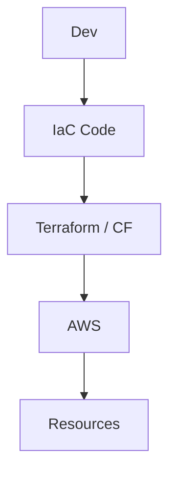

# Infrastructure as Code — Terraform & CloudFormation

## Objectifs pédagogiques

- Comprendre le principe de l’Infrastructure as Code (IaC)
- Différencier Terraform et CloudFormation
- Déployer une infrastructure reproductible
- Comprendre le concept de state
- Diagnostiquer des erreurs de déploiement IaC

## Contexte et problématique

Sans IaC :

- Infrastructure manuelle → erreurs humaines
- Impossible de reproduire un environnement
- Pas de versioning

IaC permet :

- Automatisation complète
- Reproductibilité
- Versionnement infra

## Architecture

| Composant | Rôle | Exemple |
|-----------|------|---------|
| Terraform | IaC multi-cloud | infra AWS |
| CloudFormation | IaC AWS natif | stack AWS |
| State | état infra | terraform.tfstate |
| Provider | API cloud | AWS |



## Commandes essentielles

### Terraform

```bash
terraform init
```
Initialise le projet.

```bash
terraform plan
```
Prévisualise les changements.

```bash
terraform apply
```
Applique les changements.

```bash
terraform destroy
```
Supprime l’infrastructure.

### CloudFormation

```bash
aws cloudformation deploy --template-file template.yaml --stack-name <NAME>
```

## Fonctionnement interne

### Terraform

1. Lecture du code
2. Comparaison avec state
3. Planification
4. Application

### CloudFormation

1. Template YAML/JSON
2. Stack AWS
3. Déploiement automatique

🧠 Concept clé  
→ IaC = code versionné pour l’infrastructure

💡 Astuce  
→ Toujours utiliser terraform plan avant apply

⚠️ Erreur fréquente  
→ Perte du state Terraform  
Correction : utiliser remote state (S3)

## Cas réel en entreprise

Contexte :

Déploiement multi-env (dev/prod)

Solution :

- Terraform modules
- State remote S3
- Pipeline CI/CD

Résultat :

- Déploiement rapide
- Zéro dérive infra

## Bonnes pratiques

- Versionner le code IaC
- Utiliser remote state
- Modulariser Terraform
- Ne jamais modifier infra manuellement
- Utiliser variables
- Valider avec plan
- Monitorer les changements

## Résumé

IaC permet de gérer l’infrastructure comme du code.  
Terraform est multi-cloud, CloudFormation est AWS natif.  
Le state est critique pour la cohérence.  
C’est un pilier du DevOps moderne.

---

## SNIPPETS DE RÉVISION

<!-- snippet
id: aws_iac_definition
type: concept
tech: aws
level: intermediate
importance: high
format: knowledge
tags: aws,iac,devops
title: IaC définition
content: Infrastructure as Code permet de définir et gérer l’infrastructure via du code versionné
description: Base DevOps moderne
-->

<!-- snippet
id: terraform_plan_command
type: command
tech: aws
level: intermediate
importance: high
format: knowledge
tags: terraform,cli,devops
title: Terraform plan
command: terraform plan
description: Permet de voir les changements avant application
-->

<!-- snippet
id: terraform_state_warning
type: warning
tech: aws
level: intermediate
importance: high
format: knowledge
tags: terraform,state,error
title: Perte du state
content: Perdre le state Terraform désynchronise l’infrastructure, utiliser un stockage distant sécurisé
description: Piège critique Terraform
-->

<!-- snippet
id: terraform_vs_cf
type: concept
tech: aws
level: intermediate
importance: medium
format: knowledge
tags: aws,terraform,cloudformation
title: Terraform vs CloudFormation
content: Terraform est multi-cloud et flexible, CloudFormation est natif AWS et intégré
description: Choix outil IaC
-->

<!-- snippet
id: iac_best_practice_tip
type: tip
tech: aws
level: intermediate
importance: medium
format: knowledge
tags: aws,iac,bestpractice
title: Modulariser IaC
content: Découper l’infrastructure en modules permet une meilleure maintenance et réutilisation
description: Bonne pratique IaC
-->

<!-- snippet
id: iac_manual_change_error
type: error
tech: aws
level: intermediate
importance: high
format: knowledge
tags: aws,iac,incident
title: Modification manuelle infra
content: Symptôme dérive infra, cause modification hors IaC, correction toujours passer par Terraform
description: Erreur fréquente DevOps
-->
