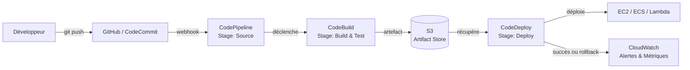

# CI/CD AWS — CodePipeline, CodeBuild, CodeDeploy

## Objectifs pédagogiques

À l'issue de ce module, tu seras capable de :

1. **Expliquer** le rôle de chaque service AWS dans un pipeline CI/CD — CodePipeline, CodeBuild, CodeDeploy — et comment ils s'articulent
2. **Construire** un pipeline AWS complet depuis la source jusqu'au déploiement en définissant ses stages
3. **Configurer** les stratégies de déploiement In-place, Blue/Green et Canary avec CodeDeploy
4. **Diagnostiquer** un pipeline défaillant en analysant les logs CodeBuild et les permissions IAM
5. **Appliquer** les bonnes pratiques de rollback automatique et d'isolation des environnements

---

## Pourquoi le CI/CD existe — et quel problème il résout

Imagine une équipe de cinq développeurs qui déploient une application web chaque vendredi soir. Chacun merge sa branche, quelqu'un construit le JAR à la main, un autre le copie en SSH sur le serveur, un troisième redémarre le service. Chaque semaine, quelque chose cloche : une dépendance manquante, une variable d'environnement oubliée, un fichier de config qui date de la semaine précédente.

Ce scénario n'est pas une caricature. C'est le quotidien de beaucoup d'équipes avant d'adopter le CI/CD.

**L'intégration continue (CI)** résout le problème de la divergence : à chaque push, le code est compilé, testé et validé automatiquement. Si quelque chose casse, on le sait en minutes — pas le vendredi soir.

**Le déploiement continu (CD)** résout le problème de la livraison : l'artefact validé est déployé de façon reproductible, avec les mêmes étapes à chaque fois, sans intervention humaine sujette à l'erreur.

AWS couvre l'ensemble du cycle avec trois services qui se complètent naturellement :

- **CodePipeline** — l'orchestrateur qui enchaîne les étapes
- **CodeBuild** — le moteur qui compile, teste et produit les artefacts
- **CodeDeploy** — le mécanisme qui installe l'artefact sur les cibles (EC2, Lambda, ECS)

Ces trois services s'intègrent nativement avec IAM, S3, CloudWatch, SNS, et avec des sources externes comme GitHub ou Bitbucket.

---

## Architecture d'un pipeline AWS

### Les composants en interaction

| Composant | Rôle dans le pipeline | Cibles typiques |
|---|---|---|
| **Source** | Détecte les changements de code | GitHub, CodeCommit, S3, ECR |
| **CodePipeline** | Orchestre les stages et actions | — (plan de vol) |
| **CodeBuild** | Compile, teste, produit l'artefact | Environnement managé (Docker) |
| **CodeDeploy** | Déploie l'artefact selon une stratégie | EC2, Lambda, ECS |
| **S3 (Artifact Store)** | Stocke les artefacts entre stages | Bucket dédié au pipeline |
| **IAM** | Contrôle les permissions de chaque service | Rôles service-to-service |

### Flux d'un déploiement de bout en bout



> 💡 Chaque stage de CodePipeline est indépendant. Si le build échoue, le déploiement n'est jamais déclenché. C'est une barrière de qualité, pas juste une automatisation.

---

## Construire le pipeline — les commandes essentielles

### Inspecter l'existant

Avant de créer quoi que ce soit, commencer par lister ce qui existe déjà dans le compte.

```bash
# Lister tous les pipelines du compte
aws codepipeline list-pipelines

# Voir l'état en temps réel d'un pipeline
aws codepipeline get-pipeline-state --name <PIPELINE_NAME>

# Lister les projets CodeBuild disponibles
aws codebuild list-projects

# Voir les détails d'un projet de build
aws codebuild batch-get-projects --names <PROJECT_NAME>

# Lister les applications CodeDeploy
aws deploy list-applications

# Voir les groupes de déploiement d'une application
aws deploy list-deployment-groups --application-name <APP_NAME>
```

### Déclencher et surveiller un déploiement

```bash
# Déclencher manuellement un pipeline
aws codepipeline start-pipeline-execution --name <PIPELINE_NAME>

# Suivre un déploiement CodeDeploy en cours
aws deploy get-deployment --deployment-id <DEPLOYMENT_ID>

# Voir les logs d'un build CodeBuild (ID récupéré dans la console ou via list-builds)
aws codebuild batch-get-builds --ids <BUILD_ID>
```

### Créer un pipeline depuis un fichier de définition

Un pipeline se définit en JSON. Pour créer ou mettre à jour :

```bash
# Créer un pipeline depuis un fichier de définition JSON
aws codepipeline create-pipeline --cli-input-json file://<PIPELINE_DEFINITION_FILE>.json

# Mettre à jour un pipeline existant
aws codepipeline update-pipeline --cli-input-json file://<PIPELINE_DEFINITION_FILE>.json
```

> ⚠️ Le rôle IAM référencé dans la définition du pipeline doit avoir les permissions sur S3 (artifact store), CodeBuild et CodeDeploy. C'est la cause numéro un des pipelines qui échouent au premier lancement.

---

## Fonctionnement interne — ce qui se passe sous le capot

### CodeBuild : le moteur de build

CodeBuild exécute les instructions d'un fichier `buildspec.yml` placé à la racine du dépôt. Ce fichier définit quatre phases :

```yaml
version: 0.2

phases:
  install:
    runtime-versions:
      nodejs: 18
    commands:
      - npm install
  pre_build:
    commands:
      - npm run lint
      - npm test
  build:
    commands:
      - npm run build
  post_build:
    commands:
      - echo "Build terminé le $(date)"

artifacts:
  files:
    - dist/**/*
    - appspec.yml
```

> 🧠 Si `pre_build` échoue (tests KO), CodeBuild s'arrête immédiatement et ne produit pas d'artefact. CodePipeline voit l'action en échec et bloque le stage suivant. C'est exactement ce comportement qu'on veut : un bug trouvé ici coûte une heure de correction. Le même bug en production peut coûter des jours.

### CodeDeploy : les stratégies de déploiement

C'est ici que réside l'essentiel de la valeur de CodeDeploy. Trois stratégies principales, chacune adaptée à un contexte différent :

**In-place** — arrêt de l'instance, mise à jour, redémarrage. Rapide, mais avec coupure de service. Adapté aux environnements non-critiques ou de développement.

**Blue/Green** — une nouvelle flotte d'instances est provisionnée avec la nouvelle version. Le load balancer bascule le trafic d'un coup. L'ancienne flotte reste disponible quelques minutes pour un rollback instantané. C'est la stratégie recommandée pour la production.

**Canary / Linear** — le trafic est progressivement déplacé vers la nouvelle version (10 % → 50 % → 100 %, ou 10 % toutes les 5 minutes). CodeDeploy surveille les health checks et déclenche un rollback automatique si des alarmes CloudWatch se déclenchent.

Le comportement de déploiement est piloté par l'`appspec.yml` :

```yaml
version: 0.0
os: linux
files:
  - source: /dist
    destination: /var/www/app
hooks:
  BeforeInstall:
    - location: scripts/stop_server.sh
      timeout: 30
  AfterInstall:
    - location: scripts/install_deps.sh
  ApplicationStart:
    - location: scripts/start_server.sh
  ValidateService:
    - location: scripts/health_check.sh
      timeout: 60
```

> ⚠️ Sans hook `ValidateService`, CodeDeploy considère le déploiement comme réussi dès que les fichiers sont copiés — même si l'application n'a pas démarré. Toujours implémenter un health check réel dans ce hook.

### Ce qui se passe quand ça casse

Deux causes couvrent 80 % des échecs de pipeline :

**1. Permissions IAM insuffisantes** — CodeBuild ne peut pas lire l'artefact dans S3, ou CodeDeploy ne peut pas accéder aux instances EC2. La solution : vérifier les rôles IAM attachés à chaque service et s'assurer que la relation de confiance inclut bien `codebuild.amazonaws.com` ou `codedeploy.amazonaws.com`.

**2. Buildspec ou appspec mal configurés** — une commande qui retourne un code de sortie non-zero, un fichier absent dans les artefacts, un hook qui timeout. La solution : lire les logs dans CloudWatch Logs sous le groupe `/aws/codebuild/<PROJECT_NAME>`.

> 💡 CodeBuild crée automatiquement un groupe de logs CloudWatch. C'est le premier endroit à regarder lors d'un échec de build — avant même la console CodeBuild.

---

## Cas réel — migration d'un déploiement manuel vers CI/CD

**Contexte :** une équipe produit déploie une API Node.js sur un groupe de huit instances EC2 derrière un ALB. Les déploiements se font manuellement chaque jeudi soir, par SSH sur chaque instance. Deux personnes sont nécessaires, la procédure dure 45 minutes et génère environ 10 minutes de downtime.

**Ce qui a été mis en place :**

- CodePipeline avec GitHub comme source (webhook sur la branche `main`)
- CodeBuild avec un `buildspec.yml` qui exécute les tests Jest, lint ESLint et construit le bundle de production
- CodeDeploy en stratégie Blue/Green avec ALB : nouvelle flotte provisionnée, bascule trafic en deux minutes, ancienne flotte conservée 15 minutes
- Alarme CloudWatch sur le taux d'erreurs HTTP 5xx configurée comme critère de rollback automatique dans CodeDeploy
- Notification SNS vers Slack à chaque changement d'état du pipeline

**Résultats après 3 mois :**

| Indicateur | Avant | Après |
|---|---|---|
| Durée d'un déploiement | 45 minutes | **8 minutes** |
| Downtime par déploiement | ~10 minutes | **0** (Blue/Green) |
| Intervenants humains | 2 personnes | **0** |
| Rollbacks manuels | 3 par mois | **0** (rollback automatique) |
| Fréquence de déploiement | 1 par semaine | **plusieurs fois par jour** |

Le principal changement culturel : les développeurs ont arrêté d'accumuler les features avant de déployer "pour amortir le coût" du processus manuel. Quand déployer ne coûte rien, on déploie souvent et par petits incréments — ce qui réduit encore davantage le risque.

---

## Bonnes pratiques

**Bloquer chaque stage avec des tests adaptés**
Les tests unitaires bloquent le build. Les tests d'intégration bloquent le déploiement en staging. Les smoke tests bloquent la promotion en production. Un test qui n'est pas dans le pipeline n'existe pas — il ne sera jamais exécuté de façon systématique.

**Toujours configurer le rollback automatique**
Dans CodeDeploy, le rollback peut être déclenché sur alarme CloudWatch. Définir au minimum une alarme sur le taux d'erreurs HTTP et le CPU des instances cibles. Un déploiement sans rollback, c'est un pari sur la confiance — pas une stratégie.

**Versionner les artefacts avec le SHA Git**
Nommer les artefacts avec le commit SHA (`app-${CODEBUILD_RESOLVED_SOURCE_VERSION}.zip`) permet de tracer exactement quelle version tourne en production et de rejouer n'importe quel déploiement passé.

**Isoler les rôles IAM par service**
CodePipeline, CodeBuild et CodeDeploy ont chacun leur rôle IAM avec les permissions strictement nécessaires. Un rôle partagé "tout-en-un" est un risque de sécurité et un cauchemar à déboguer.

**Séparer les pipelines par environnement**
Un pipeline dev/staging, un pipeline production. La promotion de staging vers prod passe par une action d'approbation manuelle (approval gate dans CodePipeline) — jamais automatique. Cela garantit qu'un humain valide avant tout impact production.

**Centraliser les logs dans CloudWatch**
Chaque build CodeBuild écrit dans CloudWatch Logs. Configurer des filtres de métriques sur les patterns d'erreur (`ERROR`, `FAILED`) permet d'alerter proactivement sans fouiller les logs à la main.

**Tester le rollback avant d'en avoir besoin**
Déclencher un rollback volontaire sur un déploiement en staging vérifie que les hooks `ApplicationStop` fonctionnent et que l'ancienne version redémarre sans problème. Découvrir que le rollback est cassé pendant un incident en production est le pire moment possible.

---

## Résumé

CodePipeline orchestre, CodeBuild compile et teste, CodeDeploy déploie — trois services avec des responsabilités claires qui s'assemblent en un pipeline cohérent. La vraie valeur n'est pas l'automatisation en elle-même, c'est la **reproductibilité** : chaque déploiement suit exactement le même chemin, avec les mêmes vérifications, quelle que soit l'heure ou la personne qui a mergé.

La stratégie Blue/Green avec rollback automatique sur alarme CloudWatch est le point de départ recommandé pour tout environnement de production. Elle élimine le downtime et transforme un incident post-déploiement en quelque chose de gérable en moins de deux minutes.

Le module suivant abordera l'observabilité avancée avec CloudWatch et X-Ray — ce qui permettra notamment d'affiner les seuils d'alarme utilisés comme critères de rollback dans CodeDeploy.

---

<!-- snippet
id: aws_cicd_pipeline_concept
type: concept
tech: aws
level: intermediate
importance: high
format: knowledge
tags: aws,cicd,codepipeline,codebuild,codedeploy
title: Architecture d'un pipeline CI/CD AWS
content: Un pipeline AWS CI/CD repose sur trois services : CodePipeline orchestre les stages, CodeBuild compile et teste en produisant un artefact, CodeDeploy installe l'artefact sur EC2/Lambda/ECS. Les artefacts transitent via S3 entre chaque stage. Si un stage échoue, le suivant ne se déclenche pas.
description: CodePipeline + CodeBuild + CodeDeploy forment un pipeline intégré avec S3 comme store d'artefacts inter-stages.
-->

<!-- snippet
id: aws_codebuild_buildspec
type: concept
tech: aws
level: intermediate
importance: high
format: knowledge
tags: aws,codebuild,buildspec,cicd
title: Structure du buildspec.yml CodeBuild
content: Le fichier buildspec.yml à la racine du dépôt définit 4 phases : install (runtime/dépendances), pre_build (lint/tests), build (compilation), post_build (packaging). Si une commande retourne un code non-zero, CodeBuild s'arrête et ne produit pas d'artefact. La section artifacts liste les fichiers à transmettre au stage suivant.
description: Le buildspec.yml pilote CodeBuild : install → pre_build → build → post_build, avec arrêt immédiat en cas d'erreur.
-->

<!-- snippet
id: aws_codedeploy_strategies
type: concept
tech: aws
level: intermediate
importance: high
format: knowledge
tags: aws,codedeploy,bluegreen,canary,deployment
title: Stratégies de déploiement CodeDeploy
content: CodeDeploy propose trois stratégies : In-place (arrêt → mise à jour → redémarrage, avec downtime), Blue/Green (nouvelle flotte + bascule ALB, rollback instantané en gardant l'ancienne flotte), Canary/Linear (trafic progressif avec surveillance CloudWatch et rollback automatique sur alarme). Blue/Green est recommandé pour la production.
description: In-place = simple mais downtime. Blue/Green = zéro downtime + rollback rapide. Canary = déploiement progressif avec filet de sécurité.
-->

<!-- snippet
id: aws_codedeploy_appspec
type: concept
tech: aws
level: intermediate
importance: high
format: knowledge
tags: aws,codedeploy,appspec,hooks
title: Hooks appspec.yml CodeDeploy
context: Fichier appspec.yml requis à la racine de l'artefact de déploiement
content: L'appspec.yml définit les fichiers à copier et les hooks de cycle de vie : BeforeInstall, AfterInstall, ApplicationStart, ValidateService. Sans hook ValidateService, CodeDeploy considère le déploiement réussi dès que les fichiers sont copiés — même si l'application n'a pas démarré. Ce hook doit implémenter un health check réel.
description: Le hook ValidateService est critique : sans lui, CodeDeploy valide le déploiement même si l'application est en échec au démarrage.
-->

<!-- snippet
id: aws_pipeline_list
type: command
tech: aws
level: intermediate
importance: medium
format: knowledge
tags: aws,cli,codepipeline
title: Lister les pipelines CodePipeline
command: aws codepipeline list-pipelines
description: Liste tous les pipelines CI/CD du compte AWS dans la région courante.
-->

<!-- snippet
id: aws_pipeline_state
type: command
tech: aws
level: intermediate
importance: high
format: knowledge
tags: aws,cli,codepipeline,monitoring
title: Voir l'état en temps réel d'un pipeline
command: aws codepipeline get-pipeline-state --name <PIPELINE_NAME>
example: aws codepipeline get-pipeline-state --name my-app-pipeline
description: Retourne le statut de chaque stage et action du pipeline — utile pour diagnostiquer un blocage.
-->

<!-- snippet
id: aws_pipeline_start
type: command
tech: aws
level: intermediate
importance: medium
format: knowledge
tags: aws,cli,codepipeline,trigger
title: Déclencher manuellement un pipeline
command: aws codepipeline start-pipeline-execution --name <PIPELINE_NAME>
example: aws codepipeline start-pipeline-execution --name my-app-pipeline
description: Force l'exécution d'un pipeline sans attendre un événement source (push, webhook).
-->

<!-- snippet
id: aws_codedeploy_get_deployment
type: command
tech: aws
level: intermediate
importance: medium
format: knowledge
tags: aws,cli,codedeploy,monitoring
title: Suivre un déploiement CodeDeploy en cours
command: aws deploy get-deployment --deployment-id <DEPLOYMENT_ID>
example: aws deploy get-deployment --deployment-id d-ABC123XYZ
description: Retourne le statut, la progression et les erreurs éventuelles d'un déploiement CodeDeploy actif.
-->

<!-- snippet
id: aws_pipeline_create
type: command
tech: aws
level: intermediate
importance: medium
format: knowledge
tags: aws,cli,codepipeline,iac
title: Créer un pipeline depuis un fichier JSON
command: aws codepipeline create-pipeline --cli-input-json file://<PIPELINE_DEFINITION_FILE>.json
example: aws codepipeline create-pipeline --cli-input-json file://pipeline.json
description: Crée un pipeline CodePipeline à partir d'une définition JSON — la méthode recommandée pour versionner l'infrastructure du pipeline.
-->

<!-- snippet
id: aws_cicd_rollback_warning
type: warning
tech: aws
level: intermediate
importance: high
format: knowledge
tags: aws,codedeploy,rollback,incident
title: Déployer sans rollback automatique — risque critique
content: Un déploiement sans rollback configuré signifie qu'en cas d'erreur post-déploiement, la restauration est manuelle. Sur CodeDeploy, configurer le rollback automatique sur alarme CloudWatch (taux d'erreurs HTTP, CPU anormal). Découvrir que le rollback est cassé pendant un incident est le pire moment pour le tester — valider le rollback en staging avant d'en avoir besoin en prod.
description: Sans rollback automatique sur alarme CloudWatch, un déploiement défaillant reste en production jusqu'à intervention manuelle.
-->

<!-- snippet
id: aws_cicd_iam_debug_tip
type: tip
tech: aws
level: intermediate
importance: high
format: knowledge
tags: aws,iam,codebuild,codedeploy,debug
title: Diagnostiquer un pipeline en échec — IAM et logs
content: 80% des échecs de pipeline ont deux causes : (1) permissions IAM insuffisantes — vérifier que le rôle IAM de CodeBuild inclut s3:GetObject sur le bucket d'artefacts et que CodeDeploy a ec2:DescribeInstances ; (2) buildspec ou appspec mal configurés — lire les logs dans CloudWatch Logs sous /aws/codebuild/<PROJECT_NAME>. C'est le premier endroit à consulter, avant même la console CodeBuild.
description: Vérifier IAM d'abord, puis les logs CloudWatch /aws/codebuild/<PROJECT_NAME> — ces deux sources couvrent la majorité des échecs.
-->
