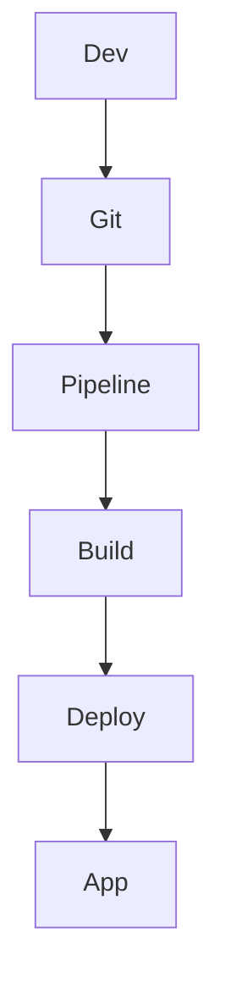

# CI/CD AWS — CodePipeline, CodeBuild, CodeDeploy

## Objectifs pédagogiques

- Comprendre les principes CI/CD
- Construire un pipeline AWS complet
- Automatiser build, test et déploiement
- Gérer rollback et versioning
- Diagnostiquer un pipeline défaillant

## Contexte et problématique

Sans CI/CD :

- Déploiements manuels
- Risques d’erreurs
- Temps de livraison long

CI/CD permet :

- Automatisation
- Fiabilité
- Déploiement rapide

## Architecture

| Composant | Rôle | Exemple |
|-----------|------|---------|
| CodePipeline | Orchestration | pipeline |
| CodeBuild | Build | compilation |
| CodeDeploy | Déploiement | EC2 |
| Source | Git | GitHub |



## Commandes essentielles

```bash
aws codepipeline list-pipelines
```

```bash
aws codebuild list-projects
```

```bash
aws deploy list-applications
```

## Fonctionnement interne

1. Commit code
2. Pipeline déclenché
3. Build exécuté
4. Tests lancés
5. Déploiement effectué

🧠 Concept clé  
→ CI/CD = automatisation du cycle de vie logiciel

💡 Astuce  
→ Toujours ajouter des tests dans pipeline

⚠️ Erreur fréquente  
→ Déployer sans rollback  
Correction : config rollback automatique

## Cas réel en entreprise

Contexte :

Déploiement application web.

Solution :

- CodePipeline orchestré
- CodeBuild compile
- CodeDeploy déploie

Résultat :

- Déploiement rapide
- Réduction erreurs

## Bonnes pratiques

- Automatiser tests
- Utiliser rollback
- Versionner artefacts
- Monitorer pipeline
- Sécuriser accès
- Isoler env dev/prod
- Documenter pipeline

## Résumé

CI/CD automatise le déploiement logiciel.  
AWS propose des outils intégrés.  
Un pipeline bien conçu améliore fiabilité et vitesse.

---

## SNIPPETS DE RÉVISION

<!-- snippet
id: aws_cicd_definition
tech: aws
level: intermediate
importance: high
format: knowledge
tags: aws,cicd,devops
title: CI CD définition
content: CI/CD automatise le build, test et déploiement des applications
description: Base DevOps
-->

<!-- snippet
id: aws_codepipeline_role
tech: aws
level: intermediate
importance: high
format: knowledge
tags: aws,codepipeline,cicd
title: CodePipeline rôle
content: CodePipeline orchestre les différentes étapes du pipeline CI/CD
description: Orchestrateur AWS
-->

<!-- snippet
id: aws_codedeploy_definition
tech: aws
level: intermediate
importance: medium
format: knowledge
tags: aws,codedeploy,deploy
title: CodeDeploy rôle
content: CodeDeploy permet de déployer automatiquement une application sur des instances
description: Déploiement AWS
-->

<!-- snippet
id: aws_pipeline_command
tech: aws
level: intermediate
importance: medium
format: knowledge
tags: aws,cli,pipeline
title: Lister pipelines
command: aws codepipeline list-pipelines
description: Permet de voir les pipelines existants
-->

<!-- snippet
id: aws_pipeline_warning
tech: aws
level: intermediate
importance: high
format: knowledge
tags: aws,cicd,error
title: Pas de rollback
content: Déployer sans rollback rend impossible la récupération après erreur, toujours configurer rollback
description: Piège critique
-->

<!-- snippet
id: aws_pipeline_tip
tech: aws
level: intermediate
importance: medium
format: knowledge
tags: aws,cicd,bestpractice
title: Tester dans pipeline
content: Ajouter des tests dans le pipeline permet de détecter les erreurs avant production
description: Bonne pratique CI/CD
-->

<!-- snippet
id: aws_pipeline_error
tech: aws
level: intermediate
importance: high
format: knowledge
tags: aws,cicd,incident
title: Pipeline échoue
content: Symptôme pipeline bloqué, cause erreur build ou permissions, correction vérifier logs CodeBuild et IAM
description: Problème fréquent
-->
