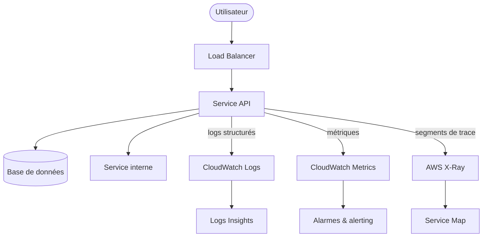

# Observabilité avancée — Logs, Metrics, Tracing (CloudWatch & X-Ray)

## Objectifs pédagogiques

À l'issue de ce module, tu seras capable de :

- Distinguer logs, métriques et traces, et choisir lequel mobiliser selon la nature d'un incident
- Configurer CloudWatch Logs Insights pour interroger des logs applicatifs en production
- Créer des métriques custom et des alarmes CloudWatch calées sur des seuils métier réels
- Instrumenter une application avec AWS X-Ray pour visualiser un flux distribué bout en bout
- Corréler les trois piliers de l'observabilité pour diagnostiquer un incident complexe en quelques minutes

---

## Pourquoi le monitoring seul ne suffit plus

Surveiller le CPU d'une instance EC2, c'est utile. Mais quand ton API commence à répondre en 8 secondes au lieu de 200 millisecondes, la courbe CPU ne t'explique pas grand-chose. Est-ce une requête SQL mal optimisée ? Un service tiers qui timeout ? Une saturation mémoire silencieuse ? Un bug introduit dans le dernier déploiement ?

Le monitoring classique te dit *que* quelque chose se passe. L'observabilité te permet de comprendre *pourquoi* et *où* — sans avoir à modifier le code ni à reproduire le problème en local.

<!-- snippet
id: aws_observability_definition
type: concept
tech: aws
level: intermediate
importance: high
format: knowledge
tags: aws,observability,monitoring
title: Observabilité vs monitoring — la distinction clé
content: L'observabilité mesure dans quelle mesure on peut déduire l'état interne d'un système depuis ses sorties externes. Un système monitoré dit "ce qui se passe" ; un système observable permet de répondre à "pourquoi ça se passe" sans avoir à modifier le code pour investiguer.
description: Monitoring = surveiller des métriques connues. Observabilité = pouvoir investiguer des problèmes inconnus à partir des sorties du système.
-->

L'observabilité repose sur trois piliers complémentaires. Aucun ne remplace les deux autres :

| Pilier | Question à laquelle il répond | Outil AWS |
|---|---|---|
| **Métriques** | *Quoi* se passe-t-il, en chiffres ? | CloudWatch Metrics |
| **Logs** | *Pourquoi* ça casse, dans le détail ? | CloudWatch Logs |
| **Traces** | *Où* dans la chaîne ça se concentre ? | AWS X-Ray |

<!-- snippet
id: aws_logs_metrics_traces
type: concept
tech: aws
level: intermediate
importance: high
format: knowledge
tags: aws,logs,metrics,tracing
title: Les trois piliers de l'observabilité
content: Les métriques chiffrent l'état du système à un instant (CPU 72%, latence 120ms). Les logs racontent ce qui s'est passé sous forme d'événements textuels horodatés. Les traces suivent le chemin d'une requête à travers plusieurs services avec les temps à chaque étape.
description: Une alarme métrique dit "quelque chose cloche", les logs disent "quoi", les traces disent "où dans la chaîne". Les trois ensemble permettent de diagnostiquer en minutes.
-->

---

## Architecture d'observabilité AWS

> **SAA-C03** — Si la question mentionne…
> - "metrics / métriques" + "alarms / alarmes" + "dashboards" → **CloudWatch**
> - "logs centralization / centralisation des logs" + "query / requêter" + "Insights" → **CloudWatch Logs** (+ Logs Insights pour les requêtes)
> - "distributed tracing / traçage distribué" + "latency between services / latence entre services" + "service map" → **X-Ray**
> - "audit API calls / auditer les appels API" + "who did what / qui a fait quoi" → **CloudTrail** (pas CloudWatch)
> - "Prometheus / Grafana" + "containers monitoring / monitoring de conteneurs" → **Managed Prometheus** + **Managed Grafana**
> - "three pillars of observability / trois piliers de l'observabilité" → **Metrics** (CloudWatch) + **Logs** (CloudWatch Logs) + **Traces** (X-Ray)
> - ⛔ CloudWatch = **métriques + logs + alarmes** (état du système). CloudTrail = **audit des appels API** (qui a fait quoi). X-Ray = **tracing distribué** (latence entre services). Trois rôles distincts.

En production, une requête utilisateur traverse plusieurs couches avant d'obtenir une réponse. L'observabilité consiste à instrumenter chacune d'elles pour pouvoir reconstituer le chemin complet après coup — sans toucher au code, sans reproduire le scénario.



| Composant | Rôle | Ce qu'il expose |
|---|---|---|
| CloudWatch Metrics | Agrégation de métriques temporelles | CPU, latence, taux d'erreur |
| CloudWatch Logs | Centralisation des logs applicatifs | Logs structurés ou bruts |
| CloudWatch Logs Insights | Requêtes analytiques sur les logs | Filtres, agrégations, visualisation |
| CloudWatch Alarms | Alerting sur seuils | Notification SNS, action automatique |
| AWS X-Ray | Tracing distribué | Carte de service, temps par segment |

---

## CloudWatch Logs — ingestion et interrogation

### Suivre les logs en temps réel

La commande la plus utile en situation d'incident est le suivi en direct d'un log group. Pas besoin d'ouvrir la console, de naviguer dans l'interface ou de rafraîchir manuellement :

<!-- snippet
id: aws_logs_tail_command
type: command
tech: aws
level: intermediate
importance: medium
format: knowledge
tags: aws,logs,cli
title: Suivre un log group en temps réel
command: aws logs tail <LOG_GROUP> --follow
example: aws logs tail /aws/lambda/my-function --follow
description: Affiche les nouveaux logs au fil de leur arrivée. Indispensable pour déboguer en temps réel sans passer par la console AWS.
-->

### Interroger les logs avec Logs Insights

CloudWatch Logs Insights permet d'exécuter des requêtes analytiques sur des volumes importants de logs sans les exporter. La syntaxe est proche du SQL et s'exécute directement depuis le terminal :

<!-- snippet
id: aws_logs_insights_query
type: command
tech: aws
level: intermediate
importance: high
format: knowledge
tags: aws,logs,insights,cli
title: Requête Logs Insights via CLI
command: aws logs start-query --log-group-name <LOG_GROUP> --start-time <START_EPOCH> --end-time <END_EPOCH> --query-string '<QUERY>'
example: aws logs start-query --log-group-name /app/api --start-time 1700000000 --end-time 1700003600 --query-string 'fields @timestamp, @message | filter level = "error" | sort @timestamp desc | limit 50'
description: Lance une requête Logs Insights depuis le terminal. Récupérer le résultat avec get-query-results et l'ID retourné par cette commande.
-->

### La qualité des logs détermine le temps de diagnostic

Un log en texte libre oblige à lire ligne par ligne. Un log JSON se filtre en une seconde. C'est la différence entre un incident résolu en 5 minutes et une nuit de débogage.

<!-- snippet
id: aws_logs_structure_warning
type: warning
tech: aws
level: intermediate
importance: high
format: knowledge
tags: aws,logs,json,structured
title: Logs non structurés — impossible à exploiter à l'échelle
content: Un log "ERROR: connexion échouée" oblige à lire chaque ligne pour comprendre le contexte. Le même log en JSON ({"level":"error","msg":"connexion échouée","user_id":42,"db":"orders","duration_ms":3200}) se filtre, se trie et s'agrège en une seule requête CloudWatch Insights.
description: Ajouter un champ request_id dans chaque log JSON permet de retrouver toute la trace d'une requête en une seule recherche Logs Insights.
-->

Un log bien structuré ressemble à ça :

```json
{
  "timestamp": "2024-11-14T10:23:45Z",
  "level": "error",
  "service": "order-api",
  "request_id": "a3f9b12c-8d4e",
  "user_id": 42,
  "action": "checkout",
  "db": "orders",
  "duration_ms": 3200,
  "msg": "connexion DB échouée après 3 tentatives"
}
```

Avec ce format, une requête Logs Insights retrouve en quelques secondes tous les utilisateurs impactés par un pic de latence DB sur une plage d'une heure — sans lire un seul log manuellement.

---

## CloudWatch Metrics et Alarmes

### Métriques custom

Les métriques AWS natives (CPU, réseau, mémoire Lambda) sont collectées automatiquement. Mais les métriques métier — nombre de commandes échouées, temps de traitement d'un paiement, taux de conversion — doivent être publiées manuellement. C'est là qu'une métrique devient vraiment utile : quand elle parle le langage du business, pas seulement celui de l'infrastructure.

<!-- snippet
id: aws_cloudwatch_put_metric
type: command
tech: aws
level: intermediate
importance: high
format: knowledge
tags: aws,cloudwatch,metrics,custom
title: Publier une métrique custom CloudWatch
command: aws cloudwatch put-metric-data --namespace <NAMESPACE> --metric-name <METRIC_NAME> --value <VALUE> --unit <UNIT>
example: aws cloudwatch put-metric-data --namespace MyApp/Orders --metric-name FailedCheckouts --value 1 --unit Count
description: Publie un point de données dans un namespace custom. Peut être appelé depuis un script, une Lambda ou un job cron pour refléter des indicateurs métier.
-->

### Créer une alarme sur seuil

Une métrique sans alarme, c'est une information qu'on ne consulte que quand c'est déjà trop tard. L'alarme transforme une courbe passive en déclencheur actif :

<!-- snippet
id: aws_cloudwatch_alarm
type: command
tech: aws
level: intermediate
importance: high
format: knowledge
tags: aws,cloudwatch,alarms,alerting
title: Créer une alarme CloudWatch sur un seuil
command: aws cloudwatch put-metric-alarm --alarm-name <ALARM_NAME> --metric-name <METRIC_NAME> --namespace <NAMESPACE> --statistic <STATISTIC> --period <PERIOD> --threshold <THRESHOLD> --comparison-operator <OPERATOR> --evaluation-periods <PERIODS> --alarm-actions <SNS_ARN>
example: aws cloudwatch put-metric-alarm --alarm-name "API-High-Latency" --metric-name Latency --namespace AWS/ApplicationELB --statistic Average --period 60 --threshold 2000 --comparison-operator GreaterThanThreshold --evaluation-periods 3 --alarm-actions arn:aws:sns:eu-west-1:123456789:ops-alerts
description: Déclenche une notification SNS si la latence moyenne dépasse 2 secondes pendant 3 minutes consécutives. Éviter de se déclencher sur un seul point de données pour limiter les faux positifs.
-->

🧠 Préférer les percentiles P95/P99 à la moyenne pour les alarmes de latence. Une latence moyenne de 300ms peut masquer 1% des requêtes à 12 secondes — ce sont elles qui génèrent des tickets support et des abandons de panier.

---

## AWS X-Ray — tracer les flux distribués

Quand une architecture enchaîne plusieurs services (API Gateway → Lambda → DynamoDB → service externe), la latence globale peut grimper sans qu'aucun service ne soit individuellement en faute. X-Ray est le seul outil qui te donne une vue complète du chemin parcouru par chaque requête.

Il instrumente chaque appel entre services et reconstruit ce chemin sous forme de **trace**, découpée en **segments** (un par service) et **sous-segments** (un par appel imbriqué : requête DB, appel HTTP externe, etc.).

<!-- snippet
id: aws_tracing_tip
type: tip
tech: aws
level: intermediate
importance: medium
format: knowledge
tags: aws,tracing,xray,lambda
title: X-Ray — activation sans modification de code
content: X-Ray instrumente automatiquement les appels entre Lambda, API Gateway, DynamoDB et services externes, et génère une carte de service avec les temps de réponse à chaque saut. Un segment rouge signale où la latence se concentre sans avoir à lire des milliers de logs.
description: Sur Lambda, X-Ray s'active directement dans la configuration de la fonction (mode Active) sans déployer de daemon ni modifier le code métier.
-->

### Interroger les traces X-Ray

<!-- snippet
id: aws_xray_get_traces
type: command
tech: aws
level: intermediate
importance: medium
format: knowledge
tags: aws,xray,tracing,cli
title: Lister les traces X-Ray avec filtre de latence
command: aws xray get-trace-summaries --start-time <START_EPOCH> --end-time <END_EPOCH> --filter-expression '<FILTER>'
example: aws xray get-trace-summaries --start-time 1700000000 --end-time 1700003600 --filter-expression 'responsetime > 2'
description: Retourne les traces dont le temps de réponse dépasse 2 secondes. Utile pour isoler les requêtes lentes sans parcourir la totalité des traces collectées.
-->

### Comment X-Ray reconstitue un flux

Voici ce qui se passe concrètement quand une requête entre dans le système :

1. **X-Ray génère un Trace ID** unique à cette requête dès le premier service
2. Chaque service qui la traite crée un **segment** avec ses propres timings
3. Les appels imbriqués (DB, HTTP externe) génèrent des **sous-segments**
4. X-Ray agrège tout ça en une **timeline** qui montre visuellement où le temps se passe

🧠 Le Trace ID circule dans les headers HTTP (`X-Amzn-Trace-Id`). Si tu ajoutes ce même ID dans tes logs JSON sous un champ `request_id`, tu peux retrouver en une requête Logs Insights tous les logs correspondant à une trace précise. C'est la corrélation logs + traces : la métrique signale, la trace localise, le log explique.

⚠️ X-Ray échantillonne les traces par défaut (5% au-delà du premier appel par seconde). En développement, augmente le taux d'échantillonnage pour une couverture complète. En production haute charge, conserve les règles par défaut pour maîtriser les coûts.

<!-- snippet
id: aws_xray_sampling_warning
type: warning
tech: aws
level: intermediate
importance: medium
format: knowledge
tags: aws,xray,sampling,cost
title: X-Ray — attention à l'échantillonnage en production
content: Par défaut, X-Ray enregistre la première requête par seconde puis 5% des suivantes. En développement ce taux est trop faible pour déboguer. En production haute charge, le monter à 100% peut générer des coûts significatifs. Définir des règles d'échantillonnage par route (100% sur /checkout, 5% sur /healthcheck) est la meilleure approche.
description: Les règles d'échantillonnage X-Ray se configurent dans la console ou via l'API put-sampling-rule, par service et par URL.
-->

---

## Cas réel — Diagnostic d'une latence inexpliquée

**Contexte :** Une équipe e-commerce observe que le temps de réponse de l'API `/checkout` passe de 280ms à plus de 6 secondes certains soirs, sans corrélation évidente avec la charge serveur. Les utilisateurs abandonnent leur panier. Le support reçoit des tickets, mais personne ne sait où chercher.

**Étape 1 — Les métriques donnent le signal.** L'alarme CloudWatch sur la latence P95 de l'ALB se déclenche à 19h02. On confirme que le problème est réel, récurrent, et limité à une plage horaire.

**Étape 2 — X-Ray localise le coupable.** La Service Map X-Ray montre que 94% du temps de réponse est consommé par un seul sous-segment : l'appel au service de vérification de stock, qui lui-même appelle une API tierce de fournisseur. Ce fournisseur a des problèmes de performance en soirée.

**Étape 3 — Les logs confirment et détaillent.** Une requête Logs Insights filtrée sur `duration_ms > 3000` et `service = "stock-checker"` révèle que les timeouts commencent systématiquement à 19h02 et concernent un seul SKU de produit en rupture de stock.

**Résultat :** L'équipe met en place un cache Redis de 5 minutes sur les réponses de stock, un timeout agressif de 800ms sur l'API fournisseur avec fallback sur la dernière valeur connue, et une alarme dédiée sur ce sous-segment spécifique. La latence P95 redescend à 310ms. Zéro abandon de panier lié à ce problème lors des semaines suivantes.

<!-- snippet
id: aws_missing_observability_error
type: warning
tech: aws
level: intermediate
importance: high
format: knowledge
tags: aws,incident,production,debugging
title: Absence d'observabilité — le piège du temps perdu
content: Sans logs structurés ni traces, un incident de production devient une chasse au trésor. L'équipe passe des heures à lire des logs bruts, à reproduire des scénarios en local, à faire des hypothèses non vérifiables. Avec CloudWatch Logs Insights et X-Ray, le même incident se diagnostique en minutes : la métrique signale, la trace localise, le log explique.
description: Le coût d'une bonne observabilité (quelques euros de logs et traces) est toujours inférieur au coût d'un incident mal diagnostiqué en production.
-->

---

## Bonnes pratiques

**Structurer les logs en JSON dès le premier jour** — Pas après le premier incident. La refonte des logs d'un service existant en production coûte bien plus cher que de le faire correctement dès le départ. Chaque log doit contenir au minimum : `timestamp`, `level`, `service`, `request_id`, `message`.

**Propager un correlation ID traversant** — Un identifiant unique généré à l'entrée du système (API Gateway, ALB) et transmis dans tous les appels inter-services permet de reconstituer le chemin complet d'une requête en une seule requête Logs Insights, même sur dix services différents.

**Séparer les log groups par service et environnement** — Un log group `/app/order-api/prod` est facile à retrouver, à filtrer et à contrôler en termes de rétention. Un log group `/app/logs` mélangeant tous les services devient inutilisable à l'échelle.

**Alarmer sur P95/P99, pas sur la moyenne** — La moyenne cache les problèmes. Une latence moyenne de 300ms peut masquer 1% de requêtes à 12 secondes. C'est ce 1% qui dégrade l'expérience utilisateur et génère des escalades support.

**Ne pas tout logger** — Les logs verbose en production coûtent cher (stockage et ingestion CloudWatch) et noient les informations importantes dans le bruit. Logger les événements signifiants : erreurs, transitions d'état, actions utilisateur critiques, dépassements de seuil.

**Activer X-Ray en priorité sur les chemins critiques** — Pas besoin d'instrumenter 100% des services dès le départ. Commencer par les flux à fort impact (checkout, authentification, paiement) apporte immédiatement de la valeur et révèle l'architecture réelle telle qu'elle se comporte en production.

**Configurer la rétention des logs explicitement** — Par défaut, CloudWatch Logs conserve indéfiniment. Définir une politique de rétention adaptée évite une facture qui croît sans fin : 30 jours pour les logs de debug, 90 jours pour les erreurs, 1 an pour les logs d'audit.

---

## Résumé

L'observabilité AWS repose sur trois piliers qui se complètent : CloudWatch Metrics signale les anomalies en chiffres, CloudWatch Logs Insights permet d'interroger ce qui s'est passé dans le détail, AWS X-Ray reconstitue le chemin exact d'une requête à travers les services. La corrélation des trois — via un `request_id` commun propagé dans logs et headers — transforme un incident opaque de plusieurs heures en un diagnostic de quelques minutes.

Le module suivant aborde la gestion multi-environnement AWS : comment structurer les comptes, les accès et les pipelines pour que l'observabilité mise en place ici s'applique de manière cohérente à chaque environnement, de dev à prod.
