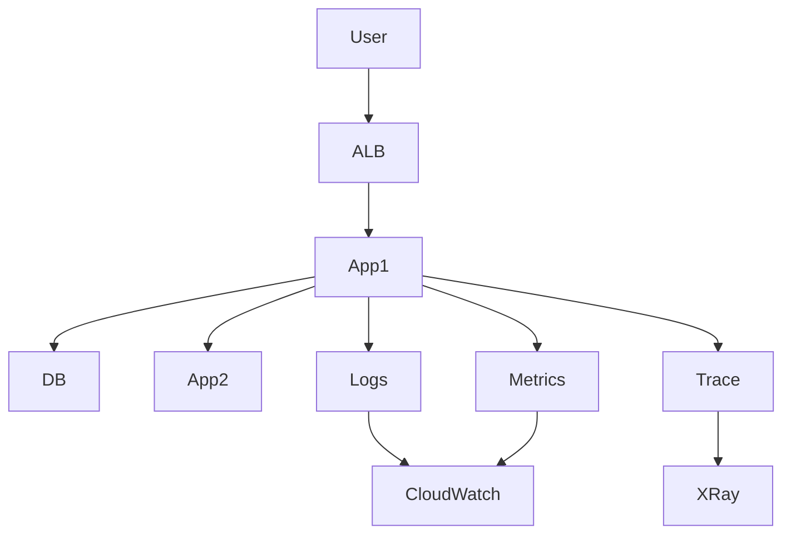

# Observabilité avancée — Logs, Metrics, Tracing (CloudWatch & X-Ray)

## Objectifs pédagogiques

- Comprendre la différence entre logs, metrics et traces
- Mettre en place une observabilité exploitable en production
- Utiliser CloudWatch Logs et Metrics efficacement
- Analyser un flux applicatif avec AWS X-Ray
- Diagnostiquer un incident complexe (latence / erreurs)

## Contexte et problématique

Un monitoring simple (CPU) ne suffit pas en production :

- Latence inconnue
- erreurs non corrélées
- dépendances invisibles

👉 Il faut une observabilité complète :

- Metrics → quoi se passe
- Logs → pourquoi ça casse
- Traces → où ça casse

## Architecture

| Composant | Rôle | Exemple |
|-----------|------|---------|
| CloudWatch Metrics | performance | CPU, latency |
| CloudWatch Logs | logs centralisés | app logs |
| X-Ray | tracing distribué | microservices |
| Alarms | alerting | erreur > seuil |



## Commandes essentielles

```bash
aws logs tail <LOG_GROUP> --follow
```
Permet de suivre les logs en temps réel.

```bash
aws cloudwatch get-metric-statistics --metric-name CPUUtilization --namespace AWS/EC2
```
Récupère des métriques.

```bash
aws xray get-trace-summaries
```
Liste les traces X-Ray.

## Fonctionnement interne

### Logs
- Collectés via agent ou service AWS
- Stockés dans CloudWatch Logs
- Interrogeables (Logs Insights)

### Metrics
- Collectées automatiquement ou custom
- Agrégées par CloudWatch

### Tracing (X-Ray)

1. Requête utilisateur
2. Passage entre services
3. Chaque étape tracée
4. Reconstruction du flux

🧠 Concept clé  
→ Observabilité = corrélation logs + metrics + traces

💡 Astuce  
→ Toujours ajouter un request_id dans logs

⚠️ Erreur fréquente  
→ Logs non structurés  
→ Impossible à exploiter  
Correction : logs JSON

## Cas réel en entreprise

Contexte :

API lente en prod.

Analyse :

- Metrics → latence élevée
- Logs → erreurs DB
- X-Ray → requête lente DB

Résultat :

- optimisation DB
- latence divisée par 3

## Bonnes pratiques

- Centraliser tous les logs
- Structurer les logs (JSON)
- Ajouter correlation ID
- Monitorer métriques critiques
- Utiliser X-Ray pour microservices
- Limiter le bruit dans les logs
- Mettre alertes pertinentes

## Résumé

L’observabilité combine logs, metrics et traces.  
CloudWatch centralise les données.  
X-Ray permet de comprendre les flux applicatifs.  
C’est indispensable pour diagnostiquer en production.

---

## SNIPPETS DE RÉVISION

<!-- snippet
id: aws_observability_definition
type: concept
tech: aws
level: intermediate
importance: high
format: knowledge
tags: aws,observability,monitoring
title: Observabilité définition
content: L’observabilité permet de comprendre le comportement d’un système via logs, metrics et traces
description: Concept clé DevOps
-->

<!-- snippet
id: aws_logs_metrics_traces
type: concept
tech: aws
level: intermediate
importance: high
format: knowledge
tags: aws,logs,metrics,tracing
title: Différence logs metrics traces
content: Logs expliquent les événements, metrics mesurent les performances, traces suivent le flux d'une requête
description: Différence fondamentale
-->

<!-- snippet
id: aws_logs_tail_command
type: command
tech: aws
level: intermediate
importance: medium
format: knowledge
tags: aws,logs,cli
title: Suivre logs temps réel
command: aws logs tail <LOG_GROUP> --follow
description: Permet de voir les logs en temps réel
-->

<!-- snippet
id: aws_logs_structure_warning
type: warning
tech: aws
level: intermediate
importance: high
format: knowledge
tags: aws,logs,error
title: Logs non structurés
content: Des logs non structurés sont difficiles à analyser, utiliser du JSON pour faciliter la recherche
description: Piège fréquent observabilité
-->

<!-- snippet
id: aws_tracing_tip
type: tip
tech: aws
level: intermediate
importance: medium
format: knowledge
tags: aws,tracing,xray
title: Utiliser X-Ray
content: X-Ray permet de visualiser le parcours complet d'une requête et identifier les points de latence
description: Outil clé debugging
-->

<!-- snippet
id: aws_missing_observability_error
type: error
tech: aws
level: intermediate
importance: high
format: knowledge
tags: aws,incident,monitoring
title: Pas d’observabilité
content: Symptôme incident non compris, cause manque logs ou traces, correction mettre en place CloudWatch et X-Ray
description: Erreur critique production
-->
