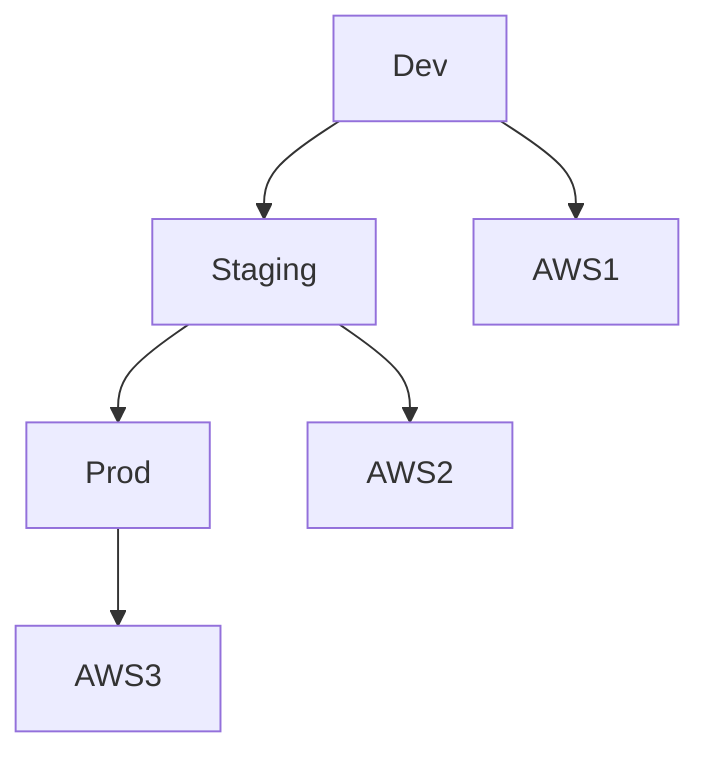

# Multi-environnement AWS — dev, staging, prod & multi-account

## Objectifs pédagogiques

- Comprendre l'intérêt des environnements multiples
- Structurer une architecture dev / staging / prod
- Mettre en place une isolation via comptes AWS
- Gérer les configurations par environnement
- Éviter les erreurs critiques liées aux environnements

## Contexte et problématique

Sans séparation :

- Bugs en production
- Tests dangereux
- Données corrompues

👉 Solution :

- Séparer les environnements
- Isoler les accès
- Reproduire la prod en staging

## Architecture

| Environnement | Rôle | Risque |
|--------------|------|--------|
| Dev | développement | faible |
| Staging | pré-prod | moyen |
| Prod | production | critique |



## Commandes essentielles

```bash
aws configure --profile dev
```

```bash
aws configure --profile prod
```

```bash
aws --profile prod ec2 describe-instances
```

## Fonctionnement interne

1. Chaque environnement isolé
2. Config propre (variables, DB, réseau)
3. Pipeline CI/CD déploie progressivement

🧠 Concept clé  
→ Ne jamais tester en production

💡 Astuce  
→ Utiliser un compte AWS par environnement

⚠️ Erreur fréquente  
→ Mélanger dev et prod  
Correction : isolation stricte

## Cas réel en entreprise

Contexte :

Application SaaS.

Solution :

- Compte AWS dev
- Compte staging
- Compte prod

Résultat :

- sécurité renforcée
- déploiement maîtrisé

## Bonnes pratiques

- 1 compte AWS par environnement
- Isoler IAM
- Utiliser variables env
- Reproduire prod en staging
- Automatiser déploiement
- Restreindre accès prod
- Logger toutes actions

## Résumé

La séparation des environnements est essentielle.  
Le multi-account AWS est la meilleure approche.  
Cela réduit les risques et améliore la qualité des déploiements.

---

## SNIPPETS DE RÉVISION

<!-- snippet
id: aws_env_definition
tech: aws
level: intermediate
importance: high
format: knowledge
tags: aws,environment,devops
title: Environnements AWS
content: Les environnements permettent de séparer développement, test et production pour réduire les risques
description: Base organisation infra
-->

<!-- snippet
id: aws_multi_account_concept
tech: aws
level: intermediate
importance: high
format: knowledge
tags: aws,multiaccount,security
title: Multi account AWS
content: Utiliser plusieurs comptes AWS permet une isolation forte entre environnements
description: Bonne pratique pro
-->

<!-- snippet
id: aws_env_mixing_warning
tech: aws
level: intermediate
importance: high
format: knowledge
tags: aws,error,environment
title: Mélanger env
content: Mélanger dev et prod peut provoquer des incidents critiques, toujours isoler les environnements
description: Piège fréquent
-->

<!-- snippet
id: aws_profile_command
tech: aws
level: intermediate
importance: medium
format: knowledge
tags: aws,cli,profile
title: Utiliser profil AWS
command: aws --profile <PROFILE> ec2 describe-instances
description: Permet d'exécuter des commandes avec un profil spécifique
-->

<!-- snippet
id: aws_env_tip
tech: aws
level: intermediate
importance: medium
format: knowledge
tags: aws,devops,bestpractice
title: Reproduire prod
content: Un environnement staging proche de la production permet de détecter les bugs avant mise en prod
description: Bonne pratique
-->

<!-- snippet
id: aws_env_error
tech: aws
level: intermediate
importance: high
format: knowledge
tags: aws,incident,prod
title: Erreur en production
content: Symptôme bug en prod, cause test direct en prod, correction utiliser staging
description: Erreur critique
-->
