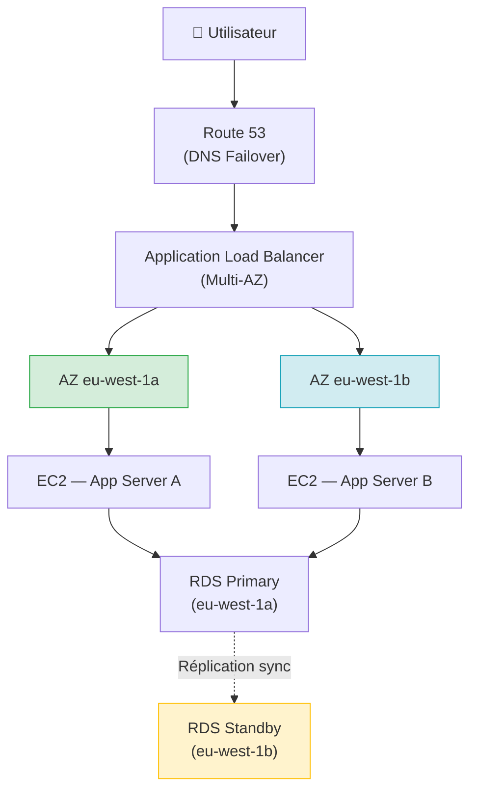
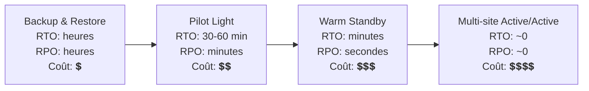

# Architectures hautement disponibles — Multi-AZ, Failover, Disaster Recovery

## Objectifs pédagogiques

À l'issue de ce module, tu seras capable de :

- Définir un SLO de disponibilité et en déduire les contraintes architecturales associées
- Concevoir une architecture Multi-AZ avec redondance des couches compute, réseau et base de données
- Configurer et valider un mécanisme de failover automatique via Route 53 et ALB
- Différencier les quatre stratégies de Disaster Recovery et choisir la plus adaptée à un contexte donné
- Identifier les points de défaillance uniques (SPOF) dans une architecture existante

---

## Pourquoi la haute disponibilité est un problème d'argent

Une application indisponible coûte. Pas métaphoriquement — littéralement. Pour une plateforme e-commerce générant 100 000 €/heure de CA, une heure de downtime en période de soldes représente une perte directe, sans compter l'impact sur la réputation et les pénalités contractuelles.

Le problème fondamental d'une architecture classique, c'est qu'elle repose sur des composants uniques : un seul serveur, une seule zone de disponibilité, une seule base de données sans réplique. Quand ce composant tombe — et il tombera, c'est une question de temps — tout tombe avec lui.

La haute disponibilité n'est pas une fonctionnalité qu'on ajoute après coup. C'est une contrainte de conception qui se traduit par des choix concrets : où déployer, comment router le trafic, comment détecter une panne et comment basculer automatiquement. Ce module couvre exactement ça.

<!-- snippet
id: aws_ha_slo_levels
type: concept
tech: aws
level: advanced
importance: high
format: knowledge
tags: aws,ha,architecture,slo
title: Haute disponibilité — SLO et niveaux de 9
content: La haute disponibilité est un SLO exprimé en pourcentage de disponibilité annuelle : 99,9% = 8,7h de downtime/an, 99,99% = 52min/an, 99,999% = 5min/an. Chaque 9 supplémentaire exige une architecture plus complexe — redondance, health checks, failover automatique, et pour les derniers 9, du chaos engineering permanent.
description: La HA ne se décrète pas, elle se mesure : sans SLO défini et suivi, on ne sait pas si l'objectif est atteint.
-->

### Ce que signifie "disponible"

La disponibilité se mesure en SLO (Service Level Objective), exprimé en pourcentage de temps de fonctionnement sur une année :

| SLO | Downtime annuel autorisé | Architecture typique |
|-----|--------------------------|----------------------|
| 99 % | ~87 heures | Serveur unique, pas de redondance |
| 99,9 % | ~8,7 heures | Multi-AZ basique, ALB |
| 99,99 % | ~52 minutes | Multi-AZ + failover automatique + tests réguliers |
| 99,999 % | ~5 minutes | Multi-région actif/actif, chaos engineering permanent |

La différence entre 99,9 % et 99,99 % paraît faible sur le papier. En pratique, elle implique que chaque panne détectée, chaque bascule, chaque redémarrage doit se faire en moins de quelques minutes — et de façon **automatique**, sans intervention humaine.

---

## L'architecture Multi-AZ : le socle de toute HA sur AWS

Une zone de disponibilité (AZ) est un datacenter physiquement séparé des autres AZ d'une même région. AWS garantit que la panne d'une AZ n'affecte pas les autres — des alimentations électriques distinctes, des connexions réseau indépendantes, une localisation géographique différente.

Déployer sur plusieurs AZ, c'est accepter que l'une d'elles tombe et que le service continue sans intervention.



Chaque couche est redondante :

- **ALB** distribue le trafic entre les AZ et retire automatiquement les instances unhealthy
- **EC2** tourne en parallèle dans les deux AZ ; si l'AZ A tombe, l'ALB route tout vers l'AZ B
- **RDS Multi-AZ** maintient un standby synchrone : en cas de panne du primary, AWS promeut le standby en quelques secondes sans modification de l'endpoint applicatif

<!-- snippet
id: aws_multi_az_concept
type: concept
tech: aws
level: advanced
importance: high
format: knowledge
tags: aws,az,ha,redondance
title: Multi-AZ — redondance de zone
content: Multi-AZ consiste à déployer des ressources sur plusieurs zones de disponibilité indépendantes pour tolérer la panne d'une AZ entière. Chaque AZ dispose de sa propre alimentation électrique, de son réseau et d'une localisation physique distincte. AWS garantit que la panne d'une AZ n'affecte pas les autres AZ de la même région.
description: Le déploiement Multi-AZ est le prérequis minimum pour toute architecture HA sur AWS — sans lui, une panne AZ est une panne totale.
-->

<!-- snippet
id: aws_ha_spof_warning
type: warning
tech: aws
level: advanced
importance: high
format: knowledge
tags: aws,ha,spof,architecture
title: Single AZ — point de défaillance unique garanti
content: Déployer l'ensemble d'une application sur une seule AZ crée un SPOF au niveau de l'infrastructure physique. Une panne électrique, réseau ou matérielle dans cette AZ entraîne une indisponibilité totale, quelle que soit la robustesse du code. Solution : distribuer chaque couche (compute, base de données, cache) sur au moins deux AZ distinctes.
description: Ce n'est pas une question de probabilité mais de quand — toutes les AZ subissent des incidents, AWS publie ces événements dans le Service Health Dashboard.
-->

---

## Failover : détecter la panne et basculer automatiquement

La redondance ne suffit pas si aucun système ne détecte la panne et reroute le trafic. C'est le rôle du failover — et sa vitesse dépend directement de la façon dont les health checks sont configurés.

<!-- snippet
id: aws_failover_concept
type: concept
tech: aws
level: advanced
importance: high
format: knowledge
tags: aws,failover,route53,alb
title: Failover — détection et bascule automatique
content: Le failover repose sur un health check qui détecte la panne et un mécanisme de bascule automatique. Route 53 peut rediriger vers une région secondaire via un enregistrement Failover. Un ALB retire automatiquement les instances unhealthy de sa target pool. RDS Multi-AZ promeut le standby en quelques secondes. La vitesse de failover = RequestInterval × FailureThreshold.
description: Un ALB configuré avec 30s d'intervalle × 2 échecs consécutifs = 60s minimum avant bascule — ce paramètre dimensionne directement le downtime perçu.
-->

### Comment ça fonctionne concrètement

**Au niveau ALB** : chaque target (instance EC2) fait l'objet d'un health check périodique. Si une instance ne répond plus, l'ALB la marque `unhealthy` et cesse de lui envoyer du trafic. Le trafic est redistribué sur les instances saines restantes, dans les autres AZ.

**Au niveau Route 53** : un enregistrement de type `Failover` pointe vers un endpoint primaire et un endpoint secondaire. Route 53 vérifie la santé du primaire via un health check ; si celui-ci échoue, il renvoie l'IP du secondaire dans ses réponses DNS. Le TTL doit être court (30–60 secondes) pour que la bascule soit effective rapidement.

**Au niveau RDS** : en mode Multi-AZ, AWS gère la réplication synchrone vers le standby. En cas de panne du primary — panne matérielle, réseau ou AZ unavailable — AWS promeut automatiquement le standby. L'endpoint RDS (`mydb.xxx.eu-west-1.rds.amazonaws.com`) reste identique ; l'application n'a pas à modifier sa configuration.

### Vérifier l'état de santé de tes ressources

```bash
# Lister les instances RDS et leur état Multi-AZ
aws rds describe-db-instances \
  --query 'DBInstances[*].{Id:DBInstanceIdentifier,MultiAZ:MultiAZ,Status:DBInstanceStatus}'
```

```bash
# Vérifier la santé des targets derrière un ALB
aws elbv2 describe-target-health \
  --target-group-arn <TARGET_GROUP_ARN>
```

```bash
# Lister les health checks Route 53 configurés
aws route53 list-health-checks \
  --query 'HealthChecks[*].{Id:Id,Type:HealthCheckConfig.Type,Endpoint:HealthCheckConfig.FullyQualifiedDomainName}'
```

<!-- snippet
id: aws_alb_target_health_cmd
type: command
tech: aws
level: advanced
importance: high
format: knowledge
tags: aws,cli,alb,healthcheck
title: Vérifier la santé des targets ALB
command: aws elbv2 describe-target-health --target-group-arn <TARGET_GROUP_ARN>
example: aws elbv2 describe-target-health --target-group-arn arn:aws:elasticloadbalancing:eu-west-1:123456789012:targetgroup/api-tg/abc123def456
description: Retourne l'état (healthy/unhealthy/initial) de chaque instance derrière le load balancer — à utiliser en premier lors d'un incident de disponibilité.
-->

```bash
# Forcer un failover RDS pour tester la bascule (hors production)
aws rds failover-db-cluster \
  --db-cluster-identifier <CLUSTER_ID>
```

```bash
# Créer un health check Route 53 sur un endpoint HTTPS
aws route53 create-health-check \
  --caller-reference "$(date +%s)" \
  --health-check-config '{
    "Type": "HTTPS",
    "FullyQualifiedDomainName": "<FQDN>",
    "Port": 443,
    "ResourcePath": "/health",
    "RequestInterval": 30,
    "FailureThreshold": 3
  }'
```

<!-- snippet
id: aws_route53_health_check_cmd
type: command
tech: aws
level: advanced
importance: medium
format: knowledge
tags: aws,cli,route53,failover
title: Créer un health check Route 53 sur un endpoint HTTPS
command: aws route53 create-health-check --caller-reference "<REFERENCE>" --health-check-config '{"Type":"HTTPS","FullyQualifiedDomainName":"<FQDN>","Port":443,"ResourcePath":"<PATH>","RequestInterval":<INTERVAL>,"FailureThreshold":<THRESHOLD>}'
example: aws route53 create-health-check --caller-reference "2024-01-15" --health-check-config '{"Type":"HTTPS","FullyQualifiedDomainName":"api.example.com","Port":443,"ResourcePath":"/health","RequestInterval":10,"FailureThreshold":3}'
description: Crée un health check qui surveille un endpoint HTTPS. RequestInterval × FailureThreshold définit le délai avant que Route 53 bascule vers l'enregistrement secondaire.
-->

🧠 **La logique derrière les paramètres** : `RequestInterval` × `FailureThreshold` = temps minimum avant failover. Avec 30s × 3 = 90 secondes d'indisponibilité avant que Route 53 bascule. Pour réduire ce délai, diminuer l'intervalle (10s minimum) ou le seuil d'échecs — mais attention aux faux positifs sur des pics de latence passagers.

<!-- snippet
id: aws_healthcheck_params_tip
type: tip
tech: aws
level: advanced
importance: medium
format: knowledge
tags: aws,healthcheck,alb,route53
title: Calibrer les paramètres de health check selon le RTO
content: RequestInterval × FailureThreshold détermine le temps minimum avant failover. 30s × 3 = 90s, 10s × 2 = 20s. Descendre sous 20s expose à des faux positifs sur des pics de latence. Pour les enregistrements Route 53 critiques, activer le mode "fast" (10s) uniquement si le health check endpoint est léger et fiable.
description: Un health check trop agressif génère des bascules inutiles ; trop permissif, il rallonge le downtime visible. Calibrer selon le RTO cible validé avec le métier.
-->

---

## Disaster Recovery : quand l'AZ ne suffit plus

> **SAA-C03** — Backup Vault Lock **compliance** = personne ne peut supprimer (vraie immuabilité). **Governance** = les admins privilégiés peuvent contourner.

La HA Multi-AZ protège contre la panne d'une zone de disponibilité. Le Disaster Recovery (DR) adresse des scénarios plus graves : région AWS entièrement indisponible, corruption de données, suppression accidentelle d'infrastructure, cyberattaque.

AWS définit quatre stratégies DR, qui se distinguent par deux métriques :

- **RTO (Recovery Time Objective)** : combien de temps pour restaurer le service ?
- **RPO (Recovery Point Objective)** : combien de données peut-on perdre, exprimé en durée ?



| Stratégie | Description | RTO | RPO | Coût |
|-----------|-------------|-----|-----|------|
| **Backup & Restore** | Snapshots réguliers, restauration manuelle en cas d'incident | Heures | Heures | Minimal |
| **Pilot Light** | Infrastructure core répliquée (DB), compute éteint mais prêt à démarrer | 30–60 min | Minutes | Faible |
| **Warm Standby** | Environnement secondaire actif en taille réduite, scalable à la demande | Minutes | Secondes | Modéré |
| **Multi-site Active/Active** | Deux régions actives en parallèle, trafic réparti en permanence | Quasi-zéro | Quasi-zéro | Élevé |

<!-- snippet
id: aws_dr_rto_rpo_concept
type: concept
tech: aws
level: advanced
importance: high
format: knowledge
tags: aws,dr,rto,rpo,architecture
title: RTO et RPO — les deux métriques du Disaster Recovery
content: RTO (Recovery Time Objective) = temps maximum acceptable pour restaurer le service après un incident. RPO (Recovery Point Objective) = quantité maximale de données perdues, exprimée en durée. Ces deux métriques sont définies avec le métier, pas par l'équipe technique. Elles déterminent directement le budget DR : réduire le RTO de heures à minutes peut multiplier les coûts d'infrastructure par 3 à 10.
description: Sans RTO et RPO validés par le business, l'architecture DR sera systématiquement mal calibrée — sur- ou sous-dimensionnée.
-->

<!-- snippet
id: aws_dr_strategies_concept
type: concept
tech: aws
level: advanced
importance: high
format: knowledge
tags: aws,dr,backup,pilotlight,warmstandby,multisite
title: Les quatre stratégies DR AWS
content: Backup & Restore (RTO heures, coût minimal) → Pilot Light (infrastructure DB répliquée, compute éteint, RTO 30-60min) → Warm Standby (environnement réduit actif, scalable, RTO minutes) → Multi-site Active/Active (deux régions actives, RTO quasi-zéro, coût maximal). Le choix dépend du RTO/RPO cible, pas de la préférence technique.
description: Chaque palier réduit le RTO/RPO mais augmente le coût opérationnel et la complexité — choisir le niveau juste suffisant pour tenir le SLA.
-->

💡 **Comment choisir ?** Ce n'est pas un choix technique — c'est un choix business. La question à poser au métier : "Combien vaut une heure d'indisponibilité ? Combien de données pouvez-vous vous permettre de perdre ?" La réponse détermine le budget DR acceptable, qui détermine la stratégie.

⚠️ **HA et DR ne se substituent pas** : la HA protège contre les pannes infrastructure courantes (AZ down, instance défaillante). Le DR protège contre les catastrophes à grande échelle. Une architecture complète a besoin des deux niveaux.

---

## Cas réel : plateforme SaaS financière, 0 downtime sur panne AZ

**Contexte** : une fintech opérant une plateforme de paiement B2B avec un SLA (Service Level Agreement) contractuel de 99,95 % (downtime max : 4h20/an). L'architecture initiale tournait sur une seule AZ (`eu-west-1a`) avec une RDS sans réplication. Un incident AWS en 2023 sur cette AZ avait causé 2h15 d'indisponibilité — soit plus de 50 % du budget downtime annuel consommé en une seule nuit.

**Refonte architecturale** :

1. Migration EC2 vers Auto Scaling Group distribué sur `eu-west-1a`, `eu-west-1b` et `eu-west-1c`
2. ALB avec health checks configurés à 10s × 2 échecs = 20s de détection maximum
3. RDS PostgreSQL en mode Multi-AZ avec promotion automatique du standby
4. Route 53 avec enregistrement Failover vers un endpoint de maintenance hébergé sur S3 + CloudFront (page de maintenance affichée si les deux régions sont down)
5. Tests de failover mensuels via AWS Fault Injection Simulator : termination forcée d'instances et simulation de panne AZ

**Résultats après 12 mois** :

- 3 pannes AZ détectées (2 côté AWS, 1 déclenchée intentionnellement en test)
- Downtime cumulé : **0 seconde perçu par les utilisateurs** — bascule en 18s maximum à chaque fois
- SLA atteint : 99,98 % mesuré sur l'année
- Coût additionnel de l'architecture HA : +340 €/mois vs architecture mono-AZ initiale

<!-- snippet
id: aws_rds_failover_cmd
type: command
tech: aws
level: advanced
importance: medium
format: knowledge
tags: aws,cli,rds,failover,test
context: Utilisé pour tester la bascule RDS en staging ou lors d'un exercice DR planifié — ne jamais lancer en production sans fenêtre de maintenance.
command: aws rds failover-db-cluster --db-cluster-identifier <CLUSTER_ID>
example: aws rds failover-db-cluster --db-cluster-identifier my-aurora-cluster-prod
description: Force la promotion du standby RDS Aurora en primary. Permet de valider que l'application reconnecte automatiquement sans reconfiguration après un failover réel.
-->

<!-- snippet
id: aws_fis_failover_tip
type: tip
tech: aws
level: advanced
importance: medium
format: knowledge
tags: aws,fis,chaosengineering,failover,test
title: Tester le failover régulièrement avec AWS FIS
content: Une architecture HA non testée est une architecture HA dont on ne sait pas si elle fonctionne. AWS Fault Injection Simulator permet d'injecter des pannes réelles (arrêt d'instances, perte de connectivité réseau, panne AZ simulée) en conditions contrôlées. Planifier ces tests mensuellement, monitorer les métriques pendant l'exercice et tracker le RTO observé vs le RTO cible.
description: Netflix a popularisé le Chaos Engineering : tester les pannes en prod de façon contrôlée est moins risqué que de les découvrir lors d'un vrai incident à 3h du matin.
-->

<!-- snippet
id: aws_ha_false_positive_warning
type: warning
tech: aws
level: advanced
importance: high
format: knowledge
tags: aws,incident,healthcheck,alb,dns
title: Downtime total malgré une architecture "HA"
content: |
  - Health checks ALB trop permissifs : vérifient juste le port 80, pas l'état de la DB — l'appli est cassée mais reste "healthy"
  - Security Group bloquant la connexion depuis la nouvelle AZ après failover RDS
  - DNS TTL trop long (≥ 300s) : les clients continuent de requêter l'ancien IP pendant plusieurs minutes — abaisser à 30-60s
description: La configuration HA et son efficacité réelle ne sont pas la même chose — seuls des tests de failover réguliers permettent de valider que la bascule fonctionne comme prévu.
-->

---

## Bonnes pratiques

**1. Concevoir pour la panne, pas pour le succès**
Chaque composant de l'architecture doit avoir une réponse à la question : "Que se passe-t-il si ce composant tombe ?" Si la réponse est "tout s'arrête", c'est un SPOF à éliminer.

**2. Définir RTO et RPO avant de concevoir**
Sans ces deux métriques validées par le métier, l'architecture DR sera sur-dimensionnée (budget gaspillé) ou sous-dimensionnée (SLA non tenu). Ce sont des décisions business, pas techniques.

**3. Automatiser la détection et la bascule**
Un failover manuel dépend de la disponibilité et de la réactivité d'un humain — à 3h du matin un dimanche. La bascule automatique via ALB, RDS Multi-AZ et Route 53 est plus rapide et plus fiable qu'une intervention humaine, sans exception.

**4. Tester les pannes en conditions contrôlées**
AWS Fault Injection Simulator permet d'injecter des pannes réelles sur staging ou en production à faible trafic. Planifier ces tests mensuellement et tracker le RTO observé vs le RTO cible — l'écart entre les deux est toujours instructif.

**5. Configurer les health checks sur les dépendances réelles**
Un health check qui vérifie juste que le port 80 répond ne détecte pas une application cassée qui retourne 200 sur tout. Le path de health check doit vérifier la connectivité base de données et les dépendances critiques — mais rester léger pour ne pas générer de charge inutile.

**6. Aligner le TTL DNS avec le RTO**
Un TTL Route 53 de 300 secondes + un health check de 90 secondes = potentiellement 6–7 minutes de downtime visible même si le failover infrastructure est instantané. Abaisser le TTL à 30–60 secondes sur les enregistrements critiques.

**7. Documenter et exercer le plan DR**
Un runbook DR non testé est un runbook qui ne fonctionnera pas au moment où on en a besoin. Simuler un scénario de DR complet (perte de région) au moins une fois par an, avec les équipes concernées impliquées dans l'exercice — pas seulement l'équipe infra.

---

## Résumé

La haute disponibilité se construit couche par couche : Multi-AZ pour tolérer la panne d'une zone, ALB avec health checks pour détecter et exclure les instances défaillantes, RDS Multi-AZ pour basculer la base de données automatiquement, Route 53 pour rediriger le trafic DNS en cas de défaillance régionale.

Le Disaster Recovery complète ce dispositif pour les scénarios plus extrêmes — de la simple sauvegarde quotidienne au déploiement actif/actif multi-région. Le choix de la stratégie se fait en fonction du RTO et RPO définis avec le métier, pas de préférences techniques.

Ce qui distingue une architecture HA robuste d'une architecture HA sur le papier, c'est la régularité des tests de failover. Le module suivant aborde les architectures serverless, où AWS délègue une grande partie de cette gestion de la disponibilité au service managé lui-même.
