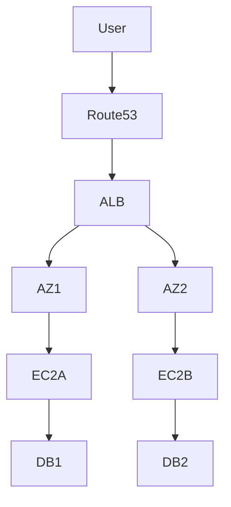

# Architectures hautement disponibles — Multi-AZ, Failover, Disaster Recovery

## Objectifs pédagogiques

- Comprendre les concepts de haute disponibilité (HA)
- Concevoir une architecture Multi-AZ
- Mettre en place des mécanismes de failover
- Comprendre les stratégies de Disaster Recovery (DR)
- Diagnostiquer les points de défaillance d’une architecture

## Contexte et problématique

Une infrastructure classique :

- dépend d’un seul serveur ou AZ
- expose à des pannes critiques
- impacte directement le business

👉 Objectif :
Assurer la continuité de service malgré les pannes

## Architecture

| Composant | Rôle | Exemple |
|-----------|------|---------|
| Multi-AZ | redondance | EC2 sur plusieurs AZ |
| Load Balancer | distribution | ALB |
| RDS Multi-AZ | DB HA | failover auto |
| Route53 | failover DNS | health check |



## Commandes essentielles

```bash
aws rds describe-db-instances
```

```bash
aws elbv2 describe-target-health --target-group-arn <ARN>
```

```bash
aws route53 list-health-checks
```

## Fonctionnement interne

### Multi-AZ
- Instances réparties sur plusieurs zones
- Tolérance à la panne AZ

### Failover
- Détection panne via health check
- Redirection trafic automatique

### Disaster Recovery

Types :

- Backup & Restore
- Pilot Light
- Warm Standby
- Multi-site active/active

🧠 Concept clé  
→ HA ≠ backup → HA = service toujours disponible

💡 Astuce  
→ Toujours combiner ALB + Multi-AZ

⚠️ Erreur fréquente  
→ 1 seule AZ utilisée  
Correction : déployer sur plusieurs AZ

## Cas réel en entreprise

Contexte :

Application critique SaaS.

Solution :

- EC2 multi-AZ
- ALB en front
- RDS Multi-AZ
- Route53 failover

Résultat :

- zéro downtime lors panne AZ
- haute résilience

## Bonnes pratiques

- Toujours utiliser plusieurs AZ
- Tester les pannes (failover)
- Monitorer health checks
- Automatiser recovery
- Documenter architecture
- Utiliser DNS failover
- Prévoir plan DR

## Résumé

La haute disponibilité permet d’éviter les interruptions.  
Multi-AZ, Load Balancer et failover sont essentiels.  
Le Disaster Recovery complète la stratégie.  
C’est indispensable en production critique.

---

## SNIPPETS DE RÉVISION

<!-- snippet
id: aws_ha_definition
type: concept
tech: aws
level: advanced
importance: high
format: knowledge
tags: aws,ha,architecture
title: Haute disponibilité définition
content: La haute disponibilité permet de maintenir un service actif même en cas de panne
description: Concept critique production
-->

<!-- snippet
id: aws_multi_az_definition
type: concept
tech: aws
level: advanced
importance: high
format: knowledge
tags: aws,az,ha
title: Multi AZ
content: Multi-AZ consiste à déployer des ressources sur plusieurs zones de disponibilité pour tolérer les pannes
description: Base résilience AWS
-->

<!-- snippet
id: aws_failover_definition
type: concept
tech: aws
level: advanced
importance: high
format: knowledge
tags: aws,failover,network
title: Failover
content: Le failover redirige automatiquement le trafic vers une ressource saine en cas de panne
description: Mécanisme clé HA
-->

<!-- snippet
id: aws_ha_single_az_warning
type: warning
tech: aws
level: advanced
importance: high
format: knowledge
tags: aws,ha,error
title: Une seule AZ
content: Déployer sur une seule AZ expose à une panne totale, utiliser plusieurs AZ
description: Piège critique
-->

<!-- snippet
id: aws_ha_command
type: command
tech: aws
level: advanced
importance: medium
format: knowledge
tags: aws,cli,ha
title: Vérifier santé targets
command: aws elbv2 describe-target-health --target-group-arn <ARN>
example: aws elbv2 describe-target-health --target-group-arn arn:aws:elasticloadbalancing:eu-west-1:123456789012:targetgroup/api-tg/abc123def456
description: Permet de vérifier les instances derrière un load balancer
-->

<!-- snippet
id: aws_ha_tip
type: tip
tech: aws
level: advanced
importance: medium
format: knowledge
tags: aws,architecture,bestpractice
title: Tester failover
content: Tester régulièrement le failover permet de valider la résilience réelle de l’infrastructure
description: Bonne pratique HA
-->

<!-- snippet
id: aws_ha_error
type: warning
tech: aws
level: advanced
importance: high
format: knowledge
tags: aws,incident,prod
title: Panne totale
content: Symptôme downtime complet, cause absence HA, correction implémenter multi-AZ et load balancing
description: Incident critique
-->
