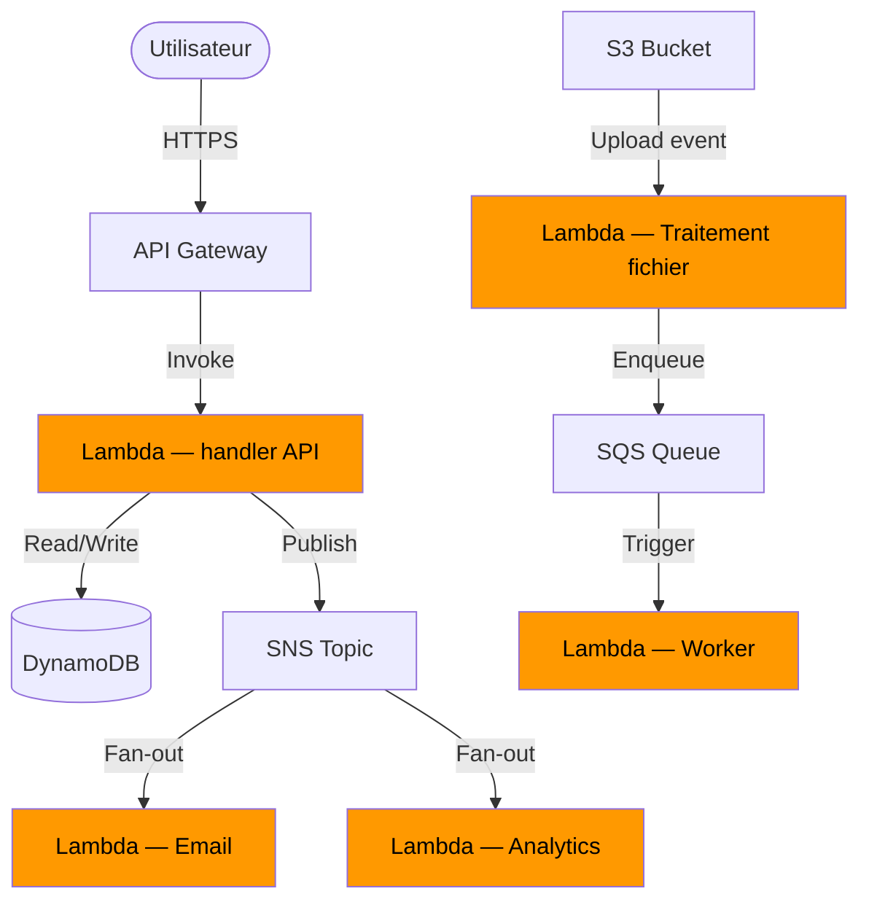

# Architecture Serverless — Lambda, API Gateway, Event-driven

## Objectifs pédagogiques

À la fin de ce module, tu sauras :

- **Expliquer** le modèle d'exécution serverless et ce qu'il change concrètement par rapport à une architecture traditionnelle
- **Déployer et invoquer** une fonction Lambda via la CLI AWS
- **Exposer un endpoint HTTP** en connectant API Gateway à une fonction Lambda
- **Concevoir un flux event-driven** en articulant Lambda avec SQS, SNS ou EventBridge
- **Anticiper les contraintes** du serverless : cold start, timeouts, limites de concurrence

---

## Pourquoi le serverless existe

Pendant longtemps, déployer une API signifiait provisionner un serveur, configurer un OS, gérer les mises à jour, anticiper les pics de charge, payer l'instance 24h/24 même quand elle est idle. L'essentiel du travail ne concernait pas le code — il concernait l'infrastructure qui le faisait tourner.

Le serverless renverse cette logique. Tu écris une fonction, tu la déploies, AWS se charge du reste : démarrage, scaling, haute disponibilité, maintenance. Tu ne paies que les millisecondes d'exécution consommées. Pour un workload irrégulier — un traitement de fichiers déclenché par des uploads S3, une API dont le trafic varie de 0 à 10 000 req/min en quelques secondes — c'est un changement radical.

Ce n'est pas une silver bullet. Les fonctions serverless ont des contraintes strictes : durée max 15 minutes, démarrage à froid, état non persistant entre invocations. Ces contraintes les rendent inadaptées à certains cas. L'enjeu de ce module est précisément de savoir quand les utiliser — et quand ne pas le faire.

---

## Les composants d'une architecture serverless AWS

| Composant | Rôle | Usage typique |
|-----------|------|---------------|
| **AWS Lambda** | Exécute du code à la demande, sans serveur | Traitement d'événements, logique métier, transformation de données |
| **API Gateway** | Expose des endpoints HTTP/REST/WebSocket | Frontal d'une API, routage vers Lambda |
| **SQS** | File de messages asynchrone | Découplage producteur/consommateur, bufferisation de charge |
| **SNS** | Publication d'événements vers plusieurs abonnés | Fan-out, notifications, déclenchement multi-Lambda |
| **EventBridge** | Bus d'événements avec routage par règles | Orchestration inter-services, événements AWS natifs |
| **DynamoDB** | Base NoSQL serverless, streams d'événements | Persistance d'état, déclencheur Lambda via DynamoDB Streams |

Le diagramme ci-dessous représente un flux typique : une requête HTTP arrive sur API Gateway, déclenche une Lambda qui lit/écrit en base et publie un événement consommé de façon asynchrone par d'autres fonctions. En parallèle, un upload S3 déclenche un traitement de fichier entièrement découplé de la couche API.



---

## Lambda : anatomie et cycle d'exécution

Une fonction Lambda, c'est quatre choses : du code (Python, Node.js, Java, Go…), un handler (le point d'entrée), un rôle IAM (ce qu'elle a le droit de faire), et une configuration (mémoire, timeout, variables d'environnement).

> **SAA-C03** — Si la question mentionne…
> - "serverless" + "event-driven / déclenché par événement" + "short-lived / courte durée" → **Lambda** (max 15 min)
> - "serverless" + "containers / conteneurs" → **Fargate** (pas Lambda)
> - "REST API" + "serverless" + "throttling / cache / authorization" → **API Gateway** + Lambda
> - "process data close to users / traiter les données au plus proche des utilisateurs" + "CloudFront" → **Lambda@Edge** (pas Route 53)
> - "orchestrate workflows / orchestrer des workflows" + "state machine" → **Step Functions** (Standard = longue durée, Express = haut débit)
> - "event bus / bus d'événements" + "rules / patterns" + "decouple services / découpler les services" → **EventBridge**
> - "cold start" + "eliminate / éliminer" → **Provisioned Concurrency** (instances pré-chauffées)
> - "Lambda needs to decrypt / Lambda doit déchiffrer" + "KMS" → `kms:decrypt` sur l'**execution role** (pas la resource policy)
> - "automatically handle load balancing, scaling, monitoring / gérer automatiquement le LB, scaling, monitoring" + "Docker" → **Elastic Beanstalk** (pas ECS — ECS nécessite une config manuelle)
> - ⛔ Lambda timeout **max = 15 minutes** — si le traitement dure plus → ECS/Fargate ou EC2
> - ⛔ Lambda **execution role** = ce que Lambda peut faire. **Resource policy** = qui peut invoquer Lambda. Ne pas confondre.
> - ⛔ Athena = **requêtes SQL ad hoc** sur S3. Ce n'est **pas** du traitement streaming temps réel → utiliser Kinesis pour ça

### Les commandes essentielles

```bash
# Lister les fonctions Lambda déployées dans la région courante
aws lambda list-functions
```

```bash
# Invoquer une fonction et récupérer la réponse dans un fichier
aws lambda invoke \
  --function-name <FUNCTION_NAME> \
  --payload '<JSON_PAYLOAD>' \
  --cli-binary-format raw-in-base64-out \
  <OUTPUT_FILE>
```

```bash
# Suivre les logs d'une fonction en quasi temps réel
aws logs tail /aws/lambda/<FUNCTION_NAME> --since 10m
```

```bash
# Déployer une nouvelle version du code depuis un zip local
aws lambda update-function-code \
  --function-name <FUNCTION_NAME> \
  --zip-file fileb://<PACKAGE_ZIP>
```

```bash
# Mettre à jour les variables d'environnement sans redéployer le code
aws lambda update-function-configuration \
  --function-name <FUNCTION_NAME> \
  --environment "Variables={<KEY>=<VALUE>}"
```

### Ce qui se passe à chaque invocation

Quand Lambda reçoit une invocation, deux scénarios sont possibles.

**Warm start** — un container est déjà prêt (il a servi une invocation récente). La fonction démarre en quelques millisecondes.

**Cold start** — aucun container disponible. AWS doit en démarrer un, initialiser le runtime, charger ton code. Selon le runtime et la taille du package, ça peut prendre de 100ms à plusieurs secondes. C'est le principal défi opérationnel du serverless.

🧠 **Comment Lambda scale** : chaque invocation simultanée tourne dans un container séparé. Si 1 000 requêtes arrivent en même temps, Lambda démarre jusqu'à 1 000 containers en parallèle. La limite par défaut est 1 000 invocations concurrentes par région, augmentable via une demande AWS. Chaque compte dispose également d'une limite de burst initiale (500 à 3 000 selon la région).

💡 **Réduire le cold start** : choisir un runtime léger (Python ou Node.js plutôt que Java), minimiser les dépendances dans le package, initialiser les connexions (DB, clients SDK) dans le scope global du module plutôt que dans le handler — ces ressources sont réutilisées entre invocations warm. Pour Java et .NET, évaluer Lambda SnapStart. Pour les fonctions critiques, configurer une concurrence provisionnée pour garder des containers actifs en permanence.

⚠️ **Le piège du timeout** : le timeout par défaut est 3 secondes, le maximum est 15 minutes. Si ta fonction effectue un appel externe qui prend plus longtemps que prévu (base de données lente, API tierce), elle sera interrompue et l'invocation sera marquée en erreur. Analyse les durées p95/p99 via CloudWatch Metrics dès le début, et fixe le timeout à environ 2x le p99 observé — ni trop court (erreurs inutiles), ni trop long (ça masque les régressions de performance et augmente les coûts).

---

## API Gateway : exposer Lambda via HTTP

API Gateway est le frontal qui transforme une requête HTTP en événement Lambda. Il gère l'authentification, le rate limiting, les transformations de payload et les stages de déploiement.

```bash
# Lister les APIs REST existantes dans la région
aws apigateway get-rest-apis
```

```bash
# Lister les stages d'une API (dev, staging, prod...)
aws apigateway get-stages --rest-api-id <API_ID>
```

```bash
# Déployer une API sur un stage
aws apigateway create-deployment \
  --rest-api-id <API_ID> \
  --stage-name <STAGE_NAME>
```

Deux types d'API coexistent dans API Gateway :

**REST API** — le mode historique, très configurable. Il supporte les transformations de payload (mapping templates), l'intégration proxy ou non-proxy, les plans d'usage et les API keys. À privilégier quand tu as besoin d'un contrôle fin sur le routage ou les transformations.

**HTTP API** — plus récent, plus simple, environ 70% moins cher que la REST API. Suffisant pour la grande majorité des cas d'usage Lambda, notamment quand l'intégration proxy couvre tout ton besoin.

💡 **Intégration proxy** : c'est le mode le plus courant. API Gateway transmet l'intégralité de la requête HTTP à Lambda (headers, query params, body, méthode) dans un objet `event` standardisé. Lambda retourne un objet avec `statusCode`, `headers` et `body`. Pas de transformation, pas de mapping intermédiaire — simple et efficace. C'est le point de départ par défaut, et la plupart des projets n'ont jamais besoin d'aller plus loin.

---

## L'architecture event-driven : le vrai pouvoir du serverless

Exposer une API via Lambda, c'est utile. Mais ce qui rend le serverless réellement puissant, c'est le modèle event-driven : les services ne s'appellent pas directement, ils publient des événements, et d'autres services y réagissent de façon autonome.

Prenons un exemple concret. Un utilisateur uploade un fichier CSV sur S3. Plutôt qu'un appel synchrone vers un service de traitement :

1. S3 publie un événement `ObjectCreated` vers une Lambda ou une queue SQS
2. La Lambda reçoit l'événement, valide le fichier, et publie un message SNS
3. SNS notifie en fan-out : une Lambda envoie un email de confirmation, une autre démarre le traitement analytique, une troisième indexe les métadonnées

Le composant clé qui orchestre tout ça est **EventBridge** : un bus d'événements qui route les messages selon des règles basées sur la source, le type d'événement ou le contenu du payload. Il peut déclencher des Lambdas, des Step Functions, des targets HTTP ou des queues SQS — et reçoit nativement les événements de plus de 200 services AWS.

🧠 **Pourquoi ce modèle change tout** : dans une architecture synchrone, si le service de traitement est lent ou indisponible, l'utilisateur attend ou reçoit une erreur. Dans un modèle event-driven avec SQS, l'événement attend dans la queue jusqu'à ce qu'un worker soit disponible. L'expérience utilisateur est découplée de la performance interne du système.

⚠️ **La complexité cachée** : le découplage a un coût. Le débogage devient plus difficile quand une requête traverse cinq services asynchrones. Les erreurs sont moins visibles, la cohérence éventuelle peut surprendre. Sans tracing distribué (X-Ray), retrouver pourquoi un événement n'a pas été traité peut devenir laborieux. Ce sujet est couvert dans le module Observabilité avancée — mais l'instrumentation doit être pensée dès la conception, pas ajoutée après coup.

---

## Cas réel : migration d'une API monolithique vers serverless

**Contexte** — Une fintech gère une API de scoring crédit. L'architecture initiale : deux instances EC2 derrière un ALB, avec un pic de charge prévisible en fin de mois (ouverture des fenêtres de crédit) et quasiment zéro trafic le reste du temps. Coût mensuel : ~800€ pour les instances, auxquels s'ajoutent les coûts d'ops.

**Problème** — Les instances doivent être surdimensionnées pour absorber le pic. 90% du temps, les ressources sont idle. De plus, chaque déploiement nécessite une coordination manuelle pour éviter les downtime.

**Architecture cible** :

- API Gateway (HTTP API) comme frontal, avec authentification via Lambda Authorizer
- Lambda en backend (Python, 512 MB, timeout 10s) pour le calcul de scoring
- DynamoDB pour la persistance des scores (accès < 5ms en lecture)
- SQS + Lambda worker pour les traitements batch asynchrones (rapport mensuel)
- EventBridge pour déclencher les workflows de fin de mois

**Migration** — Le basculement s'est fait en shadow mode pendant deux semaines : les deux architectures recevaient le même trafic, les résultats étaient comparés. Après validation, le trafic a migré progressivement (10% → 50% → 100%) via les stages API Gateway, sans coupure de service.

**Résultats** :
- Coût mensuel : de 800€ à ~90€ (dont ~60€ concentrés sur le pic de fin de mois)
- Déploiements : de 45 minutes de freeze coordonné à un `aws lambda update-function-code` en 30 secondes
- Disponibilité : 99,97% sur les 6 premiers mois, sans aucune intervention manuelle sur l'infrastructure
- Cold start moyen constaté : 180ms (Python, package < 5 MB) — dans le SLA accepté par le client

---

## Bonnes pratiques

**Une fonction = une responsabilité.** Résiste à la tentation de faire une Lambda "god function" qui gère quinze routes. Une fonction doit faire une chose précise. Ça facilite le test unitaire, le déploiement indépendant et la gestion des permissions IAM.

**Least privilege sur le rôle IAM.** Chaque Lambda a un rôle d'exécution. Ce rôle doit contenir uniquement les permissions nécessaires — pas `s3:*`, mais `s3:GetObject` sur le bucket précis. Un rôle trop permissif transforme une faille applicative en vecteur d'attaque sur l'ensemble du compte.

**Externalise la configuration.** Ne hardcode jamais de valeurs sensibles (credentials, URLs, feature flags) dans le code. Utilise les variables d'environnement Lambda pour les valeurs non-sensibles, et Secrets Manager ou Parameter Store pour les secrets. Ça permet de changer la configuration sans redéployer.

**Configure une Dead Letter Queue sur chaque Lambda asynchrone.** Par défaut, si une Lambda asynchrone échoue, l'événement est réessayé 2 fois puis perdu silencieusement. Une DLQ (SQS) sur la destination en cas d'échec capture ces invocations ratées pour permettre le rejeu après correction. Sans ça, tu as des pertes de données invisibles.

**Calibre les timeouts sur les métriques réelles.** Le timeout par défaut (3s) est souvent trop court dès qu'une Lambda fait un appel réseau. Analyse les durées p50/p95/p99 en production via CloudWatch, et fixe le timeout à environ 2x le p99 observé. Mettre 15 minutes par défaut masque les régressions et augmente les coûts.

**Optimise le cold start dès le début.** Charge les connexions (DB, clients SDK) dans le scope global du module, pas dans le handler. Ces ressources sont réutilisées entre les invocations warm. Minimise les dépendances dans le package. Pour Java et .NET, évalue Lambda SnapStart.

**Instrumente avec X-Ray dès le départ.** Activer X-Ray sur Lambda et API Gateway coûte quasi rien sur un trafic léger, mais t'évite des heures de debug quand un flux event-driven part en vrille à 2h du matin. Dans une architecture multi-Lambda, le tracing distribué n'est pas optionnel.

---

## Résumé

Le serverless ne supprime pas la complexité — il la déplace. Tu n'as plus à gérer des serveurs, mais tu dois maîtriser le cycle de vie des fonctions, les cold starts, la gestion des erreurs asynchrones et le découplage event-driven. Lambda + API Gateway couvre la majorité des patterns d'API REST, mais c'est la combinaison avec SQS, SNS et EventBridge qui permet de construire des architectures résilientes et véritablement découplées. La suite logique est le module Performance & optimisation, qui aborde le caching, la réduction de latence et l'optimisation des coûts à l'exécution.

---

<!-- snippet
id: aws_lambda_concept
type: concept
tech: aws
level: advanced
importance: high
format: knowledge
tags: aws,lambda,serverless
title: Lambda — modèle d'exécution serverless
content: AWS Lambda exécute du code dans des containers éphémères démarrés à la demande. Chaque invocation simultanée tourne dans un container séparé (scaling horizontal automatique). L'état n'est pas persisté entre deux invocations — utiliser DynamoDB ou S3 pour la persistance.
description: Lambda scale horizontalement sans configuration : chaque invocation parallèle = un container distinct.
-->

<!-- snippet
id: aws_lambda_invoke_cli
type: command
tech: aws
level: advanced
importance: high
format: knowledge
tags: aws,lambda,cli
title: Invoquer une fonction Lambda via CLI
command: aws lambda invoke --function-name <FUNCTION_NAME> --payload '<JSON_PAYLOAD>' --cli-binary-format raw-in-base64-out <OUTPUT_FILE>
example: aws lambda invoke --function-name scoring-api --payload '{"userId": "42"}' --cli-binary-format raw-in-base64-out output.json
description: Invoque une Lambda directement depuis le terminal. La réponse est écrite dans le fichier de sortie spécifié.
-->

<!-- snippet
id: aws_lambda_update_code_cli
type: command
tech: aws
level: advanced
importance: high
format: knowledge
tags: aws,lambda,cli,déploiement
title: Mettre à jour le code d'une Lambda depuis un zip
command: aws lambda update-function-code --function-name <FUNCTION_NAME> --zip-file fileb://<PACKAGE_ZIP>
example: aws lambda update-function-code --function-name scoring-api --zip-file fileb://build/package.zip
description: Déploie une nouvelle version du code sans recréer la fonction. Utile pour un déploiement rapide en dehors d'un pipeline CI/CD.
-->

<!-- snippet
id: aws_lambda_env_vars_cli
type: command
tech: aws
level: advanced
importance: medium
format: knowledge
tags: aws,lambda,cli,configuration
title: Configurer les variables d'environnement d'une Lambda
command: aws lambda update-function-configuration --function-name <FUNCTION_NAME> --environment "Variables={<KEY>=<VALUE>}"
example: aws lambda update-function-configuration --function-name scoring-api --environment "Variables={ENV=production,DB_URL=https://db.internal}"
description: Met à jour les variables d'environnement sans redéployer le code. Les valeurs sensibles doivent passer par Secrets Manager plutôt que par cette commande.
-->

<!-- snippet
id: aws_lambda_logs_cli
type: command
tech: aws
level: advanced
importance: medium
format: knowledge
tags: aws,lambda,cli,logs,cloudwatch
title: Suivre les logs d'une Lambda en quasi temps réel
command: aws logs tail /aws/lambda/<FUNCTION_NAME> --since <DURATION>
example: aws logs tail /aws/lambda/scoring-api --since 10m
description: Affiche les logs CloudWatch de la Lambda depuis la durée spécifiée. Pratique pour diagnostiquer une invocation récente sans ouvrir la console.
-->

<!-- snippet
id: aws_apigateway_list_cli
type: command
tech: aws
level: advanced
importance: medium
format: knowledge
tags: aws,apigateway,cli
title: Lister les APIs REST API Gateway
command: aws apigateway get-rest-apis
example: aws apigateway get-rest-apis
description: Retourne la liste des APIs REST déployées dans la région courante avec leur ID, nom et date de création.
-->

<!-- snippet
id: aws_apigateway_deploy_cli
type: command
tech: aws
level: advanced
importance: medium
format: knowledge
tags: aws,apigateway,cli,déploiement
title: Déployer une API Gateway sur un stage
command: aws apigateway create-deployment --rest-api-id <API_ID> --stage-name <STAGE_NAME>
example: aws apigateway create-deployment --rest-api-id abc123xyz --stage-name production
description: Publie la configuration courante de l'API sur le stage cible. Nécessaire après chaque modification des routes ou intégrations.
-->

<!-- snippet
id: aws_lambda_cold_start_warning
type: warning
tech: aws
level: advanced
importance: high
format: knowledge
tags: aws,lambda,performance,cold-start
title: Cold start Lambda — impact et mitigation
content: Un cold start survient quand Lambda doit démarrer un nouveau container (aucun warm disponible). Durée : 100ms à 2s+ selon le runtime (Java >> Python/Node.js) et la taille du package. Mitigations : runtime léger, package minimal, connexions DB initialisées hors du handler (scope global), concurrence provisionnée pour les fonctions critiques.
description: Le cold start est le principal défaut de latence du serverless — à mesurer et traiter dès la mise en production.
-->

<!-- snippet
id: aws_lambda_timeout_warning
type: warning
tech: aws
level: advanced
importance: high
format: knowledge
tags: aws,lambda,timeout,erreur
title: Lambda timeout — diagnostic et configuration
content: Timeout par défaut : 3 secondes. Maximum : 15 minutes. Quand une Lambda dépasse son timeout, l'invocation échoue avec "Task timed out". Analyser les durées p95/p99 via CloudWatch Metrics, fixer le timeout à ~2x le p99 observé. Ne pas mettre 15 min par défaut : ça masque les régressions de performance et augmente les coûts.
description: Un timeout trop court provoque des erreurs, un timeout trop long masque les problèmes — calibrer sur les métriques réelles.
-->

<!-- snippet
id: aws_lambda_dlq_tip
type: tip
tech: aws
level: advanced
importance: high
format: knowledge
tags: aws,lambda,sqs,erreur,async
title: Dead Letter Queue — capturer les invocations en échec
content: Pour les Lambdas déclenchées de façon asynchrone (SQS, SNS, S3, EventBridge), configurer une DLQ (SQS) sur la destination en cas d'échec. Sans DLQ, après 2 tentatives automatiques, l'événement est silencieusement perdu. La DLQ permet de rejouer les messages échoués après correction du bug.
description: Sans DLQ sur les Lambdas async, les échecs sont invisibles et les données perdues — à configurer systématiquement.
-->

<!-- snippet
id: aws_eventdriven_concept
type: concept
tech: aws
level: advanced
importance: high
format: knowledge
tags: aws,eventbridge,sqs,sns,architecture,event-driven
title: Architecture event-driven — découplage via événements
content: Dans un modèle event-driven, les services publient des événements (S3 upload, DynamoDB stream, message SQS) sans connaître leurs consommateurs. Les Lambdas abonnées réagissent de façon asynchrone. Avantage : si un consommateur est lent ou en erreur, l'événement attend dans la queue sans impacter le producteur. Inconvénient : la traçabilité nécessite un outil de tracing distribué (X-Ray).
description: Le découplage event-driven élimine les dépendances directes entre services — au prix d'une complexité de débogage accrue.
-->

<!-- snippet
id: aws_lambda_iam_tip
type: tip
tech: aws
level: advanced
importance: high
format: knowledge
tags: aws,lambda,iam,sécurité
title: Least privilege sur le rôle d'exécution Lambda
content: Chaque Lambda a un rôle IAM d'exécution. Appliquer le principe du moindre privilège : autoriser uniquement les actions nécessaires sur les ressources précises (ex: s3:GetObject sur arn:aws:s3:::mon-bucket/*, pas s3:*). Un rôle trop permissif transforme une vulnérabilité applicative en compromission du compte AWS.
description: Le rôle IAM d'une Lambda est sa surface d'attaque — le restreindre au strict nécessaire est non négociable.
-->
