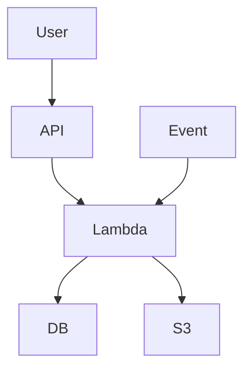

# Architecture Serverless — Lambda, API Gateway, Event-driven

## Objectifs pédagogiques

- Comprendre le modèle serverless AWS
- Utiliser AWS Lambda pour exécuter du code
- Exposer une API avec API Gateway
- Concevoir une architecture event-driven
- Identifier les limites du serverless

## Contexte et problématique

Problème classique :

- gérer des serveurs
- scaling complexe
- coûts fixes

👉 Serverless :

- pas de serveur à gérer
- scaling automatique
- paiement à l’usage

## Architecture

| Composant | Rôle | Exemple |
|-----------|------|---------|
| Lambda | exécution code | function |
| API Gateway | expose API | REST |
| SQS/SNS | événements | messaging |
| EventBridge | orchestration | events |



## Commandes essentielles

```bash
aws lambda list-functions
```

```bash
aws apigateway get-rest-apis
```

```bash
aws lambda invoke --function-name <NAME> output.txt
```

## Fonctionnement interne

1. Requête API
2. API Gateway déclenche Lambda
3. Lambda exécute code
4. Réponse envoyée

🧠 Concept clé  
→ Serverless = abstraction totale du serveur

💡 Astuce  
→ utiliser Lambda pour tâches courtes

⚠️ Erreur fréquente  
→ ignorer cold start  
Correction : optimiser runtime

## Cas réel en entreprise

Contexte :

API scalable.

Solution :

- API Gateway
- Lambda backend
- DynamoDB

Résultat :

- zéro serveur
- scaling automatique

## Bonnes pratiques

- fonctions courtes
- gérer timeout
- optimiser cold start
- monitorer logs
- sécuriser IAM
- limiter dépendances
- utiliser event-driven

## Résumé

Le serverless supprime la gestion des serveurs.  
Lambda exécute le code, API Gateway expose les endpoints.  
Idéal pour workloads dynamiques.

---

## SNIPPETS DE RÉVISION

<!-- snippet
id: aws_lambda_definition
type: concept
tech: aws
level: advanced
importance: high
format: knowledge
tags: aws,lambda,serverless
title: Lambda définition
content: Lambda permet d’exécuter du code sans gérer de serveur avec un scaling automatique
description: Base serverless AWS
-->

<!-- snippet
id: aws_apigateway_role
type: concept
tech: aws
level: advanced
importance: high
format: knowledge
tags: aws,apigateway,api
title: API Gateway rôle
content: API Gateway expose des endpoints HTTP pour accéder aux fonctions Lambda
description: Interface API AWS
-->

<!-- snippet
id: aws_lambda_command
type: command
tech: aws
level: advanced
importance: medium
format: knowledge
tags: aws,lambda,cli
title: Lister fonctions Lambda
command: aws lambda list-functions
description: Permet de voir les fonctions Lambda
-->

<!-- snippet
id: aws_cold_start_warning
type: warning
tech: aws
level: advanced
importance: high
format: knowledge
tags: aws,lambda,error
title: Cold start Lambda
content: Un cold start peut ralentir une fonction Lambda, optimiser runtime et taille
description: Piège serverless
-->

<!-- snippet
id: aws_serverless_tip
type: tip
tech: aws
level: advanced
importance: medium
format: knowledge
tags: aws,serverless,architecture
title: Event driven
content: Dans une architecture event-driven, les services ne s'appellent pas directement : ils publient des événements (S3 upload, SQS message, DynamoDB stream) et d'autres services y réagissent de façon asynchrone. Si le consommateur est down, l'événement attend dans la queue — aucune perte, aucun appel qui échoue.
description: Le découplage évite l'effet domino : une Lambda lente ne bloque pas l'API Gateway qui l'a déclenchée.
-->

<!-- snippet
id: aws_serverless_error
type: warning
tech: aws
level: advanced
importance: high
format: knowledge
tags: aws,serverless,incident
title: Lambda timeout
content: Symptôme timeout fonction, cause durée trop longue, correction optimiser code ou augmenter timeout
description: Problème fréquent
-->
