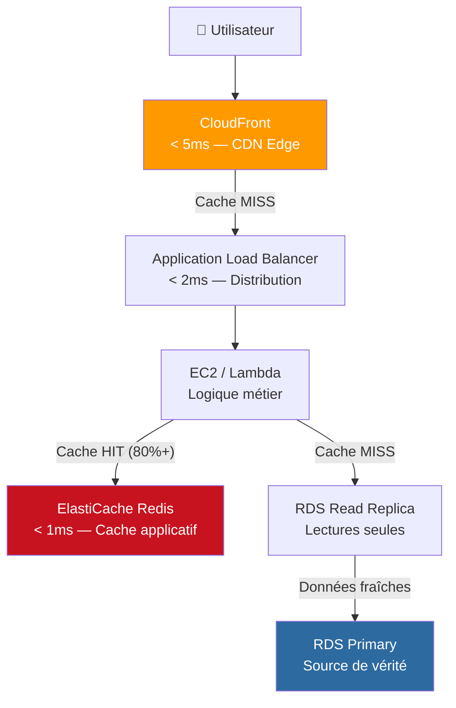

# Performance & optimisation — Caching, Latence, Tuning AWS

## Objectifs pédagogiques

À l'issue de ce module, vous serez capable de :

1. **Identifier** les bottlenecks de performance dans une architecture AWS à partir des métriques CloudWatch
2. **Mettre en place** une stratégie de caching multi-couche avec ElastiCache et CloudFront
3. **Réduire la latence** applicative en choisissant le bon levier selon la nature du goulot d'étranglement
4. **Optimiser les performances** d'une base de données RDS via les index, replicas et parameter groups
5. **Mesurer l'impact** de chaque optimisation avec des métriques en percentiles (p99, cache hit ratio, throughput)

---

## Le problème que tout le monde connaît

L'application tourne parfaitement en local. En production, avec 500 requêtes simultanées, tout ralentit. La base de données sature, les temps de réponse explosent, les utilisateurs partent. Le réflexe habituel : scaler verticalement, payer plus. C'est rarement la bonne réponse.

Dans la quasi-totalité des cas, les problèmes de performance AWS ont une cause identifiable et une solution ciblée. La latence élevée ne vient pas "de partout" — elle vient d'un seul endroit à la fois : une requête SQL sans index, du contenu statique servi depuis la mauvaise région, un service qui recalcule la même chose 10 000 fois par minute.

Ce module couvre la méthode pour trouver ce point chaud, puis les outils AWS pour le corriger couche par couche.

---

## Architecture de référence : les couches de performance

Une architecture AWS performante s'organise en couches défensives. Chaque couche intercepte les requêtes avant qu'elles n'atteignent la ressource plus lente derrière elle.

| Couche | Service AWS | Latence typique | Rôle |
|--------|-------------|-----------------|------|
| CDN edge | CloudFront | < 5 ms | Contenu statique et semi-statique, edge caching |
| Cache applicatif | ElastiCache (Redis) | < 1 ms | Sessions, résultats de calculs, données fréquentes |
| Load balancing | ALB | < 2 ms | Distribution du trafic, terminaison TLS (Transport Layer Security) |
| Compute | EC2 / Lambda | 5–200 ms | Logique métier |
| Cache DB | RDS Read Replica | 2–10 ms | Requêtes en lecture seule |
| Base de données | RDS / Aurora | 5–50 ms | Source de vérité |

La règle est simple : plus une couche est haute dans ce tableau, plus elle doit absorber de trafic. Si 80 % des requêtes remontent jusqu'à RDS, l'architecture n'est pas correctement configurée.



---

## Étape 1 — Mesurer avant de toucher quoi que ce soit

L'erreur la plus coûteuse en optimisation est d'agir sans mesurer. On optimise ce qu'on ressent comme lent, pas ce qui est réellement lent. Les deux coïncident rarement.

Trois métriques suffisent pour localiser un bottleneck en moins de dix minutes : le **p99 de latence** sur l'ALB, le **nombre de connexions actives** sur RDS, et le **cache hit ratio** sur ElastiCache. Voilà comment les lire.

### Latence p99 sur l'ALB

```bash
# Latence p99 d'un Target Group ALB — les 1% de requêtes les plus lentes
aws cloudwatch get-metric-statistics \
  --namespace AWS/ApplicationELB \
  --metric-name TargetResponseTime \
  --dimensions Name=TargetGroup,Value=<TARGET_GROUP_ARN> \
  --start-time <START_ISO8601> \
  --end-time <END_ISO8601> \
  --period 300 \
  --statistics p99
```

💡 Ne pas se fier à la moyenne. Une latence moyenne de 200 ms peut cacher un p99 à 8 secondes. Ce sont ces 8 secondes qui font partir les utilisateurs.

### Saturation de la base de données

```bash
# Connexions actives et CPU RDS — détecter une saturation base de données
aws cloudwatch get-metric-statistics \
  --namespace AWS/RDS \
  --metric-name DatabaseConnections \
  --dimensions Name=DBInstanceIdentifier,Value=<DB_INSTANCE_ID> \
  --start-time <START_ISO8601> \
  --end-time <END_ISO8601> \
  --period 60 \
  --statistics Average Maximum
```

Un pic de `DatabaseConnections` corrélé à une dégradation du `TargetResponseTime` : c'est le signe classique que la DB est le bottleneck, pas le compute.

### Efficacité du cache

```bash
# Cache hit ratio Redis — objectif : > 80%
aws cloudwatch get-metric-statistics \
  --namespace AWS/ElastiCache \
  --metric-name CacheHitRate \
  --dimensions Name=CacheClusterId,Value=<CLUSTER_ID> \
  --start-time <START_ISO8601> \
  --end-time <END_ISO8601> \
  --period 300 \
  --statistics Average
```

Un ratio inférieur à 80 % signifie que le cache est mal exploité : TTL trop court, clés mal construites, ou données fréquentes non cachées. C'est le premier levier à corriger avant tout autre tuning.

---

## Étape 2 — Caching : le levier le plus efficace

Le principe est élémentaire : calculer une fois, servir mille fois. Un résultat de requête SQL qui prend 30 ms à produire, mis en cache 60 secondes avec un taux de lecture de 100 rps, évite 6 000 requêtes DB par minute. Sans changer une ligne d'infrastructure.

### ElastiCache Redis — Cache applicatif

```bash
# Lister les clusters ElastiCache et leur état
aws elasticache describe-cache-clusters \
  --show-cache-node-info \
  --query "CacheClusters[*].{ID:CacheClusterId,Status:CacheClusterStatus,Engine:Engine,NodeType:CacheNodeType}"
```

```bash
# Créer un cluster Redis pour cache applicatif
aws elasticache create-cache-cluster \
  --cache-cluster-id <CLUSTER_NAME> \
  --engine redis \
  --cache-node-type <NODE_TYPE> \
  --num-cache-nodes 1 \
  --security-group-ids <SG_ID> \
  --cache-subnet-group-name <SUBNET_GROUP>
```

**Pattern cache-aside (lazy loading)** — le plus répandu en production :

```
Lecture → chercher dans Redis
  → HIT  : retourner la donnée directement
  → MISS : interroger la DB → stocker dans Redis (TTL) → retourner
```

L'application ne met en cache que ce qui est réellement demandé. Les données froides n'occupent pas de mémoire inutilement.

⚠️ **Le vrai risque : l'invalidation.** Si la donnée change en base, l'entrée Redis doit être supprimée explicitement (`DEL user:42`) ou le TTL doit être assez court pour que l'obsolescence ne crée pas d'incident métier. Un cache sans stratégie d'invalidation est une bombe à retardement.

### TTL — l'équilibre entre performance et cohérence

Le TTL n'est pas un paramètre technique neutre, c'est une décision métier :

| Type de donnée | TTL recommandé | Justification |
|----------------|---------------|---------------|
| Session utilisateur | 30 min | Durée de session typique |
| Catalogue produit | 2–5 min | Mise à jour rare, fraîcheur acceptable |
| Prix et stocks | 30 s max | Données critiques pour la commande |
| Référentiels (pays, catégories) | 1 h+ | Quasi-immuables |

🧠 Le TTL est un filet de sécurité, pas le mécanisme principal d'invalidation. Pour les données critiques, toujours préférer l'invalidation explicite à l'expiration passive.

### CloudFront — CDN et edge caching

CloudFront ne sert pas qu'aux images et CSS. Bien configuré, il peut cacher des réponses d'API GET stables, réduire massivement la charge sur les origins, et servir les utilisateurs depuis des edge locations à quelques millisecondes.

```bash
# Lister les distributions CloudFront et leur statut
aws cloudfront list-distributions \
  --query "DistributionList.Items[*].{Id:Id,Domain:DomainName,Status:Status,Origin:Origins.Items[0].DomainName}"
```

```bash
# Invalider le cache CloudFront sur un path (après déploiement ou mise à jour)
aws cloudfront create-invalidation \
  --distribution-id <DISTRIBUTION_ID> \
  --paths "<PATH_PATTERN>"
```

🧠 **CloudFront vs ElastiCache** : CloudFront cache des réponses HTTP complètes au niveau réseau, proche de l'utilisateur. ElastiCache cache des données applicatives en mémoire, proche de l'application. Les deux sont complémentaires — une requête peut être interceptée par CloudFront sans jamais atteindre ElastiCache, et vice versa.

---

## Étape 3 — Optimisation base de données

La DB est presque toujours le premier bottleneck identifié. Avant d'envisager une migration vers Aurora ou de doubler la RAM, trois leviers couvrent la majorité des situations.

### Read Replicas — séparer lecture et écriture

Si l'application fait 90 % de lectures et 10 % d'écritures — cas typique d'un e-commerce ou d'une app SaaS — orienter les lectures vers un Read Replica divise la charge sur le primary par un facteur proche de 10.

```bash
# Créer un Read Replica RDS
aws rds create-db-instance-read-replica \
  --db-instance-identifier <REPLICA_NAME> \
  --source-db-instance-identifier <SOURCE_DB_ID> \
  --db-instance-class <INSTANCE_CLASS> \
  --availability-zone <AZ>
```

```bash
# Lister les instances RDS et identifier les replicas
aws rds describe-db-instances \
  --query "DBInstances[*].{ID:DBInstanceIdentifier,Class:DBInstanceClass,Status:DBInstanceStatus,Source:ReadReplicaSourceDBInstanceIdentifier}"
```

⚠️ Dans le code applicatif, les connexions vers le primary et vers le replica doivent être **distinctes et configurables via des variables d'environnement**. Mixer les deux dans une même pool de connexions annule complètement le bénéfice du replica.

### Parameter Groups — tuning interne

Les parameter groups permettent d'ajuster le comportement interne de RDS sans changer d'instance ni payer plus. Impact potentiel significatif sur les performances de requêtes complexes.

```bash
# Modifier un paramètre de performance sur un parameter group
aws rds modify-db-parameter-group \
  --db-parameter-group-name <PARAM_GROUP_NAME> \
  --parameters "ParameterName=<PARAM_NAME>,ParameterValue=<VALUE>,ApplyMethod=pending-reboot"
```

Paramètres à fort impact selon le moteur :

- **PostgreSQL** : `work_mem` (mémoire par tri/jointure), `shared_buffers` (buffer pool), `max_connections`
- **MySQL** : `innodb_buffer_pool_size` (mémoire InnoDB), `query_cache_size`, `max_connections`

⚠️ Toujours tester un changement de parameter group en staging avant prod. `ApplyMethod=pending-reboot` signifie que le paramètre s'applique au prochain redémarrage de l'instance — prévoir une fenêtre de maintenance.

---

## Cas réel : plateforme e-commerce, Black Friday

**Contexte** : Une plateforme e-commerce gère 50 000 visites/heure en régime normal. Pendant les soldes, le trafic monte à 400 000 visites/heure. La semaine précédente, une période de forte charge avait provoqué 8 secondes de latence moyenne et 3 % d'erreurs 504 — perte estimée à 140 000 € de chiffre d'affaires.

**Diagnostic via CloudWatch** : 95 % du temps de réponse provient de requêtes DB (`Seq Scan` sur la table `products`, 2,3 M de lignes). CloudFront ne cache aucune réponse API. ElastiCache existe mais le cache hit ratio plafonne à 34 %.

**Actions réalisées en quatre jours** :

1. **Index DB** : ajout d'index composites sur `(category_id, is_active, price)` — `Seq Scan` → `Index Scan`, requête de 340 ms → 4 ms
2. **Cache Redis** : mise en cache des listes produits par catégorie (TTL 120 s), cache hit ratio 34 % → 91 %
3. **CloudFront** : cache des réponses `GET /api/products?category=*` pour 60 s, 67 % du trafic servi depuis l'edge
4. **Read Replica** : toutes les requêtes de lecture redirigées vers le replica, primary réservé aux seules écritures

**Résultats pendant le pic** : latence p99 de 8 200 ms → 320 ms. Taux d'erreur 3 % → 0,1 %. CPU RDS primary de 94 % → 22 %. Surcoût infrastructure : +15 % (ElastiCache + replica). Retour sur investissement : immédiat.

---

## Bonnes pratiques

**Mesurer en percentiles, pas en moyenne.** Une latence moyenne de 200 ms peut cacher un p99 à 8 secondes. Configurer systématiquement les alarmes CloudWatch sur p95 et p99, pas sur l'average.

**Définir le TTL en fonction de la tolérance métier.** Ce n'est pas un paramètre technique anodin. Un TTL de 5 minutes sur des données de stock peut entraîner une survente. Un TTL de 5 secondes sur un catalogue ne réduit pas la charge. La question à poser : "combien de temps une donnée obsolète est-elle acceptable ?"

**Invalider explicitement plutôt qu'attendre l'expiration.** Toute écriture en base doit déclencher un `DEL` de l'entrée Redis correspondante. Le TTL reste un filet de sécurité, pas le mécanisme principal.

**Séparer les endpoints lecture et écriture dans le code.** Deux variables d'environnement : `DB_READ_HOST` (replica) et `DB_WRITE_HOST` (primary). Configurable sans redéploiement, auditable, explicite.

**Utiliser CloudFront pour les réponses API stables.** Les réponses JSON de référentiels, catalogues ou pages statiques sont des candidates légitimes. Un header `Cache-Control: max-age=60` sur un endpoint GET peut absorber des milliers de requêtes sans toucher l'origin.

**Monitorer le cache hit ratio en continu.** Un ratio qui descend sous 75 % est un signal d'alarme actif : TTL trop court, nouvelles clés non cachées, éviction excessive en mémoire. Créer une alarme CloudWatch sur `CacheHitRate < 0.80`.

**Tester sous charge avant tout déploiement en production.** Un outil comme `k6` ou `locust` permet de valider qu'une optimisation tient sous trafic de pic, pas seulement sur dix utilisateurs simultanés. Une optimisation qui fonctionne sur dix et s'effondre sur 500 est plus dangereuse qu'aucune optimisation.

---

## Résumé

La performance AWS est une question de méthode, pas de budget. Identifier le bottleneck avec CloudWatch (p99, DatabaseConnections, CacheHitRate), puis appliquer le bon levier à la bonne couche : ElastiCache pour les données applicatives fréquentes, CloudFront pour le trafic HTTP depuis l'edge, les index et Read Replicas pour décharger la base de données. Chaque action doit être mesurée avant et après avec des métriques en percentiles.

Les deux indicateurs à surveiller en permanence : le **cache hit ratio** (cible > 80 %) et le **p99 de latence** (définir un seuil d'alerte selon le SLA applicatif).

---

<!-- snippet
id: aws_perf_caching_principle
type: concept
tech: aws
level: advanced
importance: high
format: knowledge
tags: aws,caching,performance,elasticache
title: Caching multi-couche AWS — principe et métriques
context: Toute architecture AWS exposée à un trafic variable doit implémenter plusieurs couches de cache
content: |
  Un cache stocke le résultat une fois et le sert depuis la mémoire jusqu'à expiration du TTL.
  - ElastiCache Redis : < 1ms (vs 5–50ms pour RDS)
  - CloudFront edge : < 5ms (vs ~200ms pour l'origin)
  Un cache hit ratio < 80% signale un problème de configuration : TTL trop court, clés trop granulaires ou données non cachées.
description: Cache hit ratio cible > 80%. En dessous, vérifier TTL, stratégie de clés et couverture des requêtes fréquentes.
-->

<!-- snippet
id: aws_perf_measure_first
type: tip
tech: aws
level: advanced
importance: high
format: knowledge
tags: aws,performance,cloudwatch,p99,monitoring
title: Mesurer en percentiles avant toute optimisation
content: Optimiser sans mesurer revient à deviner. Toujours commencer par le p99 de latence (pas la moyenne), le cache hit ratio ElastiCache, et les DatabaseConnections RDS. Ces trois métriques localisent le bottleneck en moins de 10 minutes. CloudWatch supporte les statistiques p90, p95, p99 sur ALB et ElastiCache. La loi de Pareto s'applique à la performance : 20% des requêtes causent 80% de la charge — les identifier avant d'agir.
description: Utiliser `--statistics p99` dans get-metric-statistics. Un p99 élevé avec une moyenne basse révèle des pics ponctuels, pas une lenteur généralisée.
-->

<!-- snippet
id: aws_perf_cloudwatch_latency
type: command
tech: aws
level: advanced
importance: high
format: knowledge
tags: aws,cloudwatch,alb,latency,p99
title: Récupérer la latence p99 d'un Target Group ALB
command: aws cloudwatch get-metric-statistics --namespace AWS/ApplicationELB --metric-name TargetResponseTime --dimensions Name=TargetGroup,Value=<TARGET_GROUP_ARN> --start-time <START_ISO8601> --end-time <END_ISO8601> --period 300 --statistics p99
example: aws cloudwatch get-metric-statistics --namespace AWS/ApplicationELB --metric-name TargetResponseTime --dimensions Name=TargetGroup,Value=targetgroup/my-app/abc123 --start-time 2024-01-15T08:00:00Z --end-time 2024-01-15T09:00:00Z --period 300 --statistics p99
description: Retourne la latence du percentile 99 sur la période. Un p99 > 1s sur un ALB indique un bottleneck applicatif ou DB à investiguer.
-->

<!-- snippet
id: aws_perf_rds_connections
type: command
tech: aws
level: advanced
importance: high
format: knowledge
tags: aws,cloudwatch,rds,connections,bottleneck
title: Surveiller les connexions actives RDS
command: aws cloudwatch get-metric-statistics --namespace AWS/RDS --metric-name DatabaseConnections --dimensions Name=DBInstanceIdentifier,Value=<DB_INSTANCE_ID> --start-time <START_ISO8601> --end-time <END_ISO8601> --period 60 --statistics Average Maximum
example: aws cloudwatch get-metric-statistics --namespace AWS/RDS --metric-name DatabaseConnections --dimensions Name=DBInstanceIdentifier,Value=mydb-production --start-time 2024-01-15T08:00:00Z --end-time 2024-01-15T09:00:00Z --period 60 --statistics Average Maximum
description: Un pic de DatabaseConnections corrélé à une dégradation du TargetResponseTime ALB confirme que la DB est le bottleneck principal.
-->

<!-- snippet
id: aws_perf_cache_hit_ratio
type: command
tech: aws
level: advanced
importance: high
format: knowledge
tags: aws,elasticache,cloudwatch,cache-hit-ratio
title: Surveiller le cache hit ratio ElastiCache
command: aws cloudwatch get-metric-statistics --namespace AWS/ElastiCache --metric-name CacheHitRate --dimensions Name=CacheClusterId,Value=<CLUSTER_ID> --start-time <START_ISO8601> --end-time <END_ISO8601> --period 300 --statistics Average
example: aws cloudwatch get-metric-statistics --namespace AWS/ElastiCache --metric-name CacheHitRate --dimensions Name=CacheClusterId,Value=my-redis-cluster --start-time 2024-01-15T08:00:00Z --end-time 2024-01-15T09:00:00Z --period 300 --statistics Average
description: Ratio entre 0 et 1. En dessous de 0.80, investiguer TTL, stratégie de clés et requêtes non cachées.
-->

<!-- snippet
id: aws_perf_elasticache_list
type: command
tech: aws
level: advanced
importance: high
format: knowledge
tags: aws,elasticache,redis,cli
title: Lister les clusters ElastiCache avec leur état
command: aws elasticache describe-cache-clusters --show-cache-node-info --query "CacheClusters[*].{ID:CacheClusterId,Status:CacheClusterStatus,Engine:Engine,NodeType:CacheNodeType}"
description: Affiche tous les clusters cache, leur moteur (Redis/Memcached), le type de nœud et leur statut opérationnel.
-->

<!-- snippet
id: aws_perf_cloudfront_invalidation
type: command
tech: aws
level: advanced
importance: medium
format: knowledge
tags: aws,cloudfront,cdn,invalidation,cache
title: Invalider le cache CloudFront sur un path
command: aws cloudfront create-invalidation --distribution-id <DISTRIBUTION_ID> --paths "<PATH_PATTERN>"
example: aws cloudfront create-invalidation --distribution-id E1ABC2DEF3GH4I --paths "/api/products/*"
description: Force CloudFront à ré-interroger l'origin pour les paths ciblés. À utiliser après un déploiement ou une mise à jour de contenu critique.
-->

<!-- snippet
id: aws_perf_rds_read_replica
type: command
tech: aws
level: advanced
importance: high
format: knowledge
tags: aws,rds,read-replica,scaling,performance
title: Créer un Read Replica RDS pour décharger les lectures
command: aws rds create-db-instance-read-replica --db-instance-identifier <REPLICA_NAME> --source-db-instance-identifier <SOURCE_DB_ID> --db-instance-class <INSTANCE_CLASS> --availability-zone <AZ>
example: aws rds create-db-instance-read-replica --db-instance-identifier mydb-replica-01 --source-db-instance-identifier mydb-primary --db-instance-class db.t3.medium --availability-zone eu-west-1b
description: Le replica reçoit la réplication asynchrone du primary. Diriger toutes les requêtes SELECT vers le replica endpoint pour réduire la charge du primary.
-->

<!-- snippet
id: aws_perf_no_cache_warning
type: warning
tech: aws
level: advanced
importance: high
format: knowledge
tags: aws,cache,database,performance,incident
title: Architecture sans cache — risque de saturation DB sous charge
content: Une architecture qui envoie chaque requête applicative directement à RDS ne passe pas à l'échelle. Sous charge, le nombre de connexions explose (RDS max_connections est limité par la taille d'instance), le CPU sature et les temps de réponse dégradent en cascade. ElastiCache Redis absorbe 80 à 95% du trafic de lecture en production bien configurée — la DB ne voit que les cache misses et les écritures.
description: Signe précurseur : DatabaseConnections proche du max et CPUUtilization > 80% en corrélation. Corriger avec ElastiCache avant de scaler l'instance.
-->

<!-- snippet
id: aws_perf_ttl_strategy
type: concept
tech: aws
level: advanced
importance: medium
format: knowledge
tags: aws,cache,ttl,invalidation,redis
title: Stratégie TTL — cohérence vs performance
context: Le TTL détermine combien de temps une donnée reste valide en cache avant d'être re-fetchée depuis la source
content: |
  Le TTL doit correspondre à la tolérance métier à la donnée périmée :
  - Données de session → 30 min
  - Catalogue produit → 2 à 5 min
  - Prix et stocks → 30 s max
  Toute mise à jour en base doit déclencher une invalidation explicite (`DEL clé`) plutôt qu'attendre l'expiration.
description: Préférer l'invalidation explicite à l'expiration passive pour les données critiques. Le TTL est un filet de sécurité, pas le mécanisme principal d'invalidation.
-->

<!-- snippet
id: aws_perf_rds_param_group
type: command
tech: aws
level: advanced
importance: medium
format: knowledge
tags: aws,rds,parameter-group,tuning,postgresql,mysql
title: Modifier un paramètre de performance RDS
command: aws rds modify-db-parameter-group --db-parameter-group-name <PARAM_GROUP_NAME> --parameters "ParameterName=<PARAM_NAME>,ParameterValue=<VALUE>,ApplyMethod=pending-reboot"
example: aws rds modify-db-parameter-group --db-parameter-group-name mydb-params --parameters "ParameterName=work_mem,ParameterValue=65536,ApplyMethod=pending-reboot"
description: Tester en staging avant prod. Paramètres clés PostgreSQL : work_mem, shared_buffers, max_connections. MySQL : innodb_buffer_pool_size, query_cache_size.
-->
