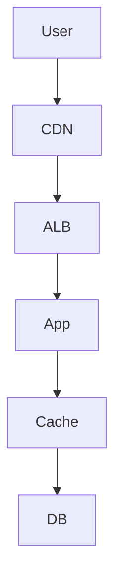

# Performance & optimisation — Caching, Latence, Tuning AWS

## Objectifs pédagogiques

- Comprendre les leviers de performance AWS
- Réduire la latence des applications
- Utiliser des systèmes de cache efficacement
- Optimiser les bases de données
- Identifier les bottlenecks d’une architecture

## Contexte et problématique

Problèmes fréquents :

- Latence élevée
- Temps de réponse long
- Coûts élevés

👉 Objectif :

- améliorer performance
- réduire coûts
- optimiser ressources

## Architecture

| Composant | Rôle | Exemple |
|-----------|------|---------|
| CloudFront | CDN | cache global |
| ElastiCache | cache mémoire | Redis |
| RDS | DB | tuning |
| ALB | distribution | trafic |



## Commandes essentielles

```bash
aws elasticache describe-cache-clusters
```

```bash
aws cloudfront list-distributions
```

```bash
aws cloudwatch get-metric-statistics
```

## Fonctionnement interne

### Caching

- Stockage temporaire
- Réduction appels DB

### Latence

- dépend distance + traitement
- optimisée via CDN

### Optimisation DB

- index
- requêtes optimisées
- read replicas

🧠 Concept clé  
→ Ne pas recalculer ce qui peut être caché

💡 Astuce  
→ cache en priorité sur lectures fréquentes

⚠️ Erreur fréquente  
→ pas de cache → surcharge DB  
Correction : ajouter cache Redis

## Cas réel en entreprise

Contexte :

API lente.

Solution :

- CloudFront
- Redis cache
- optimisation DB

Résultat :

- latence divisée par 4
- réduction coût infra

## Bonnes pratiques

- utiliser cache systématiquement
- mesurer performance
- optimiser requêtes
- utiliser CDN
- limiter appels DB
- monitorer latence
- tester charge

## Résumé

La performance dépend de plusieurs facteurs.  
Le caching est le levier principal.  
Une bonne architecture optimise coût et rapidité.

---

## SNIPPETS DE RÉVISION

<!-- snippet
id: aws_caching_definition
type: concept
tech: aws
level: advanced
importance: high
format: knowledge
tags: aws,caching,performance
title: Caching principe
content: Le caching permet de stocker temporairement des données pour éviter des calculs ou accès répétés
description: Base optimisation
-->

<!-- snippet
id: aws_cloudfront_performance
type: concept
tech: aws
level: advanced
importance: high
format: knowledge
tags: aws,cdn,latency
title: CloudFront performance
content: CloudFront réduit la latence en servant le contenu depuis des serveurs proches des utilisateurs
description: Optimisation globale
-->

<!-- snippet
id: aws_cache_warning
type: warning
tech: aws
level: advanced
importance: high
format: knowledge
tags: aws,cache,error
title: Pas de cache
content: Ne pas utiliser de cache surcharge la base de données et dégrade la performance
description: Piège fréquent
-->

<!-- snippet
id: aws_elasticache_command
type: command
tech: aws
level: advanced
importance: medium
format: knowledge
tags: aws,redis,cli
title: Lister cache clusters
command: aws elasticache describe-cache-clusters
description: Permet de voir les clusters cache
-->

<!-- snippet
id: aws_performance_tip
type: tip
tech: aws
level: advanced
importance: medium
format: knowledge
tags: aws,performance,bestpractice
title: Mesurer avant optimiser
content: Toujours mesurer la performance avant d’optimiser pour éviter les optimisations inutiles
description: Bonne pratique
-->

<!-- snippet
id: aws_latency_error
type: warning
tech: aws
level: advanced
importance: high
format: knowledge
tags: aws,latency,incident
title: Latence élevée
content: Symptôme lenteur app, cause absence CDN ou cache, correction ajouter CloudFront et Redis
description: Incident fréquent
-->
