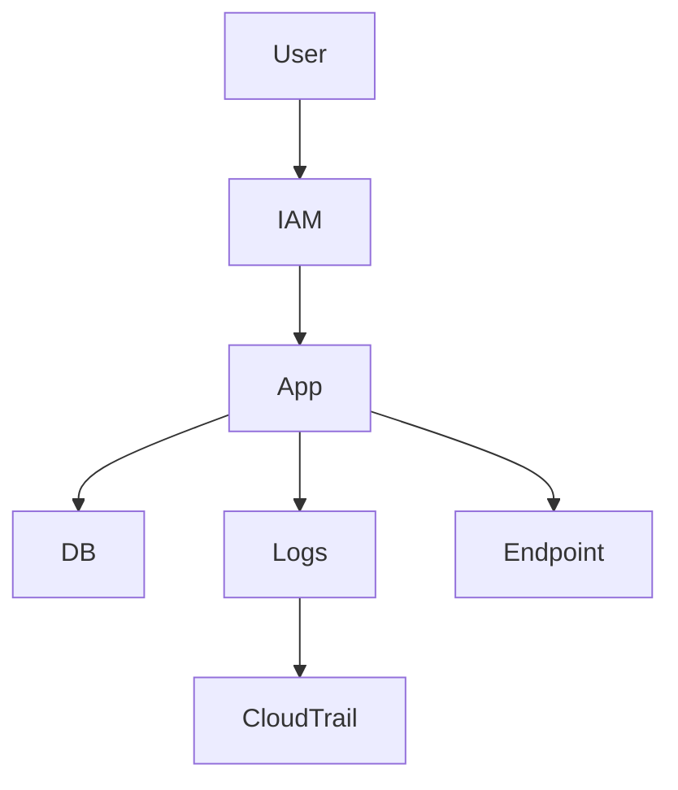

# Sécurité avancée — Zero Trust, segmentation réseau, audit AWS

## Objectifs pédagogiques

- Comprendre le modèle Zero Trust
- Segmenter un réseau AWS correctement
- Mettre en place un audit avec CloudTrail
- Sécuriser les communications internes
- Identifier les failles d’une architecture

## Contexte et problématique

Les attaques modernes :

- internes
- latérales
- sophistiquées

👉 Le modèle périmétrique ne suffit plus

Solution :

- Zero Trust
- segmentation
- audit complet

## Architecture

| Composant | Rôle | Exemple |
|-----------|------|---------|
| VPC | isolation réseau | subnet |
| SG/NACL | filtrage | ports |
| IAM | accès | policies |
| CloudTrail | audit | logs |
| VPC Endpoint | accès privé | S3 privé |



## Commandes essentielles

```bash
aws cloudtrail lookup-events
```

```bash
aws ec2 describe-security-groups
```

```bash
aws ec2 describe-network-acls
```

## Fonctionnement interne

### Zero Trust

- aucun accès implicite
- vérification systématique

### Segmentation réseau

- isolation des services
- contrôle des flux

### Audit

- CloudTrail log toutes actions
- traçabilité complète

🧠 Concept clé  
→ Ne jamais faire confiance au réseau interne

💡 Astuce  
→ utiliser VPC endpoints pour éviter Internet

⚠️ Erreur fréquente  
→ réseau trop ouvert  
Correction : restreindre SG/NACL

## Cas réel en entreprise

Contexte :

Infra exposée.

Solution :

- segmentation réseau stricte
- IAM restrictif
- audit CloudTrail

Résultat :

- sécurité renforcée
- traçabilité complète

## Bonnes pratiques

- appliquer Zero Trust
- segmenter réseau
- utiliser endpoints privés
- monitorer accès
- restreindre IAM
- auditer logs
- tester sécurité

## Résumé

La sécurité avancée repose sur la confiance zéro.  
La segmentation et l’audit sont essentiels.  
AWS fournit les outils mais la configuration est clé.

---

## SNIPPETS DE RÉVISION

<!-- snippet
id: aws_zero_trust_definition
type: concept
tech: aws
level: advanced
importance: high
format: knowledge
tags: aws,security,zerotrust
title: Zero Trust principe
content: Zero Trust consiste à ne faire confiance à aucun accès sans vérification explicite
description: Modèle sécurité moderne
-->

<!-- snippet
id: aws_cloudtrail_definition
type: concept
tech: aws
level: advanced
importance: high
format: knowledge
tags: aws,cloudtrail,audit
title: CloudTrail rôle
content: CloudTrail enregistre toutes les actions réalisées sur AWS pour audit et traçabilité
description: Audit AWS
-->

<!-- snippet
id: aws_network_segmentation
type: concept
tech: aws
level: advanced
importance: high
format: knowledge
tags: aws,network,security
title: Segmentation réseau
content: Segmenter le réseau limite la propagation d’une attaque entre services
description: Base sécurité réseau
-->

<!-- snippet
id: aws_security_group_command
type: command
tech: aws
level: advanced
importance: medium
format: knowledge
tags: aws,cli,network
title: Voir security groups
command: aws ec2 describe-security-groups
description: Permet de voir les règles réseau AWS
-->

<!-- snippet
id: aws_open_network_warning
type: warning
tech: aws
level: advanced
importance: high
format: knowledge
tags: aws,security,error
title: Réseau trop ouvert
content: Dans un VPC sans segmentation, une instance compromise peut scanner et atteindre toutes les autres sur le réseau interne. Un Security Group en liste blanche explicite (port 5432 uniquement depuis le subnet applicatif) contient l'attaque à une seule instance.
description: Le mouvement latéral est la technique n°1 après une compromission initiale — la micro-segmentation réseau le bloque.
-->

<!-- snippet
id: aws_security_tip
type: tip
tech: aws
level: advanced
importance: medium
format: knowledge
tags: aws,security,bestpractice
title: Utiliser endpoints privés
content: Sans VPC endpoint, une Lambda ou une EC2 qui appelle S3 ou DynamoDB sort par Internet (via NAT Gateway) même si les deux sont dans le même compte AWS. Un VPC endpoint maintient le trafic dans le réseau AWS, élimine la NAT Gateway et supprime l'exposition Internet.
description: VPC endpoint = sécurité + économie : les coûts de NAT Gateway disparaissent pour le trafic vers S3 et DynamoDB.
-->

<!-- snippet
id: aws_security_incident
type: concept
tech: aws
level: advanced
importance: high
format: knowledge
tags: aws,incident,security
title: Attaque interne
content: Symptôme accès anormal interne, cause manque segmentation, correction isoler les services
description: Incident critique
-->
