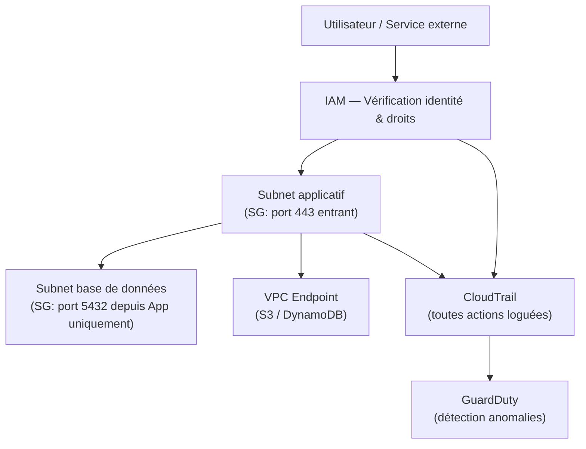

# Sécurité avancée — Zero Trust, segmentation réseau, audit AWS

## Objectifs pédagogiques

À l'issue de ce module, vous serez capable de :

- Expliquer le modèle Zero Trust et pourquoi il remplace la sécurité périmétrique traditionnelle
- Concevoir une segmentation réseau AWS en combinant VPC, Security Groups et NACLs
- Configurer CloudTrail pour assurer la traçabilité complète des actions sur un compte AWS
- Mettre en place des VPC Endpoints pour supprimer l'exposition Internet des services internes
- Identifier les failles d'une architecture AWS existante à l'aide de commandes CLI et d'outils natifs

---

## Le problème que le périmètre ne résout plus

Pendant longtemps, la sécurité réseau reposait sur une idée simple : tout ce qui est à l'intérieur du réseau est de confiance, tout ce qui vient de l'extérieur est suspect. On construisait un mur solide — un firewall, une DMZ (Demilitarized Zone) — et on dormait tranquille.

Ce modèle s'est effondré. Non pas parce que les firewalls sont devenus inutiles, mais parce que la surface d'attaque a changé de nature. Les compromissions modernes passent rarement par une brèche frontale : elles exploitent un compte utilisateur mal configuré, une clé API exposée dans un dépôt Git, un accès légitime détourné. Une fois à l'intérieur, l'attaquant se déplace **latéralement** — de service en service, de subnet en subnet — jusqu'à atteindre la donnée qu'il cherche.

Dans un VPC AWS sans segmentation sérieuse, cette progression peut s'effectuer en quelques minutes. Un serveur applicatif compromis peut scanner et contacter directement la base de données de production, le bucket S3 sensible, l'API interne de facturation — tout ça parce que "ils sont dans le même réseau, donc c'est OK".

Le modèle **Zero Trust** part du principe inverse : **aucun accès n'est implicitement accordé, même sur le réseau interne**. Chaque connexion, chaque appel d'API, chaque flux réseau doit être explicitement autorisé et vérifiable. Ce n'est pas un produit qu'on achète — c'est une posture qu'on construit couche par couche.

---

## Architecture Zero Trust sur AWS

> **SAA-C03** — Si la question mentionne…
> - "never trust, always verify / ne jamais faire confiance" + "network segmentation / segmentation réseau" → approche **Zero Trust** (SG + NACL + VPC Endpoints + IAM)
> - "prevent lateral movement / empêcher le mouvement latéral" + "micro-segmentation" → **Security Groups** restrictifs entre chaque tier (web → app → DB)
> - "eliminate Internet exposure / éliminer l'exposition Internet" + "access AWS services privately" → **VPC Endpoints** (Gateway pour S3/DynamoDB, Interface pour le reste)
> - "detect threats automatically / détecter les menaces automatiquement" + "no rules to configure / aucune règle à configurer" → **GuardDuty** (ML sur VPC Flow Logs, CloudTrail, DNS)
> - "discover sensitive data / découvrir des données sensibles" + "PII" + "S3" → **Macie**
> - "investigate incident / enquêter sur un incident" + "root cause / cause racine" → **Detective**
> - "centralized findings / findings centralisés" + "compliance score" → **Security Hub**
> - "validate CloudTrail log integrity / valider l'intégrité des logs" → activer **log file validation** dans CloudTrail
> - "block specific IP / bloquer une IP spécifique" → **WAF** (sur ALB/CloudFront) ou **NACL** (sur subnet). SG ne supporte pas les règles Deny.
> - ⛔ Security Groups = **Allow only** (pas de règle Deny). Pour bloquer une IP → NACL ou WAF.

Le Zero Trust ne se configure pas en un seul endroit. Sur AWS, il se traduit par la combinaison de plusieurs couches de contrôle qui se renforcent mutuellement.

| Couche | Composant AWS | Ce qu'il contrôle |
|--------|--------------|-------------------|
| Identité | IAM (policies, roles) | Qui peut faire quoi sur quelle ressource |
| Réseau L3 | VPC subnets + Route Tables | Séparation des segments réseau |
| Réseau L4 stateful | Security Groups | Flux autorisés entre ressources |
| Réseau L4 stateless | NACLs (Network Access Control Lists) | Filtrage au niveau subnet |
| Accès services | VPC Endpoints | Trafic AWS sans passer par Internet |
| Audit | CloudTrail | Traçabilité de toutes les actions API |
| Détection | GuardDuty | Anomalies comportementales en temps réel |

La logique ici est celle de la défense en profondeur : même si un contrôle est contourné (un Security Group mal configuré, par exemple), les autres couches limitent l'impact. Un attaquant qui passe le Security Group se heurtera à la NACL du subnet ; s'il franchit le réseau, les policies IAM l'empêcheront d'accéder aux données.



<!-- snippet
id: aws_zerotrust_principle
type: concept
tech: aws
level: advanced
importance: high
format: knowledge
tags: aws,security,zerotrust
title: Zero Trust — aucune confiance implicite
content: Le modèle Zero Trust part du principe qu'aucune connexion n'est fiable par défaut, même interne au VPC. Chaque accès doit être explicitement autorisé via IAM, Security Groups ou NACLs, et chaque action doit être auditée. Ce n'est pas un produit à acheter, c'est une posture à construire couche par couche.
description: Posture de sécurité moderne qui remplace le modèle périmétrique — applicable couche par couche sur AWS.
-->

---

## Segmentation réseau : du VPC au Security Group

La segmentation ne se limite pas à créer des subnets. L'erreur classique consiste à créer un subnet "public" et un subnet "privé" en se disant que c'est suffisant. Ce n'est pas le cas : deux instances dans le même subnet privé peuvent communiquer librement si les Security Groups ne filtrent pas explicitement les flux entre elles.

### Stateful vs stateless — une distinction qui compte

Les Security Groups AWS sont **stateful** : une réponse à une connexion autorisée est automatiquement permise, sans règle de retour explicite. Les NACLs sont **stateless** : les deux sens doivent être explicitement autorisés, ce qui les rend plus contraignantes à gérer mais plus puissantes pour bloquer des plages IP entières au niveau subnet.

En pratique, la micro-segmentation se construit ainsi : chaque tier applicatif est isolé — les serveurs web ne parlent qu'à l'application, l'application ne parle qu'à la base de données, sur des ports précis. Pas de `0.0.0.0/0`, pas de "temporaire".

<!-- snippet
id: aws_nacl_vs_sg_concept
type: concept
tech: aws
level: advanced
importance: medium
format: knowledge
tags: aws,network,security,nacl,securitygroup
title: NACLs vs Security Groups — complémentaires, pas redondants
content: Les Security Groups sont stateful (les réponses aux connexions autorisées passent automatiquement) et s'appliquent à l'instance. Les NACLs sont stateless (les deux sens doivent être explicitement autorisés) et s'appliquent au subnet. En pratique : Security Groups pour la micro-segmentation inter-services, NACLs pour bloquer des plages IP entières au niveau subnet (ex. blacklist géographique, isolation d'un subnet compromis).
description: SG = contrôle fin par instance (stateful) ; NACL = contrôle large par subnet (stateless) — les deux couches se complètent dans une défense en profondeur.
-->

<!-- snippet
id: aws_lateral_movement_warning
type: warning
tech: aws
level: advanced
importance: high
format: knowledge
tags: aws,security,network,zerotrust
title: Mouvement latéral — menace principale post-compromission
content: Dans un VPC sans micro-segmentation, une instance compromise peut scanner et atteindre toutes les autres sur le réseau interne. Un Security Group restrictif (port 5432 uniquement depuis le subnet applicatif) contient l'attaque à un seul périmètre et empêche la propagation. Le mouvement latéral est la technique d'attaque la plus courante après une compromission initiale.
description: Sans micro-segmentation, une compromission unique peut dégénérer en incident total — les Security Groups sont votre premier rempart interne.
-->

### Inspecter et auditer la segmentation en place

Commencer par un inventaire complet des Security Groups du compte :

```bash
aws ec2 describe-security-groups \
  --query 'SecurityGroups[*].{ID:GroupId,Name:GroupName,VPC:VpcId}' \
  --output table
```

L'étape suivante est la plus importante : identifier les groupes qui autorisent `0.0.0.0/0` en entrée. C'est le premier signal d'alarme lors de tout audit réseau.

```bash
aws ec2 describe-security-groups \
  --filters Name=ip-permission.cidr,Values='0.0.0.0/0' \
  --query 'SecurityGroups[*].{ID:GroupId,Name:GroupName}' \
  --output table
```

Pour les NACLs, inspecter les règles au niveau subnet :

```bash
aws ec2 describe-network-acls \
  --query 'NetworkAcls[*].{ID:NetworkAclId,VPC:VpcId,Entries:Entries}' \
  --output json
```

<!-- snippet
id: aws_sg_open_cidr_audit
type: command
tech: aws
level: advanced
importance: high
format: knowledge
tags: aws,cli,security,network
title: Détecter les Security Groups ouverts à Internet
command: aws ec2 describe-security-groups --filters Name=ip-permission.cidr,Values='0.0.0.0/0' --query 'SecurityGroups[*].{ID:GroupId,Name:GroupName}' --output table
example: aws ec2 describe-security-groups --filters Name=ip-permission.cidr,Values='0.0.0.0/0' --query 'SecurityGroups[*].{ID:GroupId,Name:GroupName}' --output table
description: Identifie immédiatement les Security Groups autorisant du trafic depuis n'importe quelle IP — première vérification lors d'un audit réseau.
-->

---

## VPC Endpoints : éliminer l'exposition Internet

Voici quelque chose de contre-intuitif : par défaut, quand une EC2 ou une Lambda dans un VPC privé appelle l'API S3 ou DynamoDB, le trafic **sort par Internet** — via la NAT Gateway — même si les deux ressources appartiennent au même compte AWS. C'est à la fois un risque de sécurité et un coût inutile.

Les **VPC Endpoints** résolvent ce problème en maintenant le trafic entièrement dans le réseau privé AWS. Deux types existent :

- **Gateway Endpoint** : gratuit, pour S3 et DynamoDB uniquement — s'ajoute directement dans les Route Tables du VPC
- **Interface Endpoint** (PrivateLink) : payant, couvre la quasi-totalité des services AWS — crée une ENI dans votre subnet

Créer un endpoint Gateway pour S3 :

```bash
aws ec2 create-vpc-endpoint \
  --vpc-id <VPC_ID> \
  --service-name com.amazonaws.<REGION>.s3 \
  --route-table-ids <ROUTE_TABLE_ID> \
  --vpc-endpoint-type Gateway
```

Vérifier les endpoints actifs sur le compte :

```bash
aws ec2 describe-vpc-endpoints \
  --query 'VpcEndpoints[*].{ID:VpcEndpointId,Service:ServiceName,State:State,Type:VpcEndpointType}' \
  --output table
```

<!-- snippet
id: aws_vpc_endpoint_gateway_create
type: command
tech: aws
level: advanced
importance: high
format: knowledge
tags: aws,vpc,endpoint,security,network
title: Créer un VPC Endpoint Gateway pour S3
command: aws ec2 create-vpc-endpoint --vpc-id <VPC_ID> --service-name com.amazonaws.<REGION>.s3 --route-table-ids <ROUTE_TABLE_ID> --vpc-endpoint-type Gateway
example: aws ec2 create-vpc-endpoint --vpc-id vpc-0abc1234 --service-name com.amazonaws.eu-west-1.s3 --route-table-ids rtb-0def5678 --vpc-endpoint-type Gateway
description: Crée un endpoint S3 gratuit qui maintient le trafic dans le réseau AWS privé et supprime le besoin de NAT Gateway pour ce trafic.
-->

<!-- snippet
id: aws_vpc_endpoint_benefit
type: tip
tech: aws
level: advanced
importance: high
format: knowledge
tags: aws,security,network,vpc,cost
title: VPC Endpoint — sécurité et économie simultanées
content: Sans VPC Endpoint, une Lambda ou une EC2 qui appelle S3 ou DynamoDB sort par Internet via NAT Gateway, même si les deux ressources sont dans le même compte AWS. Un Gateway Endpoint (gratuit pour S3 et DynamoDB) maintient le trafic dans le réseau AWS privé, supprime l'exposition Internet et élimine les coûts de traitement NAT Gateway. C'est l'un des rares changements qui améliore simultanément sécurité et coûts.
description: Gateway Endpoint pour S3/DynamoDB = zéro coût, zéro exposition Internet — à activer systématiquement sur tout VPC en production.
-->

---

## Audit avec CloudTrail

CloudTrail est le registre de toutes les actions effectuées sur un compte AWS : qui a appelé quelle API, depuis quelle IP, à quel moment, avec quel résultat. Par défaut, AWS conserve 90 jours d'historique via la console — mais pour un audit sérieux, il faut configurer un trail persistant vers S3.

🧠 CloudTrail n'est pas un outil de monitoring temps réel. C'est un journal d'audit : il dit **ce qui s'est passé**, pas **ce qui se passe**. Pour la détection en temps réel, GuardDuty analyse les logs CloudTrail automatiquement et déclenche des alertes sur les comportements anormaux — mais ça, c'est le module suivant.

Interroger les événements récents directement depuis la CLI, utile lors d'une investigation rapide :

```bash
aws cloudtrail lookup-events \
  --max-results 20 \
  --query 'Events[*].{Time:EventTime,User:Username,Action:EventName}' \
  --output table
```

Filtrer sur une action spécifique et une fenêtre de temps :

```bash
aws cloudtrail lookup-events \
  --lookup-attributes AttributeKey=EventName,AttributeValue=<EVENT_NAME> \
  --start-time <START_TIME> \
  --end-time <END_TIME> \
  --output json
```

Vérifier que les trails sont bien actifs, multi-région et configurés avec validation d'intégrité :

```bash
aws cloudtrail describe-trails \
  --query 'trailList[*].{Name:Name,S3Bucket:S3BucketName,MultiRegion:IsMultiRegionTrail,LogValidation:LogFileValidationEnabled}' \
  --output table
```

⚠️ Un trail CloudTrail sans **Log File Validation** activée est insuffisant pour tout contexte réglementaire : on ne peut pas prouver que les logs n'ont pas été altérés après coup. L'option `--enable-log-file-validation` génère des hash SHA-256 pour chaque fichier, permettant de détecter toute modification.

<!-- snippet
id: aws_cloudtrail_lookup_events
type: command
tech: aws
level: advanced
importance: high
format: knowledge
tags: aws,cloudtrail,audit,cli
title: Rechercher des événements CloudTrail par type d'action
command: aws cloudtrail lookup-events --lookup-attributes AttributeKey=EventName,AttributeValue=<EVENT_NAME> --start-time <START_TIME> --end-time <END_TIME> --output json
example: aws cloudtrail lookup-events --lookup-attributes AttributeKey=EventName,AttributeValue=DeleteBucket --start-time 2024-01-15T00:00:00Z --end-time 2024-01-16T00:00:00Z --output json
description: Filtre les événements CloudTrail par nom d'action API — indispensable lors d'une investigation de sécurité pour retrouver qui a fait quoi et quand.
-->

<!-- snippet
id: aws_cloudtrail_trail_audit
type: command
tech: aws
level: advanced
importance: medium
format: knowledge
tags: aws,cloudtrail,audit,cli
title: Vérifier la configuration des trails CloudTrail actifs
command: aws cloudtrail describe-trails --query 'trailList[*].{Name:Name,S3Bucket:S3BucketName,MultiRegion:IsMultiRegionTrail,LogValidation:LogFileValidationEnabled}' --output table
example: aws cloudtrail describe-trails --query 'trailList[*].{Name:Name,S3Bucket:S3BucketName,MultiRegion:IsMultiRegionTrail,LogValidation:LogFileValidationEnabled}' --output table
description: Vérifie en un coup d'œil que les trails couvrent toutes les régions et que la validation d'intégrité est activée.
-->

<!-- snippet
id: aws_cloudtrail_log_validation_warning
type: warning
tech: aws
level: advanced
importance: high
format: knowledge
tags: aws,cloudtrail,audit,compliance
title: Log File Validation — obligatoire pour les audits réglementaires
content: Sans validation d'intégrité activée sur CloudTrail, rien ne prouve qu'un log n'a pas été modifié après coup. L'option --enable-log-file-validation génère des fichiers digest SHA-256 pour chaque fichier de log, permettant de détecter toute altération. Cette option est requise pour PCI-DSS, SOC2 et la plupart des frameworks de conformité.
description: Un trail sans validation d'intégrité ne peut pas servir de preuve légale — activez toujours cette option sur les trails de production.
-->

---

## GuardDuty — Détection de menaces en temps réel

CloudTrail te dit ce qui s'est passé. GuardDuty te dit ce qui est **en train de mal tourner**. C'est le service de détection de menaces intelligent d'AWS : il analyse en continu les logs CloudTrail, les VPC Flow Logs et les logs DNS de ton compte pour identifier les comportements suspects — sans que tu aies à écrire la moindre règle.

Sous le capot, GuardDuty utilise du **machine learning** et des flux de renseignement sur les menaces (threat intelligence feeds) pour repérer des patterns anormaux. Tu n'as pas d'infrastructure à déployer, pas de règles de corrélation à maintenir, pas d'agent à installer sur tes instances. Tu actives le service en un clic, et il commence à analyser.

### Types de findings

GuardDuty classe ses détections en catégories qui correspondent aux étapes classiques d'une attaque :

- **Reconnaissance** : un scan de ports détecté via les VPC Flow Logs, des appels API `DescribeInstances` ou `ListBuckets` depuis une IP connue comme malveillante
- **Instance compromise** : une EC2 qui communique avec un serveur de commande et contrôle (C2), du minage de cryptomonnaie détecté via des patterns DNS, du trafic sortant vers des IP associées à des botnets
- **Credentials compromise** : des appels API effectués depuis une géolocalisation inhabituelle, une clé d'accès utilisée depuis une IP jamais vue auparavant, des tentatives d'exfiltration de données S3

### Activation et intégration

L'activation est immédiate et AWS offre un essai gratuit de 30 jours — ce qui permet d'évaluer le volume de findings avant de s'engager financièrement.

```bash
aws guardduty list-detectors
```

Cette commande vérifie si GuardDuty est activé dans la région courante. Un résultat vide signifie qu'aucun détecteur n'est configuré — et donc qu'aucune détection ne tourne.

La vraie puissance de GuardDuty apparaît quand tu le connectes à **EventBridge** pour déclencher des réponses automatisées. Par exemple : un finding de type `CryptoCurrency:EC2/BitcoinTool.B!DNS` déclenche une règle EventBridge qui invoque une Lambda, laquelle isole immédiatement l'instance en remplaçant son Security Group par un groupe sans aucune règle sortante. L'incident est contenu en secondes, sans intervention humaine.

Pour les organisations multi-compte, GuardDuty s'intègre avec **AWS Organizations** : tu actives un compte administrateur qui agrège les findings de tous les comptes membres. Chaque nouveau compte ajouté à l'organisation est automatiquement protégé — pas de configuration manuelle à répéter.

🧠 **Astuce examen** : si l'énoncé parle de "détection automatique de menaces sans écrire de règles" ou de "détection d'anomalies comportementales", la réponse est GuardDuty. Ce n'est pas un WAF (qui filtre les requêtes HTTP), ce n'est pas Inspector (qui scanne les vulnérabilités des instances) — c'est le service qui détecte les comportements malveillants en analysant les logs existants.

---

## Macie — Détection de données sensibles dans S3

GuardDuty surveille les comportements suspects. Macie répond à une autre question : **qu'est-ce qui est stocké dans tes buckets S3, et est-ce que ça devrait y être ?**

Amazon Macie utilise le machine learning et le pattern matching pour découvrir et classifier les données sensibles dans S3. Il scanne le contenu réel des objets — pas juste les métadonnées — et identifie les informations personnelles identifiables (PII) : noms, adresses email, numéros de carte de crédit, numéros de sécurité sociale, mais aussi des clés API, des credentials de base de données, des clés privées SSH qui auraient été stockées par erreur.

### Inventaire et évaluation automatique

Dès son activation, Macie génère un **inventaire complet de tes buckets S3** avec une évaluation de sécurité pour chacun : chiffrement activé ou non, accès public configuré, politique de versioning, etc. C'est une cartographie instantanée de ta surface d'exposition S3 — avant même de lancer le moindre scan de contenu.

### Cas d'usage : conformité réglementaire

C'est dans les contextes de conformité que Macie prend toute sa valeur. Si tu dois répondre au **RGPD**, tu as l'obligation de savoir où sont stockées les données personnelles de tes utilisateurs. Si tu es soumis à **HIPAA**, tu dois prouver que les données de santé ne se retrouvent pas dans des buckets non chiffrés ou accessibles publiquement.

Macie répond à ces questions en quelques heures : lance un scan sur l'ensemble de tes buckets, récupère la liste des findings classés par sévérité, et tu sais exactement quels buckets contiennent des données sensibles et lesquels sont mal configurés.

### Intégration et CLI

Comme GuardDuty, Macie s'intègre avec **EventBridge** pour déclencher des actions automatisées. Un finding de type "credit card numbers detected in public bucket" peut déclencher une Lambda qui bloque immédiatement l'accès public au bucket concerné.

```bash
aws macie2 list-findings
```

Cette commande liste les findings Macie actifs — chaque finding identifie un bucket, le type de données sensibles détectées, et la sévérité.

🧠 **Astuce examen** : dès que l'énoncé mentionne "données sensibles dans S3", "détection de PII", ou "classification de données", la réponse est Macie. Ne pas confondre avec GuardDuty (qui détecte les menaces comportementales) ni avec S3 Access Analyzer (qui analyse les politiques d'accès, pas le contenu).

---

## Cas réel — Incident de mouvement latéral sur une plateforme SaaS

**Contexte :** Une startup SaaS héberge son application sur AWS depuis deux ans. L'architecture a grandi vite : une dizaine de microservices dans un unique VPC, des Security Groups qui se sont accumulés et assouplis au fil des sprints. Aucun incident jusqu'ici — donc aucune raison d'y toucher.

Un développeur reçoit une alerte de son outil de monitoring : des requêtes anormalement lentes sur la base de données PostgreSQL. En creusant, l'équipe découvre que des appels SQL arrivent depuis l'adresse IP d'un serveur de rendu de PDF — un service sans aucune raison légitime d'accéder à la DB.

**Investigation avec CloudTrail :** L'équipe interroge les logs sur les 48 heures précédentes. La séquence est claire : une clé API de staging avait été exposée dans un commit GitHub six heures avant l'incident, puis utilisée pour lancer des appels `DescribeInstances` (phase de reconnaissance réseau). Le serveur PDF — dont le Security Group autorisait le port 5432 vers *tous* les subnets — avait ensuite été utilisé comme pivot pour atteindre la base de données.

**Corrections appliquées :**

- Security Groups révisés pour chaque service : seul le subnet applicatif peut atteindre la DB sur le port 5432
- VPC Endpoint Gateway activé pour S3 et DynamoDB, supprimant le passage par NAT Gateway
- Trail CloudTrail multi-région activé avec log file validation et alarme CloudWatch sur `DescribeInstances` et `AssumeRole` en dehors des horaires habituels
- Rotation immédiate de toutes les clés API ; condition IAM `aws:SourceVpc` ajoutée sur les accès sensibles

**Résultat :** Le rayon d'explosion a été contenu au seul serveur PDF. Grâce aux logs CloudTrail, la timeline complète a été reconstituée en moins de 2 heures. La refonte des Security Groups a réduit de 80 % le nombre de règles actives, et le trafic NAT Gateway a chuté de 40 % grâce aux VPC Endpoints.

---

## Bonnes pratiques

**1. Construire les Security Groups en liste blanche, jamais en liste noire**
Commencer avec tout bloqué et ouvrir uniquement ce qui est justifié — pas l'inverse. Le principe de moindre privilège s'applique au réseau exactement comme à IAM, et un SG ouvert qu'on "fermera plus tard" reste ouvert en production.

**2. Activer CloudTrail multi-région dès le premier jour**
Les attaques exploitent souvent des régions secondaires peu surveillées. Un trail mono-région laisse des angles morts. L'option `--is-multi-region-trail` couvre automatiquement toutes les régions, y compris celles que vous n'utilisez pas encore.

**3. Ne jamais autoriser `0.0.0.0/0` sur des ports sensibles**
Un Security Group qui laisse passer SSH (22), RDP (3389) ou PostgreSQL (5432) depuis Internet est une faute de configuration, pas un raccourci temporaire. Utiliser AWS Systems Manager Session Manager pour l'accès opérationnel sans ouvrir le port 22.

**4. Déployer des VPC Endpoints pour tous les services AWS utilisés**
Gateway Endpoints pour S3 et DynamoDB (gratuits), Interface Endpoints pour les autres services selon le budget. Le gain est double : sécurité et réduction des coûts NAT Gateway.

**5. Corréler CloudTrail avec des alarmes CloudWatch**
Les logs bruts ne suffisent pas. Créer des metric filters sur les actions à risque : `DeleteTrail`, `StopLogging`, `CreateUser`, `AttachUserPolicy`. Une alarme sur `ConsoleLoginWithoutMFA` détecte immédiatement les connexions sans second facteur.

**6. Tester la segmentation régulièrement**
La configuration réseau dérive avec le temps. Planifier des audits trimestriels avec `aws ec2 describe-security-groups` et des AWS Config Rules (règle `restricted-ssh`, `vpc-sg-open-only-to-authorized-ports`) pour détecter les régressions automatiquement.

**7. Documenter les flux réseau autorisés**
Tenir à jour un diagramme des communications inter-services avec les ports et protocoles. Quand un développeur demande d'ouvrir un nouveau port, la décision est prise en connaissance de cause — pas par défaut ou par habitude.

---

## Résumé

Le Zero Trust n'est pas une fonctionnalité à activer : c'est une posture qui se construit couche par couche en combinant IAM restrictif, micro-segmentation réseau et audit complet. Sur AWS, cela se traduit concrètement par des Security Groups en liste blanche, des VPC Endpoints qui éliminent l'exposition Internet des services internes, et CloudTrail configuré avec validation d'intégrité pour garantir la traçabilité de toutes les actions API.

La vraie valeur de cette approche apparaît lors d'un incident : une architecture bien segmentée contient la compromission à un périmètre minimal, et les logs CloudTrail permettent de reconstituer la timeline en heures plutôt qu'en jours. GuardDuty et Macie ajoutent une couche de détection intelligente — l'un sur les comportements malveillants, l'autre sur les données sensibles exposées. Ces principes de segmentation et d'audit prennent une dimension supplémentaire dans le module suivant, où la gouvernance multi-compte implique de les appliquer à l'échelle d'une organisation entière.

<!-- snippet
id: aws_guardduty_threat_detection
type: concept
tech: aws
level: advanced
importance: high
format: knowledge
tags: aws,security,guardduty,detection,monitoring
title: GuardDuty — détection intelligente de menaces sans règles à écrire
content: Amazon GuardDuty analyse en continu les logs CloudTrail, VPC Flow Logs et DNS pour détecter les comportements malveillants via machine learning. Il identifie les scans de ports, les instances compromises (crypto mining, communication C2), et les credentials utilisées depuis des localisations inhabituelles. Activation en un clic, intégration EventBridge pour réponse automatisée (ex. isoler une instance via Lambda), et support multi-compte via Organizations.
description: Service managé de détection de menaces qui analyse les logs existants sans infrastructure à déployer ni règles à maintenir — la première ligne de défense automatisée sur AWS.
-->

<!-- snippet
id: aws_macie_sensitive_data_s3
type: concept
tech: aws
level: advanced
importance: high
format: knowledge
tags: aws,security,macie,s3,compliance,pii
title: Macie — découverte et classification de données sensibles dans S3
content: Amazon Macie utilise le machine learning et le pattern matching pour scanner le contenu des buckets S3 et détecter les données sensibles : PII (noms, emails, cartes de crédit, SSN), clés API, credentials, clés privées. Il fournit un inventaire automatique des buckets avec évaluation de sécurité et s'intègre avec EventBridge pour des alertes ou remédiation automatisée. Indispensable pour la conformité RGPD, HIPAA et tout audit de données personnelles.
description: Service managé qui scanne le contenu réel des objets S3 pour identifier les données sensibles — essentiel pour la conformité réglementaire et la gouvernance des données.
-->
