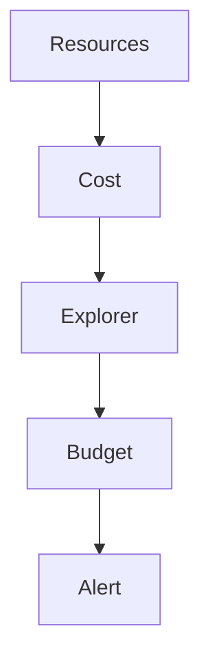

# FinOps & optimisation des coûts AWS

## Objectifs pédagogiques

- Comprendre les modèles de pricing AWS
- Identifier les principaux postes de coûts
- Mettre en place un suivi FinOps
- Optimiser les ressources et réduire la facture
- Diagnostiquer des dérives de coûts

## Contexte et problématique

Problème courant :

- Facture AWS incontrôlée
- Ressources inutilisées
- Mauvaise allocation

👉 FinOps permet :

- visibilité
- optimisation
- gouvernance des coûts

## Architecture

| Composant | Rôle | Exemple |
|-----------|------|---------|
| Cost Explorer | analyse coûts | dashboard |
| Budgets | alertes | seuil |
| Pricing models | facturation | on-demand |
| Tags | allocation coûts | projet |



## Commandes essentielles

```bash
aws ce get-cost-and-usage
```

```bash
aws budgets describe-budgets --account-id <ID>
```

```bash
aws ec2 describe-instances
```

## Fonctionnement interne

### Modèles de pricing

- On-demand
- Reserved instances
- Spot instances

### Optimisation

- rightsizing
- arrêt ressources inutilisées
- utilisation cache

🧠 Concept clé  
→ Le coût AWS dépend de l’usage réel

💡 Astuce  
→ utiliser Spot pour workloads non critiques

⚠️ Erreur fréquente  
→ laisser ressources actives  
Correction : automatiser arrêt

## Cas réel en entreprise

Contexte :

Facture élevée.

Solution :

- analyse Cost Explorer
- suppression ressources inutilisées
- reserved instances

Résultat :

- réduction coût de 40%

## Bonnes pratiques

- tagger ressources
- monitorer coûts
- utiliser budgets
- automatiser arrêt
- optimiser stockage
- utiliser instances adaptées
- revoir régulièrement infra

## Résumé

FinOps permet de contrôler et optimiser les coûts AWS.  
Sans suivi, la facture peut exploser.  
C’est une compétence clé en entreprise.

---

## SNIPPETS DE RÉVISION

<!-- snippet
id: aws_finops_definition
tech: aws
level: advanced
importance: high
format: knowledge
tags: aws,finops,cost
title: FinOps définition
content: FinOps permet de gérer et optimiser les coûts du cloud en continu
description: Compétence clé AWS
-->

<!-- snippet
id: aws_pricing_models
tech: aws
level: advanced
importance: high
format: knowledge
tags: aws,cost,pricing
title: Modèles pricing AWS
content: AWS propose on-demand, reserved et spot instances selon les besoins et coûts
description: Base pricing AWS
-->

<!-- snippet
id: aws_cost_warning
tech: aws
level: advanced
importance: high
format: knowledge
tags: aws,cost,error
title: Ressources inutilisées
content: Laisser des ressources actives inutilement augmente fortement la facture, les supprimer ou arrêter
description: Piège fréquent
-->

<!-- snippet
id: aws_cost_command
tech: aws
level: advanced
importance: medium
format: knowledge
tags: aws,cli,cost
title: Voir coûts AWS
command: aws ce get-cost-and-usage
description: Permet d'analyser les coûts AWS
-->

<!-- snippet
id: aws_finops_tip
tech: aws
level: advanced
importance: medium
format: knowledge
tags: aws,finops,bestpractice
title: Utiliser tags
content: Les tags permettent de suivre les coûts par projet et équipe
description: Bonne pratique FinOps
-->

<!-- snippet
id: aws_cost_incident
tech: aws
level: advanced
importance: high
format: knowledge
tags: aws,incident,cost
title: Facture élevée
content: Symptôme coût élevé, cause ressources mal dimensionnées, correction rightsizing et optimisation
description: Incident courant
-->
