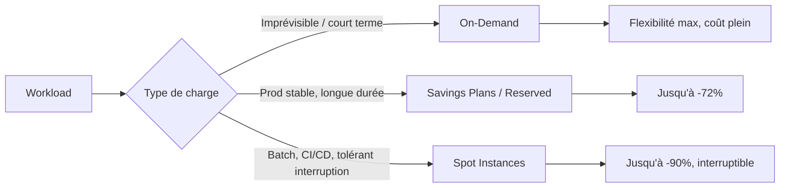

# FinOps & optimisation des coûts AWS

## Objectifs pédagogiques

À l'issue de ce module, vous serez capable de :

- Distinguer les modèles de pricing AWS (on-demand, reserved, spot) et choisir le bon selon le profil de charge
- Identifier les principaux postes de coûts d'une infrastructure AWS et localiser les gaspillages courants
- Configurer AWS Cost Explorer et des alertes Budgets pour détecter une dérive en temps réel
- Appliquer les techniques de rightsizing et d'automatisation pour réduire une facture de façon mesurable
- Mettre en place une politique de tagging cohérente permettant l'allocation des coûts par équipe ou projet

---

## Pourquoi les coûts AWS dérivent — et pourquoi c'est structurel

Le cloud a une propriété trompeuse : il est facile à consommer et difficile à surveiller. En datacenter traditionnel, un serveur mal utilisé coûte pareil qu'un serveur plein. Sur AWS, chaque ressource inutilisée tourne au compteur — et la facture arrive en fin de mois, longtemps après la cause.

Ce n'est pas un problème de mauvaise volonté. Les équipes techniques créent des ressources rapidement (c'est la promesse du cloud), mais personne ne les supprime parce que personne ne sait qu'elles existent encore. Un bucket S3 oublié avec 10 To de logs, trois instances de dev restées allumées le week-end, un NAT Gateway qui transite des gigaoctets en silence — ce sont ces micro-dérives qui composent les factures incompréhensibles.

**Le FinOps n'est pas un audit annuel.** C'est une pratique continue qui aligne trois parties : les ingénieurs (qui consomment), la finance (qui paye), et le business (qui décide des priorités). L'objectif n'est pas de dépenser le moins possible — c'est de dépenser de façon intentionnelle, en sachant exactement pourquoi chaque euro part.

<!-- snippet
id: aws_finops_definition
type: concept
tech: aws
level: advanced
importance: high
format: knowledge
tags: aws,finops,cost
title: FinOps — aligner ingénieurs, finance et business
content: FinOps est la pratique qui aligne ingénieurs, finance et business sur les coûts cloud en temps réel. Contrairement à un budget annuel figé, le cloud facture à la seconde : sans FinOps, les coûts dérivent silencieusement jusqu'à la facture de fin de mois.
description: Premier réflexe FinOps : activer AWS Cost Explorer + alertes budget à 80% et 100% pour ne jamais être surpris en fin de mois.
-->

---

## Ce qui pèse vraiment sur la facture

Avant d'optimiser, il faut savoir où regarder. Une infrastructure AWS typique concentre ses coûts sur quelques lignes — et les surprises viennent rarement de là où on les attend.

| Service | Poste de coût principal | Levier d'optimisation |
|---|---|---|
| EC2 | Type et taille d'instance, uptime | Rightsizing, Savings Plans, Spot |
| RDS | Instance + stockage + Multi-AZ | Reserved instances, pause en dev |
| S3 | Volume stocké + requêtes + transferts | Classes de stockage, lifecycle rules |
| Data Transfer | Sortie vers Internet ou inter-régions | Architecture VPC, endpoints, CDN |
| NAT Gateway | Données traitées | Endpoints S3/DynamoDB directs |
| CloudWatch Logs | Volume ingéré + rétention | Filtrage, rétention adaptée |

Le transfert de données est souvent la surprise la plus coûteuse. Entrer des données sur AWS est gratuit. Les faire sortir vers Internet ou les transférer entre régions est facturé — parfois plus cher que le compute lui-même.

---

## Les modèles de pricing : choisir plutôt que subir

AWS propose trois façons de payer le compute. Chacune correspond à un usage précis, et utiliser uniquement l'on-demand par défaut est la décision la plus courante — et la plus coûteuse.

<!-- snippet
id: aws_pricing_models
type: concept
tech: aws
level: advanced
importance: high
format: knowledge
tags: aws,cost,pricing,ec2
title: Trois modèles de pricing EC2 — on-demand, reserved, spot
content: On-demand : flexibilité totale, prix plein. Reserved Instances / Savings Plans : engagement 1 ou 3 ans, jusqu'à 72% de réduction, idéal pour la prod stable. Spot Instances : capacité excédentaire AWS à -90%, interruptible sous 2 minutes, pour les workloads tolérants aux interruptions (batch, ML, CI/CD).
description: Règle pratique : on-demand pour le nouveau, Reserved/Savings Plans pour la prod connue, Spot pour tout ce qui peut recommencer.
-->

> **SAA-C03** — Savings Plans pour RDS **n'existent pas** (uniquement Reserved DB Instances). **Instance Scheduler** = workloads heures ouvrées uniquement. Cost Explorer = analyse/prévision programmatique ; Budgets = alertes sur seuils.

**On-demand** — vous payez à la seconde, sans engagement. C'est le mode par défaut, le plus cher, mais justifié pour les charges imprévisibles ou les expérimentations. Dès qu'un workload devient prévisible, rester en on-demand est de l'argent gaspillé.

**Reserved Instances & Savings Plans** — vous vous engagez sur 1 ou 3 ans en échange d'une réduction allant jusqu'à 72%. Nuance importante : les Savings Plans sont plus flexibles que les Reserved Instances classiques car ils s'appliquent à n'importe quelle instance dans une famille donnée, pas à un type précis. Pour EC2 et Lambda, préférer les Savings Plans. Pour RDS, les Reserved Instances restent le seul levier.

**Spot Instances** — AWS revend sa capacité non utilisée avec des réductions allant jusqu'à 90%, mais peut récupérer les instances sous 2 minutes. Parfaitement adapté aux traitements batch, au rendu, au ML, aux pipelines CI/CD — tout ce qui peut être interrompu puis relancé sans perte de données.



<!-- snippet
id: aws_savings_plans_vs_reserved
type: tip
tech: aws
level: advanced
importance: medium
format: knowledge
tags: aws,cost,savings-plans,reserved-instances
title: Savings Plans vs Reserved Instances — lequel choisir
content: Savings Plans s'appliquent à toute une famille d'instance (ex. : toute instance M5 quelle que soit la taille) et couvrent aussi Lambda et Fargate. Reserved Instances sont figées sur un type exact mais restent le seul levier pour RDS. Pour EC2, Savings Plans est plus simple et plus flexible.
description: Préférer Savings Plans pour EC2/Lambda/Fargate, Reserved Instances uniquement pour RDS et les cas où le type d'instance est immuable.
-->

---

## Mise en place du suivi : voir avant d'agir

On ne peut pas optimiser ce qu'on ne mesure pas. Le point de départ est toujours la même séquence : activer la visibilité, définir des seuils d'alerte, taguer les ressources. Dans cet ordre.

### Cost Explorer — lire la facture intelligemment

Cost Explorer est activé par défaut sur les comptes récents. Il permet de filtrer les coûts par service, région, tag ou compte linked, et de visualiser des tendances sur 12 mois. En CLI, on peut l'interroger directement pour automatiser des rapports :

```bash
aws ce get-cost-and-usage \
  --time-period Start=2024-01-01,End=2024-01-31 \
  --granularity MONTHLY \
  --metrics "BlendedCost" \
  --group-by Type=DIMENSION,Key=SERVICE
```

<!-- snippet
id: aws_cost_explorer_command
type: command
tech: aws
level: advanced
importance: medium
format: knowledge
tags: aws,cli,cost,ce
title: Analyser les coûts mensuels par service via CLI
command: aws ce get-cost-and-usage --time-period Start=<START_DATE>,End=<END_DATE> --granularity MONTHLY --metrics "BlendedCost" --group-by Type=DIMENSION,Key=SERVICE
example: aws ce get-cost-and-usage --time-period Start=2024-01-01,End=2024-01-31 --granularity MONTHLY --metrics "BlendedCost" --group-by Type=DIMENSION,Key=SERVICE
description: Retourne les coûts mensuels décomposés par service AWS. Utile pour identifier rapidement les services qui pèsent le plus sur la facture.
-->

### Budgets — alerter avant le dépassement

Un budget AWS envoie une alerte SNS ou email quand les dépenses approchent d'un seuil. La bonne pratique : deux seuils par compte de production — 80% pour l'alerte précoce, 100% pour le signal critique.

```bash
aws budgets describe-budgets --account-id <ACCOUNT_ID>
```

<!-- snippet
id: aws_budgets_command
type: command
tech: aws
level: advanced
importance: high
format: knowledge
tags: aws,cli,budgets,alerting
title: Lister les budgets configurés sur un compte AWS
command: aws budgets describe-budgets --account-id <ACCOUNT_ID>
example: aws budgets describe-budgets --account-id 123456789012
description: Liste tous les budgets actifs sur le compte. Vérifier qu'un budget à 80% et un à 100% existent sur chaque compte de production.
-->

### Tagging — savoir qui consomme quoi

Sans tags, Cost Explorer affiche une somme globale sans aucune décomposition utile. Avec des tags cohérents sur chaque ressource, on peut répondre à la vraie question : "quel projet, quelle équipe, quel environnement ?"

Une convention minimale et efficace :

```
project   = nom-du-projet
env       = dev | staging | prod
team      = infra | backend | data
owner     = prenom.nom@entreprise.com
```

<!-- snippet
id: aws_finops_tagging_tip
type: tip
tech: aws
level: advanced
importance: medium
format: knowledge
tags: aws,finops,tagging,cost-allocation
title: Tags de coût — rendre visible qui consomme quoi
content: Sans tags, AWS Cost Explorer montre une facture globale sans expliquer qui consomme quoi. Avec des tags `project`, `env` et `team` sur chaque ressource, on peut voir que "projet-X en staging consomme 40% du budget" — et agir. Les tags doivent être activés en tant que "cost allocation tags" dans la console Billing pour apparaître dans Cost Explorer.
description: Enforcer les tags via AWS Config (règle required-tags) dès le départ — sans enforcement, la moitié des ressources seront non taguées dans 6 mois.
-->

L'application de ces tags doit être **enforced** via AWS Config (règle `required-tags`) — sinon, dans six mois, la moitié des ressources seront non taguées et l'analyse sera inutilisable. L'intention ne suffit pas ; il faut le contraindre.

---

## Optimisation active : réduire sans casser

### Rightsizing — payer pour ce qu'on utilise vraiment

Le rightsizing consiste à ajuster le type d'instance au profil de charge réel. AWS Compute Optimizer analyse l'utilisation CPU, mémoire et réseau sur 14 jours et génère des recommandations avec l'économie estimée.

```bash
aws compute-optimizer get-ec2-instance-recommendations \
  --account-ids <ACCOUNT_ID>
```

<!-- snippet
id: aws_rightsizing_command
type: command
tech: aws
level: advanced
importance: high
format: knowledge
tags: aws,ec2,rightsizing,compute-optimizer
title: Obtenir les recommandations de rightsizing EC2
command: aws compute-optimizer get-ec2-instance-recommendations --account-ids <ACCOUNT_ID>
example: aws compute-optimizer get-ec2-instance-recommendations --account-ids 123456789012
description: Liste les instances EC2 sur ou sous-dimensionnées avec le type recommandé et l'économie estimée en pourcentage.
-->

🧠 Une instance `t3.xlarge` à 10% d'utilisation CPU coûte 4× plus qu'une `t3.medium`. Les équipes surdimensionnent au moment du provisioning par précaution, puis oublient de revenir en arrière — et c'est exactement là que l'argent part.

### Identifier les ressources orphelines

Les ressources oubliées sont la première source de gaspillage identifiable sans risque — aucune interruption de service, gain immédiat.

```bash
# Volumes EBS non attachés à aucune instance
aws ec2 describe-volumes \
  --filters Name=status,Values=available \
  --query 'Volumes[*].{ID:VolumeId,Size:Size,State:State}'
```

<!-- snippet
id: aws_orphan_volumes_command
type: command
tech: aws
level: advanced
importance: high
format: knowledge
tags: aws,ec2,ebs,cost,cleanup
title: Lister les volumes EBS non attachés à une instance
command: aws ec2 describe-volumes --filters Name=status,Values=available --query 'Volumes[*].{ID:VolumeId,Size:Size,State:State}'
example: aws ec2 describe-volumes --filters Name=status,Values=available --query 'Volumes[*].{ID:VolumeId,Size:Size,State:State}'
description: Retourne tous les volumes EBS en état 'available' (non attachés). Ces volumes sont facturés en continu sans être utilisés par aucune instance.
-->

⚠️ Un volume `available` n'est pas forcément à supprimer — il peut s'agir d'un backup volontaire. Vérifier le tag `owner` et la date de création avant toute suppression.

<!-- snippet
id: aws_cost_orphan_warning
type: warning
tech: aws
level: advanced
importance: high
format: knowledge
tags: aws,cost,ebs,elastic-ip,cleanup
title: Ressources orphelines — facturées jusqu'à suppression explicite
content: Volumes EBS détachés, Elastic IPs non associées, Load Balancers sans cible, snapshots anciens : ces ressources continuent d'être facturées même si aucune instance ne les utilise. AWS ne les supprime jamais automatiquement. Un audit mensuel des ressources en état 'available' ou 'unused' est nécessaire pour éviter l'accumulation silencieuse.
description: Automatiser la détection avec AWS Config ou un script hebdomadaire — attendre la facture pour agir est toujours trop tard.
-->

### Automatiser l'arrêt des environnements non-prod

Les instances de développement et staging n'ont aucune raison de tourner la nuit et le week-end. Un scheduler EventBridge qui les arrête hors heures ouvrables représente typiquement 65% de réduction sur ces environnements (168h → 60h/semaine actives).

```bash
# Arrêter toutes les instances taguées env=dev en cours d'exécution
aws ec2 stop-instances \
  --instance-ids $(aws ec2 describe-instances \
    --filters "Name=tag:env,Values=dev" "Name=instance-state-name,Values=running" \
    --query 'Reservations[*].Instances[*].InstanceId' \
    --output text)
```

<!-- snippet
id: aws_stop_dev_instances
type: command
tech: aws
level: advanced
importance: medium
format: knowledge
tags: aws,ec2,automation,cost,scheduler
title: Arrêter toutes les instances EC2 taguées par environnement
command: aws ec2 stop-instances --instance-ids $(aws ec2 describe-instances --filters "Name=tag:env,Values=<ENV>" "Name=instance-state-name,Values=running" --query 'Reservations[*].Instances[*].InstanceId' --output text)
example: aws ec2 stop-instances --instance-ids $(aws ec2 describe-instances --filters "Name=tag:env,Values=dev" "Name=instance-state-name,Values=running" --query 'Reservations[*].Instances[*].InstanceId' --output text)
description: Arrête toutes les instances en cours d'exécution pour un environnement donné. À déclencher via EventBridge chaque soir (ex. 20h) et relancer le matin (ex. 7h30).
-->

💡 Ce scheduler s'appuie directement sur les tags `env` — c'est une raison de plus pour les enforcer dès le départ. Sans tag cohérent, impossible de cibler les bonnes instances automatiquement.

---

## Cas réel : −42% en 6 semaines sans toucher à la prod

**Contexte** — Une scale-up SaaS B2B (50 personnes, 8 développeurs) reçoit une facture AWS de 28 000 €/mois. Le CTO n'arrive pas à l'expliquer à la direction. Aucun budget ni tag n'existe. L'infra a grandi par ajouts successifs depuis 3 ans sans jamais être auditée.

**Diagnostic** — La première semaine est consacrée à activer Cost Explorer et à décomposer la facture par service. Résultat immédiat : EC2 représente 52%, RDS 22%, Data Transfer 18%.

En croisant avec Compute Optimizer et une inspection manuelle :
- 14 instances de dev/staging tournent 24h/24 alors que l'équipe travaille 10h/jour, 5 jours/7
- 6 instances de prod sont surdimensionnées (CPU moyen inférieur à 8%)
- 4 To de volumes EBS non attachés depuis plus de 6 mois
- 3 Load Balancers sans cible active (projets abandonnés)

**Actions** — Sur 6 semaines, les correctifs sont appliqués par ordre d'impact décroissant, en commençant par les quick-wins sans risque de service.

| Action | Économie mensuelle |
|---|---|
| Scheduler EventBridge dev/staging (hors heures ouvrables) | −6 200 € |
| Rightsizing 6 instances prod (t3.2xlarge → t3.large/xlarge) | −3 100 € |
| Savings Plans 1 an sur les instances prod restantes | −1 900 € |
| Migration workloads batch vers Spot | −1 700 € |
| Suppression volumes EBS orphelins + snapshots > 90 jours | −800 € |

**Résultat** — Facture ramenée de 28 000 € à 16 200 €/mois, soit **−42%**. Temps investi : environ 3 jours-homme d'audit + 2 jours d'implémentation. ROI positif dès le premier mois.

<!-- snippet
id: aws_finops_cost_audit
type: concept
tech: aws
level: advanced
importance: high
format: knowledge
tags: aws,finops,rightsizing,audit
title: Dérive de coûts — méthode de diagnostic systématique
content: Face à une facture inexpliquée : 1) décomposer par service dans Cost Explorer, 2) identifier dev/staging qui tourne 24h/24, 3) chercher les ressources orphelines (volumes, EIPs, LB sans cible), 4) lancer Compute Optimizer pour le rightsizing prod. L'ordre compte : quick-wins sans risque d'abord, optimisation prod ensuite.
description: Dans la majorité des cas, 30 à 50% des coûts AWS d'une PME proviennent de ressources dev/staging non arrêtées et d'instances surdimensionnées — pas de la prod.
-->

---

## Bonnes pratiques

**1. Activer Cost Explorer + alertes Budgets dès le premier jour** — Pas après le premier incident. La visibilité est un prérequis, pas une option. Configurer systématiquement deux alertes : 80% du budget mensuel (signal précoce) et 100% (alerte critique). Sans ces alertes, la dérive est invisible jusqu'à la facture.

**2. Enforcer le tagging dès la création** — Une ressource non taguée est une ressource invisible dans Cost Explorer. Utiliser AWS Config avec la règle `required-tags` pour signaler ou bloquer les ressources sans tags obligatoires (`project`, `env`, `team`). L'intention ne suffit pas : il faut le contraindre.

**3. Rightsizing trimestriel avec Compute Optimizer** — Les instances provisionnées au démarrage d'un projet sont rarement au bon niveau 6 mois après. Programmer une revue Compute Optimizer tous les trimestres, systématiquement, pas uniquement quand la facture augmente.

**4. Scheduler les environnements non-prod** — Dev et staging n'ont pas besoin de tourner la nuit ni le week-end. EventBridge + Lambda ou AWS Instance Scheduler couvre ce besoin sans développement sur-mesure. L'économie typique est de 60 à 65% sur ces environnements.

**5. Utiliser Spot pour les charges interruptibles** — CI/CD, batch, ML, tests de charge : tout ce qui peut recommencer est un candidat Spot. Les économies (−70 à −90%) sont trop significatives pour les ignorer par confort opérationnel.

**6. Audit mensuel des ressources orphelines** — Volumes EBS `available`, Elastic IPs non associées, Load Balancers sans cible, snapshots anciens. Ces ressources ne disparaissent jamais seules. Un script hebdomadaire ou AWS Config Rules couvre ce besoin.

**7. Préférer les Savings Plans aux Reserved Instances pour EC2** — Plus flexibles (s'appliquent à toute la famille d'instance), plus simples à gérer, disponibles aussi pour Lambda et Fargate. Les Reserved Instances gardent leur utilité uniquement pour RDS, où les Savings Plans ne s'appliquent pas.

**8. Mesurer l'impact de chaque optimisation** — Garder une trace des actions et des économies générées. C'est ce qui permet de justifier le temps investi en FinOps auprès de la direction et de prioriser les prochaines itérations. Sans trace, chaque audit recommence à zéro.

---

## Résumé

Le FinOps n'est pas une discipline à part — c'est une façon de travailler où chaque ressource créée a un propriétaire, un budget et une durée de vie. Sur AWS, les coûts ne dérivent pas à cause d'erreurs dramatiques : ils dérivent à cause de l'accumulation silencieuse de petites décisions oubliées. La réponse est structurelle : visibilité (Cost Explorer, tags), alertes (Budgets), et revue régulière (rightsizing, orphelins, schedulers). Dans la plupart des infrastructures qui n'ont jamais été auditées, 30 à 50% des coûts sont récupérables sans toucher à la production. Le module suivant — gouvernance AWS avec Organizations, Tagging et Compliance — amènera ces pratiques à l'échelle multi-comptes.
