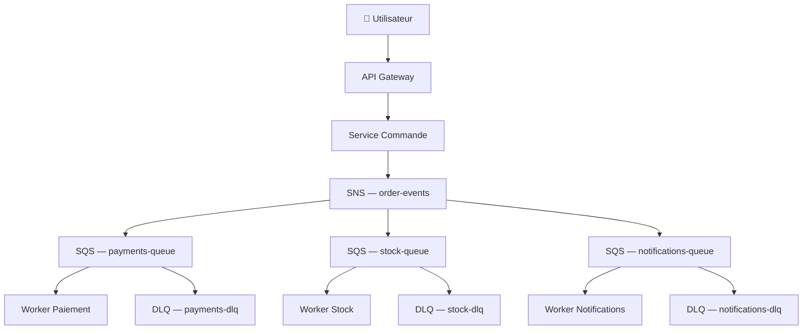

# Architectures distribuées — Microservices, SQS, SNS

## Objectifs pédagogiques

À l'issue de ce module, vous serez capable de :

1. **Expliquer** les limites d'une architecture monolithique et pourquoi le découplage résout des problèmes de résilience et de scalabilité
2. **Distinguer** SQS (file point-à-point, stockage durable) et SNS (diffusion pub/sub vers N abonnés) et choisir le bon selon le cas
3. **Implémenter** un flux de messages asynchrone entre services via la CLI AWS
4. **Concevoir** un pattern fan-out fiable en combinant un topic SNS et plusieurs queues SQS indépendantes
5. **Identifier** les pièges classiques — double traitement, messages bloquants, perte de messages — et appliquer les contre-mesures adaptées

---

## Pourquoi découpler ses services ?

Imaginez un monolithe e-commerce : paiement, stock, notifications et facturation dans la même application. Le jour du Black Friday, le service email tiers répond avec 8 secondes de latence. Résultat : le pipeline de commande entier timeout. Personne ne peut passer commande, pas parce que le paiement est cassé, mais parce qu'un service de notification périphérique est lent.

C'est le problème du **couplage fort** : un composant défaillant paralyse tout le reste. L'idée derrière les architectures distribuées n'est pas de découper le code en petits morceaux pour le plaisir — c'est de permettre à chaque partie du système d'évoluer, de tomber et de redémarrer **indépendamment des autres**.

Sur AWS, deux services sont au cœur de cette approche :

- **SQS** (Simple Queue Service) — une file de messages entre un producteur et un ou plusieurs consommateurs. Le producteur dépose, le consommateur traite quand il est disponible. Le message est stocké durablement entre les deux.
- **SNS** — un topic de diffusion. Un événement publié déclenche simultanément tous les abonnés : queues SQS, Lambda, endpoints HTTP, emails.

Combinés, ils permettent de construire des systèmes où les services ne se connaissent pas directement, ne dépendent pas de la disponibilité des autres, et absorbent les pics de charge sans s'effondrer.

---

## Ce que ça ressemble en pratique

| Composant | Rôle | Usage typique |
|-----------|------|---------------|
| SQS Standard | File de messages, at-least-once delivery | Traitement asynchrone, découplage producteur/consommateur |
| SQS FIFO | File ordonnée, exactly-once delivery | Transactions financières, séquençage strict |
| SNS | Publication vers N abonnés (pub/sub) | Diffusion d'événements, fan-out vers plusieurs services |
| DLQ | File de quarantaine pour messages en échec | Isolation des messages problématiques sans bloquer le flux |

Voici le flux d'un système de commande découplé :



Le service commande ne sait pas qu'il existe un service stock ou notification. Il publie un événement dans SNS — c'est tout. Les abonnés font leur travail de leur côté, à leur rythme, sans aucune dépendance directe entre eux.

---

## SQS — Créer et utiliser une queue

### Queue standard vs FIFO : le choix en amont

La décision se prend avant de créer la queue, pas après. Une queue standard offre un débit quasi illimité mais livre les messages **au moins une fois** et sans ordre garanti. Une queue FIFO (First In, First Out) garantit l'ordre et l'exactly-once delivery, mais est plafonnée à 3 000 messages par seconde.

Règle pratique : FIFO pour les flux financiers ou les séquences strictes, Standard pour tout le reste.

### SQS comme buffer devant un Auto Scaling Group

Un des patterns les plus importants à connaître : quand des requêtes sont perdues parce que l'ASG n'a pas le temps de scaler assez vite, **placer une queue SQS entre le producteur et les consumers** résout le problème. Les requêtes ne sont plus envoyées directement aux instances — elles sont d'abord stockées dans la queue, puis consommées par les instances à leur rythme. Si un pic de trafic arrive, les messages s'accumulent dans la queue sans être perdus, et l'ASG a le temps de lancer de nouvelles instances.

Le scaling de l'ASG se fait alors sur la métrique **`ApproximateNumberOfMessages`** (profondeur de la queue) au lieu du CPU. Le calcul est simple :
- **Backlog par instance** = `ApproximateNumberOfMessages` / nombre d'instances en service
- **Target** = latence acceptable / temps moyen de traitement d'un message

Exemple : 1 500 messages en queue, 10 instances, traitement moyen 0,1 s/message, latence acceptable 10 s → target = 10 / 0,1 = 100 messages/instance. Backlog actuel = 1 500 / 10 = 150 → l'ASG ajoute 5 instances.

Ce pattern est la réponse dès qu'une question mentionne "requests being lost / requêtes perdues" + "Auto Scaling" + "load spikes / pics de charge". L'idée clé : SQS absorbe le pic, l'ASG rattrape.

### Créer une queue standard

```bash
aws sqs create-queue --queue-name <NOM_QUEUE>
```

```bash
aws sqs create-queue --queue-name orders-queue
```

<!-- snippet
id: aws_sqs_create_queue
type: command
tech: aws
level: advanced
importance: high
format: knowledge
tags: aws,sqs,cli,queue
title: Créer une queue SQS standard
command: aws sqs create-queue --queue-name <NOM_QUEUE>
example: aws sqs create-queue --queue-name orders-queue
description: Crée une queue SQS standard. Retourne l'URL de la queue, à conserver pour les opérations suivantes.
-->

### Créer une queue FIFO

Les queues FIFO ont deux contraintes immuables : le nom doit se terminer par `.fifo`, et chaque message doit porter un `MessageGroupId` pour permettre le séquençage.

```bash
aws sqs create-queue \
  --queue-name <NOM_QUEUE>.fifo \
  --attributes FifoQueue=true,ContentBasedDeduplication=true
```

```bash
aws sqs create-queue \
  --queue-name payments-queue.fifo \
  --attributes FifoQueue=true,ContentBasedDeduplication=true
```

<!-- snippet
id: aws_sqs_create_fifo
type: command
tech: aws
level: advanced
importance: medium
format: knowledge
tags: aws,sqs,fifo,cli
title: Créer une queue SQS FIFO
context: À utiliser quand l'ordre des messages et l'exactly-once delivery sont critiques — transactions financières, séquençage strict
command: aws sqs create-queue --queue-name <NOM_QUEUE>.fifo --attributes FifoQueue=true,ContentBasedDeduplication=true
example: aws sqs create-queue --queue-name payments-queue.fifo --attributes FifoQueue=true,ContentBasedDeduplication=true
description: Crée une queue FIFO avec déduplication automatique basée sur le contenu. Débit plafonné à 3 000 msg/s.
-->

### Envoyer un message

```bash
aws sqs send-message \
  --queue-url <URL_QUEUE> \
  --message-body '<CONTENU_MESSAGE>'
```

```bash
aws sqs send-message \
  --queue-url https://sqs.eu-west-1.amazonaws.com/123456789012/orders-queue \
  --message-body '{"orderId":"ORD-4521","amount":149.99,"customerId":"USR-88"}'
```

<!-- snippet
id: aws_sqs_send_message
type: command
tech: aws
level: advanced
importance: high
format: knowledge
tags: aws,sqs,cli,message
title: Envoyer un message dans une queue SQS
command: aws sqs send-message --queue-url <URL_QUEUE> --message-body '<CONTENU_MESSAGE>'
example: aws sqs send-message --queue-url https://sqs.eu-west-1.amazonaws.com/123456789012/orders-queue --message-body '{"orderId":"ORD-4521","amount":149.99}'
description: Publie un message dans la queue. Le corps peut être du JSON structuré — le consommateur doit savoir le parser.
-->

### Recevoir puis supprimer un message

Recevoir un message ne le supprime pas. SQS le rend simplement **invisible** pendant un délai configurable (le visibility timeout). Si le consommateur ne le supprime pas explicitement dans ce délai — parce qu'il a planté ou que le traitement est trop long — le message redevient visible et un autre consommateur le récupère.

```bash
aws sqs receive-message --queue-url <URL_QUEUE>
```

Une fois le traitement terminé avec succès, la suppression explicite est obligatoire :

```bash
aws sqs delete-message \
  --queue-url <URL_QUEUE> \
  --receipt-handle <RECEIPT_HANDLE>
```

<!-- snippet
id: aws_sqs_delete_message
type: command
tech: aws
level: advanced
importance: high
format: knowledge
tags: aws,sqs,cli,consumer
title: Supprimer un message SQS après traitement
context: Sans cette suppression, le message redevient visible après le visibility timeout et sera traité à nouveau
command: aws sqs delete-message --queue-url <URL_QUEUE> --receipt-handle <RECEIPT_HANDLE>
example: aws sqs delete-message --queue-url https://sqs.eu-west-1.amazonaws.com/123456789012/orders-queue --receipt-handle AQEBwJnKyrHigUMZj6reyAsAg...
description: Supprime définitivement le message de la queue. Le ReceiptHandle est retourné par receive-message.
-->

### Activer le Long Polling pour réduire les coûts

Par défaut, `receive-message` retourne immédiatement même si la queue est vide — ce qui génère de nombreux appels inutiles facturés. Avec `--wait-time-seconds 20`, SQS attend jusqu'à 20 secondes qu'un message arrive avant de répondre.

```bash
aws sqs receive-message \
  --queue-url <URL_QUEUE> \
  --wait-time-seconds 20
```

<!-- snippet
id: aws_sqs_long_polling
type: tip
tech: aws
level: advanced
importance: medium
format: knowledge
tags: aws,sqs,cli,polling,cost
title: Activer le Long Polling SQS pour réduire les coûts
context: À configurer sur tous les consommateurs en production — le comportement par défaut (short polling) est coûteux
command: aws sqs receive-message --queue-url <URL_QUEUE> --wait-time-seconds 20
example: aws sqs receive-message --queue-url https://sqs.eu-west-1.amazonaws.com/123456789012/orders-queue --wait-time-seconds 20
description: Le Long Polling réduit le nombre d'appels API à vide. Latence identique, moins de coûts, moins de bruit dans les logs.
-->

---

## SNS — Publier et distribuer

SNS (Simple Notification Service) est un service pub/sub : un message publié sur un topic est distribué à **tous les abonnés** (Lambda, SQS, email, SMS, HTTP). C'est le service à utiliser pour les **notifications opérationnelles** — typiquement, une alarme CloudWatch déclenche une notification SNS qui envoie un email à l'équipe ops.

**SNS vs SES (Simple Email Service)** : une confusion fréquente. SNS envoie des notifications courtes (alertes, alarmes, confirmations) vers des abonnés via email, SMS, HTTP ou d'autres services AWS. SES est un service d'envoi d'emails en masse — marketing, emails transactionnels (factures, confirmations d'inscription), newsletters. Si la question parle de "monitor and notify / surveiller et notifier" une équipe → **SNS**. Si la question parle de "send bulk emails / envoyer des emails en masse" ou "marketing campaign" → **SES** (ou Pinpoint pour les campagnes multicanal).

### Créer un topic

```bash
aws sns create-topic --name <NOM_TOPIC>
```

```bash
aws sns create-topic --name order-events
```

<!-- snippet
id: aws_sns_create_topic
type: command
tech: aws
level: advanced
importance: high
format: knowledge
tags: aws,sns,cli,pubsub
title: Créer un topic SNS
command: aws sns create-topic --name <NOM_TOPIC>
example: aws sns create-topic --name order-events
description: Crée un topic SNS et retourne son ARN. Cet ARN est utilisé pour publier des messages et gérer les abonnements.
-->

### Abonner une queue SQS à un topic — le pattern fan-out

C'est ici que la combinaison SNS + SQS prend tout son sens. Chaque queue abonnée reçoit une copie indépendante de chaque message publié. Un service down accumule ses messages dans sa queue sans impacter les autres.

```bash
aws sns subscribe \
  --topic-arn <ARN_TOPIC> \
  --protocol sqs \
  --notification-endpoint <ARN_QUEUE>
```

```bash
aws sns subscribe \
  --topic-arn arn:aws:sns:eu-west-1:123456789012:order-events \
  --protocol sqs \
  --notification-endpoint arn:aws:sqs:eu-west-1:123456789012:stock-queue
```

<!-- snippet
id: aws_sns_subscribe_sqs
type: command
tech: aws
level: advanced
importance: high
format: knowledge
tags: aws,sns,sqs,fanout,cli
title: Abonner une queue SQS à un topic SNS
context: Pattern fan-out — chaque queue abonnée reçoit une copie indépendante du message publié
command: aws sns subscribe --topic-arn <ARN_TOPIC> --protocol sqs --notification-endpoint <ARN_QUEUE>
example: aws sns subscribe --topic-arn arn:aws:sns:eu-west-1:123456789012:order-events --protocol sqs --notification-endpoint arn:aws:sqs:eu-west-1:123456789012:stock-queue
description: Crée un abonnement SNS→SQS. La queue doit avoir une policy autorisant SNS à y écrire, sinon les messages sont silencieusement perdus.
-->

### Publier un événement

```bash
aws sns publish \
  --topic-arn <ARN_TOPIC> \
  --message '<CONTENU_MESSAGE>' \
  --subject '<SUJET>'
```

```bash
aws sns publish \
  --topic-arn arn:aws:sns:eu-west-1:123456789012:order-events \
  --message '{"orderId":"ORD-4521","status":"confirmed"}' \
  --subject "OrderConfirmed"
```

<!-- snippet
id: aws_sns_publish
type: command
tech: aws
level: advanced
importance: high
format: knowledge
tags: aws,sns,cli,publish
title: Publier un message dans un topic SNS
command: aws sns publish --topic-arn <ARN_TOPIC> --message '<CONTENU_MESSAGE>' --subject '<SUJET>'
example: aws sns publish --topic-arn arn:aws:sns:eu-west-1:123456789012:order-events --message '{"orderId":"ORD-4521","status":"confirmed"}' --subject "OrderConfirmed"
description: Publie un événement vers tous les abonnés du topic simultanément. Le sujet est optionnel mais aide au filtrage côté abonné.
-->

---

## Ce qu'il faut vraiment comprendre

### L'at-least-once delivery : la promesse et ses conséquences

SQS garantit qu'un message sera livré **au moins une fois** — pas exactement une fois. Un consommateur peut recevoir le même message deux fois : il a planté pendant le traitement, le visibility timeout a expiré, un autre consommateur l'a repris.

🧠 Ce n'est pas un bug, c'est le contrat. La conséquence directe : votre code de traitement doit être **idempotent**. Traiter deux fois le même message doit produire le même résultat qu'une seule fois. La technique standard consiste à inclure un identifiant unique dans chaque message (`orderId`, `requestId`) et à vérifier en base de données si ce message a déjà été traité avant d'agir.

💡 Si vos traitements durent régulièrement plus que le visibility timeout (30 secondes par défaut), prolongez-le dynamiquement depuis le consommateur avec `ChangeMessageVisibility`, ou augmentez-le à la création de la queue.

<!-- snippet
id: aws_sqs_idempotency
type: tip
tech: aws
level: advanced
importance: high
format: knowledge
tags: aws,sqs,idempotency,bestpractice
title: SQS at-least-once — rendre son code idempotent
content: SQS garantit qu'un message sera délivré au moins une fois, pas exactement une fois. Un consommateur peut recevoir le même message deux fois (crash pendant le traitement, visibility timeout expiré). La solution : inclure un identifiant unique dans chaque message (orderId, requestId) et vérifier en base si ce message a déjà été traité avant d'agir. Sans idempotence, un double traitement peut créer deux commandes, deux prélèvements ou deux emails envoyés.
description: Ce n'est pas un edge case — c'est garanti d'arriver en production. L'idempotence est une exigence non négociable sur toute queue SQS Standard.
-->

### La Dead Letter Queue : l'outil qu'on regrette de ne pas avoir mis dès le départ

Certains messages échouent systématiquement : JSON malformé, données corrompues, bug dans le consommateur. Sans DLQ, ces messages restent dans la queue principale, sont retentés indéfiniment, consomment des ressources et polluent les logs. Le flux continue à fonctionner pour les autres messages, mais ces messages fantômes ne disparaissent jamais.

⚠️ Configurez une DLQ avec un `maxReceiveCount` entre 3 et 5 sur **toutes** vos queues de production. Les messages qui échouent N fois sont automatiquement déplacés vers la DLQ. Bonus : un pic soudain de messages en DLQ est une alarme naturelle — il signale un bug ou un changement de format non anticipé côté producteur.

<!-- snippet
id: aws_sqs_dlq_warning
type: warning
tech: aws
level: advanced
importance: high
format: knowledge
tags: aws,sqs,dlq,reliability
title: Absence de DLQ — messages bloquants silencieux
content: Sans Dead Letter Queue, un message qui échoue systématiquement reste dans la queue principale et est retenté indéfiniment. Il consomme des ressources, pollue les logs, et peut masquer d'autres problèmes. Configurez une DLQ avec maxReceiveCount entre 3 et 5 sur toutes vos queues de production. Un pic de messages en DLQ est aussi un signal d'alerte : il indique généralement un bug ou un changement de schéma non coordonné.
description: La DLQ isole les messages problématiques sans arrêter le flux principal. Ne pas en configurer une est une dette technique garantie.
-->

### Pourquoi SNS + SQS est plus robuste que SNS seul

SNS peut livrer directement vers Lambda ou un endpoint HTTP — mais si cet endpoint est indisponible au moment de la publication, le message est perdu. En interposant SQS entre SNS et le consommateur, le message est stocké durablement : le consommateur le traitera dès son retour, même s'il était en train de redémarrer. C'est cette combinaison qui transforme un système fragile en système résilient aux pannes partielles.

<!-- snippet
id: aws_fanout_concept
type: concept
tech: aws
level: advanced
importance: high
format: knowledge
tags: aws,sns,sqs,fanout,architecture
title: Pattern fan-out SNS + SQS
content: Le fan-out consiste à brancher plusieurs queues SQS sur un seul topic SNS. Quand un événement est publié, chaque queue en reçoit une copie indépendante. Chaque consommateur traite à son rythme, sans connaître les autres. Si un service est down, ses messages s'accumulent dans sa queue — les autres services continuent sans être impactés. C'est fondamentalement différent de SNS seul : sans SQS, un consommateur indisponible perd définitivement le message.
description: Un producteur, N consommateurs indépendants, zéro dépendance directe. La base du découplage événementiel robuste sur AWS.
-->

---

## Cas réel : pipeline de commande sous Black Friday

Une marketplace mid-size traitait ses commandes de façon synchrone : l'API appelait successivement le stock, la facturation et le service email dans une chaîne de 4 appels bloquants. Lors du Black Friday précédent, le service email tiers avait répondu avec 8 secondes de latence — ce délai avait fait timeout l'ensemble du pipeline pendant 22 minutes, causant 340 k€ de CA perdu. Pas un problème de paiement. Pas un problème de stock. Un service email lent avait tout bloqué.

**Architecture mise en place** — L'équipe a découplé autour d'un topic SNS `order-confirmed` :

1. L'API valide la commande, persiste en base, publie dans SNS — et répond immédiatement `202 Accepted` au client
2. SNS diffuse vers trois queues SQS indépendantes : `stock-updates`, `billing-jobs`, `email-notifications`
3. Chaque worker consomme sa queue à son propre rythme
4. Une DLQ avec `maxReceiveCount=3` protège chaque queue

Trois semaines après la mise en prod, le service email a de nouveau connu des lenteurs — 11 minutes cette fois. Résultat : 0 commande perdue. Les messages s'étaient accumulés dans `email-notifications` et ont été traités dès le retour du service. Le stock et la facturation n'ont jamais été impactés.

**Résultats mesurés** — Temps de réponse de l'API commande : de 1,2 s en moyenne à 180 ms. Taux d'erreur lors des pics : de 12 % à 0,3 %. Capacité de traitement parallèle multipliée par 8 en ajoutant des workers sur chaque queue indépendamment, sans toucher aux autres services.

---

## Bonnes pratiques

**Versionner les schémas de messages dès le départ** — Un changement de format JSON dans le producteur sans mise à jour des consommateurs est la cause n°1 de DLQ qui explose. Définissez un contrat explicite (JSON Schema, champ `version` dans chaque message) et coordonnez les déploiements en conséquence.

**Traiter une queue comme une interface publique** — Si deux équipes partagent une queue, elles doivent s'accorder sur le format, le versioning et la gestion des erreurs comme pour une API. Sans contrat écrit, les incidents de production sont inévitables.

**Surveiller la profondeur de queue, pas seulement les erreurs** — Une queue qui grossit sans être consommée est un problème en formation. Créez une alarme CloudWatch sur `ApproximateNumberOfMessagesVisible` avec un seuil adapté dès le départ. Ne découvrez pas le problème quand la queue déborde.

**Passer les identifiants, pas les payloads massifs** — SQS accepte 256 KB maximum par message. Pour les gros volumes, stockez les données en S3 et passez uniquement la clé dans le message. C'est aussi plus efficace : le consommateur charge les données uniquement s'il en a besoin.

**Tester les scénarios de panne avant la production** — Arrêtez un worker en cours de traitement et vérifiez que les messages reviennent dans la queue. Injectez des messages malformés et vérifiez qu'ils atterrissent en DLQ. Modifiez le visibility timeout et observez le comportement. Ce que vous ne testez pas en staging, vous le découvrez en prod sous charge.

**Documenter la topologie des topics SNS** — Dans un système avec une dizaine de services, savoir "qui publie quoi" et "qui écoute quoi" devient critique lors des incidents. Un fichier de cartographie dans le repo — même simple — vaut mieux qu'une découverte en urgence à 3h du matin.

---

## Résumé

Le découplage via SQS et SNS répond à un problème concret : dans un système synchrone, la défaillance d'un composant périphérique peut paralyser l'ensemble. En rendant les communications asynchrones et durables, chaque service devient indépendant — il tombe, il redémarre, il absorbe les pics sans impacter les autres.

SQS stocke les messages pour un consommateur unique ; SNS les diffuse vers N abonnés simultanément. Combinés dans le pattern fan-out, ils forment la base des architectures distribuées robustes sur AWS. Les deux points de vigilance permanents sont l'idempotence des consommateurs — SQS livre at-least-once, pas exactly-once — et la mise en place systématique des DLQ pour isoler les messages problématiques sans bloquer le flux.

Le prochain module aborde la résilience et le Chaos Engineering : comment tester activement ces architectures face aux pannes réelles, et comment concevoir des systèmes qui survivent à ce qu'on n'a pas anticipé.
