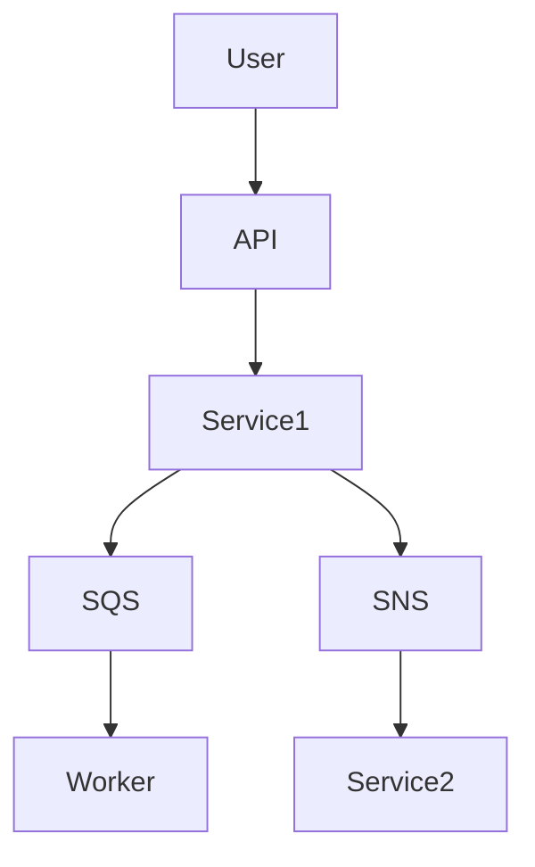

# Architectures distribuées — Microservices, SQS, SNS

## Objectifs pédagogiques

- Comprendre les architectures distribuées
- Implémenter une architecture microservices
- Utiliser SQS et SNS pour découpler les services
- Gérer la résilience et les pannes
- Concevoir un système scalable et robuste

## Contexte et problématique

Monolithe classique :

- couplage fort
- difficile à scaler
- fragile aux pannes

👉 Solution :

- microservices
- communication asynchrone
- découplage

## Architecture

| Composant | Rôle | Exemple |
|-----------|------|---------|
| Microservice | service indépendant | API |
| SQS | queue | traitement async |
| SNS | pub/sub | notification |
| EventBridge | events | orchestration |



## Commandes essentielles

```bash
aws sqs list-queues
```

```bash
aws sns list-topics
```

```bash
aws sqs send-message --queue-url <URL> --message-body "test"
```

## Fonctionnement interne

### Microservices

- services indépendants
- communication via API ou events

### SQS

- file de messages
- traitement asynchrone

### SNS

- publication messages
- diffusion multiple

🧠 Concept clé  
→ Découplage = résilience + scalabilité

💡 Astuce  
→ privilégier communication asynchrone

⚠️ Erreur fréquente  
→ dépendances fortes entre services  
Correction : utiliser queues/events

## Cas réel en entreprise

Contexte :

Système e-commerce.

Solution :

- service commande
- SQS pour traitement
- SNS pour notifications

Résultat :

- système scalable
- résilient

## Bonnes pratiques

- découpler services
- utiliser queues pour async
- gérer retry messages
- monitorer queues
- éviter dépendances fortes
- utiliser idempotence
- tester pannes

## Résumé

Les architectures distribuées permettent de scaler et résister aux pannes.  
SQS et SNS sont essentiels pour découpler les services.  
C’est un standard des architectures modernes.

---

## SNIPPETS DE RÉVISION

<!-- snippet
id: aws_microservices_definition
type: concept
tech: aws
level: advanced
importance: high
format: knowledge
tags: aws,microservices,architecture
title: Microservices définition
content: Les microservices sont des services indépendants communiquant via API ou événements
description: Base architecture moderne
-->

<!-- snippet
id: aws_sqs_definition
type: concept
tech: aws
level: advanced
importance: high
format: knowledge
tags: aws,sqs,queue
title: SQS rôle
content: SQS est une file de messages permettant le traitement asynchrone entre services
description: Découplage services
-->

<!-- snippet
id: aws_sns_definition
type: concept
tech: aws
level: advanced
importance: high
format: knowledge
tags: aws,sns,pubsub
title: SNS rôle
content: SNS permet de diffuser des messages à plusieurs consommateurs simultanément
description: Pub/Sub AWS
-->

<!-- snippet
id: aws_sqs_command
type: command
tech: aws
level: advanced
importance: medium
format: knowledge
tags: aws,sqs,cli
title: Envoyer message SQS
command: aws sqs send-message --queue-url <URL> --message-body "test"
description: Permet d'envoyer un message dans une queue
-->

<!-- snippet
id: aws_coupling_warning
type: warning
tech: aws
level: advanced
importance: high
format: knowledge
tags: aws,architecture,error
title: Couplage fort
content: Des services fortement couplés rendent le système fragile, utiliser des queues pour découpler
description: Piège critique
-->

<!-- snippet
id: aws_async_tip
type: tip
tech: aws
level: advanced
importance: medium
format: knowledge
tags: aws,architecture,bestpractice
title: Communication async
content: La communication asynchrone améliore la résilience et la scalabilité des systèmes
description: Bonne pratique
-->

<!-- snippet
id: aws_distributed_error
type: error
tech: aws
level: advanced
importance: high
format: knowledge
tags: aws,incident,architecture
title: Service bloqué
content: Symptôme blocage système, cause dépendance synchrone, correction passer en async via SQS
description: Incident fréquent
-->
