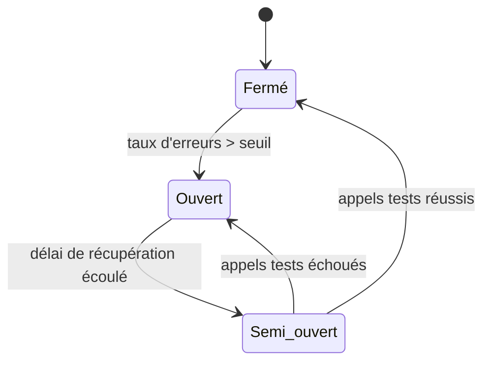

# Résilience & Chaos Engineering — Retry, Backoff, Circuit Breaker

## Objectifs pédagogiques

À l'issue de ce module, tu seras capable de :

1. **Expliquer** pourquoi les pannes sont inévitables dans les architectures distribuées et ce qu'elles impliquent concrètement
2. **Implémenter** une stratégie de retry avec backoff exponentiel et jitter pour éviter les surcharges en cascade
3. **Concevoir** un circuit breaker adapté à un service AWS dépendant d'une API externe
4. **Planifier et exécuter** un test de chaos avec AWS Fault Injection Simulator (FIS)
5. **Évaluer** la robustesse d'une architecture à partir de métriques CloudWatch ciblées

---

## Pourquoi une architecture doit prévoir l'échec

Un système distribué ne tombe pas en panne *si* une dépendance échoue — il tombe en panne *quand* elle échoue, parce que c'est inévitable. Réseau instable, base de données lente, service tiers indisponible, déploiement raté sur une AZ : chaque appel distant est un point de défaillance potentiel.

La résilience ne consiste pas à empêcher les pannes. Elle consiste à faire en sorte qu'une panne isolée ne devienne pas une panne généralisée. C'est la différence entre un service qui retourne une erreur propre sur une fonctionnalité secondaire, et un service qui s'effondre entièrement parce qu'une API externe a mis 30 secondes à répondre.

Les trois mécanismes que couvre ce module — retry, backoff, circuit breaker — sont complémentaires et s'appliquent dans cet ordre logique : on réessaie intelligemment, on attend de façon croissante, et si ça ne passe toujours pas, on coupe pour protéger le reste du système.

---

## Les trois mécanismes fondamentaux

### Retry : réessayer, mais pas n'importe comment

Le retry est le réflexe naturel face à une erreur transitoire. Une requête qui échoue une fois a souvent de bonnes chances de réussir à la deuxième tentative — erreur réseau, timeout court, throttling temporaire d'API : tous sont de bons candidats.

Mais un retry naïf crée plus de problèmes qu'il n'en résout. Si cent clients relancent simultanément leurs requêtes dès la première erreur, on amplifie exactement la charge qui a provoqué la panne.

La règle est simple : on ne retry que sur des erreurs *idempotentes* (qu'on peut répéter sans effet de bord) et *transitoires* (qui ont une chance de disparaître). Une erreur 400 Bad Request ne mérite pas de retry — la requête est mal formée, relancer ne changera rien. Une erreur 503 ou un timeout, oui.

```python
import boto3
from botocore.config import Config

# Retry automatique configuré dans le SDK Python
config = Config(
    retries={
        "max_attempts": 5,
        "mode": "adaptive"   # adaptive ajuste selon la charge perçue
    }
)

client = boto3.client("dynamodb", config=config)
```

Le SDK AWS gère le retry nativement sur la plupart des services. Le mode `adaptive` est préférable au mode `standard` en production car il réduit dynamiquement la fréquence des retries si le service semble sous pression.

<!-- snippet
id: aws_retry_concept
type: concept
tech: aws
level: advanced
importance: high
format: knowledge
tags: aws,retry,resilience
title: Retry — principe et conditions d'application
content: Le retry réexécute une opération ayant échoué. Il ne s'applique qu'aux erreurs transitoires (timeout, 503) et idempotentes. Sur une erreur 400 ou une erreur métier, un retry n'a aucun sens et aggrave la situation en ampliant la charge sur un service déjà dégradé.
description: Mécanisme de base de la résilience — à limiter impérativement en nombre et à cibler sur les bons codes d'erreur.
-->

<!-- snippet
id: aws_retry_infinite_warning
type: warning
tech: aws
level: advanced
importance: high
format: knowledge
tags: aws,retry,incident
title: Retry infini — le chemin vers la panne généralisée
content: Sans limite de tentatives, un retry en boucle sur un service dégradé génère une tempête de requêtes qui aggrave la panne. Toujours définir un max_attempts (3 à 5 en général) et journaliser les échecs définitifs pour ne pas les perdre silencieusement.
description: Piège critique : un retry sans borne peut transformer une micro-panne en incident majeur de type thundering herd.
-->

---

### Backoff exponentiel : laisser le service respirer

Définir combien de fois on retry ne suffit pas — il faut aussi définir *quand*. Le backoff est le délai d'attente entre deux tentatives. L'approche la plus efficace est **exponentielle** : la première attente dure 1 seconde, la deuxième 2 secondes, la troisième 4 secondes, etc. On plafonne à une valeur maximale (par exemple 30 secondes) pour éviter d'attendre indéfiniment.

Un détail souvent oublié change tout : le **jitter**. Si dix instances retentent toutes au même instant — même délai exponentiel, même synchronisation — on reconstitue exactement le pic de charge qu'on cherchait à éviter. Le jitter ajoute une variation aléatoire pour désynchroniser les tentatives entre instances.

```python
import time
import random

def retry_with_backoff(func, max_attempts=5, base_delay=1, cap=30):
    for attempt in range(max_attempts):
        try:
            return func()
        except Exception as e:
            if attempt == max_attempts - 1:
                raise
            # Backoff exponentiel avec jitter complet
            delay = min(cap, base_delay * (2 ** attempt))
            jitter = random.uniform(0, delay)
            print(f"Tentative {attempt + 1} échouée, retry dans {jitter:.1f}s")
            time.sleep(jitter)
```

<!-- snippet
id: aws_backoff_exponential_concept
type: concept
tech: aws
level: advanced
importance: high
format: knowledge
tags: aws,backoff,retry,jitter
title: Backoff exponentiel avec jitter
content: Le backoff exponentiel multiplie le délai entre retries (1s, 2s, 4s, 8s...). Le jitter ajoute une variation aléatoire pour éviter que plusieurs clients retentent exactement au même moment, ce qui reconstituerait le pic de charge initial — l'effet thundering herd.
description: Formule : délai = min(cap, base × 2ⁿ) + random(0, délai) — indispensable en contexte multi-instances.
-->

---

### Circuit Breaker : couper avant que tout s'effondre

Même avec un backoff bien réglé, si un service reste durablement indisponible, les retries continuent d'accumuler de la latence et de consommer des ressources. Le circuit breaker tranche différemment : plutôt que de continuer à frapper sur une porte qui ne s'ouvre pas, on arrête d'essayer temporairement.

Le mécanisme s'inspire des disjoncteurs électriques. Il surveille le taux d'erreur sur les appels vers un service donné, et au-delà d'un seuil, il "ouvre le circuit" — les appels sont bloqués immédiatement côté client, sans même tenter de joindre le service défaillant.

| État | Comportement | Condition de transition |
|------|-------------|------------------------|
| **Fermé** | Trafic normal, erreurs comptabilisées | Seuil d'erreurs atteint → Ouvert |
| **Ouvert** | Appels rejetés immédiatement | Délai écoulé → Semi-ouvert |
| **Semi-ouvert** | Quelques appels de test passent | Succès → Fermé / Échec → Ouvert |

L'état ouvert protège le service défaillant d'une surcharge supplémentaire, et protège le service appelant d'une accumulation de timeouts qui bloquerait ses propres threads. L'état semi-ouvert permet de détecter automatiquement la reprise sans intervention manuelle.



⚠️ AWS ne fournit pas de circuit breaker natif côté infrastructure — c'est une logique applicative. On l'implémente dans le code (Resilience4j pour Java, PyBreaker pour Python, ou les SDK AWS en mode adaptatif) ou via un service mesh comme AWS App Mesh.

<!-- snippet
id: aws_circuit_breaker_concept
type: concept
tech: aws
level: advanced
importance: high
format: knowledge
tags: aws,circuitbreaker,resilience
title: Circuit Breaker — trois états, un objectif
content: Le circuit breaker surveille le taux d'erreur des appels sortants. Au-delà d'un seuil configuré, il passe en état "ouvert" et bloque les appels sans les transmettre. Après un délai de récupération, il passe en semi-ouvert pour tester la reprise avec quelques appels de test. Objectif : éviter l'effet cascade et préserver les ressources du service défaillant.
description: Protection contre les pannes en cascade — indispensable dès qu'un service dépend d'un composant externe ou d'une autre microservice.
-->

<!-- snippet
id: aws_cascade_failure_warning
type: warning
tech: aws
level: advanced
importance: high
format: knowledge
tags: aws,incident,circuitbreaker,cascade
title: Effet cascade — quand une dépendance noie tout le système
content: Sans circuit breaker, un service qui répond en 10s bloque les threads appelants. Ces threads saturent, la file d'attente grossit, et le service appelant s'effondre à son tour — même s'il n'est pas directement concerné par la panne. Le circuit breaker rompt cette chaîne en rejetant immédiatement les appels dès que le seuil est franchi.
description: L'effet cascade est la cause principale des incidents majeurs en architecture microservices. Un circuit breaker l'arrête à la source.
-->

---

## Fallback : que faire quand le circuit est ouvert ?

Un circuit ouvert sans fallback retourne une erreur 500 — ça ne protège pas l'utilisateur, ça déplace juste l'origine du problème. Le fallback est la réponse de substitution qu'on déclenche quand le chemin normal est indisponible.

Selon le contexte, plusieurs options existent :

- **Cache** : retourner la dernière valeur connue si la donnée peut être légèrement périmée
- **Valeur par défaut** : retourner une réponse vide ou neutre plutôt qu'une erreur 500
- **Service de secours** : appeler une API alternative ou une version dégradée du même service
- **File d'attente** : différer le traitement (SQS) plutôt que le rejeter
- **Message fonctionnel** : informer l'utilisateur proprement plutôt que de le laisser face à un timeout silencieux

C'est ce qu'on appelle la dégradation gracieuse (*graceful degradation*) : une panne partielle reste partielle. Un moteur de recommandations indisponible n'empêche pas d'afficher la page — on affiche des recommandations génériques. L'utilisateur perd une fonctionnalité, pas le service.

<!-- snippet
id: aws_graceful_degradation_concept
type: concept
tech: aws
level: advanced
importance: high
format: knowledge
tags: aws,resilience,fallback,degradation
title: Dégradation gracieuse et stratégies de fallback
content: Un système résilient ne vise pas à être infaillible — il vise à ne jamais tomber entièrement. La dégradation gracieuse consiste à maintenir les fonctions critiques actives et à substituer les fonctions secondaires par des fallbacks (cache, valeur par défaut, file SQS, service alternatif) quand une dépendance est indisponible.
description: Objectif : une panne partielle reste partielle. Elle ne doit jamais provoquer l'effondrement de l'ensemble du système.
-->

---

## Chaos Engineering : tester ce qu'on ne teste pas

Il y a une limite à ce qu'on peut valider par des tests unitaires ou des code reviews : on ne sait pas vraiment comment un système se comporte face à une vraie panne tant qu'on ne l'a pas provoquée. C'est l'idée centrale du chaos engineering — introduire des défaillances contrôlées pour observer le comportement réel du système, avant qu'un incident en production ne le fasse à votre place.

Netflix a popularisé cette approche avec Chaos Monkey. AWS propose **Fault Injection Simulator (FIS)**, un service géré qui permet de définir des expériences de pannes reproductibles sur des ressources AWS réelles.

### Anatomie d'une expérience FIS

Une expérience FIS se définit autour de trois éléments :

- **Les actions** : que provoquer ? Arrêt d'instance EC2, injection de latence réseau, erreur API, saturation CPU, perte d'une AZ.
- **Les cibles** : sur quoi ? Instances EC2 filtrées par tag, tâches ECS, nœuds EKS — avec un pourcentage de ciblage configurable.
- **Les stop conditions** : quand arrêter automatiquement ? Une alarme CloudWatch franchie déclenche l'arrêt sans intervention manuelle.

```bash
# Lister les templates d'expériences FIS disponibles dans la région
aws fis list-experiment-templates --region <REGION>

# Démarrer une expérience à partir d'un template existant
aws fis start-experiment \
  --experiment-template-id <TEMPLATE_ID> \
  --region <REGION>

# Suivre l'état d'une expérience en cours
aws fis get-experiment \
  --id <EXPERIMENT_ID> \
  --region <REGION>
```

<!-- snippet
id: aws_fis_list_templates
type: command
tech: aws-fis
level: advanced
importance: medium
format: knowledge
tags: aws,fis,chaos
title: Lister les templates d'expériences FIS disponibles
context: Consulter les scénarios de chaos disponibles dans le compte AWS courant avant de lancer une expérience
command: aws fis list-experiment-templates --region <REGION>
example: aws fis list-experiment-templates --region eu-west-1
description: Retourne la liste des templates FIS créés dans la région. Chaque template définit les actions, cibles et stop conditions d'une expérience de chaos.
-->

<!-- snippet
id: aws_fis_start_experiment
type: command
tech: aws-fis
level: advanced
importance: high
format: knowledge
tags: aws,fis,chaos,resilience
title: Démarrer une expérience AWS FIS
context: Lancer un scénario de panne contrôlée défini dans un template FIS existant
command: aws fis start-experiment --experiment-template-id <TEMPLATE_ID> --region <REGION>
example: aws fis start-experiment --experiment-template-id EXT1a2b3c4d --region eu-west-1
description: Lance l'expérience de chaos définie dans le template. Toujours avoir une stop condition CloudWatch configurée avant d'exécuter en environnement sensible.
-->

```bash
# Vérifier les alarmes CloudWatch associées (stop conditions)
aws cloudwatch describe-alarms \
  --alarm-name-prefix <PREFIX_ALARME> \
  --state-value ALARM \
  --region <REGION>
```

<!-- snippet
id: aws_fis_cloudwatch_stopcondition
type: command
tech: aws-cloudwatch
level: advanced
importance: high
format: knowledge
tags: aws,cloudwatch,fis,stopcondition
title: Vérifier les alarmes CloudWatch pour stop conditions FIS
context: Surveiller les alarmes qui servent de conditions d'arrêt automatique dans une expérience FIS
command: aws cloudwatch describe-alarms --alarm-name-prefix <PREFIX_ALARME> --state-value ALARM --region <REGION>
example: aws cloudwatch describe-alarms --alarm-name-prefix "chaos-stopcondition" --state-value ALARM --region eu-west-1
description: Identifie les alarmes en état ALARM pouvant déclencher l'arrêt automatique d'une expérience FIS. À surveiller pendant et après chaque expérience.
-->

### Ce qu'on cherche à observer

L'expérience n'a de valeur que si on observe activement pendant qu'elle se déroule. Quelques questions à se poser avant même de démarrer :

- 🧠 Les alarmes CloudWatch se déclenchent-elles au bon moment et sur les bons seuils ?
- 🧠 Le circuit breaker s'ouvre-t-il quand il devrait, et se referme-t-il correctement après ?
- ⚠️ Quels services sont affectés par effet de bord alors qu'ils ne devraient pas l'être ?
- 💡 Le fallback s'active-t-il sans intervention manuelle et retourne-t-il la bonne réponse ?
- 💡 Le système revient-il à l'état nominal dans un délai acceptable après la fin de l'injection ?

Si une expérience révèle qu'un composant ne se rétablit pas correctement, c'est un bug à corriger — pas une curiosité à documenter. La boucle est : tester → observer → corriger → retester.

<!-- snippet
id: aws_fis_staging_first_tip
type: tip
tech: aws
level: advanced
importance: medium
format: knowledge
tags: aws,fis,chaos,bestpractice
title: Toujours commencer le chaos engineering hors production
content: La première expérience FIS doit s'exécuter en staging, avec une stop condition CloudWatch stricte et une fenêtre de maintenance définie. En production, débuter par des actions à faible impact (injection de latence sur un faible pourcentage de requêtes) avant d'escalader vers des arrêts d'instances ou des coupures AZ complètes.
description: FIS permet de cibler un pourcentage de ressources et de définir des stop conditions — utiliser ces leviers pour contrôler l'impact avant d'aller plus loin.
-->

---

## Cas réel — Service de paiement sur AWS

**Contexte** : une plateforme e-commerce avec un service de paiement qui appelle un prestataire PSP externe. Le taux de disponibilité contractuel du PSP est de 99,5 % — acceptable sur le papier, mais en pratique ça représente ~44h d'indisponibilité par an, réparties en micro-coupures imprévisibles de 1 à 3 minutes.

**Problème observé** : lors de ces coupures, les threads du service paiement s'accumulent en attente de timeout (30s configurés côté client), le pool de connexions se sature, et d'autres services non liés au paiement — catalogue, panier — commencent à être affectés par contrecoup. Une indisponibilité de 2 minutes du PSP génère 8 à 12 minutes d'instabilité globale. C'est l'effet cascade dans sa forme la plus classique.

**Solution implémentée** :

1. **Retry avec backoff exponentiel + jitter** : 3 tentatives max, délai initial 500ms, cap à 8s. Activé uniquement sur les erreurs 503 et les timeouts — pas sur les erreurs 4xx.
2. **Circuit breaker** : seuil d'ouverture à 50% d'erreurs sur 10 appels consécutifs, fenêtre semi-ouverte de 30s avec 2 appels de test.
3. **Fallback SQS** : si le circuit est ouvert, la commande est mise en file d'attente plutôt que rejetée. Un consumer reprend le traitement dès que le circuit se referme.
4. **Alarme CloudWatch** : notification SNS à l'équipe on-call dès que le circuit passe en état ouvert.

**Résultats après 6 semaines** :

- Durée d'impact des micro-coupures PSP : de 8–12 min à **moins de 2 min**
- Taux d'erreur visible côté utilisateur lors des incidents : de ~18% à **< 1%**
- Zéro perte de commande grâce à la file SQS (contre 3 à 5 pertes par incident avant)

La validation finale a été réalisée avec FIS : injection de 5s de latence sur 100% des appels sortants vers le PSP pendant 3 minutes. Le circuit s'est ouvert après 12 appels, le fallback SQS a absorbé les commandes en attente, et le système est revenu à la normale 45 secondes après la fin de l'injection.

---

## Bonnes pratiques

**1. Retry uniquement sur les erreurs idempotentes et transitoires**
Ne retenter que sur les erreurs réseau, les timeouts et les 5xx explicitement transitoires (503, 429 avec Retry-After). Un retry sur une erreur 400 ne servira à rien — la requête est mal formée, relancer ne changera rien.

**2. Toujours fixer un max_attempts et un délai plafond**
Sans borne, le retry devient une boucle infinie. 3 à 5 tentatives couvrent la quasi-totalité des cas. Le plafond de délai (cap) évite d'attendre plusieurs minutes entre tentatives sur des appels critiques.

**3. Ajouter du jitter en environnement multi-instances**
Sans jitter, toutes les instances retentent exactement au même instant — c'est l'effet *thundering herd*. Une variation aléatoire simple répartit la charge et suffit dans la plupart des cas.

**4. Dimensionner le circuit breaker selon la tolérance métier**
Un seuil trop bas (5% d'erreurs) ouvre le circuit sur des anomalies bénignes. Un seuil trop haut (80%) laisse passer trop d'erreurs avant de protéger. Calibrer selon le SLA du service cible et la criticité des opérations.

**5. Prévoir un fallback explicite pour chaque circuit breaker**
Un circuit ouvert sans fallback retourne une erreur 500 — ça ne protège personne. Le fallback peut être une valeur en cache, une réponse dégradée, ou une mise en file d'attente SQS. Choisir selon la criticité de la fonctionnalité.

**6. Instrumenter avant de tester**
Le chaos engineering n'a de valeur que si les métriques existent pour observer l'impact. Avant de lancer une expérience FIS, vérifier que les dashboards CloudWatch et les alarmes couvrent tous les composants ciblés.

**7. Ne jamais lancer une expérience FIS sans stop condition**
Toute expérience doit avoir une alarme CloudWatch configurée comme condition d'arrêt automatique. Si la panne dépasse le seuil acceptable, FIS s'arrête sans intervention manuelle — c'est le filet de sécurité minimal.

**8. Traiter les résultats comme des bugs**
Si une expérience révèle qu'un service ne se rétablit pas correctement, c'est un incident à corriger — pas une observation à archiver. La boucle est : tester → corriger → retester pour valider.

---

## Résumé

La résilience dans un système distribué n'est pas une option qu'on ajoute après coup — c'est une contrainte de conception. Retry, backoff exponentiel et circuit breaker forment un ensemble cohérent : on réessaie intelligemment les erreurs transitoires, on étale la charge avec du backoff jitterisé, et on coupe proactivement les dépendances défaillantes pour éviter l'effet cascade. Le fallback complète le tableau en substituant les fonctions indisponibles sans exposer l'utilisateur à une erreur brute.

AWS Fault Injection Simulator permet de valider ces mécanismes dans des conditions réelles — avant qu'un vrai incident ne le fasse à votre place. Tester, observer, corriger : la boucle est continue.

Le prochain module aborde la gouvernance AWS : comment structurer les comptes, les tags et les politiques de conformité à l'échelle d'une organisation.
