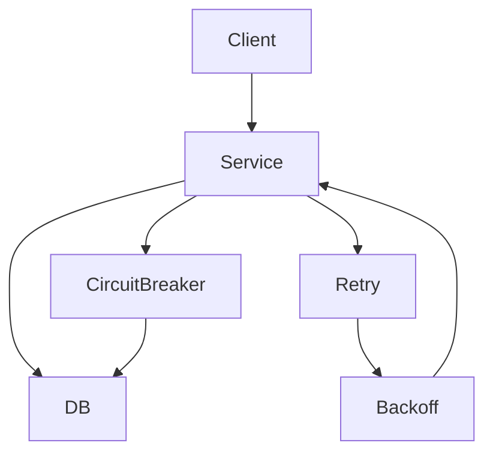

# Résilience & Chaos Engineering — Retry, Backoff, Circuit Breaker

## Objectifs pédagogiques

- Comprendre les principes de résilience système
- Implémenter des stratégies de retry et backoff
- Comprendre le pattern circuit breaker
- Tester les pannes avec le chaos engineering
- Concevoir un système tolérant aux erreurs

## Contexte et problématique

Dans un système distribué :

- les pannes sont normales
- les dépendances peuvent échouer
- les latences varient

👉 Objectif :

- ne pas crasher
- continuer à fonctionner
- se dégrader intelligemment

## Architecture

| Composant | Rôle | Exemple |
|-----------|------|---------|
| Retry | réessayer | appel API |
| Backoff | temporisation | exponential |
| Circuit Breaker | couper appels | service down |
| Chaos testing | tester pannes | failure injection |



## Commandes essentielles

```bash
aws fault-injection-simulator list-experiments
```

```bash
aws cloudwatch describe-alarms
```

## Fonctionnement interne

### Retry

- réessayer en cas d’échec

### Backoff

- attendre entre tentatives
- souvent exponentiel

### Circuit Breaker

- couper les appels si trop d’erreurs
- éviter surcharge

### Chaos Engineering

- simuler des pannes
- tester la résilience

🧠 Concept clé  
→ Les systèmes doivent être conçus pour échouer

💡 Astuce  
→ utiliser exponential backoff

⚠️ Erreur fréquente  
→ retry sans limite → surcharge  
Correction : limiter retries

## Cas réel en entreprise

Contexte :

Service dépendant API externe.

Solution :

- retry avec backoff
- circuit breaker
- fallback

Résultat :

- système stable malgré erreurs

## Bonnes pratiques

- limiter retries
- utiliser backoff exponentiel
- implémenter circuit breaker
- prévoir fallback
- tester les pannes
- monitorer erreurs
- documenter comportements

## Résumé

La résilience est essentielle en système distribué.  
Retry, backoff et circuit breaker permettent de gérer les pannes.  
Le chaos engineering valide la robustesse réelle.

---

## SNIPPETS DE RÉVISION

<!-- snippet
id: aws_resilience_definition
type: concept
tech: aws
level: advanced
importance: high
format: knowledge
tags: aws,resilience,architecture
title: Résilience définition
content: La résilience permet à un système de continuer à fonctionner malgré des pannes
description: Concept critique distribué
-->

<!-- snippet
id: aws_retry_definition
type: concept
tech: aws
level: advanced
importance: high
format: knowledge
tags: aws,retry,network
title: Retry principe
content: Le retry consiste à réessayer une opération échouée pour augmenter les chances de succès
description: Base résilience
-->

<!-- snippet
id: aws_backoff_definition
type: concept
tech: aws
level: advanced
importance: high
format: knowledge
tags: aws,backoff,retry
title: Backoff exponentiel
content: Le backoff exponentiel augmente le délai entre retries pour éviter la surcharge
description: Optimisation retry
-->

<!-- snippet
id: aws_retry_warning
type: warning
tech: aws
level: advanced
importance: high
format: knowledge
tags: aws,retry,error
title: Retry infini
content: Des retries infinis peuvent saturer le système, toujours limiter les tentatives
description: Piège critique
-->

<!-- snippet
id: aws_circuit_breaker_definition
type: concept
tech: aws
level: advanced
importance: high
format: knowledge
tags: aws,circuitbreaker,resilience
title: Circuit breaker rôle
content: Le circuit breaker coupe les appels vers un service défaillant pour éviter l'effet cascade
description: Protection système
-->

<!-- snippet
id: aws_resilience_tip
type: tip
tech: aws
level: advanced
importance: medium
format: knowledge
tags: aws,resilience,bestpractice
title: Tester les pannes
content: Tester les pannes permet de valider la robustesse réelle du système
description: Bonne pratique
-->

<!-- snippet
id: aws_resilience_error
type: warning
tech: aws
level: advanced
importance: high
format: knowledge
tags: aws,incident,system
title: Effet cascade
content: Symptôme panne généralisée, cause dépendances non protégées, correction implémenter circuit breaker
description: Incident critique
-->
