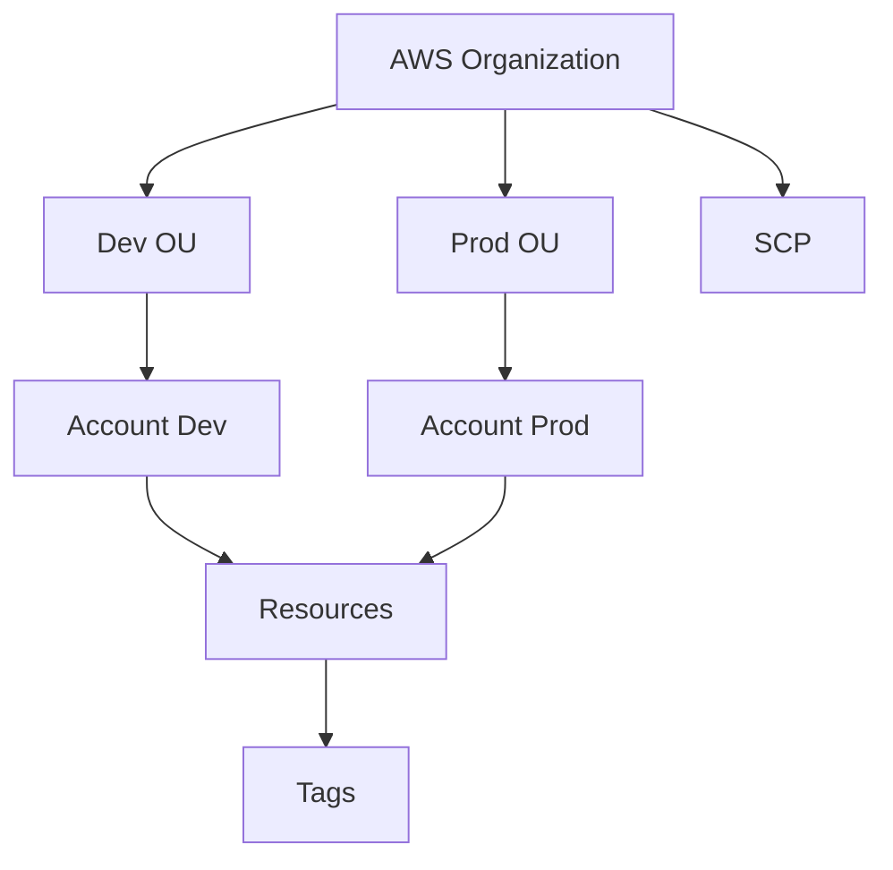

# Gouvernance AWS — Organizations, Tagging, Compliance

## Objectifs pédagogiques

- Comprendre la gouvernance dans AWS
- Structurer un environnement multi-account avec AWS Organizations
- Mettre en place une stratégie de tagging efficace
- Comprendre les exigences de conformité (RGPD, sécurité)
- Contrôler et auditer les actions à l’échelle entreprise

## Contexte et problématique

Dans une entreprise :

- Multiplication des comptes AWS
- Ressources difficiles à suivre
- Risques de dérive (sécurité, coûts)

👉 La gouvernance permet :

- contrôle global
- standardisation
- sécurité renforcée

## Architecture

| Composant | Rôle | Exemple |
|-----------|------|---------|
| AWS Organizations | gestion multi-comptes | comptes dev/prod |
| OU (Organizational Units) | regroupement comptes | business units |
| SCP (Service Control Policy) | restrictions globales | deny actions |
| Tagging | organisation ressources | project=app |
| Config / Audit | conformité | règles |



## Commandes essentielles

```bash
aws organizations list-accounts
```

```bash
aws organizations list-policies
```

```bash
aws resourcegroupstaggingapi get-resources
```

## Fonctionnement interne

### AWS Organizations

- regroupe plusieurs comptes
- gestion centralisée

### SCP (Service Control Policies)

- limite les actions autorisées
- même pour les admins

### Tagging

- clé/valeur sur ressources
- utilisé pour coût, organisation

### Compliance

- audit via AWS Config
- logs via CloudTrail

🧠 Concept clé  
→ Gouvernance = contrôle global de l’infrastructure

💡 Astuce  
→ définir une stratégie de tags dès le début

⚠️ Erreur fréquente  
→ absence de tagging  
Correction : imposer des tags obligatoires

## Cas réel en entreprise

Contexte :

Entreprise avec 50 comptes AWS.

Solution :

- AWS Organizations
- OU par équipe
- tagging standardisé
- SCP restrictives

Résultat :

- meilleure visibilité
- contrôle sécurité
- suivi coûts précis

## Bonnes pratiques

- utiliser AWS Organizations
- définir stratégie tagging
- imposer SCP
- isoler environnements
- auditer régulièrement
- centraliser logs
- documenter gouvernance

## Résumé

La gouvernance AWS permet de gérer une infrastructure à grande échelle.  
Organizations structure les comptes.  
Le tagging et les policies assurent contrôle et visibilité.  
C’est indispensable en entreprise.

---

## SNIPPETS DE RÉVISION

<!-- snippet
id: aws_governance_definition
type: concept
tech: aws
level: advanced
importance: high
format: knowledge
tags: aws,governance,organization
title: Gouvernance AWS définition
content: La gouvernance AWS définit qui peut créer quoi, où et avec quel budget, à l’échelle de toute l’organisation. Sans elle, chaque équipe invente ses propres conventions — résultat : des ressources orphelines, des coûts incontrôlés et des trous de sécurité entre comptes.
description: La gouvernance s’implémente via AWS Organizations + SCPs (ce qu’on interdit) + AWS Config (ce qu’on détecte) + budgets (ce qu’on contrôle).
-->

<!-- snippet
id: aws_organizations_definition
type: concept
tech: aws
level: advanced
importance: high
format: knowledge
tags: aws,organizations,multiaccount
title: AWS Organizations rôle
content: AWS Organizations regroupe tous les comptes sous un compte master qui centralise la facturation et applique des Service Control Policies (SCP) sur les Organizational Units. Une SCP `DenyRegion` bloquant eu-north-1 s'applique à 50 comptes en une modification.
description: Consolidated billing = une seule facture pour tous les comptes, avec les remises de volume AWS cumulées sur l'ensemble de l'organisation.
-->

<!-- snippet
id: aws_scp_definition
type: concept
tech: aws
level: advanced
importance: high
format: knowledge
tags: aws,scp,security
title: SCP rôle
content: Les Service Control Policies limitent les actions autorisées au niveau organisationnel
description: Sécurité globale
-->

<!-- snippet
id: aws_tagging_definition
type: concept
tech: aws
level: advanced
importance: high
format: knowledge
tags: aws,tagging,cost
title: Tagging rôle
content: Le tagging permet d’organiser et suivre les ressources AWS par projet, équipe ou coût
description: Gestion et FinOps
-->

<!-- snippet
id: aws_tagging_warning
type: warning
tech: aws
level: advanced
importance: high
format: knowledge
tags: aws,tagging,error
title: Pas de tagging
content: L’absence de tagging empêche le suivi des coûts et complique la gestion des ressources
description: Piège fréquent entreprise
-->

<!-- snippet
id: aws_org_command
type: command
tech: aws
level: advanced
importance: medium
format: knowledge
tags: aws,cli,organizations
title: Lister comptes AWS
command: aws organizations list-accounts
description: Permet de voir les comptes dans une organisation
-->

<!-- snippet
id: aws_governance_tip
type: tip
tech: aws
level: advanced
importance: medium
format: knowledge
tags: aws,governance,bestpractice
title: Stratégie de tags
content: Les tags ajoutés a posteriori ne couvrent jamais 100% des ressources. Définir dès le départ les tags obligatoires (ex. `env`, `project`, `owner`) et les enforcer via AWS Config rule `required-tags` garantit que toute ressource non taguée déclenche une alerte automatique.
description: Sans tag `env`, impossible de distinguer ce qui tourne en prod de ce qui tourne en dev dans la facture AWS.
-->

<!-- snippet
id: aws_governance_error
type: warning
tech: aws
level: advanced
importance: high
format: knowledge
tags: aws,incident,management
title: Perte de contrôle infra
content: Symptôme ressources non maîtrisées, cause absence gouvernance, correction mettre Organizations et tagging
description: Incident organisationnel
-->
