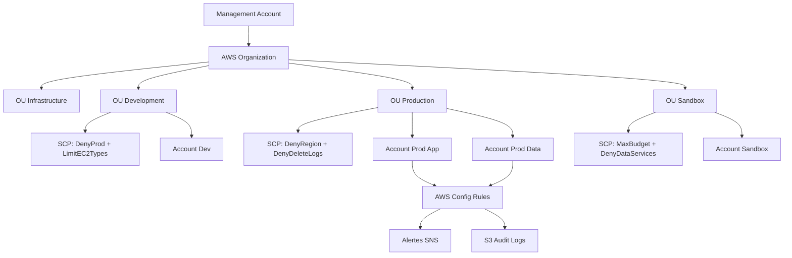

# Gouvernance AWS — Organizations, Tagging, Compliance

## Objectifs pédagogiques

À l'issue de ce module, vous serez capable de :

- Structurer un environnement multi-account avec AWS Organizations et des Organizational Units adaptées au contexte métier
- Définir et appliquer des Service Control Policies pour restreindre les actions à l'échelle de l'organisation, sans bloquer les services globaux
- Concevoir une stratégie de tagging cohérente et l'enforcer automatiquement via AWS Config
- Auditer la conformité d'une infrastructure AWS avec Config Rules et CloudTrail
- Identifier les dérives de gouvernance les plus fréquentes et piloter leur remédiation

---

## Pourquoi la gouvernance devient critique à grande échelle

Imaginez une entreprise qui démarre avec deux comptes AWS : un pour la prod, un pour le dev. Deux ans plus tard, elle en compte quarante-trois. Chaque équipe a créé les siens, avec ses propres conventions de nommage, ses propres politiques IAM, ses propres régions actives. Résultat : personne ne sait exactement ce qui tourne où, les factures sont inexplicables et un audit de sécurité révèle des buckets S3 publics dans trois comptes dont personne ne se souvient.

Ce scénario n'est pas une exagération. C'est le point d'arrivée naturel d'une organisation qui n'a pas posé les bases de gouvernance assez tôt.

La gouvernance AWS répond à trois questions fondamentales :
- **Qui peut faire quoi ?** — contrôle des permissions à l'échelle organisation
- **Sur quelles ressources, dans quel contexte ?** — isolation, tagging, régions autorisées
- **Comment détecter les dérives ?** — audit continu, alertes, conformité automatique

Ce module couvre les outils natifs AWS qui permettent d'y répondre : Organizations, SCPs, le tagging enforced et AWS Config.

---

## Architecture d'une gouvernance multi-account

Avant de rentrer dans les commandes, voici comment les composants s'articulent :

| Composant | Rôle | Ce qu'il résout |
|---|---|---|
| **AWS Organizations** | Regroupe tous les comptes sous un compte management | Facturation consolidée, point de contrôle unique |
| **Organizational Units (OU)** | Regroupe les comptes par périmètre (prod, dev, sandbox) | Application différenciée des politiques |
| **SCP (Service Control Policies)** | Plafond de permissions — ce qu'on interdit globalement | Empêche les actions risquées même pour les admins locaux |
| **Tag Policies** | Normalise les valeurs de tags à l'échelle org | Évite `env=Prod`, `env=prod`, `env=production` dans la même facture |
| **AWS Config** | Évalue en continu les ressources par rapport à des règles | Détecte les dérives de conformité |
| **CloudTrail** | Journalise toutes les API calls | Traçabilité et forensic |



💡 Le compte **management** (anciennement "master") ne doit contenir aucune charge de travail applicative. Son seul rôle est l'administration de l'organisation. C'est une règle de sécurité fondamentale : si ce compte est compromis, l'attaquant a accès à toute la structure.

---

## AWS Organizations — Structure et contrôle

### Explorer l'organisation

```bash
# Voir tous les comptes de l'organisation
aws organizations list-accounts

# Voir les OUs à la racine
aws organizations list-organizational-units-for-parent \
  --parent-id <ROOT_ID>

# Voir les comptes dans une OU spécifique
aws organizations list-accounts-for-parent \
  --parent-id <OU_ID>

# Déplacer un compte vers une autre OU
aws organizations move-account \
  --account-id <ACCOUNT_ID> \
  --source-parent-id <SOURCE_OU_ID> \
  --destination-parent-id <TARGET_OU_ID>
```

### Service Control Policies — ce que beaucoup comprennent mal

Une SCP n'accorde aucune permission. Elle définit le **plafond maximum** de ce qu'un compte peut faire. Si une SCP interdit `ec2:TerminateInstances`, même un administrateur avec `AdministratorAccess` dans ce compte ne pourra pas terminer d'instances — quelle que soit sa politique IAM locale.

```bash
# Lister les SCPs de l'organisation
aws organizations list-policies \
  --filter SERVICE_CONTROL_POLICY

# Voir le contenu d'une SCP
aws organizations describe-policy \
  --policy-id <POLICY_ID>

# Attacher une SCP à une OU
aws organizations attach-policy \
  --policy-id <POLICY_ID> \
  --target-id <OU_ID>

# Voir les SCPs effectivement applicables à un compte
aws organizations list-policies-for-target \
  --target-id <ACCOUNT_ID> \
  --filter SERVICE_CONTROL_POLICY
```

Voici une SCP qui bloque toutes les régions sauf eu-west-1 et eu-west-3 :

```json
{
  "Version": "2012-10-17",
  "Statement": [
    {
      "Sid": "DenyNonEURegions",
      "Effect": "Deny",
      "Action": "*",
      "Resource": "*",
      "Condition": {
        "StringNotEquals": {
          "aws:RequestedRegion": ["eu-west-1", "eu-west-3"]
        }
      }
    }
  ]
}
```

⚠️ Certaines actions AWS sont **globales** — IAM, Route 53, CloudFront, Support, STS — et ignorent le filtre de région. Si vous utilisez une SCP de restriction géographique sans exclure ces services explicitement via `NotAction`, vous bloquez IAM et le compte devient inaccessible. Toujours tester sur un compte sandbox avant d'appliquer à une OU de production.

---

## Tagging — De la convention à l'obligation

### Pourquoi le tagging dégénère toujours sans enforcement

Le tagging est le problème classique de la bonne intention : tout le monde est d'accord pour taguer, mais sans contrainte technique, ça ne se fait pas systématiquement. Deux ans après, vous avez `env=prod`, `env=Prod`, `env=PROD`, `env=production`, `Env=prod` — et votre Cost Explorer ressemble à un tableau impressionniste.

La solution n'est pas de faire confiance à la discipline des équipes. C'est d'enforcer les tags via AWS Config et de rendre les dérives visibles automatiquement.

### Tags stratégiques recommandés

```bash
# Tags obligatoires dans la plupart des organisations
env         = dev | staging | prod
project     = <nom-du-projet>
owner       = <équipe-ou-email>
cost-center = <code-comptable>
managed-by  = terraform | console | cli
```

### Explorer et corriger les ressources taguées

```bash
# Lister toutes les ressources avec un tag spécifique
aws resourcegroupstaggingapi get-resources \
  --tag-filters Key=env,Values=prod

# Lister les ressources sans un tag obligatoire (détection de dérive)
aws resourcegroupstaggingapi get-resources \
  --tag-filters Key=owner,Values=""

# Appliquer un tag à plusieurs ressources en une fois
aws resourcegroupstaggingapi tag-resources \
  --resource-arn-list <ARN_1> <ARN_2> \
  --tags env=prod,owner=platform-team
```

### Enforcer les tags avec AWS Config

```bash
# Vérifier que la règle required-tags est active
aws configservice describe-config-rules \
  --config-rule-names required-tags

# Voir les ressources non conformes
aws configservice get-compliance-details-by-config-rule \
  --config-rule-name required-tags \
  --compliance-types NON_COMPLIANT
```

🧠 La règle Config `required-tags` évalue les ressources nouvellement créées — elle n'agit pas rétroactivement. Pour les ressources existantes non taguées, il faut une campagne de remédiation manuelle ou un Lambda déclenché sur les alertes Config. L'enforcement à J0 évite précisément ce rattrapage.

---

## Audit et conformité avec AWS Config

AWS Config répond à la question : "Est-ce que mon infrastructure respecte les règles que j'ai définies, en ce moment ?" Il évalue en continu l'état réel des ressources et signale chaque écart.

```bash
# Voir l'état de conformité global par règle
aws configservice describe-compliance-by-config-rule

# Déclencher une évaluation manuelle
aws configservice start-config-rules-evaluation \
  --config-rule-names required-tags restricted-ssh

# Voir l'historique de configuration d'une ressource
aws configservice get-resource-config-history \
  --resource-type AWS::EC2::Instance \
  --resource-id <INSTANCE_ID>
```

Règles managées utiles pour la gouvernance :

| Règle | Ce qu'elle détecte |
|---|---|
| `required-tags` | Ressources sans les tags obligatoires |
| `restricted-ssh` | Security groups avec SSH ouvert à `0.0.0.0/0` |
| `s3-bucket-public-read-prohibited` | Buckets S3 accessibles publiquement |
| `iam-root-access-key-check` | Clés d'accès actives sur le compte root |
| `cloudtrail-enabled` | Comptes sans CloudTrail actif |

💡 AWS Config conserve l'historique de configuration de chaque ressource. Il permet de répondre à la question forensic "Comment était configurée cette instance il y a trois semaines ?" — invaluable lors d'un incident de sécurité pour reconstruire la chronologie.

---

## Cas réel : Reprise en main d'une organisation de 50 comptes

**Contexte** : Scale-up SaaS, 180 développeurs, 50 comptes AWS créés organiquement sur 4 ans. Un audit de sécurité révèle 23 buckets S3 publics, 11 comptes sans CloudTrail actif, et 40 % des ressources EC2 sans tag `owner`. La facture AWS mensuelle de 280 k€ est inexplicable par équipe.

**Démarche adoptée en 8 semaines** :

**Semaines 1-2 — Inventaire.** `organizations list-accounts` combiné à `resourcegroupstaggingapi` pour cartographier les 50 comptes et leurs ressources non conformes. Sans cette photo initiale, impossible de mesurer les progrès.

**Semaine 3 — Structure.** Création de la structure OU (Prod / Non-Prod / Sandbox / Shared Services) et déplacement progressif des comptes. Aucune SCP appliquée à ce stade pour éviter les blocages non anticipés.

**Semaine 4 — SCPs prioritaires.** Blocage des régions non autorisées + protection des logs : `Deny` sur `cloudtrail:DeleteTrail`, `cloudtrail:StopLogging` et `logs:DeleteLogGroup` sur tous les comptes non-management.

**Semaines 5-6 — AWS Config.** Déploiement d'un conformity pack via StackSets sur tous les comptes. Règles activées : `required-tags`, `s3-bucket-public-read-prohibited`, `iam-root-access-key-check`. Alertes SNS routées vers les équipes propriétaires.

**Semaines 7-8 — Remédiation.** Campagne de correction des non-conformités identifiées. Attribution claire de chaque ressource à une équipe via les alertes.

**Résultats à 3 mois :**
- 0 bucket S3 public (contre 23 au départ)
- 100 % des comptes avec CloudTrail actif
- 94 % des ressources EC2/RDS correctement taguées (contre 60 %)
- 34 k€/mois d'économies identifiées sur des ressources orphelines rendues visibles par le tagging

---

## Bonnes pratiques

**Créer la structure Organizations dès le premier compte secondaire.** Migrer des comptes existants dans Organizations fonctionne, mais c'est douloureux. Le faire dès le début coûte 30 minutes. Le faire deux ans après coûte plusieurs semaines.

**Traiter les SCPs comme du code.** Les stocker dans un repo Git, avec review obligatoire et test sur un compte sandbox avant application. Une SCP mal rédigée peut verrouiller un compte entier — et le déverrouillage nécessite une intervention depuis le compte management.

**Définir la tag policy avant de déployer quoi que ce soit.** Tags ajoutés rétroactivement : couverture jamais complète. Définir `env`, `project`, `owner`, `cost-center` et les enforcer via Config dès J0, c'est la seule façon d'avoir une visibilité financière fiable sur la durée.

**Isoler les environnements dans des comptes séparés, pas des VPCs séparés.** L'isolation par VPC est contournable par une mauvaise règle de peering ou un Security Group permissif. L'isolation par compte est une barrière physique : une credential compromise en dev ne peut structurellement pas accéder à la prod.

**Protéger les logs avec des SCPs en priorité.** `Deny` sur `cloudtrail:DeleteTrail` et `logs:DeleteLogGroup` avant même les restrictions de régions. Si un attaquant compromet un compte, il ne doit pas pouvoir effacer ses traces. C'est la SCP la plus rentable à déployer.

**Activer AWS Config en mode agrégateur.** Un Config Aggregator dans le compte management consolide la vue de conformité de l'ensemble des comptes. Sans ça, inspecter 50 comptes un par un prend des jours — et les dérives passent entre les mailles.

**Documenter chaque décision de gouvernance comme une ADR (Architecture Decision Record).** Pourquoi ces tags obligatoires et pas d'autres ? Pourquoi cette structure OU ? Sans documentation, la gouvernance devient une boîte noire que personne n'ose modifier — et qui finit par être contournée.

---

## Résumé

La gouvernance AWS n'est pas un projet ponctuel — c'est une infrastructure de contrôle qui évolue avec l'organisation. AWS Organizations structure les comptes en unités logiques et applique des SCPs comme garde-fous globaux, indépendants des politiques IAM locales. Le tagging enforced via AWS Config transforme une convention optionnelle en contrainte technique automatisée. L'audit continu avec Config et CloudTrail donne la visibilité pour détecter les dérives avant qu'elles deviennent des incidents. Plus une organisation attend pour mettre en place ces mécanismes, plus la dette de gouvernance s'accumule — et plus la remédiation est coûteuse en temps et en risque.

---

<!-- snippet
id: aws_governance_definition
type: concept
tech: aws
level: advanced
importance: high
format: knowledge
tags: aws,governance,organization
title: Gouvernance AWS — définition opérationnelle
content: La gouvernance AWS définit qui peut créer quoi, où et avec quel budget, à l'échelle de toute l'organisation. Sans elle, chaque équipe invente ses propres conventions — résultat : des ressources orphelines, des coûts incontrôlés et des trous de sécurité entre comptes. Elle s'implémente via trois couches complémentaires : Organizations + SCPs (ce qu'on interdit), AWS Config (ce qu'on détecte), et Budgets (ce qu'on contrôle financièrement).
description: Gouvernance = contrôle global via Organizations/SCPs + détection via Config + contrôle financier via Budgets.
-->

<!-- snippet
id: aws_organizations_structure
type: concept
tech: aws
level: advanced
importance: high
format: knowledge
tags: aws,organizations,multiaccount
title: AWS Organizations — structure et facturation consolidée
content: AWS Organizations regroupe tous les comptes sous un compte management qui centralise la facturation (consolidated billing) et applique des Service Control Policies sur les Organizational Units. Une SCP appliquée à une OU s'applique instantanément à tous les comptes qu'elle contient. Le compte management ne doit contenir aucune charge applicative — c'est une règle de sécurité fondamentale : sa compromission donne accès à toute la structure.
description: Consolidated billing = une seule facture pour tous les comptes, avec cumul des remises de volume AWS sur l'ensemble de l'organisation.
-->

<!-- snippet
id: aws_scp_ceiling
type: concept
tech: aws
level: advanced
importance: high
format: knowledge
tags: aws,scp,security,organizations
title: SCP — plafond de permissions, pas un grant
content: Une SCP ne donne aucune permission. Elle définit le maximum de ce qu'un compte peut faire. Si une SCP interdit ec2:TerminateInstances, même un utilisateur avec AdministratorAccess dans ce compte ne pourra pas terminer d'instances. Les SCPs s'appliquent à tous les principals du compte, y compris le compte root local — mais pas au compte management de l'organisation lui-même.
description: SCP = plafond. IAM Policy = permission effective. L'accès réel = intersection des deux. Un Deny en SCP est absolu.
-->

<!-- snippet
id: aws_scp_region_restriction
type: warning
tech: aws
level: advanced
importance: high
format: knowledge
tags: aws,scp,region,security
title: SCP restriction de régions — piège des services globaux
content: Une SCP qui bloque toutes les régions sauf eu-west-1 doit explicitement exclure les services globaux (IAM, Route 53, CloudFront, Support, STS) via NotAction. Sans cette exclusion, les appels IAM sont bloqués et le compte devient inaccessible depuis la console. Toujours tester une SCP restrictive sur un compte sandbox isolé avant de l'appliquer à une OU de production.
description: Les services globaux AWS ignorent le contexte de région — une restriction géographique sans exclusion de ces services verrouille les comptes.
-->

<!-- snippet
id: aws_org_list_accounts
type: command
tech: aws
level: advanced
importance: medium
format: knowledge
tags: aws,cli,organizations
title: Lister tous les comptes d'une organisation
command: aws organizations list-accounts
description: Retourne l'ID, le nom, l'email et le statut de chaque compte de l'organisation. Point de départ de tout inventaire multi-account.
-->

<!-- snippet
id: aws_org_list_policies
type: command
tech: aws
level: advanced
importance: medium
format: knowledge
tags: aws,cli,organizations,scp
title: Lister les SCPs d'une organisation
command: aws organizations list-policies --filter SERVICE_CONTROL_POLICY
description: Retourne toutes les Service Control Policies définies dans l'organisation, avec leur ID et leur description.
-->

<!-- snippet
id: aws_tagging_enforcement
type: concept
tech: aws
level: advanced
importance: high
format: knowledge
tags: aws,tagging,config,compliance
title: Tagging — enforcer plutôt que suggérer
content: Les tags ajoutés a posteriori ne couvrent jamais 100% des ressources. Définir dès le départ les tags obligatoires (env, project, owner, cost-center) et les enforcer via la règle AWS Config required-tags garantit que toute ressource non taguée déclenche une alerte automatique. Sans enforcement technique, la convention de tagging reste une intention, pas une réalité opérationnelle.
description: Sans tag env, impossible de distinguer ce qui tourne en prod de ce qui tourne en dev dans Cost Explorer.
-->

<!-- snippet
id: aws_tagging_warning
type: warning
tech: aws
level: advanced
importance: high
format: knowledge
tags: aws,tagging,cost,governance
title: Ressources non taguées — dette de gouvernance invisible
content: L'absence de tagging cohérent a trois conséquences directes : les coûts ne peuvent pas être attribués par équipe ou projet, les ressources orphelines passent inaperçues et continuent de facturer, les audits de sécurité ne peuvent pas identifier rapidement les propriétaires des ressources exposées. Dans une organisation de 50+ comptes, récupérer cette dette prend plusieurs semaines de travail.
description: Le tagging rétroactif ne couvre jamais 100% des ressources — enforcer dès le départ via AWS Config required-tags.
-->

<!-- snippet
id: aws_config_compliance_check
type: command
tech: aws
level: advanced
importance: high
format: knowledge
tags: aws,config,compliance,audit
title: Voir les ressources non conformes via AWS Config
command: aws configservice get-compliance-details-by-config-rule --config-rule-name <RULE_NAME> --compliance-types NON_COMPLIANT
example: aws configservice get-compliance-details-by-config-rule --config-rule-name required-tags --compliance-types NON_COMPLIANT
description: Retourne la liste des ressources qui violent une règle Config spécifique. Point d'entrée pour les campagnes de remédiation.
-->

<!-- snippet
id: aws_governance_protect_logs
type: tip
tech: aws
level: advanced
importance: high
format: knowledge
tags: aws,scp,cloudtrail,security,governance
title: Protéger les logs d'audit avec une SCP
content: Appliquer une SCP qui refuse cloudtrail:DeleteTrail, cloudtrail:StopLogging et logs:DeleteLogGroup sur tous les comptes non-management. Si un attaquant compromet un compte, il ne doit pas pouvoir effacer ses traces. Cette SCP de protection des logs est l'une des premières à déployer dans toute organisation — avant même les restrictions de régions ou de services — car elle préserve la capacité forensic en cas d'incident.
description: Une SCP Deny sur les actions de suppression de logs est la protection forensic minimale dans toute organisation AWS.
-->
