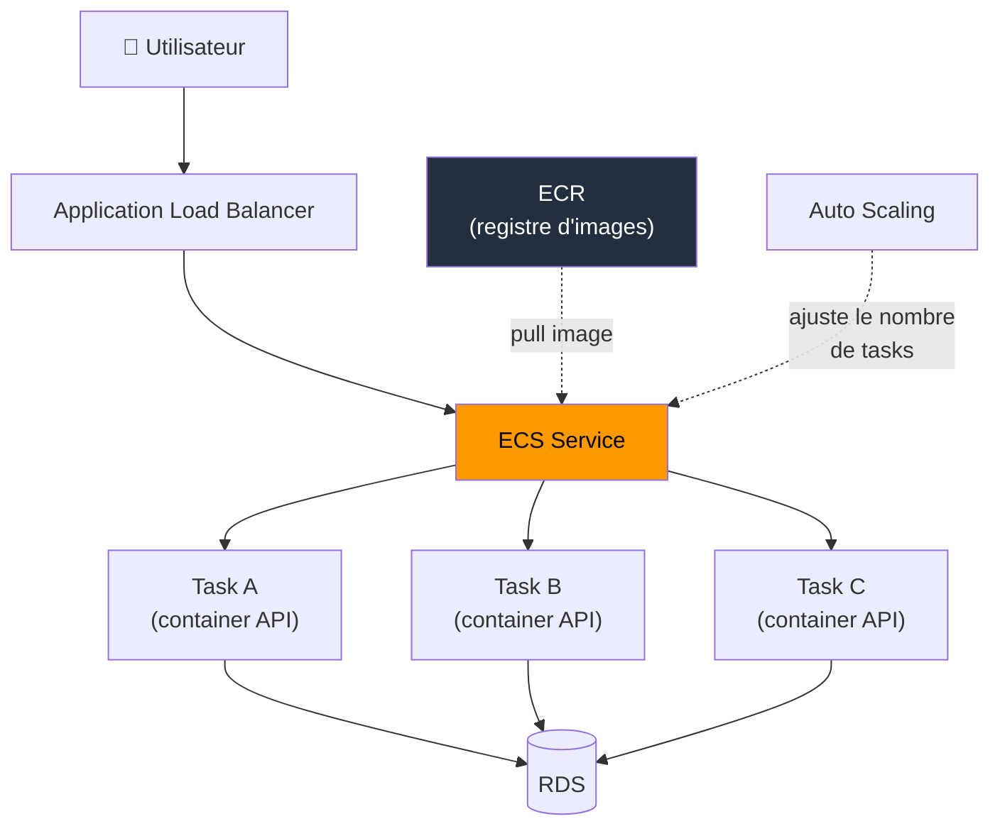

# Containers AWS — ECS, EKS, Fargate

## Objectifs pédagogiques

À l'issue de ce module, tu seras capable de :

1. **Expliquer** pourquoi les containers ont remplacé le déploiement direct sur EC2 pour la majorité des architectures modernes
2. **Distinguer** ECS, EKS et Fargate et choisir le bon service selon le contexte technique et organisationnel
3. **Décrire** l'architecture d'un service ECS (cluster, task definition, service, target group) et le flux d'une requête
4. **Déployer et inspecter** un service conteneurisé via la CLI AWS
5. **Identifier** les anti-patterns courants et les pièges de l'examen SAA-C03 sur les containers

---

## Pourquoi les containers changent la donne

Déployer une application sur EC2, c'est gérer un système d'exploitation, des dépendances, des conflits de versions, et prier pour que ce qui fonctionne en local fonctionne aussi en production. Quand trois applications partagent le même serveur et que l'une d'elles a besoin de Python 3.11 alors que l'autre ne tourne qu'en 3.8, les ennuis commencent.

Un container résout ce problème à la racine. Il empaquette l'application **avec** ses dépendances dans une image immuable. Cette image tourne de façon identique sur un laptop, dans un pipeline CI/CD, ou sur un serveur AWS — parce qu'elle embarque tout ce dont elle a besoin, isolé du reste.

Docker a popularisé cette approche. AWS y a greffé trois services d'orchestration qui répondent à des profils différents : **ECS** pour la simplicité native AWS, **EKS** pour les équipes déjà investies dans Kubernetes, et **Fargate** pour ceux qui ne veulent gérer aucun serveur.

---

## Les trois services en perspective

> **SAA-C03** — Fargate = **pas un service autonome** (launch type pour ECS/EKS). ECS control plane = gratuit. EKS = ~74 $/mois par cluster.

| Service | Ce que c'est | Qui gère les serveurs | Quand le choisir |
|---------|-------------|----------------------|-----------------|
| **ECS** (Elastic Container Service) | Orchestrateur natif AWS | Toi (mode EC2) ou AWS (mode Fargate) | Cas standard, équipe AWS-native |
| **EKS** (Elastic Kubernetes Service) | Kubernetes managé par AWS | Toi (mode EC2) ou AWS (mode Fargate) | Équipe avec compétences K8s, multi-cloud |
| **Fargate** | Moteur d'exécution serverless | AWS (zéro serveur) | S'utilise **avec** ECS ou EKS |
| **ECR** (Elastic Container Registry) | Registre d'images Docker | AWS | Stocker et distribuer tes images |

Un point qui crée beaucoup de confusion : **Fargate n'est pas un service autonome**. C'est un mode de lancement disponible dans ECS et EKS. Tu choisis ECS *puis* tu choisis si les tasks tournent sur des instances EC2 que tu gères, ou sur Fargate où AWS gère l'infrastructure.



---

## ECS — L'orchestrateur natif AWS

### Les quatre concepts fondamentaux

ECS s'articule autour de quatre objets dont la hiérarchie est stricte :

**1. Cluster** — L'enveloppe logique qui regroupe tes services. Un cluster par environnement est la convention recommandée (`api-prod`, `api-staging`). Le cluster lui-même ne contient pas de compute — il référence des capacity providers (EC2 ou Fargate).

**2. Task Definition** — Le blueprint de ton container. C'est l'équivalent d'un `docker-compose.yml` : quelle image utiliser, combien de CPU et de mémoire allouer, quelles variables d'environnement injecter, quel port exposer, quel rôle IAM attribuer. Chaque modification crée une nouvelle **révision** — les anciennes restent disponibles pour un rollback.

**3. Task** — Une instance en cours d'exécution d'une task definition. Si ta task definition décrit un container Nginx, une task est un container Nginx qui tourne réellement sur une infrastructure (EC2 ou Fargate).

**4. Service** — Le contrôleur qui maintient N tasks actives en permanence. Si tu demandes `desired_count=3` et qu'une task plante, le service en relance une automatiquement. Le service s'enregistre auprès d'un target group ALB pour recevoir du trafic.

### EC2 launch type vs Fargate launch type

C'est le choix le plus structurant, et celui qui revient le plus en examen.

**EC2 launch type** — Tu provisionnes et gères un pool d'instances EC2 dans le cluster. Les tasks sont placées sur ces instances par l'ECS scheduler. Tu as un contrôle total sur le type d'instance, le stockage local, la configuration réseau. En contrepartie, tu gères les mises à jour OS, le monitoring des instances, et le capacity planning.

**Fargate launch type** — Tu ne vois aucun serveur. Tu définis les ressources (CPU, mémoire) dans la task definition, et AWS provisionne l'infrastructure à la volée. Chaque task tourne dans son propre environnement isolé. Le coût est plus élevé par unité de compute, mais tu élimines tout le travail opérationnel lié aux instances.

| Critère | EC2 launch type | Fargate launch type |
|---------|----------------|-------------------|
| Gestion serveurs | Toi (AMI, patchs, monitoring) | AWS (aucun accès) |
| Contrôle infra | Total (type instance, stockage, GPU) | Limité (CPU/mémoire prédéfinis) |
| Coût | Moins cher à charge stable | Plus cher, mais zéro overhead ops |
| Scaling | ASG sur les instances + service scaling | Service scaling uniquement |
| GPU / accès disque local | Oui | Non |
| Cas d'usage | Workloads intensifs, GPU, coût optimisé | APIs stateless, microservices, équipes réduites |

🧠 **Règle pratique pour l'examen** : si l'énoncé mentionne "sans gérer de serveurs" ou "serverless containers" → la réponse est **Fargate**. Si l'énoncé mentionne "GPU", "accès au disque local" ou "contrôle de l'instance" → la réponse est **EC2 launch type**.

---

## EKS — Quand Kubernetes est un prérequis

EKS déploie un control plane Kubernetes managé par AWS. AWS gère l'API server, etcd, et les composants du control plane. Toi, tu gères les worker nodes (ou tu utilises Fargate pour les pods).

Le point important : **EKS ne simplifie pas Kubernetes**. Il simplifie le déploiement et la maintenance du control plane, mais tu travailles toujours avec des manifests YAML, des deployments, des services K8s, et toute la complexité opérationnelle de l'écosystème Kubernetes.

Trois raisons légitimes de choisir EKS plutôt qu'ECS :

1. **L'équipe maîtrise déjà Kubernetes** — la courbe d'apprentissage est déjà payée
2. **Multi-cloud** — les workloads doivent tourner aussi sur GCP ou Azure, Kubernetes est le dénominateur commun
3. **Écosystème K8s** — besoin de service mesh (Istio), d'opérateurs custom, ou d'outils qui n'existent que dans l'écosystème Kubernetes

⚠️ **Piège SAA-C03** : si l'énoncé ne mentionne pas Kubernetes explicitement, EKS n'est presque jamais la bonne réponse. ECS + Fargate couvre la grande majorité des cas et est plus simple à opérer.

---

## ECR — Le registre d'images

ECR est le Docker Hub privé d'AWS. Chaque image poussée est chiffrée au repos, scannée pour les vulnérabilités connues, et accessible via les rôles IAM — pas de credentials Docker à gérer.

Le flux standard en production : le pipeline CI/CD construit l'image, la pousse dans ECR, puis met à jour la task definition ECS pour pointer vers la nouvelle révision de l'image.

---

## Commandes essentielles

### Inspecter l'infrastructure existante

```bash
# Lister les clusters ECS du compte
aws ecs list-clusters

# Voir les services actifs dans un cluster
aws ecs list-services --cluster <CLUSTER_NAME>

# Détail d'un service (desired count, running count, events)
aws ecs describe-services --cluster <CLUSTER_NAME> --services <SERVICE_NAME>
```

### Inspecter les tasks

```bash
# Lister les tasks actives d'un service
aws ecs list-tasks --cluster <CLUSTER_NAME> --service-name <SERVICE_NAME>

# Détail d'une task (IP, statut, container, raison d'arrêt)
aws ecs describe-tasks --cluster <CLUSTER_NAME> --tasks <TASK_ARN>
```

### Opérations courantes

```bash
# Forcer un nouveau déploiement (pull la dernière image)
aws ecs update-service --cluster <CLUSTER_NAME> --service <SERVICE_NAME> --force-new-deployment

# Ajuster le nombre de tasks manuellement
aws ecs update-service --cluster <CLUSTER_NAME> --service <SERVICE_NAME> --desired-count <COUNT>
```

### ECR — Pousser une image

```bash
# S'authentifier auprès d'ECR
aws ecr get-login-password --region <REGION> | docker login --username AWS --password-stdin <ACCOUNT_ID>.dkr.ecr.<REGION>.amazonaws.com

# Taguer et pousser l'image
docker tag <IMAGE>:latest <ACCOUNT_ID>.dkr.ecr.<REGION>.amazonaws.com/<REPO>:latest
docker push <ACCOUNT_ID>.dkr.ecr.<REGION>.amazonaws.com/<REPO>:latest
```

---

## ECS Auto Scaling — Adapter la capacité à la charge

ECS propose deux niveaux de scaling indépendants :

**Service Auto Scaling** — Ajuste le nombre de tasks dans un service selon des métriques CloudWatch. C'est l'équivalent de l'ASG pour les containers. Trois modes disponibles : Target Tracking (maintenir CPU moyen à 60%), Step Scaling (règles conditionnelles), et Scheduled Scaling (pics prévisibles).

**Cluster Auto Scaling** (EC2 launch type uniquement) — Ajuste le nombre d'instances EC2 dans le cluster pour accueillir les tasks demandées. Utilise un Capacity Provider qui coordonne le scaling du cluster avec le scaling des services.

Avec Fargate, seul le Service Auto Scaling existe — AWS gère la capacité infrastructure automatiquement.

🧠 En examen, si l'énoncé demande "scaling automatique des containers sans gérer de serveurs", la réponse combine **ECS + Fargate + Service Auto Scaling**.

---

## Cas réel : migration d'un monolithe vers des microservices conteneurisés

**Contexte** : une plateforme SaaS B2B (30 développeurs, 150 000 utilisateurs actifs) tourne sur 6 instances EC2 derrière un ALB. Le déploiement prend 45 minutes avec 5 à 10 minutes de downtime à chaque release. Trois équipes travaillent sur le même codebase, et chaque merge crée des conflits de dépendances.

**Décision architecturale** : l'équipe choisit ECS avec Fargate — pas EKS, parce que personne dans l'équipe ne connaît Kubernetes et que l'infrastructure est 100% AWS. Le monolithe est découpé en 4 services : API publique, service de paiement, service de notification, worker de traitement asynchrone.

**Architecture mise en place** :
- 1 cluster ECS par environnement (`prod`, `staging`)
- 4 services ECS, chacun avec sa task definition et son repository ECR
- ALB avec path-based routing : `/api/*` → service API, `/payments/*` → service paiement
- Fargate launch type — zéro instance EC2 à gérer
- Service Auto Scaling sur CPU moyen (cible 60%) pour l'API et le worker
- Pipeline CodePipeline : push sur `main` → build image → push ECR → update service ECS (rolling deployment)

**Résultats après 3 mois** :
- Déploiement : de 45 minutes à **8 minutes**, zéro downtime (rolling update)
- Chaque équipe déploie son service indépendamment — de 1 release/semaine à **3-4 releases/jour**
- Coût compute : +12% par rapport aux EC2 (surcoût Fargate), mais -2 jours/mois d'ops économisés
- Incident isolation : une régression dans le service notification n'impacte plus l'API publique

L'erreur initiale de l'équipe : avoir voulu découper en 12 microservices dès le départ. Après 2 semaines de complexité réseau et de debugging distribué, ils sont revenus à 4 services — le bon niveau de granularité pour leur taille d'équipe.

---

## Bonnes pratiques

**Commencer par ECS + Fargate, pas par EKS.** EKS n'est justifié que si l'équipe maîtrise déjà Kubernetes ou si le workload doit tourner sur plusieurs clouds. Pour tout le reste, ECS + Fargate est plus simple, moins cher à opérer, et couvre 90% des besoins.

**Une task definition par service, pas par environnement.** La même task definition doit pouvoir tourner en dev, staging et prod — seules les variables d'environnement changent. Dupliquer les task definitions par environnement crée de la dérive.

**Rôle IAM par task, pas par cluster.** Chaque task definition a son propre `taskRoleArn` avec les permissions minimales nécessaires. Un rôle partagé entre tous les services du cluster est un vecteur de propagation en cas de compromission.

**Health checks ALB → container, pas juste TCP.** Le target group doit pointer vers un endpoint applicatif (`/health`) qui vérifie les dépendances critiques (base de données, cache). Un container qui répond sur le port mais dont l'application est plantée doit être détecté.

**Stocker les images dans ECR, pas sur Docker Hub.** ECR est intégré avec IAM (pas de credentials Docker à gérer), scanne les vulnérabilités automatiquement, et le pull est gratuit depuis les services AWS dans la même région.

**Limiter le nombre de microservices à la taille de l'équipe.** Deux pizzas, deux services. Un service par développeur est un anti-pattern qui noie l'équipe dans la complexité opérationnelle. Mieux vaut 4 services bien découpés que 15 mal maintenus.

**Activer les Container Insights pour le monitoring.** CloudWatch Container Insights collecte les métriques CPU, mémoire et réseau au niveau task et service. Sans ça, diagnostiquer un problème de performance dans un cluster de 30 tasks revient à chercher une aiguille dans une botte de foin.

---

## Résumé

ECS est l'orchestrateur de containers natif AWS — simple, bien intégré, suffisant pour la grande majorité des architectures. EKS apporte Kubernetes managé pour les équipes qui en ont déjà l'expertise ou qui visent le multi-cloud. Fargate n'est pas un service autonome mais un mode de lancement qui élimine la gestion des serveurs, disponible dans ECS et EKS. ECR complète le tableau comme registre d'images privé intégré avec IAM.

Le choix se fait en deux questions : "Avons-nous besoin de Kubernetes ?" (non → ECS, oui → EKS) puis "Voulons-nous gérer des serveurs ?" (non → Fargate, oui → EC2 launch type). En examen SAA-C03, "sans gérer de serveurs" pointe systématiquement vers Fargate, et l'absence de mention de Kubernetes exclut EKS.

---

<!-- snippet
id: aws_ecs_architecture_concept
type: concept
tech: aws
level: intermediate
importance: high
format: knowledge
tags: aws,ecs,containers,architecture
title: ECS — quatre composants fondamentaux
content: ECS s'articule autour de quatre objets : Cluster (enveloppe logique), Task Definition (blueprint du container — image, CPU, mémoire, IAM role), Task (instance en exécution), Service (maintient N tasks actives et s'enregistre auprès d'un ALB). Le Service relance automatiquement les tasks défaillantes.
description: La hiérarchie Cluster → Task Definition → Task → Service est la base de toute architecture ECS.
-->

<!-- snippet
id: aws_ecs_ec2_vs_fargate
type: concept
tech: aws
level: intermediate
importance: high
format: knowledge
tags: aws,ecs,fargate,ec2,serverless
title: EC2 launch type vs Fargate — critères de choix
content: EC2 launch type = contrôle total (GPU, stockage local, type d'instance), gestion serveurs à ta charge. Fargate = zéro serveur, AWS gère l'infrastructure, coût plus élevé mais zéro overhead ops. Fargate ne supporte pas les GPU ni l'accès disque local. En examen, "serverless containers" = Fargate.
description: Le choix EC2 vs Fargate détermine qui gère l'infrastructure sous les containers — toi ou AWS.
-->

<!-- snippet
id: aws_ecs_list_services
type: command
tech: aws
level: intermediate
importance: medium
format: knowledge
tags: aws,ecs,cli
title: Lister les services ECS actifs dans un cluster
command: aws ecs list-services --cluster <CLUSTER_NAME>
example: aws ecs list-services --cluster api-prod
description: Retourne les ARN de tous les services du cluster. Premier réflexe pour auditer ce qui tourne.
-->

<!-- snippet
id: aws_ecs_force_deploy
type: command
tech: aws
level: intermediate
importance: high
format: knowledge
tags: aws,ecs,cli,deploy
title: Forcer un nouveau déploiement ECS
context: Utile quand l'image ECR a été mise à jour avec le même tag (latest) et que le service doit re-pull
command: aws ecs update-service --cluster <CLUSTER_NAME> --service <SERVICE_NAME> --force-new-deployment
example: aws ecs update-service --cluster api-prod --service api-backend --force-new-deployment
description: Force le service à lancer de nouvelles tasks avec un pull frais de l'image depuis ECR, même si le tag n'a pas changé.
-->

<!-- snippet
id: aws_ecr_push_image
type: command
tech: aws
level: intermediate
importance: high
format: knowledge
tags: aws,ecr,docker,cli
title: Pousser une image Docker vers ECR
context: Nécessite Docker installé et une authentification préalable via aws ecr get-login-password
command: docker push <ACCOUNT_ID>.dkr.ecr.<REGION>.amazonaws.com/<REPO>:<TAG>
example: docker push 123456789012.dkr.ecr.eu-west-1.amazonaws.com/api-backend:latest
description: Pousse l'image taguée vers le repository ECR. L'image est chiffrée au repos et scannable pour les vulnérabilités.
-->

<!-- snippet
id: aws_eks_vs_ecs_choice
type: tip
tech: aws
level: intermediate
importance: high
format: knowledge
tags: aws,eks,ecs,architecture,decision
title: EKS vs ECS — quand choisir quoi
content: ECS pour 90% des cas : simple, intégré AWS, pas de Kubernetes à maîtriser. EKS uniquement si l'équipe connaît déjà Kubernetes, si le workload doit être multi-cloud, ou si des outils K8s spécifiques (Istio, opérateurs custom) sont nécessaires. En examen SAA, si Kubernetes n'est pas mentionné dans l'énoncé, la réponse n'est pas EKS.
description: ECS est le choix par défaut sur AWS. EKS ne se justifie que par un besoin Kubernetes explicite ou une contrainte multi-cloud.
-->

<!-- snippet
id: aws_fargate_not_standalone_warning
type: warning
tech: aws
level: intermediate
importance: high
format: knowledge
tags: aws,fargate,ecs,eks
title: Fargate n'est pas un service autonome
content: Fargate est un mode de lancement (launch type), pas un service indépendant. Il s'utilise au sein d'ECS ou d'EKS. Tu ne "déploies pas sur Fargate" — tu déploies sur ECS en choisissant Fargate comme launch type. Cette confusion est exploitée en examen.
description: Fargate = mode d'exécution serverless au sein d'ECS ou EKS, pas un service à part entière.
-->

<!-- snippet
id: aws_ecs_microservices_warning
type: warning
tech: aws
level: intermediate
importance: medium
format: knowledge
tags: aws,ecs,microservices,architecture
title: Trop de microservices tue les microservices
content: Découper un monolithe en 15 microservices pour une équipe de 8 développeurs noie l'équipe dans la complexité opérationnelle (debugging distribué, latence inter-services, configuration réseau). Règle pratique : le nombre de services ne doit pas dépasser le nombre d'équipes autonomes. Mieux vaut 4 services bien découpés que 15 mal maintenus.
description: Le nombre de microservices doit refléter la taille de l'équipe, pas la granularité du domaine métier.
-->
