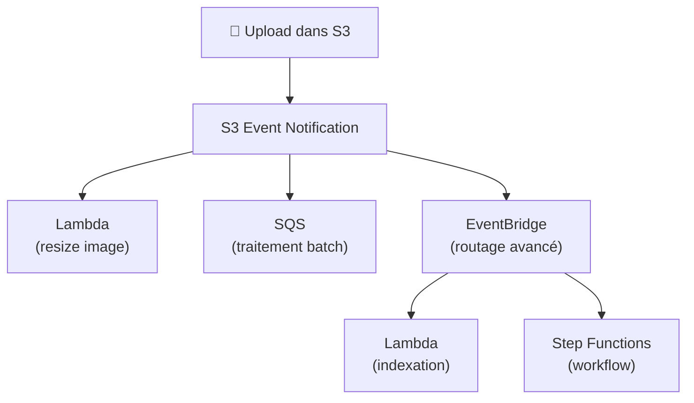

# S3 avancé — Réplication, Performance, Sécurité

## Objectifs pédagogiques

À l'issue de ce module, tu seras capable de :

1. **Configurer** la réplication S3 (CRR et SRR) et expliquer ses contraintes
2. **Optimiser** les performances d'upload et de téléchargement avec le multipart upload et Transfer Acceleration
3. **Sécuriser** l'accès aux objets avec les pre-signed URLs, CORS et MFA Delete
4. **Protéger** les données contre la suppression avec Object Lock et Glacier Vault Lock
5. **Concevoir** des architectures event-driven déclenchées par les événements S3

Ce module étend le module 04 (Stockage AWS) qui couvre les fondamentaux S3 : buckets, classes de stockage, lifecycle rules et Block Public Access.

---

## Réplication S3 — Copier les données automatiquement entre buckets

### Pourquoi répliquer ?

Tu as un bucket de production en `eu-west-1`. Tes utilisateurs en Asie constatent des latences de 400 ms sur le téléchargement d'assets. Ou bien, une réglementation t'oblige à conserver une copie des données dans une autre région. Ou encore, tu veux un backup automatique qui résiste à la perte d'une région entière.

La réplication S3 répond à ces trois cas avec le même mécanisme : chaque objet uploadé dans le bucket source est automatiquement copié dans un bucket de destination, de façon asynchrone.

### CRR vs SRR

Deux modes existent, qui se distinguent uniquement par la portée géographique :

- **CRR** (Cross-Region Replication) — Le bucket destination est dans une **autre région**. Cas d'usage : disaster recovery, réduction de latence pour les utilisateurs distants, conformité réglementaire.
- **SRR** (Same-Region Replication) — Le bucket destination est dans la **même région**. Cas d'usage : agréger des logs de plusieurs comptes dans un bucket central, conserver une copie dans un compte d'audit séparé.

### Contraintes à connaître

Plusieurs points reviennent régulièrement en examen :

- Le **versioning doit être activé** sur les deux buckets (source et destination) — la réplication ne fonctionne pas sans
- La réplication ne s'applique qu'aux **nouveaux objets** uploadés après activation — les objets existants ne sont pas répliqués (pour ça, utiliser S3 Batch Replication)
- La réplication est **unidirectionnelle** par défaut — pour une synchronisation bidirectionnelle, il faut configurer deux règles en miroir
- Les **delete markers** peuvent être répliqués (option à activer explicitement), mais les **suppressions permanentes de versions** ne le sont jamais — c'est une protection contre la suppression malveillante

```bash
# Voir la configuration de réplication d'un bucket
aws s3api get-bucket-replication --bucket <BUCKET_NAME>
```

---

## S3 Event Notifications — Déclencher des actions sur les uploads

S3 peut publier un événement chaque fois qu'un objet est créé, supprimé ou restauré depuis Glacier. Ces événements déclenchent automatiquement un service cible.

Les destinations possibles sont :
- **Lambda** — traitement à la volée (redimensionnement d'image, extraction de métadonnées)
- **SQS** — mise en file pour traitement asynchrone
- **SNS** — diffusion vers plusieurs abonnés
- **EventBridge** — routage avancé avec filtrage sur le contenu de l'événement



💡 **EventBridge est la destination la plus flexible** : elle permet de filtrer les événements par préfixe, suffixe, taille d'objet et métadonnées — ce que les destinations directes (Lambda, SQS, SNS) ne permettent pas nativement. Si l'énoncé mentionne "filtrage avancé" ou "routing conditionnel", EventBridge est la réponse.

⚠️ **Piège classique** : les Event Notifications nécessitent que le bucket ait une **resource policy** autorisant S3 à publier vers la destination. Sans cette policy, les événements sont silencieusement perdus — pas d'erreur, pas de log.

---

## Performance S3 — Quand les uploads et downloads deviennent un goulot

### Multipart Upload

Pour les fichiers volumineux, S3 permet de découper l'upload en plusieurs parties transmises en parallèle. Si une partie échoue, seule cette partie est réenvoyée — pas le fichier entier.

- **Recommandé** à partir de 100 Mo
- **Obligatoire** au-delà de 5 Go (limite de la requête PUT simple)
- Les parties sont assemblées côté S3 après réception complète

```bash
# Lister les multipart uploads en cours (utile pour nettoyer les uploads abandonnés)
aws s3api list-multipart-uploads --bucket <BUCKET_NAME>
```

🧠 Les uploads multipart abandonnés (une partie échoue, le développeur ne finalise pas) continuent d'occuper de l'espace et de facturer. Une **lifecycle rule** avec `AbortIncompleteMultipartUpload` après 7 jours nettoie automatiquement ces fragments.

### S3 Transfer Acceleration

Transfer Acceleration utilise les edge locations CloudFront pour accélérer les uploads longue distance. Le fichier est d'abord reçu par l'edge location la plus proche de l'utilisateur, puis transféré vers le bucket via le backbone réseau AWS — optimisé et privé.

Le gain est significatif pour les uploads intercontinentaux : un fichier envoyé depuis Sydney vers un bucket en `eu-west-1` peut gagner 50 à 80% de vitesse.

L'URL change : `mybucket.s3-accelerate.amazonaws.com` au lieu de `mybucket.s3.amazonaws.com`.

### Byte-Range Fetches

Pour le téléchargement, S3 supporte les requêtes par plage d'octets (byte-range fetches). Cela permet de :
- Paralléliser le download en demandant plusieurs parties simultanément
- Récupérer uniquement les N premiers octets d'un fichier (ex : lire le header d'un fichier Parquet sans télécharger le fichier entier)

### Performance de base

S3 offre nativement **3 500 PUT/COPY/POST/DELETE** et **5 500 GET/HEAD** requêtes par seconde **par préfixe**. Distribuer les objets sur plusieurs préfixes permet de multiplier ce débit. Un bucket avec les préfixes `/images/`, `/videos/`, `/logs/` dispose de 3 × 3 500 = 10 500 PUT/s au total.

---

## Pre-signed URLs — Accès temporaire sans rendre le bucket public

Une pre-signed URL est un lien signé qui donne un accès temporaire à un objet S3 privé. Le bucket reste privé, mais quiconque possède l'URL peut télécharger (ou uploader) l'objet pendant la durée de validité.

Cas d'usage concret : ton application génère un lien de téléchargement pour une facture PDF. Le lien expire après 15 minutes. Pas besoin de proxy applicatif, pas besoin de rendre le bucket public.

```bash
# Générer une pre-signed URL valide 1 heure (3600 secondes)
aws s3 presign s3://<BUCKET_NAME>/<KEY> --expires-in 3600
```

L'URL contient la signature, l'expiration et l'identité du signataire. Une fois expirée, elle retourne une erreur `AccessDenied`.

⚠️ La durée maximale dépend du type de credentials utilisé pour signer : 7 jours avec des clés IAM statiques, 36 heures avec STS (rôle assumé), ou la durée de session avec un utilisateur fédéré.

---

## S3 CORS — Autoriser les requêtes cross-origin

Quand un site web hébergé sur `www.monsite.com` tente de charger une image depuis un bucket S3 (`assets.monsite.com`), le navigateur bloque la requête par défaut — c'est le mécanisme CORS (Cross-Origin Resource Sharing).

Pour autoriser ce flux, tu dois configurer une politique CORS sur le bucket S3 qui liste les origines autorisées :

```json
{
  "CORSRules": [
    {
      "AllowedOrigins": ["https://www.monsite.com"],
      "AllowedMethods": ["GET"],
      "AllowedHeaders": ["*"],
      "MaxAgeSeconds": 3600
    }
  ]
}
```

💡 En examen, si un énoncé décrit un site web qui ne parvient pas à charger des assets depuis un bucket S3, la réponse est presque toujours CORS.

---

## MFA Delete — Protection contre la suppression accidentelle

MFA Delete ajoute une couche de protection sur les opérations de suppression permanente dans un bucket versionné. Quand activé, deux actions nécessitent un code MFA :
- Supprimer définitivement une version d'objet
- Désactiver le versioning sur le bucket

Seul le **compte root** peut activer ou désactiver MFA Delete — pas un utilisateur IAM, même avec `AdministratorAccess`. C'est une contrainte de sécurité volontaire.

---

## Object Lock et Glacier Vault Lock — Immutabilité des données

### S3 Object Lock

Object Lock empêche la suppression ou la modification d'un objet pendant une durée définie. Deux modes :

- **Governance mode** — Les utilisateurs avec des permissions spécifiques (`s3:BypassGovernanceRetention`) peuvent contourner le verrouillage. Utile pour les tests.
- **Compliance mode** — **Personne** ne peut supprimer l'objet pendant la période de rétention, pas même le compte root. Irréversible une fois activé.

### Glacier Vault Lock

Même principe appliqué à un vault Glacier entier. Une fois la policy verrouillée, elle ne peut plus être modifiée ni supprimée — même par le compte root. Conçu spécifiquement pour les exigences réglementaires de rétention longue durée (WORM — Write Once Read Many).

🧠 En examen, "conformité réglementaire" + "données ne devant jamais être supprimées" → **Compliance mode** ou **Glacier Vault Lock** selon le contexte.

---

## Autres fonctionnalités S3 à connaître pour l'examen

### S3 Access Points

Les Access Points simplifient la gestion des accès sur les buckets partagés. Plutôt que d'écrire une bucket policy monstre avec 50 conditions, tu crées un Access Point par cas d'usage (un pour l'équipe data, un pour l'application, un pour l'audit) — chacun avec sa propre policy et son propre endpoint DNS.

### S3 Object Lambda

Object Lambda permet de transformer un objet **au moment de sa lecture**, sans modifier l'objet original. Une fonction Lambda s'exécute entre la requête GET et la réponse. Cas d'usage : redimensionner une image à la volée, redacter des données personnelles avant de les servir, convertir un format.

### S3 Storage Lens

Dashboard de métriques S3 au niveau organisation, compte ou bucket. Identifie les buckets sans lifecycle rules, les classes de stockage sous-optimales, et les patterns d'accès. Utile pour le FinOps S3 à grande échelle.

### S3 Batch Operations

Permet d'exécuter des opérations en masse sur des milliards d'objets : copier, tagger, restaurer depuis Glacier, invoquer une Lambda par objet. S3 génère un rapport de résultat pour chaque job.

### S3 Requester Pays

Le propriétaire du bucket ne paie que le stockage. Les requêtes et le transfert de données sont facturés au compte qui effectue la requête. Utile pour les datasets publics volumineux.

---

## Cas réel : plateforme de gestion documentaire pour un cabinet d'avocats

**Contexte** : un cabinet de 200 avocats stocke 2 millions de documents juridiques sur S3 (contrats, pièces de procédure, factures). Trois problèmes identifiés : les documents originaux doivent être conservés intacts pendant 10 ans (obligation légale), les avocats travaillant depuis l'étranger constatent des temps de téléchargement de 8 secondes sur les gros dossiers, et un stagiaire a accidentellement supprimé un dossier de 4 000 fichiers le mois précédent.

**Solution mise en place** :

1. **Object Lock en Compliance mode** avec rétention de 10 ans sur les documents originaux — plus personne ne peut les supprimer, même accidentellement
2. **CRR** vers un bucket en `us-east-1` pour les avocats basés en Amérique du Nord — latence de téléchargement divisée par 3
3. **Transfer Acceleration** activé pour les uploads depuis l'étranger — gain de 60% sur les envois de dossiers volumineux depuis l'Asie
4. **MFA Delete** activé sur le bucket principal — la suppression permanente de versions nécessite un code du compte root
5. **Pre-signed URLs** pour le partage de documents avec les clients — liens valides 24 heures, pas de bucket public
6. **S3 Event Notifications → Lambda** pour indexer automatiquement chaque nouveau document dans une base Elasticsearch

**Résultats après 2 mois** :
- Zéro suppression accidentelle depuis la mise en place d'Object Lock et MFA Delete
- Temps de téléchargement pour les avocats US : de 8 s à 2,4 s (CRR)
- Upload depuis l'Asie : de 45 s à 18 s pour un dossier de 200 Mo (Transfer Acceleration)
- Audit de conformité passé sans réserve grâce à la traçabilité Object Lock + CloudTrail

---

## Bonnes pratiques

**Activer le versioning avant la réplication.** CRR et SRR exigent le versioning sur source et destination. L'activer après coup ne réplique pas les objets existants — il faut S3 Batch Replication pour le rattrapage.

**Nettoyer les multipart uploads abandonnés.** Une lifecycle rule `AbortIncompleteMultipartUpload` après 7 jours évite l'accumulation silencieuse de fragments qui facturent sans servir à rien.

**Utiliser Transfer Acceleration uniquement pour les uploads longue distance.** Le surcoût est de ~0,04 $/Go. Pour des uploads depuis la même région que le bucket, il n'apporte aucun gain.

**Préférer EventBridge aux destinations directes pour les Event Notifications.** EventBridge offre le filtrage avancé, le replay d'événements, et la possibilité de router vers 20+ types de cibles. Les notifications directes (Lambda, SQS, SNS) sont plus simples mais moins flexibles.

**Object Lock Compliance mode est irréversible.** Une fois activé, tu ne peux pas raccourcir la période de rétention ni supprimer l'objet, même depuis le compte root. Tester en Governance mode d'abord.

**Distribuer les objets sur plusieurs préfixes pour maximiser le débit.** Un préfixe unique (`/data/`) atteint 3 500 PUT/s. Quatre préfixes (`/data/a/`, `/data/b/`, `/data/c/`, `/data/d/`) atteignent 14 000 PUT/s.

---

## Résumé

S3 avancé couvre les mécanismes qui distinguent une utilisation basique d'une architecture S3 de production. La réplication (CRR/SRR) apporte la résilience géographique et la réduction de latence. Le multipart upload et Transfer Acceleration résolvent les problèmes de performance sur les fichiers volumineux. Pre-signed URLs, CORS et MFA Delete sécurisent l'accès sans compromettre la simplicité. Object Lock et Glacier Vault Lock garantissent l'immutabilité pour la conformité réglementaire. Et les Event Notifications transforment S3 en source d'événements pour des architectures réactives.

Pour l'examen SAA-C03, les points qui reviennent le plus souvent : réplication + versioning obligatoire, pre-signed URLs pour l'accès temporaire, Object Lock Compliance pour la conformité, et EventBridge pour le routage avancé d'événements S3.

---

<!-- snippet
id: aws_s3_crr_replication_concept
type: concept
tech: aws
level: intermediate
importance: high
format: knowledge
tags: aws,s3,replication,crr,srr,dr
title: CRR vs SRR — réplication S3 cross-region et same-region
content: CRR réplique les objets vers un bucket dans une autre région (DR, latence). SRR réplique dans la même région (agrégation logs, copie audit). Les deux exigent le versioning activé sur source et destination. Seuls les nouveaux objets sont répliqués — utiliser S3 Batch Replication pour l'existant. Les suppressions permanentes de versions ne sont jamais répliquées.
description: CRR pour la résilience géographique, SRR pour l'agrégation. Versioning obligatoire, réplication unidirectionnelle par défaut.
-->

<!-- snippet
id: aws_s3_event_notifications
type: concept
tech: aws
level: intermediate
importance: high
format: knowledge
tags: aws,s3,events,lambda,eventbridge
title: S3 Event Notifications — déclencher des actions sur les uploads
content: S3 publie des événements (ObjectCreated, ObjectRemoved, RestoreCompleted) vers Lambda, SQS, SNS ou EventBridge. EventBridge est la destination la plus flexible (filtrage par préfixe, suffixe, taille, métadonnées). Attention : la resource policy de la destination doit autoriser S3 à y écrire, sinon les événements sont perdus silencieusement.
description: EventBridge est la destination recommandée pour le routage avancé d'événements S3.
-->

<!-- snippet
id: aws_s3_presign_url
type: command
tech: aws
level: intermediate
importance: high
format: knowledge
tags: aws,s3,presigned,security
title: Générer une pre-signed URL S3
context: Permet de donner un accès temporaire à un objet privé sans modifier les permissions du bucket
command: aws s3 presign s3://<BUCKET_NAME>/<KEY> --expires-in <SECONDS>
example: aws s3 presign s3://mon-bucket-prod/factures/2024-001.pdf --expires-in 3600
description: Génère un lien signé valide pour la durée spécifiée. Le bucket reste privé, seule l'URL donne accès.
-->

<!-- snippet
id: aws_s3_multipart_cleanup
type: tip
tech: aws
level: intermediate
importance: high
format: knowledge
tags: aws,s3,multipart,lifecycle,cost
title: Nettoyer les multipart uploads abandonnés avec une lifecycle rule
content: Les uploads multipart abandonnés (une partie échoue, jamais finalisé) restent stockés et facturés indéfiniment. Une lifecycle rule avec AbortIncompleteMultipartUpload après 7 jours nettoie automatiquement ces fragments. Sans cette règle, des gigaoctets fantômes peuvent s'accumuler sur la facture.
description: Lifecycle rule obligatoire sur tout bucket actif — les fragments multipart orphelins facturent en silence.
-->

<!-- snippet
id: aws_s3_transfer_acceleration
type: concept
tech: aws
level: intermediate
importance: medium
format: knowledge
tags: aws,s3,performance,transfer
title: S3 Transfer Acceleration — uploads rapides longue distance
content: Transfer Acceleration route les uploads via l'edge location CloudFront la plus proche, puis utilise le backbone AWS privé vers le bucket. Gain de 50-80% sur les uploads intercontinentaux. URL spécifique : mybucket.s3-accelerate.amazonaws.com. Surcoût ~0.04$/Go — inutile pour les uploads depuis la même région.
description: Accélère les uploads longue distance via les edge locations CloudFront. Inutile en intra-région.
-->

<!-- snippet
id: aws_s3_object_lock_compliance
type: concept
tech: aws
level: intermediate
importance: high
format: knowledge
tags: aws,s3,objectlock,compliance,worm
title: Object Lock Compliance mode — immutabilité irréversible
content: Object Lock Compliance mode empêche toute suppression ou modification pendant la période de rétention, même par le compte root. Irréversible une fois activé — la période ne peut pas être raccourcie. Governance mode permet un contournement avec la permission s3:BypassGovernanceRetention. En examen, "conformité réglementaire" + "ne jamais supprimer" = Compliance mode.
description: Compliance mode = protection absolue. Tester en Governance mode d'abord, Compliance mode est irréversible.
-->

<!-- snippet
id: aws_s3_cors_fix
type: tip
tech: aws
level: intermediate
importance: medium
format: knowledge
tags: aws,s3,cors,web,troubleshooting
title: CORS — quand un site web ne peut pas charger des assets S3
content: Si un site web sur un domaine A tente de charger des fichiers depuis un bucket S3 sur un domaine B, le navigateur bloque la requête par défaut (politique same-origin). La solution est une configuration CORS sur le bucket qui autorise le domaine A. En examen, "site web ne charge pas les images depuis S3" = CORS.
description: CORS est la cause n1 quand un site web ne parvient pas à charger des assets depuis un bucket S3.
-->

<!-- snippet
id: aws_s3_mfa_delete_warning
type: warning
tech: aws
level: intermediate
importance: high
format: knowledge
tags: aws,s3,mfa,security
title: MFA Delete — seul le compte root peut l'activer
content: MFA Delete protège contre la suppression permanente de versions et la désactivation du versioning. Mais seul le compte root peut activer ou désactiver MFA Delete — pas un utilisateur IAM, même admin. Ce point revient régulièrement en examen comme piège.
description: MFA Delete = activation par root uniquement. Protection contre la suppression accidentelle de versions.
-->
