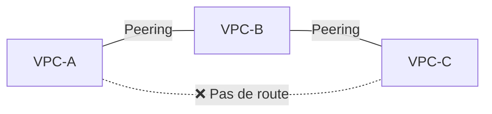
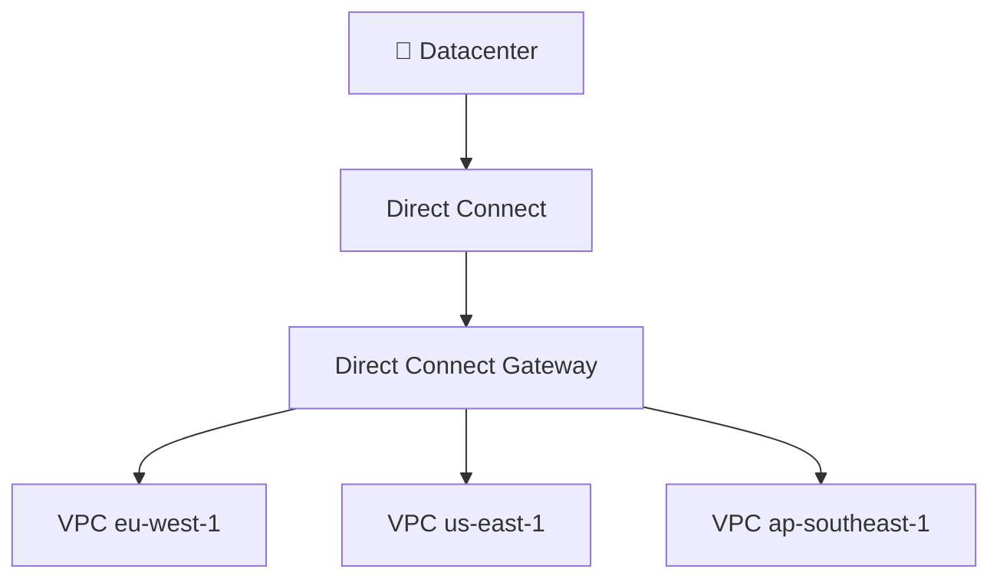
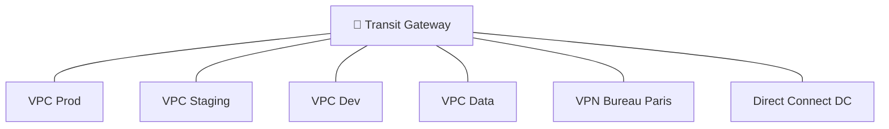

# VPC avancé — Peering, VPN, Direct Connect, Transit Gateway

## Objectifs pédagogiques

À l'issue de ce module, tu seras capable de :

1. **Concevoir** une architecture multi-VPC avec VPC Peering ou Transit Gateway selon le nombre de VPC et les contraintes de transitivité
2. **Choisir** entre Site-to-Site VPN et Direct Connect pour connecter un datacenter on-premise à AWS en fonction du budget, de la latence et du délai de mise en service
3. **Analyser** le trafic réseau avec VPC Flow Logs et Traffic Mirroring pour diagnostiquer des problèmes de connectivité ou de sécurité
4. **Configurer** le support IPv6 dans un VPC et comprendre le rôle de l'Egress-only Internet Gateway
5. **Estimer** les coûts réseau AWS (inter-AZ, inter-région, sortie Internet) pour optimiser le placement des ressources

Ce module étend le module 05 (VPC) qui couvre les fondamentaux : création de VPC, subnets publics et privés, Internet Gateway, NAT Gateway, route tables et Security Groups. Ici, on aborde les mécanismes de connectivité avancés qui permettent de relier plusieurs VPC entre eux, de connecter AWS au datacenter de l'entreprise, et de sécuriser le trafic à grande échelle.

---

## VPC Peering — Connecter deux VPC directement

### Le problème que ça résout

Tu as deux VPC : un pour la production (`10.0.0.0/16`) et un pour le staging (`10.1.0.0/16`). L'équipe QA a besoin que le staging accède à la base de données de production en lecture seule pour les tests de migration. Passer par Internet est exclu — trop lent, pas sécurisé. Le VPC Peering crée un lien privé entre les deux VPC, comme si les deux réseaux étaient connectés par un câble direct.

### Comment ça fonctionne

Une connexion VPC Peering établit un lien réseau entre deux VPC en utilisant l'infrastructure interne d'AWS. Le trafic ne sort jamais d'AWS, ne traverse pas Internet, et utilise les adresses IP privées des instances. La connexion peut relier deux VPC dans le même compte, dans des comptes différents (cross-account), ou même dans des régions différentes (cross-region).

Après avoir créé le peering, tu dois mettre à jour les route tables des deux côtés : dans chaque VPC, une route doit pointer le CIDR de l'autre VPC vers la connexion de peering. Sans cette mise à jour manuelle des routes, le peering existe mais aucun trafic ne passe.

```bash
# Créer une connexion de peering entre deux VPC
aws ec2 create-vpc-peering-connection --vpc-id <VPC_ID_1> --peer-vpc-id <VPC_ID_2> --peer-region <REGION>
```

### La règle de non-transitivité

C'est le point le plus important et le plus testé en examen. Si VPC-A est peeré avec VPC-B, et VPC-B est peeré avec VPC-C, alors **VPC-A ne peut PAS communiquer avec VPC-C** via VPC-B. Le peering n'est pas transitif. Pour que A parle à C, il faut un peering direct entre A et C.

Avec 3 VPC, ça donne 3 connexions de peering. Avec 10 VPC, ça monte à 45 connexions. Avec 50 VPC, c'est 1 225 connexions — ingérable. C'est exactement le problème que Transit Gateway résout.



⚠️ **Les CIDR ne doivent pas se chevaucher.** Si VPC-A utilise `10.0.0.0/16` et VPC-B utilise aussi `10.0.0.0/16`, le peering est impossible. Planifier les plages d'adresses IP dès le départ est crucial dans une architecture multi-VPC.

🧠 **Point examen** : si un énoncé décrit "plusieurs VPC qui doivent tous communiquer entre eux" et propose VPC Peering vs Transit Gateway, le nombre de VPC est le critère décisif. 2-3 VPC → peering acceptable. 5+ VPC → Transit Gateway.

---

## VPC Flow Logs — Voir tout le trafic réseau

### Ce que ça capture

VPC Flow Logs enregistre les métadonnées de chaque flux réseau entrant et sortant dans ton VPC. Chaque entrée contient : IP source, IP destination, port source, port destination, protocole, nombre de paquets, nombre d'octets, et surtout le verdict — **ACCEPT** ou **REJECT**.

Les Flow Logs peuvent être attachés à trois niveaux : un VPC entier, un subnet spécifique, ou une ENI (Elastic Network Interface) individuelle. Plus le niveau est granulaire, plus le volume de logs est réduit.

Les logs sont stockés dans CloudWatch Logs ou dans un bucket S3. Le choix du stockage détermine comment tu analyseras les données ensuite.

```bash
# Créer des Flow Logs sur un VPC entier, stockés dans S3
aws ec2 create-flow-logs --resource-type VPC --resource-ids <VPC_ID> --traffic-type ALL --log-destination-type s3 --log-destination arn:aws:s3:::<BUCKET_NAME>/flow-logs/
```

### Analyse avec Athena

Quand les Flow Logs sont stockés dans S3, Athena permet de les interroger en SQL sans provisioner de serveur. C'est la méthode recommandée pour analyser de gros volumes de logs réseau.

Par exemple, pour identifier les IP qui génèrent le plus de trafic rejeté :

```sql
SELECT srcaddr, COUNT(*) as reject_count
FROM vpc_flow_logs
WHERE action = 'REJECT'
GROUP BY srcaddr
ORDER BY reject_count DESC
LIMIT 10;
```

💡 **Les Flow Logs ne capturent pas le contenu des paquets** — uniquement les métadonnées (IP, ports, protocole, verdict). Pour inspecter le contenu, il faut Traffic Mirroring. Les Flow Logs ne capturent pas non plus le trafic DNS vers le résolveur Amazon, ni le trafic DHCP, ni le trafic vers l'adresse de métadonnées `169.254.169.254`.

---

## Site-to-Site VPN — Connecter ton datacenter à AWS par Internet

### Pourquoi un VPN ?

Ton entreprise a un datacenter avec des serveurs applicatifs et des bases de données. Tu migres progressivement vers AWS, mais pendant la transition, les applications sur AWS doivent communiquer avec les serveurs restés on-premise. Le Site-to-Site VPN crée un tunnel chiffré entre ton datacenter et ton VPC via Internet.

### Les composants

Trois pièces s'assemblent pour établir la connexion :

| Composant | Côté | Rôle |
|-----------|------|------|
| **Virtual Private Gateway (VGW)** | AWS | Point d'entrée VPN côté AWS, attaché à un VPC |
| **Customer Gateway (CGW)** | On-premise | Représentation dans AWS de ton routeur physique |
| **Connexion VPN** | Entre les deux | Deux tunnels IPsec chiffrés (redondance automatique) |

Le VPN utilise Internet comme transport, ce qui signifie que la latence et la bande passante dépendent de la qualité de ta connexion Internet. Le débit est plafonné à environ **1,25 Gbps** par tunnel VPN.

```bash
# Créer un Customer Gateway (ton routeur on-premise)
aws ec2 create-customer-gateway --type ipsec.1 --public-ip <ON_PREMISE_PUBLIC_IP> --bgp-asn <BGP_ASN>
```

🧠 **Point examen** : le Site-to-Site VPN se met en place en quelques minutes (configuration logicielle). Direct Connect nécessite des semaines à des mois. Si l'énoncé mentionne "besoin urgent", "rapidement", ou "solution temporaire en attendant Direct Connect" → VPN.

---

## Direct Connect — Une ligne dédiée entre ton datacenter et AWS

### Le problème du VPN

Le VPN passe par Internet. Même chiffré, le trafic subit la latence et les variations de débit d'Internet. Pour une entreprise qui transfère des téraoctets de données par jour entre son datacenter et AWS, ou qui exécute des applications temps réel sensibles à la latence (trading, vidéo, VoIP), Internet n'est pas assez fiable.

### Comment fonctionne Direct Connect

Direct Connect est une connexion réseau physique et dédiée entre ton datacenter (ou ton colocation) et un point de présence AWS (Direct Connect location). Le trafic ne passe **jamais** par Internet — il emprunte un câble physique privé.

Deux modes de connexion existent :

| Type | Bande passante | Délai de mise en service | Coût |
|------|---------------|--------------------------|------|
| **Dedicated** | 1 Gbps, 10 Gbps, 100 Gbps | 4 à 12 semaines | Élevé (port dédié) |
| **Hosted** | 50 Mbps à 10 Gbps | 1 à 4 semaines | Modéré (via partenaire) |

Le délai de mise en service ("lead time") est un point fondamental. Commander un Direct Connect dédié prend facilement un mois et demi. C'est pour cette raison que beaucoup d'entreprises commencent par un VPN (opérationnel en quelques minutes), puis basculent vers Direct Connect quand la ligne est prête.

### Direct Connect Gateway

Un Direct Connect classique connecte ton datacenter à un seul VPC dans une seule région. Mais si tu as des VPC dans 5 régions, tu ne veux pas tirer 5 lignes physiques. Le **Direct Connect Gateway** résout ce problème : il agit comme un point de distribution qui relie une seule connexion Direct Connect à plusieurs VPC dans différentes régions.



⚠️ **Direct Connect n'est PAS chiffré par défaut.** Le trafic est privé (il ne traverse pas Internet), mais il n'est pas chiffré. Pour ajouter le chiffrement, tu peux établir un VPN par-dessus le Direct Connect — tu obtiens alors le meilleur des deux mondes : bande passante dédiée + chiffrement IPsec.

💡 **Résilience** : un seul Direct Connect est un single point of failure. Pour la haute disponibilité, AWS recommande deux connexions Direct Connect dans deux Direct Connect locations différentes. Pour l'examen, si l'énoncé mentionne "résilience maximale" + "Direct Connect", la réponse est deux connexions dans deux emplacements distincts.

---

## Transit Gateway — Le routeur central de ton architecture AWS

### Pourquoi Transit Gateway existe

Imagine une entreprise avec 15 VPC (un par équipe), 3 connexions VPN vers des bureaux régionaux, et un Direct Connect vers le datacenter principal. Avec du VPC Peering, il faudrait plus de 100 connexions pour que tout le monde communique avec tout le monde. Chaque nouvelle équipe qui crée un VPC nécessite de reconfigurer tous les peerings existants. C'est un cauchemar opérationnel.

Transit Gateway (TGW) agit comme un **hub central** auquel chaque VPC et chaque connexion (VPN, Direct Connect) se connecte. Au lieu d'un maillage N-to-N, tu obtiens une topologie **hub-and-spoke** — chaque spoke n'a qu'une seule connexion vers le hub.



### Fonctionnalités clés

Transit Gateway supporte le **peering inter-région** : tu peux connecter un TGW en `eu-west-1` à un TGW en `us-east-1`, créant ainsi un réseau global privé. Le trafic entre les deux TGW reste sur le backbone AWS.

Les **route tables du TGW** permettent un contrôle fin : tu peux décider que le VPC Dev communique avec le VPC Staging mais pas avec le VPC Prod. C'est de la segmentation réseau à grande échelle, gérée depuis un seul point.

Transit Gateway supporte aussi le **multicast** — un cas d'usage rare mais qui revient parfois en examen pour des scénarios de diffusion vidéo ou de mise à jour de caches distribués.

🧠 **Point examen** : dès que l'énoncé mentionne "simplifier la connectivité entre de nombreux VPC", "hub central", "réduire la complexité réseau" ou "architecture hub-and-spoke" → Transit Gateway.

---

## Bastion Hosts vs SSM Session Manager

### Le problème d'accès

Tes instances EC2 sont dans un subnet privé — elles n'ont pas d'IP publique et ne sont pas accessibles depuis Internet. C'est voulu pour la sécurité. Mais quand un administrateur doit s'y connecter en SSH pour du debugging, il lui faut un chemin d'accès.

### Bastion Host (méthode traditionnelle)

Un bastion host (ou jump box) est une instance EC2 placée dans un subnet public. L'administrateur se connecte en SSH au bastion, puis rebondit en SSH vers l'instance privée. Le Security Group de l'instance privée n'autorise le SSH que depuis l'IP du bastion.

Le problème : le bastion est un point d'entrée exposé sur Internet. Il faut le patcher, le surveiller, le durcir. Et il coûte de l'argent même quand personne ne l'utilise.

### SSM Session Manager (méthode moderne)

AWS Systems Manager Session Manager permet de se connecter à une instance privée **sans ouvrir le port 22, sans IP publique, sans bastion**. L'agent SSM installé sur l'instance maintient une connexion sortante vers le service SSM. L'administrateur ouvre une session depuis la console AWS ou le CLI.

Avantages : pas de port SSH ouvert, pas de gestion de clés SSH, audit complet de chaque session dans CloudTrail, possibilité de logger chaque commande tapée dans S3 ou CloudWatch Logs.

```bash
# Ouvrir une session SSM vers une instance privée
aws ssm start-session --target <INSTANCE_ID>
```

💡 **Pour l'examen et en production, SSM Session Manager est la réponse par défaut.** Le bastion host est considéré comme une approche legacy. Si un énoncé propose les deux, SSM est presque toujours le meilleur choix — sauf si l'énoncé mentionne explicitement un besoin de tunnel SSH classique ou un transfert de fichiers SCP.

---

## NAT Instances vs NAT Gateway

Le module 05 couvre le NAT Gateway en détail. Ici, on compare avec les NAT Instances, qui sont l'ancienne méthode.

| Critère | NAT Instance | NAT Gateway |
|---------|-------------|-------------|
| **Type** | Instance EC2 que tu gères | Service managé AWS |
| **Haute disponibilité** | Manuelle (scripts de failover) | Automatique dans une AZ |
| **Bande passante** | Dépend du type d'instance | Jusqu'à 100 Gbps |
| **Maintenance** | Patches OS, Security Groups | Aucune |
| **Coût** | Moins cher pour faible trafic | Plus cher mais prévisible |
| **Source/dest check** | Doit être désactivé manuellement | Géré automatiquement |
| **Bastion** | Peut servir de bastion en même temps | Non |

🧠 **Point examen** : la NAT Instance nécessite de **désactiver le source/destination check** sur l'ENI — c'est un détail qui revient régulièrement. Le NAT Gateway gère ça automatiquement. En production, utilise toujours le NAT Gateway sauf contrainte budgétaire extrême.

---

## VPC Traffic Mirroring — Capturer le trafic réseau complet

Les Flow Logs ne capturent que les métadonnées (IP, ports, verdict). Pour inspecter le **contenu réel des paquets** — par exemple détecter une exfiltration de données, analyser un malware en transit, ou debugger un protocole applicatif — il faut Traffic Mirroring.

Traffic Mirroring copie le trafic réseau d'une ENI source vers une cible (une autre ENI ou un Network Load Balancer). C'est l'équivalent d'un port mirroring sur un switch physique, mais dans le cloud. Tu peux filtrer le trafic mirroré par protocole, port, ou direction (inbound/outbound) pour ne capturer que ce qui t'intéresse.

Cas d'usage typiques : alimenter un IDS/IPS (Suricata, Snort) qui inspecte le trafic en temps réel, capturer du trafic pour une analyse forensique après incident, ou valider qu'une application chiffre correctement ses communications.

---

## IPv6 dans un VPC et Egress-only Internet Gateway

### Le support IPv6 sur AWS

Tous les VPC AWS fonctionnent en **dual-stack** : chaque instance peut avoir une adresse IPv4 privée et une adresse IPv6 publique. Les adresses IPv6 sur AWS sont toutes publiques et routables sur Internet — il n'existe pas d'équivalent IPv6 des adresses privées RFC 1918.

C'est précisément ce point qui pose un problème de sécurité : si une instance dans un subnet privé reçoit une adresse IPv6, elle est techniquement joignable depuis Internet en IPv6, même si le NAT Gateway bloque le trafic IPv4 entrant.

### Egress-only Internet Gateway

L'Egress-only Internet Gateway est l'équivalent IPv6 du NAT Gateway. Il permet aux instances de **sortir** vers Internet en IPv6, mais bloque tout trafic **entrant** initié depuis Internet. C'est un composant stateful : il autorise les réponses aux connexions initiées depuis le VPC.

| Protocole | Trafic sortant | Trafic entrant | Composant |
|-----------|---------------|----------------|-----------|
| IPv4 privé | NAT Gateway | Bloqué | NAT Gateway |
| IPv6 public | Egress-only IGW | Bloqué | Egress-only IGW |
| IPv4/IPv6 public | Internet Gateway | Autorisé | Internet Gateway |

🧠 **Point examen** : si un énoncé décrit une instance dans un subnet privé qui doit accéder à Internet en IPv6 sans être joignable depuis l'extérieur → Egress-only Internet Gateway. C'est une question récurrente au SAA-C03.

---

## Coûts réseau AWS — Ce que tu paies et ce qui est gratuit

Les coûts réseau sont souvent sous-estimés et peuvent représenter 10 à 30% de la facture AWS totale. Comprendre la logique de facturation permet de prendre de meilleures décisions d'architecture.

| Type de trafic | Coût |
|---------------|------|
| **Trafic entrant** (ingress) depuis Internet | Gratuit |
| **Trafic intra-AZ** (même AZ, IP privée) | Gratuit |
| **Trafic inter-AZ** (même région, AZ différentes) | ~0,01 $/Go dans chaque direction |
| **Trafic inter-région** | ~0,02 $/Go |
| **Trafic sortant** (egress) vers Internet | ~0,09 $/Go (dégressive après 10 To) |
| **Trafic via NAT Gateway** | 0,045 $/Go traité + coût de l'instance |
| **VPC Peering inter-région** | ~0,02 $/Go (comme le trafic inter-région) |
| **VPC Peering intra-région** | ~0,01 $/Go dans chaque direction |

Plusieurs conséquences architecturales découlent de cette grille tarifaire. Placer les instances qui communiquent intensément **dans la même AZ** élimine le coût inter-AZ — mais réduit la résilience. C'est un compromis coût vs disponibilité que tu dois évaluer cas par cas. Utiliser des **VPC Endpoints** (Gateway Endpoints pour S3 et DynamoDB) évite que le trafic vers ces services passe par le NAT Gateway — économisant le coût de transit NAT de 0,045 $/Go.

💡 **Astuce FinOps** : un Gateway Endpoint (S3, DynamoDB) est **gratuit**. Un Interface Endpoint (tous les autres services) coûte ~0,01 $/heure + 0,01 $/Go. Pour S3 et DynamoDB, le Gateway Endpoint est toujours le bon choix.

---

## AWS Network Firewall — Filtrage et inspection de trafic managé

### Au-delà des Security Groups et NACLs

Les Security Groups et NACLs filtrent le trafic au niveau IP/port. Mais ils ne peuvent pas inspecter le contenu des paquets, filtrer par nom de domaine (FQDN), ni détecter des patterns malveillants dans le payload.

AWS Network Firewall est un service managé de pare-feu réseau qui s'insère dans le chemin du trafic d'un VPC. Il supporte le filtrage stateful et stateless, le filtrage par domaine (bloquer `*.malware.com`), et l'inspection profonde de paquets avec des règles compatibles Suricata.

Le Network Firewall se déploie dans un subnet dédié et tout le trafic du VPC est routé à travers lui. C'est la solution AWS native pour les entreprises qui doivent implémenter une inspection de trafic centralisée — sans déployer et gérer des appliances tierces (Palo Alto, Fortinet) sur des instances EC2.

⚠️ **Network Firewall est différent de WAF.** WAF protège les applications web (Layer 7, HTTP/HTTPS). Network Firewall opère au niveau réseau (Layer 3/4) avec la capacité d'inspecter le payload. Les deux sont complémentaires, pas interchangeables.

---

## Cas réel : migration hybride d'une banque régionale

**Contexte** : une banque régionale avec 200 employés gère ses applications critiques (core banking, gestion des risques, portail client) dans un datacenter physique. La direction décide de migrer vers AWS sur 18 mois, avec une phase hybride où les applications on-premise et cloud doivent coexister.

**Architecture réseau mise en place** :

1. **Phase 1 (semaine 1-2)** — Site-to-Site VPN entre le datacenter et le VPC de production AWS. Opérationnel en 3 jours, bande passante de 500 Mbps. Suffisant pour commencer la migration des applications non critiques.

2. **Phase 2 (semaine 6-12)** — Direct Connect Dedicated 1 Gbps commandé en parallèle. La ligne est active après 8 semaines. Le VPN devient la connexion de backup — si le Direct Connect tombe, le trafic bascule automatiquement sur le VPN via le routing BGP.

3. **Phase 3 (mois 4)** — Passage à 6 VPC (Prod, Staging, Dev, Data, Sécurité, Management). Transit Gateway déployé comme hub central. Chaque VPC se connecte au TGW. Le Direct Connect et le VPN de backup se connectent aussi au TGW via le Direct Connect Gateway.

4. **Sécurité** — AWS Network Firewall dans le VPC de sécurité inspecte tout le trafic entre les VPC et vers Internet. VPC Flow Logs activés sur tous les VPC, stockés dans S3, analysés quotidiennement avec Athena pour détecter les anomalies. SSM Session Manager remplace les bastions pour l'accès administrateur.

**Résultats après 6 mois** :
- Latence datacenter-AWS : de 45 ms (VPN) à 4 ms (Direct Connect)
- Coût réseau mensuel : 2 800 $ (dont 1 200 $ de Direct Connect, 900 $ de NAT Gateway, 700 $ de transit inter-AZ)
- Zéro port SSH ouvert sur Internet — tout passe par SSM Session Manager
- Temps moyen de diagnostic réseau : de 4 heures (avant Flow Logs) à 25 minutes (requête Athena)

---

## Bonnes pratiques

**Planifier les CIDR dès le jour 1.** Chaque VPC doit avoir une plage d'adresses unique et non chevauchante. Utiliser un schéma structuré (ex : `10.0.0.0/16` pour Prod, `10.1.0.0/16` pour Staging, `10.2.0.0/16` pour Dev) évite les conflits qui rendent le peering impossible plus tard.

**Préférer Transit Gateway au-delà de 3 VPC.** Le peering fonctionne bien pour 2-3 VPC, mais la complexité explose au-delà. Transit Gateway centralise le routing, simplifie l'ajout de nouveaux VPC et supporte les connexions VPN et Direct Connect depuis le même hub.

**Combiner Direct Connect et VPN pour la résilience.** Le Direct Connect offre la performance, le VPN offre le backup rapide. Les deux se complètent via le routing BGP — le basculement est automatique en cas de panne du Direct Connect.

**Utiliser SSM Session Manager au lieu de bastions.** Moins de surface d'attaque, pas de clé SSH à gérer, audit complet dans CloudTrail. Le bastion host est un pattern legacy qui ajoute de la complexité opérationnelle sans bénéfice.

**Activer les Flow Logs sur tous les VPC de production.** Le coût est faible (stockage S3) et la valeur en cas d'incident est immense. Stocker dans S3 plutôt que CloudWatch Logs pour les gros volumes — Athena permet l'analyse SQL à la demande.

**Router le trafic S3 et DynamoDB via des Gateway Endpoints.** C'est gratuit, ça réduit le trafic passant par le NAT Gateway (0,045 $/Go économisé), et ça améliore la sécurité en gardant le trafic dans le réseau AWS.

**Chiffrer le Direct Connect avec un VPN overlay.** Direct Connect est privé mais non chiffré. Pour les données sensibles (finance, santé), ajouter un tunnel VPN par-dessus garantit le chiffrement de bout en bout sans sacrifier la bande passante dédiée.

---

## Résumé

Le networking avancé AWS repose sur un choix structurant : VPC Peering pour les connexions simples entre 2-3 VPC, Transit Gateway pour les architectures complexes multi-VPC et hybrides. La connectivité avec le datacenter passe par le Site-to-Site VPN (rapide à déployer, limité en débit) ou Direct Connect (performant, semaines de délai). Les Flow Logs fournissent la visibilité indispensable sur le trafic réseau, tandis que Network Firewall et Traffic Mirroring sécurisent et inspectent ce trafic.

Pour l'examen SAA-C03, retiens surtout : le peering n'est **pas transitif**, Direct Connect prend des **semaines** à mettre en service (VPN en minutes), Transit Gateway est le **hub central** pour les architectures complexes, les Gateway Endpoints sont **gratuits** pour S3 et DynamoDB, et l'Egress-only Internet Gateway est le **NAT Gateway de l'IPv6**.

---

<!-- snippet
id: aws_vpc_peering_non_transitive
type: concept
tech: aws
level: intermediate
importance: high
format: knowledge
tags: aws,vpc,peering,networking
title: VPC Peering — connexion directe non transitive entre deux VPC
content: VPC Peering connecte deux VPC de manière privée (même compte, cross-account, cross-region). Le trafic ne passe pas par Internet. La règle fondamentale : le peering n'est PAS transitif. Si A est peeré avec B et B avec C, A ne peut pas atteindre C via B. Les CIDR des deux VPC ne doivent pas se chevaucher. Les route tables doivent être mises à jour manuellement des deux côtés.
description: Connexion directe entre deux VPC, non transitive. Pour N VPC totalement maillés, il faut N*(N-1)/2 connexions.
-->

<!-- snippet
id: aws_vpc_flow_logs_athena
type: command
tech: aws
level: intermediate
importance: high
format: knowledge
tags: aws,vpc,flowlogs,monitoring,athena
title: Créer des VPC Flow Logs vers S3 pour analyse avec Athena
context: Capturer les métadonnées du trafic réseau (IP, ports, verdict ACCEPT/REJECT) pour diagnostic et audit
command: aws ec2 create-flow-logs --resource-type VPC --resource-ids <VPC_ID> --traffic-type ALL --log-destination-type s3 --log-destination arn:aws:s3:::<BUCKET_NAME>/flow-logs/
example: aws ec2 create-flow-logs --resource-type VPC --resource-ids vpc-0a1b2c3d4e5f --traffic-type ALL --log-destination-type s3 --log-destination arn:aws:s3:::mon-bucket-logs/flow-logs/
description: Les Flow Logs capturent les métadonnées réseau (pas le contenu). Stockés dans S3, ils sont analysables avec Athena en SQL.
-->

<!-- snippet
id: aws_site_to_site_vpn_customer_gw
type: command
tech: aws
level: intermediate
importance: high
format: knowledge
tags: aws,vpn,networking,hybrid
title: Créer un Customer Gateway pour un VPN Site-to-Site
context: Première étape pour établir un tunnel VPN entre un datacenter on-premise et AWS
command: aws ec2 create-customer-gateway --type ipsec.1 --public-ip <ON_PREMISE_PUBLIC_IP> --bgp-asn <BGP_ASN>
example: aws ec2 create-customer-gateway --type ipsec.1 --public-ip 203.0.113.42 --bgp-asn 65000
description: Le Customer Gateway représente le routeur on-premise dans AWS. Le VPN utilise deux tunnels IPsec chiffrés avec un débit max de 1,25 Gbps par tunnel.
-->

<!-- snippet
id: aws_direct_connect_vs_vpn
type: concept
tech: aws
level: intermediate
importance: high
format: knowledge
tags: aws,directconnect,vpn,hybrid,networking
title: Direct Connect vs VPN — performance dédiée vs déploiement rapide
content: Direct Connect est une connexion physique dédiée (1/10/100 Gbps) avec 4-12 semaines de délai. Le VPN passe par Internet, limité à 1,25 Gbps par tunnel, mais opérationnel en minutes. Direct Connect n'est PAS chiffré par défaut — ajouter un VPN par-dessus pour le chiffrement. Le Direct Connect Gateway permet de connecter une seule ligne à plusieurs VPC multi-régions.
description: VPN = rapide et chiffré via Internet. Direct Connect = performant et dédié mais long à mettre en service et non chiffré.
-->

<!-- snippet
id: aws_transit_gateway_hub_spoke
type: concept
tech: aws
level: intermediate
importance: high
format: knowledge
tags: aws,transitgateway,networking,architecture
title: Transit Gateway — hub central pour architectures multi-VPC
content: Transit Gateway agit comme un routeur central (hub-and-spoke) connectant plusieurs VPC, VPN et Direct Connect depuis un seul point. Supporte le peering inter-région entre TGW, les route tables pour la segmentation, et le multicast. Remplace le maillage complexe de VPC Peering dès que le nombre de VPC dépasse 3-4. Chaque nouveau VPC n'a qu'une seule connexion à établir vers le TGW.
description: Hub central qui simplifie la connectivité multi-VPC. Indispensable au-delà de 3 VPC.
-->

<!-- snippet
id: aws_ssm_session_manager_connect
type: command
tech: aws
level: intermediate
importance: high
format: knowledge
tags: aws,ssm,bastion,security,ec2
title: Se connecter à une instance privée via SSM Session Manager
context: Alternative moderne au bastion host — pas de port SSH ouvert, pas de clé SSH, audit CloudTrail complet
command: aws ssm start-session --target <INSTANCE_ID>
example: aws ssm start-session --target i-0a1b2c3d4e5f6a7b8
description: SSM Session Manager remplace le bastion host. Pas de port 22, pas d'IP publique, audit complet. Méthode recommandée par AWS.
-->

<!-- snippet
id: aws_nat_instance_source_dest_check
type: warning
tech: aws
level: intermediate
importance: high
format: knowledge
tags: aws,nat,networking,ec2
title: NAT Instance — désactiver le source/destination check
content: Une NAT Instance (EC2 faisant office de NAT) nécessite de désactiver le source/destination check sur son ENI, sinon elle drop les paquets dont elle n'est ni la source ni la destination. Le NAT Gateway managé gère ça automatiquement. La NAT Instance est un pattern legacy — préférer le NAT Gateway en production pour la haute disponibilité et la bande passante (jusqu'à 100 Gbps).
description: Piège examen classique : NAT Instance = désactiver source/dest check. NAT Gateway = tout automatique.
-->

<!-- snippet
id: aws_egress_only_igw_ipv6
type: concept
tech: aws
level: intermediate
importance: medium
format: knowledge
tags: aws,vpc,ipv6,networking
title: Egress-only Internet Gateway — le NAT Gateway de l'IPv6
content: Les adresses IPv6 AWS sont toutes publiques et routables. L'Egress-only Internet Gateway permet aux instances d'un subnet privé de sortir vers Internet en IPv6 tout en bloquant le trafic entrant initié depuis l'extérieur. C'est l'équivalent fonctionnel du NAT Gateway mais pour IPv6. Composant stateful qui autorise les réponses aux connexions sortantes.
description: Permet le trafic IPv6 sortant, bloque l'entrant. Équivalent du NAT Gateway pour IPv6.
-->

<!-- snippet
id: aws_network_costs_inter_az
type: tip
tech: aws
level: intermediate
importance: high
format: knowledge
tags: aws,networking,cost,finops
title: Coûts réseau AWS — le trafic inter-AZ n'est pas gratuit
content: Le trafic intra-AZ avec IP privée est gratuit. Le trafic inter-AZ coûte ~0,01$/Go dans chaque direction. Le trafic sortant vers Internet coûte ~0,09$/Go. Les Gateway Endpoints (S3, DynamoDB) sont gratuits et évitent le transit NAT Gateway (0,045$/Go). Placer les services qui communiquent intensément dans la même AZ réduit les coûts mais réduit aussi la résilience.
description: Le trafic inter-AZ facture dans les deux directions. Utiliser les Gateway Endpoints gratuits pour S3/DynamoDB.
-->

<!-- snippet
id: aws_network_firewall_vs_waf
type: concept
tech: aws
level: intermediate
importance: medium
format: knowledge
tags: aws,firewall,security,networking
title: AWS Network Firewall vs WAF — Layer 3-4 vs Layer 7
content: Network Firewall opère au niveau réseau (Layer 3/4) avec inspection profonde de paquets, filtrage par domaine (FQDN) et règles Suricata. WAF protège les applications web au niveau HTTP/HTTPS (Layer 7) contre les injections SQL, XSS, etc. Les deux sont complémentaires. Network Firewall se déploie dans un subnet dédié et inspecte tout le trafic du VPC.
description: Network Firewall = inspection réseau L3/L4. WAF = protection web L7. Complémentaires, pas interchangeables.
-->
