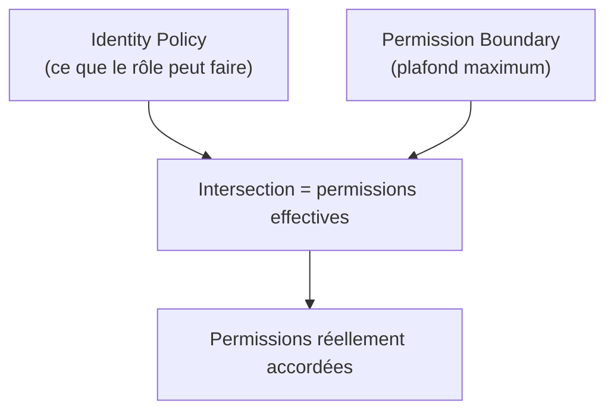
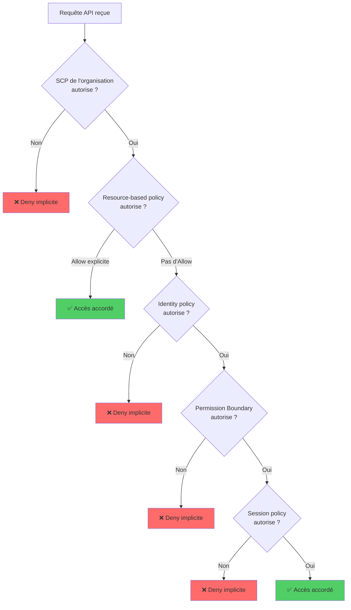
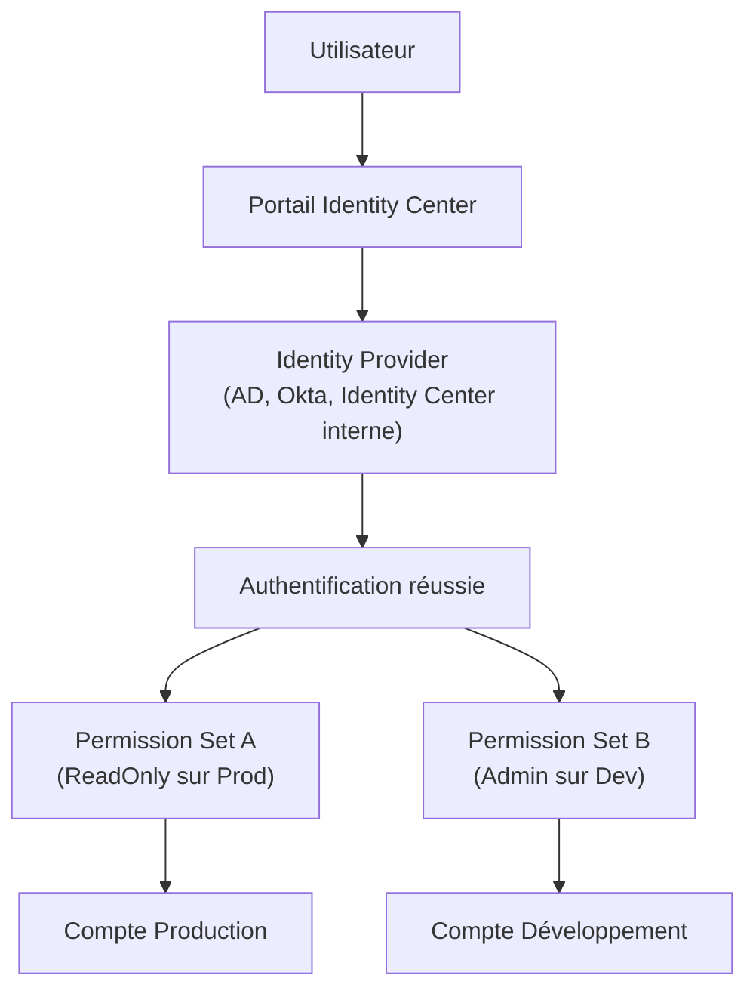
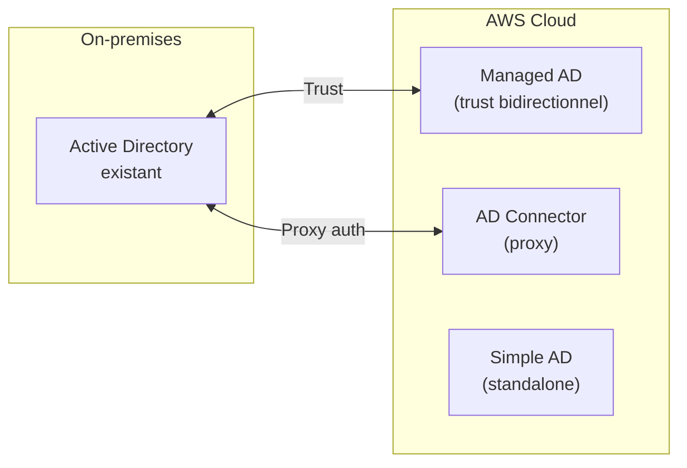

# IAM avancé — Identity Center, Policies avancées, Cross-Account

## Objectifs pédagogiques

À l'issue de ce module, tu seras capable de :

1. **Rédiger** des policies IAM avec des conditions avancées (restriction par IP, par région, par tag)
2. **Configurer** des Permission Boundaries pour limiter les droits qu'un administrateur délégué peut accorder
3. **Choisir** entre une resource-based policy et un rôle IAM pour le cross-account access, en justifiant le choix
4. **Tracer** le parcours complet d'évaluation d'une requête IAM (SCP → resource policy → identity policy → boundary → session)
5. **Décrire** le fonctionnement d'IAM Identity Center pour centraliser l'accès multi-comptes
6. **Comparer** les trois options AWS Directory Services et identifier quand utiliser chacune
7. **Expliquer** le rôle de Control Tower, de ses guardrails et de son Account Factory

Ce module prolonge le module 02 (IAM fondamental : users, groups, roles, policies de base, MFA) et le module 08 (sécurité : responsabilité partagée, KMS, CloudTrail). On ne reviendra pas sur ces bases — ici on plonge dans la mécanique fine des permissions et dans la gouvernance d'identité à l'échelle d'une organisation.

---

## Pourquoi IAM basique ne suffit plus

Imagine une entreprise de 300 développeurs répartis dans 12 comptes AWS. Chaque équipe possède son propre compte (dev, staging, prod, data, sécurité, audit...). Un développeur de l'équipe data a besoin d'accéder à un bucket S3 dans le compte prod pour alimenter son pipeline. Un autre développeur, junior, doit pouvoir créer des rôles IAM pour ses fonctions Lambda — mais tu ne veux surtout pas qu'il puisse s'attribuer `AdministratorAccess`. Et ton RSSI exige que personne ne puisse lancer de ressources en dehors de `eu-west-1` et `eu-central-1`.

Avec les outils du module 02 (users, groups, policies Allow/Deny simples), tu ne peux pas résoudre ces trois problèmes simultanément. Tu as besoin de conditions dans tes policies, de Permission Boundaries, de rôles cross-account avec STS, et d'une gouvernance centralisée avec Identity Center et Control Tower. C'est exactement ce que couvre ce module.

---

## Policies IAM avancées — le pouvoir des conditions

### La structure Condition

Tu connais déjà la structure de base d'une policy : `Effect`, `Action`, `Resource`. Le quatrième champ, `Condition`, est celui qui transforme une policy basique en une règle de sécurité chirurgicale. Une condition ajoute un test supplémentaire qui doit être vrai pour que le statement s'applique.

La syntaxe est toujours la même : un **opérateur de comparaison**, une **clé de condition**, et une **valeur attendue**.

```json
{
  "Effect": "Deny",
  "Action": "*",
  "Resource": "*",
  "Condition": {
    "NotIpAddress": {
      "aws:SourceIp": ["192.168.1.0/24", "10.0.0.0/8"]
    }
  }
}
```

Cette policy refuse toute action si la requête ne provient pas des plages IP spécifiées. Concrètement, un développeur qui tente de se connecter depuis un café ne pourra rien faire, même avec des credentials valides.

### Clés de condition les plus fréquentes en examen

| Clé de condition | Ce qu'elle teste | Cas d'usage typique |
|---|---|---|
| `aws:SourceIp` | IP d'origine de la requête | Restreindre l'accès au réseau de l'entreprise |
| `aws:RequestedRegion` | Région ciblée par l'appel API | Interdire le déploiement hors Europe |
| `aws:PrincipalTag/<tag>` | Tag attaché à l'utilisateur/rôle | Accès conditionné au département |
| `aws:ResourceTag/<tag>` | Tag de la ressource cible | Un dev ne peut modifier que ses propres ressources |
| `aws:MultiFactorAuthPresent` | MFA utilisé pour la session | Exiger MFA pour les actions sensibles |
| `s3:prefix` | Préfixe de l'objet S3 | Limiter un user à "son" dossier dans un bucket |
| `ec2:ResourceTag/Environment` | Tag Environment de l'instance | Empêcher la suppression des instances prod |

### Opérateurs de comparaison

Les opérateurs définissent comment la valeur est comparée. Les plus importants :

- **StringEquals** / **StringNotEquals** — correspondance exacte (`"aws:RequestedRegion": "eu-west-1"`)
- **StringLike** / **StringNotLike** — avec wildcards (`"s3:prefix": "home/${aws:username}/*"`)
- **IpAddress** / **NotIpAddress** — comparaison de plages CIDR
- **DateGreaterThan** / **DateLessThan** — restrictions temporelles
- **Bool** — pour les booléens (`"aws:MultiFactorAuthPresent": "true"`)
- **ArnLike** — comparaison d'ARN avec wildcards

💡 **Variable de substitution** : dans une condition, `${aws:username}` est remplacé par le nom de l'utilisateur IAM qui effectue la requête. C'est ce qui permet d'écrire une policy générique du type "chaque user n'accède qu'à son dossier S3" sans créer une policy par user.

### Exemple concret : restriction régionale

```json
{
  "Effect": "Deny",
  "Action": [
    "ec2:RunInstances",
    "rds:CreateDBInstance",
    "lambda:CreateFunction"
  ],
  "Resource": "*",
  "Condition": {
    "StringNotEquals": {
      "aws:RequestedRegion": ["eu-west-1", "eu-central-1"]
    }
  }
}
```

Cette policy, attachée à un groupe ou à un rôle, empêche la création de ressources compute hors des deux régions européennes autorisées. Même un utilisateur avec `PowerUserAccess` ne pourra pas lancer une instance EC2 en `us-east-1`.

⚠️ **Piège examen** : cette policy Deny ne bloque que les actions listées. Les services globaux (IAM, CloudFront, Route 53) ne ciblent pas de région — ils continueront de fonctionner. Si tu veux un blocage total hors région, il faut utiliser un SCP au niveau de l'organisation, pas une policy IAM individuelle.

---

## Permission Boundaries — limiter ce qu'un administrateur délégué peut accorder

### Le problème de la délégation

Tu veux permettre aux tech leads de créer des rôles IAM pour leurs fonctions Lambda. Mais sans garde-fou, un tech lead pourrait créer un rôle avec `AdministratorAccess` et l'attacher à sa Lambda — ce qui revient à s'auto-promouvoir admin. La Permission Boundary résout exactement ce problème.

### Comment ça fonctionne

Une Permission Boundary est une policy IAM **attachée à un utilisateur ou un rôle**, non pas pour lui donner des permissions, mais pour définir le **plafond maximum** de permissions qu'il pourra jamais obtenir. Les permissions effectives sont l'intersection entre la policy d'identité (ce qu'il peut faire) et la Permission Boundary (ce qu'il peut faire au maximum).



Concrètement, si la Permission Boundary autorise uniquement `s3:*`, `lambda:*` et `dynamodb:*`, alors même si la policy d'identité accorde `iam:*` ou `ec2:*`, ces permissions seront ignorées. L'utilisateur ne pourra jamais dépasser la boundary.

### Scénario de délégation sécurisée

Voici la stratégie complète :

1. Tu crées une policy `DevBoundary` qui autorise uniquement S3, Lambda, DynamoDB, CloudWatch et Logs
2. Tu donnes au tech lead la permission `iam:CreateRole` et `iam:PutRolePolicy`, **avec la condition** que tout rôle créé doit avoir `DevBoundary` comme Permission Boundary
3. Le tech lead peut créer des rôles pour ses Lambdas — mais ces rôles ne pourront jamais dépasser le périmètre de `DevBoundary`

```json
{
  "Effect": "Allow",
  "Action": ["iam:CreateRole", "iam:PutRolePolicy", "iam:AttachRolePolicy"],
  "Resource": "*",
  "Condition": {
    "StringEquals": {
      "iam:PermissionsBoundary": "arn:aws:iam::123456789012:policy/DevBoundary"
    }
  }
}
```

🧠 **Point examen** : la Permission Boundary ne donne aucune permission par elle-même. Elle ne fait que limiter. Un utilisateur avec une boundary `s3:*` mais aucune identity policy n'a **zéro** permission. Il faut les deux : la boundary définit le plafond, la policy d'identité accorde les droits effectifs à l'intérieur de ce plafond.

---

## Resource-based Policies vs IAM Roles — le cross-account

### Deux mécanismes, deux philosophies

Pour donner à un principal du compte A l'accès à une ressource du compte B, deux approches existent :

**Approche 1 : IAM Role (AssumeRole)**
Le compte B crée un rôle avec une trust policy qui autorise le compte A. L'utilisateur du compte A appelle `sts:AssumeRole`, obtient des credentials temporaires, et utilise ces credentials pour accéder à la ressource dans le compte B. Pendant la durée de la session, l'utilisateur **abandonne ses permissions originales** et ne possède que les permissions du rôle assumé.

**Approche 2 : Resource-based Policy**
Le compte B ajoute une policy directement sur la ressource (bucket policy S3, policy de file SQS, key policy KMS...) qui autorise le principal du compte A. L'utilisateur du compte A accède à la ressource **sans changer de rôle** et **conserve ses propres permissions** en plus de celles accordées par la resource policy.

### Quand utiliser quoi

| Critère | IAM Role (AssumeRole) | Resource-based Policy |
|---|---|---|
| Permissions durant l'accès | Uniquement celles du rôle assumé | Celles du rôle + celles de la resource policy |
| Changement de contexte | Oui (nouvelles credentials temporaires) | Non (credentials inchangés) |
| Services supportés | Tous | Uniquement les services qui supportent les resource policies (S3, SQS, SNS, KMS, Lambda, API Gateway...) |
| Cas d'usage principal | Accès large à un compte entier | Accès ciblé à une ressource spécifique |

💡 **Le point clé pour l'examen** : si un utilisateur du compte A doit accéder à une ressource dans le compte B **tout en conservant ses permissions dans le compte A** (par exemple, copier un objet S3 du compte B vers le compte A dans la même opération), la resource-based policy est la seule option. Avec AssumeRole, il perdrait ses permissions dans le compte A pendant la session.

⚠️ **Tous les services ne supportent pas les resource-based policies.** DynamoDB, par exemple, n'en a pas. Pour un accès cross-account à DynamoDB, l'AssumeRole est la seule option.

---

## Logique d'évaluation des policies IAM — le flux complet

Quand AWS reçoit une requête API, elle passe par une chaîne d'évaluation précise. Comprendre ce flux est essentiel pour diagnostiquer les problèmes d'accès et pour répondre aux questions d'examen.



Voici la règle fondamentale : **un Deny explicite l'emporte toujours**, à n'importe quelle étape. Si un SCP refuse `ec2:TerminateInstances`, aucune identity policy, aucune resource policy ne pourra contourner ce refus.

Ensuite, pour qu'un accès soit accordé, il faut un **Allow explicite** à chaque couche applicable. Si un utilisateur a une Permission Boundary qui n'inclut pas `s3:DeleteObject`, alors même si sa policy d'identité l'autorise, la requête sera refusée.

L'exception notable : une **resource-based policy** qui accorde un Allow explicite à un principal **dans le même compte** peut suffire seule, sans que la policy d'identité n'ait besoin d'un Allow correspondant. En cross-account, les deux côtés doivent autoriser.

🧠 **Mnémotechnique pour l'examen** : pense à une série de portes. Chaque couche (SCP, resource policy, identity policy, boundary, session policy) est une porte. Pour passer, il faut que chaque porte soit ouverte. Un Deny explicite **verrouille** une porte définitivement — rien ne peut la rouvrir.

---

## STS AssumeRole en profondeur

### Mécanisme

AWS Security Token Service (STS) est le service qui produit les credentials temporaires. Quand un principal appelle `sts:AssumeRole`, STS vérifie la **trust policy** du rôle cible, puis retourne trois éléments : un `AccessKeyId`, un `SecretAccessKey` et un `SessionToken`, valides pour une durée définie (de 15 minutes à 12 heures selon la configuration).

```bash
# Assumer un rôle dans un autre compte
aws sts assume-role \
  --role-arn arn:aws:iam::<ACCOUNT_ID>:role/<ROLE_NAME> \
  --role-session-name <SESSION_NAME>
```

Le paramètre `--role-session-name` identifie la session dans CloudTrail — c'est ainsi que tu retrouves qui a fait quoi avec un rôle partagé.

### Les trois cas d'usage de STS

**Cross-account access** : un utilisateur du compte A assume un rôle dans le compte B. La trust policy du rôle liste le compte A (ou un rôle/user spécifique du compte A) comme principal autorisé.

**Federation** : un utilisateur authentifié par un fournisseur d'identité externe (Active Directory, Google, Okta) échange son token SAML ou OIDC contre des credentials AWS temporaires via `AssumeRoleWithSAML` ou `AssumeRoleWithWebIdentity`.

**Service access** : un service AWS (EC2, Lambda, ECS) assume un rôle pour obtenir des permissions. C'est le mécanisme derrière les instance profiles EC2 et les execution roles Lambda.

### Session policies

Quand tu appelles `AssumeRole`, tu peux passer une **session policy** optionnelle qui restreint encore davantage les permissions du rôle pour cette session spécifique. Les permissions effectives sont l'intersection entre la policy du rôle et la session policy. Utile pour donner un accès encore plus limité à un utilisateur fédéré sans créer un nouveau rôle.

⚠️ **Durée de session** : par défaut, une heure. Configurable jusqu'à 12 heures sur le rôle (`MaxSessionDuration`). Pour les rôles chaînés (un rôle qui assume un autre rôle), la limite tombe à **1 heure maximum** — non configurable. Ce point revient en examen.

---

## IAM Identity Center — gestion centralisée des accès multi-comptes

### Le problème qu'il résout

Sans Identity Center, chaque compte AWS possède ses propres utilisateurs IAM. Un développeur qui travaille sur trois comptes (dev, staging, prod) a trois jeux de credentials, trois mots de passe, trois configurations MFA. À 300 développeurs et 12 comptes, c'est ingérable — et c'est un cauchemar pour le offboarding quand quelqu'un quitte l'entreprise.

IAM Identity Center (anciennement AWS SSO) centralise l'authentification et l'autorisation pour tous les comptes d'une AWS Organization. Un utilisateur se connecte **une seule fois** au portail Identity Center, puis choisit le compte et le rôle qu'il veut utiliser. Pas de credentials IAM à gérer par compte.

### Architecture



### Concepts clés

**Identity source** : d'où viennent les utilisateurs. Trois options :
- Le répertoire intégré d'Identity Center (pour les petites organisations)
- Un Active Directory existant via AD Connector ou Managed AD
- Un fournisseur SAML 2.0 externe (Okta, Azure AD, Google Workspace)

**Permission Set** : un ensemble de policies IAM qui définit ce qu'un utilisateur peut faire dans un compte donné. Tu crées un Permission Set "DeveloperAccess" une seule fois, puis tu l'assignes à des utilisateurs ou groupes sur un ou plusieurs comptes. Identity Center crée automatiquement les rôles IAM correspondants dans chaque compte cible.

**Assignment** : le lien entre un utilisateur (ou groupe), un Permission Set et un compte. "Le groupe Developers a le Permission Set DeveloperAccess sur les comptes dev et staging."

💡 **Pour l'examen** : si l'énoncé mentionne "single sign-on", "gestion centralisée des accès multi-comptes", "un portail unique pour tous les comptes", ou "simplifier l'accès à AWS Organizations" — la réponse est IAM Identity Center. C'est le successeur d'AWS SSO, et AWS le pousse comme la solution de référence pour la gouvernance d'identité.

### Attribution fine avec ABAC

Identity Center supporte l'ABAC (Attribute-Based Access Control) : tu peux utiliser les attributs de l'utilisateur (département, équipe, niveau) dans les conditions des Permission Sets. Un utilisateur tagué `department=engineering` n'accède qu'aux ressources taggées `department=engineering`. Cela évite de créer un Permission Set par équipe — un seul Permission Set avec des conditions ABAC suffit.

---

## AWS Directory Services — connecter Active Directory à AWS

### Pourquoi c'est nécessaire

La majorité des grandes entreprises utilisent Microsoft Active Directory pour gérer les identités de leurs employés (authentification Windows, accès réseau, groupes de sécurité). Quand ces entreprises migrent vers AWS, elles veulent réutiliser leur AD existant plutôt que de recréer tous les comptes. AWS propose trois services pour faire le pont.

### Les trois options

| Service | Ce qu'il fait | Cas d'usage |
|---|---|---|
| **AWS Managed Microsoft AD** | Déploie un **vrai** Active Directory dans AWS, géré par AWS. Peut établir une **trust relationship** avec ton AD on-premises. | Tu as besoin d'un AD complet dans le cloud — pour des services qui l'exigent (WorkSpaces, FSx for Windows, RDS SQL Server) |
| **AD Connector** | **Proxy** qui redirige les requêtes d'authentification vers ton AD on-premises existant. Aucune donnée d'annuaire stockée dans AWS. | Tu veux utiliser ton AD existant sans le répliquer dans AWS. Nécessite une connexion réseau (VPN ou Direct Connect) vers le DC on-premises. |
| **Simple AD** | Annuaire léger compatible AD (basé sur Samba), géré par AWS. Ne supporte pas les trust relationships ni MFA. | Petites organisations (<5000 users) qui ont besoin de fonctionnalités AD basiques sans AD on-premises existant. |



🧠 **Logique de choix pour l'examen** : si l'énoncé mentionne "trust relationship avec AD on-premises" ou "services qui nécessitent un AD" (WorkSpaces, RDS SQL Server) → **Managed AD**. Si l'énoncé dit "utiliser l'AD existant sans rien stocker dans AWS" → **AD Connector**. Si c'est une petite orga sans AD existant → **Simple AD**.

---

## AWS Control Tower — gouvernance automatisée multi-comptes

### Le problème de la prolifération des comptes

Une organisation AWS grandit. Chaque équipe demande son propre compte. Au bout de six mois, tu as 30 comptes avec des configurations hétérogènes : certains n'ont pas CloudTrail activé, d'autres ont des S3 buckets publics, un compte de test a un VPC sans flow logs. Control Tower automatise la mise en conformité de tous ces comptes dès leur création.

### Les trois piliers de Control Tower

**Landing Zone** : l'environnement multi-comptes préconfigurée. Control Tower crée automatiquement une structure d'Organizations avec des OUs (Organizational Units), un compte de logging centralisé, un compte d'audit, et les SCPs de base. C'est le socle sur lequel tout repose.

**Guardrails** (désormais appelés "Controls") : des règles de gouvernance appliquées automatiquement. Deux types :
- **Preventive guardrails** — des SCPs qui empêchent des actions non conformes (ex : "interdire la désactivation de CloudTrail"). Ils bloquent avant que l'action ne se produise.
- **Detective guardrails** — des règles AWS Config qui détectent les dérives de conformité (ex : "alerter si un bucket S3 est public"). Ils ne bloquent pas, ils signalent.

**Account Factory** : un mécanisme de provisioning automatisé pour créer de nouveaux comptes conformes. Quand un tech lead demande un nouveau compte, Account Factory le crée avec les guardrails déjà appliqués, le VPC préconfiguré, CloudTrail et Config activés, et les rôles d'accès en place. Pas de configuration manuelle, pas d'oubli.

💡 **Pour l'examen** : Control Tower est la réponse quand l'énoncé décrit "mettre en conformité tous les comptes d'une organisation", "empêcher les dérives de configuration", "automatiser la création de comptes conformes", ou "landing zone". Control Tower s'appuie sur Organizations, SCPs et AWS Config — il les orchestre, il ne les remplace pas.

---

## Cas réel : migration IAM d'un groupe bancaire européen

**Contexte** : un groupe bancaire de 4 500 employés possède 45 comptes AWS répartis entre trois filiales. Avant la migration, chaque filiale gérait ses comptes indépendamment : 1 200 utilisateurs IAM répartis dans 45 comptes, 300 access keys statiques, aucun inventaire centralisé des permissions, et 8 semaines en moyenne pour révoquer les accès d'un employé partant.

**Problèmes identifiés** :
- Un audit de conformité PCI-DSS a révélé 47 utilisateurs IAM avec des permissions excessives
- Trois access keys n'avaient pas tourné depuis 14 mois
- Un développeur junior avait `AdministratorAccess` sur un compte de production depuis son onboarding — erreur de copier-coller dans un Terraform

**Solution déployée en 3 phases** :

**Phase 1 — Centralisation (4 semaines)** : mise en place d'AWS Control Tower avec une Landing Zone couvrant les 45 comptes. Création de 4 OUs (Production, Development, Staging, Security). Activation de guardrails preventive : interdiction de désactiver CloudTrail, interdiction de créer des buckets S3 publics, restriction régionale à `eu-west-1` et `eu-central-1` via SCP.

**Phase 2 — Identity Center (3 semaines)** : migration des 1 200 utilisateurs IAM vers IAM Identity Center avec Azure AD comme source d'identité (l'entreprise utilisait déjà Microsoft 365). Création de 8 Permission Sets (ReadOnlyProd, DeveloperDev, DeveloperStaging, AdminInfra, DataEngineer, SecurityAudit, FinOps, EmergencyAccess). Suppression progressive des 300 access keys statiques, remplacées par des credentials temporaires STS.

**Phase 3 — Permission Boundaries (2 semaines)** : déploiement de Permission Boundaries sur tous les rôles de délégation. Les tech leads peuvent créer des rôles pour leurs Lambdas et ECS tasks, mais ces rôles sont plafonnés par une boundary qui exclut `iam:*`, `organizations:*` et `sts:AssumeRole` hors du compte courant.

**Résultats après 6 mois** :
- Temps de révocation d'accès : de 8 semaines à **15 minutes** (désactivation du compte Azure AD = révocation immédiate de tous les accès AWS)
- Utilisateurs IAM restants : de 1 200 à **12** (comptes de service legacy en cours de migration)
- Access keys statiques : de 300 à **0**
- Permissions excessives détectées par audit : de 47 à **2** (en cours de correction)
- Coût de gestion IAM estimé : réduction de 60% du temps de l'équipe sécurité

---

## Bonnes pratiques

**Utiliser IAM Identity Center plutôt que des utilisateurs IAM par compte.** Les utilisateurs IAM avec des access keys statiques sont le principal vecteur de compromission. Identity Center fournit des credentials temporaires, un portail unique, et une révocation instantanée via la source d'identité.

**Toujours poser une Permission Boundary quand tu délègues la création de rôles.** Sans boundary, un utilisateur qui peut créer des rôles peut s'auto-promouvoir admin. La boundary est le filet de sécurité de la délégation.

**Préférer les conditions IAM aux policies séparées.** Plutôt que de créer 10 policies pour 10 équipes, utilise une seule policy avec des conditions sur les tags (`aws:PrincipalTag`, `aws:ResourceTag`). C'est plus maintenable et ça scale mieux.

**Resource-based policy pour le cross-account ciblé, AssumeRole pour le cross-account large.** Si un seul bucket S3 doit être accessible depuis un autre compte, une bucket policy suffit. Si un compte entier doit accéder à de multiples ressources dans un autre compte, un rôle avec AssumeRole est plus propre.

**Activer Control Tower dès le deuxième compte.** La dette de gouvernance s'accumule vite. Rétrofitter des guardrails sur 30 comptes existants est dix fois plus complexe que de les appliquer dès le départ.

**Tester les policies avec IAM Policy Simulator avant de les déployer.** Le simulateur évalue une requête contre l'ensemble des policies d'un principal et retourne Allow ou Deny avec l'explication. C'est le moyen le plus sûr de valider une policy complexe sans risque.

---

## Résumé

IAM avancé couvre les mécanismes qui permettent de passer d'une gestion d'accès artisanale à une gouvernance d'identité industrielle. Les conditions dans les policies (restriction par IP, par région, par tag) transforment des autorisations génériques en règles de sécurité précises. Les Permission Boundaries empêchent l'escalade de privilèges lors de la délégation. Le choix entre resource-based policies et AssumeRole dépend du contexte : accès ciblé à une ressource vs accès large à un compte, conservation des permissions originales ou non. La logique d'évaluation (SCP → resource policy → identity policy → boundary → session) explique pourquoi un accès est refusé quand toutes les policies semblent correctes. Et à l'échelle d'une organisation, Identity Center centralise l'authentification, Control Tower impose la conformité, et Directory Services connecte le monde Active Directory à AWS.

Pour l'examen SAA-C03 : retiens que le Deny explicite l'emporte toujours, que la Permission Boundary est un plafond (pas un octroi), que la resource-based policy est la seule option pour conserver ses permissions pendant un accès cross-account, et qu'Identity Center est la réponse à toute question sur la gestion centralisée des accès multi-comptes.

---

## Snippets

<!-- snippet
id: aws_iam_condition_source_ip
type: concept
tech: aws
level: intermediate
importance: high
format: knowledge
tags: aws,iam,policy,condition,security
title: Condition IAM aws:SourceIp — restreindre l'accès par IP
content: La condition aws:SourceIp dans une policy IAM permet de limiter les appels API aux requêtes provenant de plages IP spécifiques. Combinée avec un Effect Deny et NotIpAddress, elle bloque tout accès hors du réseau de l'entreprise, même avec des credentials valides. En examen, "restreindre l'accès au réseau corporate" = condition aws:SourceIp.
description: Restreindre les appels API AWS à des plages IP spécifiques via les conditions IAM.
-->

<!-- snippet
id: aws_iam_permission_boundary
type: concept
tech: aws
level: intermediate
importance: high
format: knowledge
tags: aws,iam,boundary,delegation,security
title: Permission Boundary — plafond de permissions pour la délégation
content: Une Permission Boundary est une policy attachée à un user ou rôle qui définit le plafond maximum de permissions possibles. Les permissions effectives sont l'intersection entre la policy d'identité et la boundary. La boundary ne donne aucune permission seule — elle ne fait que limiter. Indispensable quand on délègue iam:CreateRole pour empêcher l'escalade de privilèges.
description: La Permission Boundary plafonne les permissions — indispensable pour la délégation sécurisée de création de rôles.
-->

<!-- snippet
id: aws_iam_cross_account_resource_policy
type: concept
tech: aws
level: intermediate
importance: high
format: knowledge
tags: aws,iam,cross-account,resource-policy,assume-role
title: Resource-based policy vs AssumeRole — cross-account
content: Deux mécanismes pour le cross-account. Resource-based policy : le principal conserve ses permissions originales et accède à la ressource directement — idéal pour copier entre comptes. AssumeRole : le principal abandonne ses permissions et prend celles du rôle — idéal pour un accès large. Tous les services ne supportent pas les resource-based policies (DynamoDB par exemple exige AssumeRole).
description: Resource-based policy conserve les permissions originales, AssumeRole les remplace. Choix selon le cas d'usage.
-->

<!-- snippet
id: aws_iam_policy_evaluation_logic
type: concept
tech: aws
level: intermediate
importance: high
format: knowledge
tags: aws,iam,evaluation,scp,deny
title: Logique d'évaluation IAM — SCP, resource, identity, boundary, session
content: L'évaluation suit l'ordre SCP → Resource-based policy → Identity policy → Permission Boundary → Session policy. Un Deny explicite l'emporte toujours à n'importe quelle étape. Pour qu'un accès soit accordé, il faut un Allow explicite à chaque couche applicable. Exception : une resource-based policy avec Allow explicite peut suffire seule dans le même compte.
description: Le Deny explicite gagne toujours. Chaque couche doit autoriser pour que l'accès soit accordé.
-->

<!-- snippet
id: aws_sts_assume_role_cross
type: command
tech: aws
level: intermediate
importance: high
format: knowledge
tags: aws,sts,assume-role,cross-account,credentials
title: STS AssumeRole — obtenir des credentials temporaires cross-account
context: Permet d'obtenir des credentials temporaires pour accéder à un rôle dans un autre compte AWS
command: aws sts assume-role --role-arn arn:aws:iam::<ACCOUNT_ID>:role/<ROLE_NAME> --role-session-name <SESSION_NAME>
example: aws sts assume-role --role-arn arn:aws:iam::987654321012:role/CrossAccountReadOnly --role-session-name audit-session-greg
description: Retourne AccessKeyId, SecretAccessKey et SessionToken temporaires. Le role-session-name apparaît dans CloudTrail.
-->

<!-- snippet
id: aws_iam_identity_center_sso
type: concept
tech: aws
level: intermediate
importance: high
format: knowledge
tags: aws,iam,identity-center,sso,multi-account
title: IAM Identity Center — SSO centralisé multi-comptes
content: IAM Identity Center (ex-AWS SSO) centralise l'authentification pour tous les comptes d'une AWS Organization. L'utilisateur se connecte une fois au portail et choisit son compte et Permission Set. Sources d'identité possibles : répertoire intégré, Active Directory (via Managed AD ou AD Connector), ou SAML 2.0 externe (Okta, Azure AD). En examen, "accès centralisé multi-comptes" ou "single sign-on AWS" = Identity Center.
description: Identity Center remplace les utilisateurs IAM par compte — un portail unique, des credentials temporaires, une révocation instantanée.
-->

<!-- snippet
id: aws_directory_services_comparison
type: concept
tech: aws
level: intermediate
importance: medium
format: knowledge
tags: aws,directory,ad,managed-ad,ad-connector
title: Directory Services — Managed AD vs AD Connector vs Simple AD
content: Managed AD déploie un vrai AD dans AWS avec trust bidirectionnel vers l'AD on-premises (requis pour WorkSpaces, RDS SQL Server). AD Connector est un proxy vers l'AD on-premises existant sans stockage dans AWS. Simple AD est un annuaire léger standalone pour les petites organisations. En examen, trust relationship = Managed AD, proxy sans stockage = AD Connector.
description: Trois options pour connecter Active Directory à AWS, chacune adaptée à un cas d'usage spécifique.
-->

<!-- snippet
id: aws_control_tower_guardrails
type: concept
tech: aws
level: intermediate
importance: high
format: knowledge
tags: aws,control-tower,guardrails,governance,landing-zone
title: Control Tower — Landing Zone, Guardrails et Account Factory
content: Control Tower automatise la gouvernance multi-comptes. La Landing Zone crée la structure Organizations de base. Les Guardrails preventive (SCPs) bloquent les actions non conformes, les Guardrails detective (AWS Config) détectent les dérives. Account Factory provisionne de nouveaux comptes conformes automatiquement. En examen, "conformité automatisée multi-comptes" ou "landing zone" = Control Tower.
description: Control Tower orchestre Organizations, SCPs et Config pour imposer la conformité dès la création des comptes.
-->

<!-- snippet
id: aws_iam_condition_region_deny
type: tip
tech: aws
level: intermediate
importance: high
format: knowledge
tags: aws,iam,condition,region,compliance
title: Restreindre les déploiements à certaines régions avec aws:RequestedRegion
content: Une policy Deny avec la condition StringNotEquals sur aws:RequestedRegion empêche la création de ressources hors des régions autorisées. Attention — les services globaux (IAM, CloudFront, Route 53) ne ciblent pas de région et ne sont pas affectés. Pour un blocage total au niveau organisation, utiliser un SCP plutôt qu'une policy IAM individuelle.
description: aws:RequestedRegion dans un Deny bloque les déploiements hors région — mais les services globaux passent quand même.
-->

<!-- snippet
id: aws_sts_session_duration_warning
type: warning
tech: aws
level: intermediate
importance: medium
format: knowledge
tags: aws,sts,session,assume-role,chaining
title: Durée de session STS — 1h max pour les rôles chaînés
content: La durée de session AssumeRole est configurable jusqu'à 12 heures (MaxSessionDuration). Mais quand un rôle assume un autre rôle (role chaining), la durée maximale tombe à 1 heure — non configurable. Ce piège revient régulièrement en examen. Solution si besoin de sessions plus longues avec chaînage — repenser l'architecture pour éviter le chaînage.
description: Le role chaining limite la session à 1h maximum, même si MaxSessionDuration est configuré à 12h.
-->
