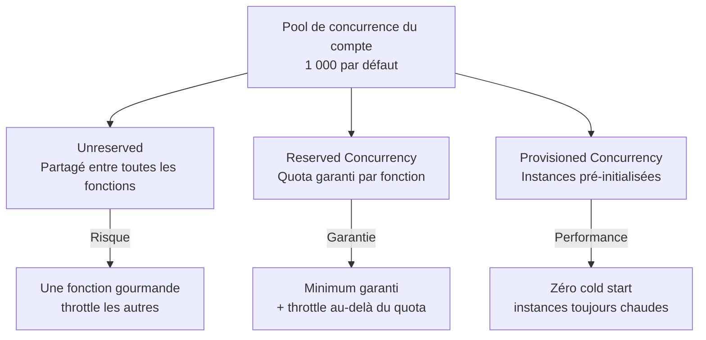
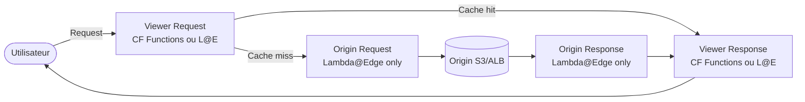
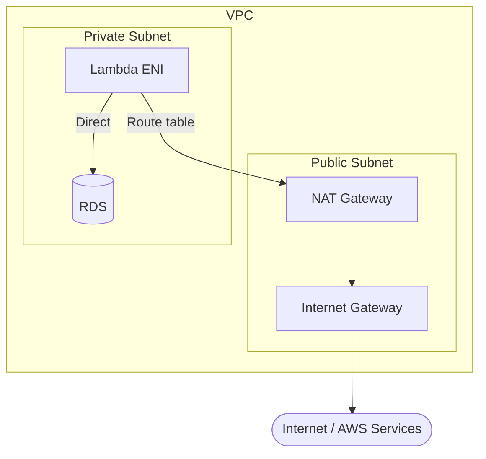
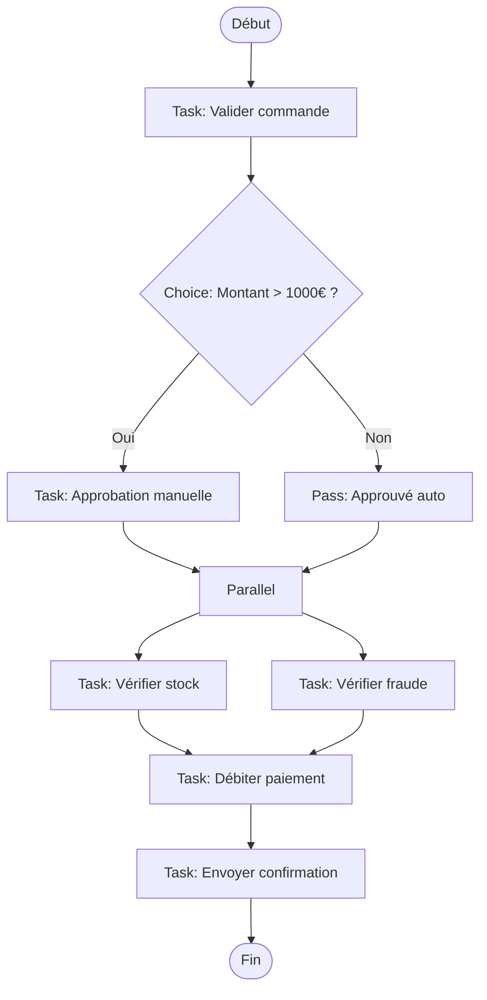
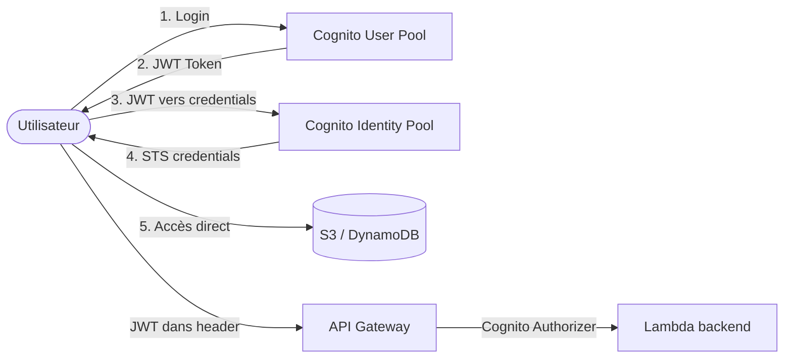

# Serverless avancé — Lambda Limits, Concurrency, Step Functions, Cognito

## Objectifs pédagogiques

À l'issue de ce module, tu seras capable de :

1. **Citer de mémoire** les limites Lambda critiques pour l'examen (mémoire, timeout, /tmp, package, concurrence)
2. **Choisir** entre unreserved, reserved et provisioned concurrency selon le workload
3. **Expliquer** le fonctionnement de SnapStart et son impact sur les cold starts Java
4. **Comparer** Lambda@Edge et CloudFront Functions pour le edge computing
5. **Diagnostiquer** les problèmes de Lambda en VPC (ENI, cold start, accès internet)
6. **Justifier** l'usage de RDS Proxy devant une Lambda connectée à une base relationnelle
7. **Concevoir** un workflow multi-étapes avec Step Functions (choice, parallel, wait)
8. **Distinguer** Cognito User Pools et Identity Pools et savoir quand utiliser chacun
9. **Exploiter** les fonctionnalités avancées de DynamoDB (DAX, Streams, Global Tables, GSI/LSI)

Ce module prolonge le module 18 (Lambda basics, API Gateway, event-driven avec SQS/SNS/EventBridge, DynamoDB fondamental). On ne reviendra pas sur le handler Lambda, le modèle d'invocation ou la configuration de base d'API Gateway — ici on plonge dans les limites, l'optimisation et les services complémentaires qui transforment un prototype serverless en architecture de production.

---

## Lambda Limits — les chiffres que tu dois connaître

Quand tu conçois une architecture serverless, les limites Lambda ne sont pas un détail — elles dictent directement ce que tu peux et ne peux pas faire. Une fonction qui traite des fichiers vidéo de 500 Mo ne peut pas tourner avec 128 Mo de mémoire et un timeout de 3 secondes. Connaître ces limites te permet de trancher immédiatement entre "Lambda convient" et "il faut un conteneur ECS".

### Limites d'exécution

| Limite | Valeur | Ce que ça implique |
|--------|--------|--------------------|
| **Mémoire** | 128 Mo à 10 240 Mo (10 Go) | Le CPU scale proportionnellement — plus de mémoire = plus de CPU |
| **Timeout** | max 15 minutes | Au-delà, utilise ECS Fargate, Step Functions ou un batch |
| **Stockage /tmp** | 10 Go (éphémère) | Disponible pendant l'exécution uniquement, nettoyé entre invocations à froid |
| **Variables d'environnement** | 4 Ko total | Pour les gros configs, utilise SSM Parameter Store ou Secrets Manager |
| **Taille du payload synchrone** | 6 Mo (request + response) | Pour les gros fichiers, passe par S3 avec une URL présignée |
| **Taille du payload asynchrone** | 256 Ko | Les messages SQS/SNS qui déclenchent Lambda doivent rester sous cette limite |

### Limites de déploiement

| Limite | Valeur | Contournement |
|--------|--------|---------------|
| **Package zippé** | 50 Mo | Utilise des Lambda Layers ou un container image |
| **Package dézippé** | 250 Mo | Utilise une container image Lambda (jusqu'à 10 Go) |
| **Container image** | 10 Go | Suffisant pour du ML avec des modèles volumineux |
| **Lambda Layers** | 5 layers max, 250 Mo total dézippé | Externalise les dépendances lourdes dans des layers |

### Limites de concurrence

| Limite | Valeur | Ajustable ? |
|--------|--------|-------------|
| **Concurrence par compte/région** | 1 000 (défaut) | Oui, via demande au support AWS (soft limit) |
| **Burst concurrency** | 500 à 3 000 selon la région | Non ajustable |
| **Concurrence réservée par fonction** | Configurable (puise dans le pool de 1 000) | Oui |

💡 **Astuce examen** : quand l'énoncé mentionne une fonction Lambda qui échoue avec des erreurs de throttling après un pic de trafic, la réponse implique presque toujours la concurrence — soit augmenter la limite du compte, soit configurer une reserved ou provisioned concurrency.

⚠️ **Piège fréquent** : la mémoire Lambda ne concerne pas que la RAM. AWS alloue le CPU proportionnellement à la mémoire. Une fonction à 128 Mo reçoit une fraction de vCPU ; à 1 769 Mo elle reçoit exactement 1 vCPU complet. Si ta fonction est CPU-bound (compression, crypto, parsing JSON lourd), augmenter la mémoire accélère l'exécution même si tu n'as pas besoin de plus de RAM.

---

## Lambda Concurrency — unreserved, reserved, provisioned

> **SAA-C03** — Si la question mentionne…
> - "cold start / démarrage à froid" + "eliminate / éliminer" → **Provisioned Concurrency** (instances pré-chauffées, coût fixe)
> - "guarantee concurrency / garantir la concurrence" + "isolate from other functions" → **Reserved Concurrency** (réserve un quota, pas de pré-chauffage)
> - "Lambda@Edge" + "modify request/response at edge / modifier la requête à l'edge" → exécution aux edge locations CloudFront (viewer/origin request/response)
> - "CloudFront Functions" vs "Lambda@Edge" → CF Functions = plus rapide, moins cher, JS uniquement, < 1 ms. Lambda@Edge = plus puissant, multi-langage, < 30 s
> - "authenticate users / authentifier des utilisateurs" + "sign-up / sign-in" + "MFA / social login" → **Cognito User Pool**
> - "get temporary AWS credentials / obtenir des credentials AWS temporaires" + "for app users" → **Cognito Identity Pool** (fédère User Pool + providers externes)
> - "orchestrate multiple Lambda / orchestrer plusieurs Lambda" + "state machine / machine à états" → **Step Functions**
> - "Step Functions Standard" = longue durée (1 an max), exactly-once. "Step Functions Express" = haut débit (5 min max), at-least-once.
> - "GraphQL API" + "real-time subscriptions / abonnements temps réel" → **AppSync**
> - ⛔ Lambda max **15 min timeout**. Si le traitement dure plus → Fargate, ECS ou EC2.
> - ⛔ Lambda default concurrency = **1 000 par région** (extensible via support). Une seule fonction peut consommer tout le quota.

La concurrence Lambda désigne le nombre d'instances de ta fonction qui s'exécutent simultanément. C'est le levier principal pour gérer la scalabilité et la stabilité d'une architecture serverless. Mal configurée, une seule fonction peut consommer toute la concurrence du compte et provoquer le throttling de toutes les autres.

### Les trois modes

**Unreserved concurrency** : c'est le comportement par défaut. Toutes les fonctions du compte partagent le pool de 1 000. Pas de garantie — si une fonction monte à 900, il ne reste que 100 pour toutes les autres. AWS réserve toujours 100 du pool comme "unreserved minimum" : tu ne peux jamais allouer plus de 900 en reserved concurrency.

**Reserved concurrency** : tu réserves un quota fixe pour une fonction spécifique. Si tu réserves 200 pour ta fonction de paiement, elle aura toujours 200 slots disponibles — même si les autres fonctions sont en pic. Mais attention : elle ne pourra pas dépasser 200. C'est à la fois une garantie et un plafond. La reserved concurrency est gratuite.

**Provisioned concurrency** : AWS pré-initialise un nombre fixe d'instances de ta fonction. Ces instances sont déjà démarrées, le code est chargé, le runtime est prêt. Résultat : zéro cold start pour les requêtes qui tombent sur une instance provisionnée. Au-delà du nombre provisionné, Lambda crée des instances normales (avec cold start). C'est payant — tu paies les instances provisionnées même quand elles ne sont pas utilisées.

### Quand utiliser quoi

| Scénario | Mode recommandé | Pourquoi |
|----------|-----------------|----------|
| Fonction critique qui ne doit jamais être throttlée | Reserved | Garantit un minimum de capacité |
| Fonction à faible trafic qui ne doit pas monopoliser le pool | Reserved (à une valeur basse) | Agit comme un rate limiter |
| API temps réel avec SLA de latence stricte | Provisioned | Élimine les cold starts |
| Fonction rarement invoquée, pas critique | Unreserved (défaut) | Pas besoin de configuration |
| Pic de trafic prévisible (Black Friday, lancement produit) | Provisioned + Auto Scaling | Pré-chauffe les instances avant le pic |

🧠 **Point examen** : la reserved concurrency à 0 désactive complètement la fonction. C'est une technique pour couper une fonction en urgence sans la supprimer — utile en cas d'incident.

---

## Lambda SnapStart — tuer le cold start Java

Le cold start est le talon d'Achille du serverless. Quand Lambda doit créer une nouvelle instance, elle télécharge le code, initialise le runtime et exécute ton code d'initialisation. Pour Python ou Node.js, c'est quelques centaines de millisecondes. Pour Java avec Spring Boot, ça peut dépasser 10 secondes.

SnapStart résout ce problème spécifiquement pour Java. Voici comment : quand tu publies une nouvelle version de ta fonction, Lambda exécute l'initialisation complète une seule fois, puis prend un **snapshot Firecracker** (snapshot de la mémoire de la micro-VM). Quand une nouvelle instance est nécessaire, Lambda restaure le snapshot au lieu de réinitialiser depuis zéro. Le résultat : un cold start Java qui passe de 10+ secondes à moins de 200 ms.

**Contraintes de SnapStart** :
- Disponible uniquement pour le runtime Java (Corretto 11+)
- Nécessite la publication d'une version (pas compatible avec $LATEST)
- Le snapshot est une image figée : les connexions réseau, les caches et les tokens initialisés dans le constructeur seront périmés au restore. Tu dois utiliser des hooks `beforeCheckpoint` / `afterRestore` pour réinitialiser les ressources sensibles

💡 **Astuce examen** : si l'énoncé parle d'une application Java/Spring sur Lambda avec des cold starts inacceptables, la réponse est SnapStart. Si l'énoncé parle de cold starts pour Python/Node.js, la réponse est provisioned concurrency.

---

## Lambda@Edge vs CloudFront Functions

Les deux permettent d'exécuter du code au edge (dans les points de présence CloudFront), mais ils ciblent des cas d'usage très différents.

| Critère | CloudFront Functions | Lambda@Edge |
|---------|---------------------|-------------|
| **Runtime** | JavaScript uniquement | Node.js, Python |
| **Durée max** | < 1 ms | 5 s (viewer) / 30 s (origin) |
| **Mémoire** | 2 Mo | 128 Mo (viewer) / 10 Go (origin) |
| **Accès réseau** | Non | Oui |
| **Accès au body** | Non | Oui (origin request/response) |
| **Triggers** | Viewer request, Viewer response | Viewer request/response, Origin request/response |
| **Échelle** | Millions de req/s | Milliers de req/s |
| **Prix** | ~$0.10 / million | ~$0.60 / million (6x plus cher) |
| **Déploiement** | Toutes les PoP (218+) | Regional Edge Caches |

**CloudFront Functions** : pour les manipulations légères et ultra-rapides sur chaque requête. Réécriture d'URL, ajout de headers de sécurité (HSTS, CSP), normalisation de cache keys, redirection basée sur le pays/device, validation de tokens simples. C'est le choix par défaut pour tout ce qui ne nécessite pas d'accès réseau ni de logique complexe.

**Lambda@Edge** : pour les traitements plus lourds qui nécessitent un accès au réseau, un traitement du body, ou une logique métier significative. Authentification avec appel à un IdP externe, transformation d'images à la volée, A/B testing avec lookup en base, réponses dynamiques générées côté origin.

🧠 **Point examen** : "manipuler les headers de requête à chaque request avec une latence minimale" = CloudFront Functions. "Authentifier l'utilisateur avec un appel à Cognito avant de servir le contenu" = Lambda@Edge.

---

## Lambda en VPC — le piège du cold start réseau

Par défaut, une Lambda s'exécute dans un VPC géré par AWS — elle a accès à internet et aux services AWS, mais pas à tes ressources privées (RDS, ElastiCache, instances EC2 dans un subnet privé). Si ta Lambda doit accéder à une base RDS dans un subnet privé, tu dois la placer dans ton VPC.

### Comment ça fonctionne

Quand tu places une Lambda dans ton VPC, AWS crée des **ENI (Elastic Network Interfaces)** dans les subnets que tu as spécifiés. Depuis 2019, AWS utilise un modèle d'ENI partagées (Hyperplane) : les ENI sont créées une seule fois lors de la première invocation et réutilisées ensuite. Le premier cold start est plus long (~10 secondes pour l'attachement ENI), mais les cold starts suivants sont comparables à une Lambda hors VPC.

### Le piège de l'accès internet

⚠️ **C'est le piège le plus fréquent en examen.** Une Lambda placée dans un subnet public avec une Internet Gateway n'a PAS accès à internet. Pourquoi ? Parce que Lambda n'attribue pas d'IP publique à ses ENI. Même dans un subnet public, l'ENI n'a qu'une IP privée — et une IP privée ne peut pas router vers une Internet Gateway.

La solution : place ta Lambda dans un **subnet privé** avec une route vers un **NAT Gateway** dans un subnet public.

**Alternative au NAT Gateway** : pour accéder aux services AWS (S3, DynamoDB, SQS...) sans passer par internet, utilise des **VPC Endpoints**. Un Gateway Endpoint (gratuit, pour S3 et DynamoDB) ou un Interface Endpoint (payant, pour les autres services) permet à ta Lambda d'atteindre le service AWS via le réseau privé AWS — sans NAT Gateway et sans traverser internet.

💡 **Astuce examen** : "Lambda dans un VPC ne peut pas accéder à S3" → la réponse est soit un NAT Gateway, soit un VPC Gateway Endpoint pour S3. Le VPC Endpoint est préféré car il est gratuit et ne sort pas du réseau AWS.

---

## RDS Proxy — le connection pooling pour Lambda

### Le problème

Chaque instance Lambda qui se connecte à une base RDS ouvre une nouvelle connexion TCP. Avec 500 invocations simultanées, tu as 500 connexions ouvertes vers ta base. Or les bases relationnelles ne sont pas conçues pour des milliers de connexions éphémères — une instance RDS `db.t3.medium` supporte environ 90 connexions max par défaut. Résultat : `too many connections`, ton application tombe.

### La solution : RDS Proxy

RDS Proxy est un proxy de connexion managé par AWS qui se place entre tes fonctions Lambda et ta base RDS (MySQL, PostgreSQL, MariaDB, SQL Server). Il maintient un **pool de connexions persistantes** vers la base et multiplexe les requêtes Lambda sur ce pool.

| Sans RDS Proxy | Avec RDS Proxy |
|----------------|----------------|
| 500 Lambda = 500 connexions | 500 Lambda = ~20 connexions réelles |
| Connexion ouverte/fermée à chaque invocation | Connexions maintenues et réutilisées |
| Failover RDS = coupure de 30-60 sec | Failover RDS = basculement transparent en ~1 sec |
| Credentials en variable d'env ou Secrets Manager | Authentification IAM possible |

RDS Proxy s'intègre avec **Secrets Manager** pour la rotation automatique des credentials et supporte l'**authentification IAM** — ta Lambda n'a plus besoin de stocker de mot de passe, elle utilise son rôle IAM pour s'authentifier auprès du proxy.

🧠 **Point examen** : toute question qui combine "Lambda" + "RDS" + "trop de connexions" ou "connection timeout" → la réponse est RDS Proxy. C'est systématique.

---

## Step Functions — orchestrer des workflows serverless

Lambda est conçu pour des tâches courtes et unitaires. Mais un processus métier réel implique souvent plusieurs étapes : valider une commande, vérifier le stock, débiter le paiement, envoyer une confirmation, déclencher l'expédition. Enchaîner ces étapes dans une seule Lambda crée du code monolithique fragile. Les orchestrer via SQS/SNS crée une chorégraphie distribuée difficile à debugger.

Step Functions résout ce problème en offrant une **machine à états** visuelle et déclarative. Tu définis un workflow en JSON (Amazon States Language) avec des états typés, et Step Functions se charge de l'exécution, du retry, du tracking et de la gestion d'erreurs.

### Types d'états

| Type d'état | Rôle | Exemple |
|-------------|------|---------|
| **Task** | Exécute une action (Lambda, API AWS, activité) | Invoquer une fonction de paiement |
| **Choice** | Branchement conditionnel | Si montant > 1000€, validation manuelle |
| **Parallel** | Exécution de branches en parallèle | Vérifier stock ET vérifier fraude simultanément |
| **Wait** | Pause (durée fixe ou timestamp) | Attendre 24h avant relance email |
| **Map** | Itération sur une liste d'éléments | Traiter chaque ligne d'un fichier CSV |
| **Pass** | Transformation de données sans action | Reformater le payload entre deux étapes |
| **Succeed / Fail** | Fin du workflow (succès ou erreur) | Terminer avec un statut explicite |

### Standard vs Express

| Critère | Standard Workflow | Express Workflow |
|---------|-------------------|------------------|
| **Durée max** | 1 an | 5 minutes |
| **Exécution** | Exactement une fois (exactly-once) | Au moins une fois (at-least-once) |
| **Prix** | Par transition d'état (~$0.025/1000) | Par durée + nombre d'exécutions |
| **Historique** | Jusqu'à 25 000 entrées | Pas d'historique (logs CloudWatch) |
| **Usage typique** | Workflows longue durée, processus métier | Traitement de données à haut débit, IoT |

### Gestion d'erreurs intégrée

Step Functions gère nativement les **retries** et les **catch** au niveau de chaque état Task. Tu peux configurer un retry exponentiel avec un nombre max de tentatives, et un catch qui redirige vers un état de fallback en cas d'échec définitif. C'est infiniment plus propre que de coder des try/catch dans chaque Lambda avec des dead letter queues partout.

💡 **Astuce examen** : "orchestrer plusieurs fonctions Lambda avec gestion d'erreurs et branchements conditionnels" = Step Functions. "Déclencher des fonctions de manière indépendante sans coordination" = EventBridge / SNS.

---

## Amazon Cognito — authentification et autorisation

Cognito est le service d'identité managé d'AWS. Il couvre deux besoins distincts avec deux composants distincts que tu dois impérativement différencier.

### User Pools — l'authentification

Un User Pool est un **annuaire d'utilisateurs**. Il gère l'inscription, la connexion, la récupération de mot de passe, le MFA, et la fédération avec des identity providers externes (Google, Facebook, Apple, SAML, OIDC). Quand un utilisateur se connecte avec succès, Cognito retourne un **JWT (JSON Web Token)** que ton application utilise pour les appels API.

Cas d'usage typique : une application web ou mobile dont les utilisateurs créent un compte et se connectent. Le JWT retourné par Cognito est passé à API Gateway qui le valide via un **Cognito Authorizer** — sans écrire une seule ligne de code d'authentification côté backend.

### Identity Pools (Federated Identities) — l'autorisation AWS

Un Identity Pool prend un token d'identité (venant d'un User Pool, de Google, de Facebook, ou d'un login anonyme) et l'échange contre des **credentials AWS temporaires** (via STS). Ces credentials permettent à l'utilisateur d'accéder directement aux services AWS (S3, DynamoDB) depuis le frontend, avec des permissions contrôlées par des rôles IAM.

Cas d'usage typique : une application mobile qui doit uploader des photos directement dans S3 sans passer par un backend. L'Identity Pool donne à l'utilisateur des credentials temporaires avec un rôle IAM qui limite l'accès à son propre dossier dans le bucket.

### User Pool + Identity Pool ensemble

Le pattern le plus courant combine les deux :

1. L'utilisateur se connecte via le User Pool et reçoit un JWT
2. Le JWT est envoyé à l'Identity Pool qui retourne des credentials AWS temporaires
3. L'application utilise ces credentials pour accéder directement à S3/DynamoDB
4. En parallèle, le JWT sert aussi d'authorization header pour les appels API Gateway

| Composant | Rôle | Ce qu'il retourne | Quand l'utiliser |
|-----------|------|-------------------|------------------|
| **User Pool** | Authentification (qui es-tu ?) | JWT token | Login/signup, fédération, MFA |
| **Identity Pool** | Autorisation AWS (que peux-tu faire ?) | AWS credentials temporaires | Accès direct aux services AWS depuis le client |

⚠️ **Piège examen** : ne confonds pas les deux. "Gérer l'inscription et la connexion des utilisateurs" = User Pool. "Donner à un utilisateur mobile un accès direct à S3" = Identity Pool (souvent combiné avec User Pool).

---

## DynamoDB Advanced — DAX, Streams, Global Tables, GSI/LSI

Le module 18 couvrait les bases de DynamoDB (tables, items, partition key, sort key, RCU/WCU). Ici on aborde les fonctionnalités avancées qui reviennent massivement en examen SAA-C03.

### DAX — DynamoDB Accelerator

DAX est un cache in-memory entièrement compatible avec l'API DynamoDB. Tu ne changes pas ton code applicatif — tu remplaces le endpoint DynamoDB par le endpoint DAX, et les lectures passent par le cache. Latence de lecture : de quelques millisecondes (DynamoDB) à **microsecondes** (DAX).

DAX est un cache **write-through** : quand tu écris via DAX, l'écriture va d'abord dans DynamoDB puis le cache est mis à jour. Les lectures récupèrent automatiquement la version cachée.

**Quand utiliser DAX** : applications qui font beaucoup de lectures répétitives sur les mêmes items (leaderboards, catalogue produit, profils utilisateurs). **Quand ne PAS utiliser DAX** : applications qui font principalement des écritures, ou qui nécessitent des lectures fortement cohérentes (DAX ne supporte que les eventually consistent reads).

### DynamoDB Streams

DynamoDB Streams capture chaque modification (INSERT, MODIFY, DELETE) dans une table sous forme d'un flux ordonné d'événements. Ce flux peut déclencher une fonction Lambda pour réagir en temps réel aux changements.

Cas d'usage classiques :
- **Réplication cross-region** : un stream déclenche une Lambda qui écrit dans une table dans une autre région (remplacé par Global Tables, mais le concept reste en examen)
- **Analytics en temps réel** : chaque vente insérée dans DynamoDB déclenche une Lambda qui met à jour un dashboard
- **Audit** : capture de toutes les modifications avec horodatage pour conformité

Les streams conservent les données pendant **24 heures**. Au-delà, les enregistrements expirent.

### Global Tables

Les Global Tables permettent une réplication **multi-région et multi-active** de tes tables DynamoDB. Chaque réplica est en lecture ET écriture — c'est un modèle active-active, pas un primary-replica. La réplication est asynchrone (eventually consistent entre régions) et utilise DynamoDB Streams sous le capot.

**Prérequis** : les DynamoDB Streams doivent être activés sur la table. La résolution de conflits est automatique — last writer wins.

🧠 **Point examen** : "base de données NoSQL avec réplication multi-région active-active et basculement automatique" = DynamoDB Global Tables. Pas Aurora Global (qui est primary-replica pour les écritures).

### GSI et LSI — les index secondaires

| Critère | GSI (Global Secondary Index) | LSI (Local Secondary Index) |
|---------|------------------------------|----------------------------|
| **Partition key** | Différente de la table | Identique à la table |
| **Sort key** | Différente de la table | Différente de la table |
| **Création** | À tout moment | À la création de la table uniquement |
| **Limite** | 20 par table | 5 par table |
| **Capacité** | Propre (RCU/WCU séparés) | Partagée avec la table |
| **Cohérence** | Eventually consistent uniquement | Eventually consistent + Strongly consistent |
| **Taille** | Pas de limite | 10 Go par partition key |

**GSI** : tu veux interroger ta table avec une clé complètement différente. Ta table a `userId` comme partition key, mais tu veux aussi chercher par `email`. Crée un GSI avec `email` comme partition key.

**LSI** : tu veux garder la même partition key mais trier par un attribut différent. Ta table a `userId` (PK) + `orderDate` (SK), mais tu veux aussi trier par `orderAmount`. Crée un LSI avec `userId` (PK) + `orderAmount` (SK). Attention : tu dois le faire à la création de la table.

⚠️ **Piège examen** : les GSI ont leur propre capacité. Si tu provisionnes assez de RCU/WCU pour ta table mais pas pour ton GSI, les écritures dans la table seront throttlées parce que la réplication vers le GSI est en retard. C'est le "GSI back-pressure throttling".

---

## Cas réel — plateforme de commande en ligne

**Contexte** : une marketplace de livraison de repas gère 50 000 commandes par jour avec des pics à 500 commandes par minute le vendredi soir. L'architecture initiale était un monolithe Node.js sur EC2 avec une base PostgreSQL sur RDS.

**Problèmes identifiés** :
- Les pics du vendredi soir saturaient les instances EC2 — il fallait pré-provisionner de la capacité inutilisée le reste de la semaine
- Le processus de commande (validation, paiement, assignation livreur, notification) était un appel synchrone de 8 secondes — une erreur au milieu corrompait l'état
- Les connexions PostgreSQL explosaient pendant les pics (500 connexions simultanées pour une base configurée à 100)
- Aucune authentification standardisée — chaque client mobile/web avait son propre système de tokens

**Solution déployée** :

**Phase 1 — Authentification (2 semaines)** : migration vers Cognito User Pool avec fédération Google/Apple. API Gateway avec Cognito Authorizer remplace le middleware d'authentification custom. L'Identity Pool donne aux applications mobiles un accès direct à S3 pour l'upload des photos de plats.

**Phase 2 — Orchestration (3 semaines)** : le processus de commande monolithique est découpé en Step Functions. Chaque étape est une Lambda distincte : ValidateOrder, CheckRestaurantAvailability, ProcessPayment, AssignDriver, SendNotifications. Le state Choice redirige vers un workflow de remboursement si le restaurant est fermé. Le state Parallel exécute simultanément l'assignation du livreur et l'envoi des notifications.

**Phase 3 — Data layer (2 semaines)** : les données de session et le catalogue des restaurants migrent vers DynamoDB avec DAX en cache (latence de lecture du catalogue : de 12 ms à 0.4 ms). Le suivi des commandes en temps réel utilise DynamoDB Streams + Lambda pour pousser les updates vers les clients via WebSocket API Gateway. RDS Proxy est placé devant PostgreSQL pour les données transactionnelles qui restent en relationnel (comptabilité, reporting).

**Phase 4 — Optimisation Lambda (1 semaine)** : provisioned concurrency configurée sur les fonctions critiques (ValidateOrder, ProcessPayment) avec Application Auto Scaling pour augmenter les instances provisionnées le vendredi 18h-22h. Les fonctions de notification utilisent la concurrence unreserved — un throttling ponctuel est acceptable car les notifications sont asynchrones.

**Résultats après 3 mois** :
- Temps de traitement d'une commande : de 8 secondes à **1,2 seconde**
- Coût d'infrastructure : réduction de **45%** (plus de capacité EC2 idle)
- Connexions PostgreSQL pendant les pics : de 500 à **30** (via RDS Proxy)
- Taux d'erreur sur le processus de commande : de 2,3% à **0,1%** (grâce aux retries Step Functions)
- Cold starts sur les fonctions critiques : **0** (provisioned concurrency)

---

## Bonnes pratiques

**Toujours calculer ta concurrence cible avant de déployer.** Concurrence = invocations par seconde x durée moyenne en secondes. Si ta Lambda traite 100 req/s avec une durée de 200 ms, tu as besoin de 20 instances simultanées. Si elle traite 100 req/s avec une durée de 2 secondes, tu en as besoin de 200. Anticipe les pics.

**Utiliser RDS Proxy dès que tu connectes Lambda à une base relationnelle.** Même si tu n'as que 10 invocations simultanées aujourd'hui, un pic imprévu peut multiplier les connexions par 50 en quelques secondes. Le proxy est ton assurance contre les `too many connections`.

**Placer Lambda dans un VPC uniquement si nécessaire.** Si ta Lambda n'a pas besoin d'accéder à des ressources privées (RDS, ElastiCache, instances EC2), laisse-la en dehors du VPC. Tu évites la complexité du NAT Gateway et les coûts associés.

**Préférer CloudFront Functions à Lambda@Edge par défaut.** Ne passe à Lambda@Edge que si tu as besoin d'accès réseau, de traitement du body ou d'un runtime autre que JavaScript. CloudFront Functions est 6x moins cher et supporte un débit beaucoup plus élevé.

**Utiliser Step Functions pour tout workflow de plus de deux étapes.** Dès que tu as un branchement conditionnel ou un retry à gérer entre deux fonctions Lambda, Step Functions est plus fiable et plus maintenable qu'une orchestration SQS/Lambda maison.

**Choisir le bon index DynamoDB dès la conception.** Les LSI doivent être créés à la création de la table — tu ne pourras pas en ajouter après. Les GSI ont leur propre capacité — provisionne-la ou utilise le mode on-demand pour éviter le throttling.

---

## Résumé

Les limites Lambda (mémoire 128 Mo-10 Go, timeout 15 min, package 50 Mo/250 Mo, concurrence 1 000) dictent les choix d'architecture — les connaître par coeur te permet de trancher instantanément entre Lambda et un conteneur. La concurrence se gère en trois niveaux : unreserved (partage par défaut), reserved (garantie + plafond, gratuit), provisioned (zéro cold start, payant). SnapStart élimine les cold starts Java via des snapshots Firecracker. CloudFront Functions traite les manipulations légères au edge à grande échelle, Lambda@Edge gère les cas complexes nécessitant un accès réseau. Lambda en VPC utilise des ENI Hyperplane — rappelle-toi qu'elle n'a PAS d'accès internet sans NAT Gateway, même dans un subnet public. RDS Proxy est la réponse systématique au problème de connection pooling Lambda/RDS.

Step Functions orchestre des workflows multi-étapes avec des machines à états déclaratives, des retries natifs et des branchements conditionnels. Cognito User Pools gère l'authentification (JWT), Identity Pools gère l'autorisation AWS (credentials temporaires) — les deux se combinent mais servent des rôles distincts. DynamoDB avancé comprend DAX (cache microsecondes, read-heavy), Streams (capture de changements en temps réel), Global Tables (réplication multi-région active-active) et les index GSI/LSI (avec leurs contraintes respectives de création et de capacité).

Pour l'examen SAA-C03 : Lambda throttling = concurrence. Java cold start = SnapStart. Lambda + RDS = RDS Proxy. Orchestration multi-Lambda = Step Functions. Login/signup = User Pool. Accès AWS depuis le client = Identity Pool. Cache DynamoDB = DAX. Multi-région active-active NoSQL = Global Tables.

---

## Snippets

<!-- snippet
id: aws_lambda_limits_memory_timeout
type: concept
tech: aws
level: advanced
importance: high
format: knowledge
tags: aws,lambda,limits,memory,timeout,serverless
title: Limites Lambda — mémoire, timeout et /tmp
content: Lambda supporte 128 Mo à 10 Go de mémoire (le CPU scale proportionnellement — 1 vCPU à 1 769 Mo). Timeout max 15 minutes. Stockage éphémère /tmp jusqu'à 10 Go. Package zippé max 50 Mo (250 Mo dézippé), ou container image jusqu'à 10 Go. Variables d'env limitées à 4 Ko total. En examen, si le workload dépasse 15 min ou 10 Go de mémoire, la réponse est ECS Fargate.
description: Les limites Lambda dictent les choix d'architecture — mémoire, timeout, stockage et taille de package.
-->

<!-- snippet
id: aws_lambda_reserved_concurrency
type: concept
tech: aws
level: advanced
importance: high
format: knowledge
tags: aws,lambda,concurrency,reserved,throttling,serverless
title: Reserved Concurrency — garantie et plafond de concurrence Lambda
content: La reserved concurrency réserve un quota fixe d'exécutions simultanées pour une fonction Lambda, puisé dans le pool du compte (1 000 par défaut). C'est à la fois une garantie (la fonction ne sera pas throttlée par les autres) et un plafond (elle ne dépassera pas ce quota). La reserved concurrency à 0 désactive complètement la fonction — utile en cas d'urgence. C'est gratuit, contrairement à la provisioned concurrency.
description: Reserved concurrency garantit un minimum de capacité Lambda tout en plafonnant la consommation — gratuit.
-->

<!-- snippet
id: aws_lambda_provisioned_concurrency
type: command
tech: aws
level: advanced
importance: high
format: knowledge
tags: aws,lambda,concurrency,provisioned,cold-start,serverless
title: Provisioned Concurrency — éliminer les cold starts Lambda
context: Configure des instances Lambda pré-initialisées pour éliminer les cold starts sur les fonctions critiques
command: aws lambda put-provisioned-concurrency-config --function-name <FUNCTION_NAME> --qualifier <ALIAS_OR_VERSION> --provisioned-concurrent-executions <COUNT>
example: aws lambda put-provisioned-concurrency-config --function-name payment-processor --qualifier prod --provisioned-concurrent-executions 50
description: Pré-initialise un nombre fixe d'instances Lambda — zéro cold start mais payant même quand inutilisé. Nécessite un alias ou une version publiée.
-->

<!-- snippet
id: aws_lambda_snapstart_java
type: concept
tech: aws
level: advanced
importance: high
format: knowledge
tags: aws,lambda,snapstart,java,cold-start,serverless
title: Lambda SnapStart — cold start Java de 10s à 200ms
content: SnapStart prend un snapshot Firecracker de la micro-VM après l'initialisation complète du runtime Java. Les nouveaux cold starts restaurent le snapshot au lieu de réinitialiser. Passe de 10+ secondes à moins de 200 ms. Uniquement pour Java (Corretto 11+), nécessite la publication d'une version (pas $LATEST). Les connexions réseau et tokens initialisés sont périmés au restore — utiliser les hooks beforeCheckpoint/afterRestore.
description: SnapStart élimine les cold starts Java via des snapshots mémoire — la réponse examen pour Java + cold start.
-->

<!-- snippet
id: aws_cloudfront_functions_vs_lambda_edge
type: concept
tech: aws
level: advanced
importance: high
format: knowledge
tags: aws,cloudfront,lambda-edge,cloudfront-functions,edge,cdn
title: CloudFront Functions vs Lambda@Edge — choisir le bon edge computing
content: CloudFront Functions exécute du JavaScript en moins de 1 ms avec 2 Mo de mémoire sur toutes les PoP — idéal pour la réécriture d'URL, les headers de sécurité, la normalisation de cache key. Lambda@Edge supporte Node.js/Python avec jusqu'à 10 Go de mémoire et 30 s de durée — nécessaire pour l'accès réseau, le traitement du body, l'authentification externe. CloudFront Functions est 6x moins cher et supporte un débit bien supérieur.
description: CloudFront Functions pour les manipulations légères au edge, Lambda@Edge pour les traitements complexes avec accès réseau.
-->

<!-- snippet
id: aws_lambda_vpc_nat_gateway
type: warning
tech: aws
level: advanced
importance: high
format: knowledge
tags: aws,lambda,vpc,nat-gateway,eni,network
title: Lambda en VPC — pas d'internet sans NAT Gateway
content: Une Lambda dans un VPC n'a PAS d'accès internet même dans un subnet public, car l'ENI Lambda n'a qu'une IP privée. Solution — placer Lambda dans un subnet privé avec route vers un NAT Gateway. Alternative pour les services AWS (S3, DynamoDB) — utiliser des VPC Endpoints (Gateway Endpoint gratuit pour S3/DynamoDB, Interface Endpoint payant pour les autres). En examen, Lambda VPC + pas d'accès S3 = VPC Endpoint ou NAT Gateway.
description: Lambda en VPC perd l'accès internet — NAT Gateway ou VPC Endpoints sont indispensables.
-->

<!-- snippet
id: aws_rds_proxy_lambda
type: concept
tech: aws
level: advanced
importance: high
format: knowledge
tags: aws,rds-proxy,lambda,connection-pooling,database
title: RDS Proxy — connection pooling managé pour Lambda
content: Chaque invocation Lambda ouvre une connexion TCP vers RDS. Avec 500 invocations simultanées, 500 connexions saturent la base. RDS Proxy maintient un pool de connexions persistantes et multiplexe les requêtes Lambda — 500 Lambda passent par ~20 connexions réelles. Supporte IAM authentication et intégration Secrets Manager. Réduit aussi le temps de failover RDS de 30-60s à ~1s. En examen, Lambda + RDS + too many connections = RDS Proxy.
description: RDS Proxy résout le problème de connection pooling entre Lambda et RDS — réponse systématique en examen.
-->

<!-- snippet
id: aws_step_functions_workflow
type: command
tech: aws
level: advanced
importance: high
format: knowledge
tags: aws,step-functions,workflow,orchestration,serverless
title: Step Functions — orchestration de workflows Lambda
context: Crée et lance une exécution d'une machine à états Step Functions
command: aws stepfunctions start-execution --state-machine-arn arn:aws:states:<REGION>:<ACCOUNT_ID>:stateMachine:<STATE_MACHINE_NAME> --input '<JSON_INPUT>'
example: aws stepfunctions start-execution --state-machine-arn arn:aws:states:eu-west-1:123456789012:stateMachine:OrderProcessing --input '{"orderId":"ORD-42","amount":89.90}'
description: Step Functions orchestre des workflows multi-étapes avec des états Task, Choice, Parallel, Wait et Map. Standard (1 an, exactly-once) ou Express (5 min, at-least-once).
-->

<!-- snippet
id: aws_cognito_user_pool_vs_identity_pool
type: concept
tech: aws
level: advanced
importance: high
format: knowledge
tags: aws,cognito,user-pool,identity-pool,authentication,authorization
title: Cognito User Pool vs Identity Pool — authentification vs autorisation AWS
content: User Pool gère l'authentification — inscription, login, MFA, fédération (Google, SAML, OIDC) — et retourne un JWT. Identity Pool échange un token d'identité (User Pool, Google, etc.) contre des credentials AWS temporaires via STS pour accéder directement aux services AWS (S3, DynamoDB) depuis le client. En examen, login/signup = User Pool, accès AWS direct depuis mobile = Identity Pool, les deux ensemble = pattern classique.
description: User Pool = qui es-tu (JWT), Identity Pool = que peux-tu faire dans AWS (credentials temporaires).
-->

<!-- snippet
id: aws_dynamodb_dax_global_tables
type: concept
tech: aws
level: advanced
importance: high
format: knowledge
tags: aws,dynamodb,dax,global-tables,streams,gsi,lsi
title: DynamoDB avancé — DAX, Streams, Global Tables, GSI/LSI
content: DAX est un cache in-memory write-through qui réduit la latence de lecture de millisecondes à microsecondes — uniquement pour les lectures eventually consistent. DynamoDB Streams capture INSERT/MODIFY/DELETE pendant 24h pour déclencher des Lambda. Global Tables répliquent en active-active multi-région (last writer wins). GSI permet une partition key différente, créable à tout moment, avec sa propre capacité. LSI garde la même PK avec un SK différent, créable uniquement à la création de la table.
description: DAX pour le cache, Streams pour les événements, Global Tables pour le multi-région, GSI/LSI pour les requêtes flexibles.
-->
