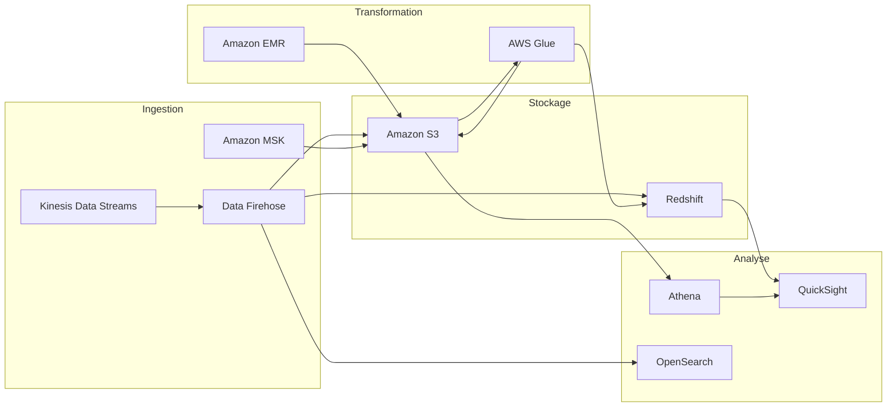
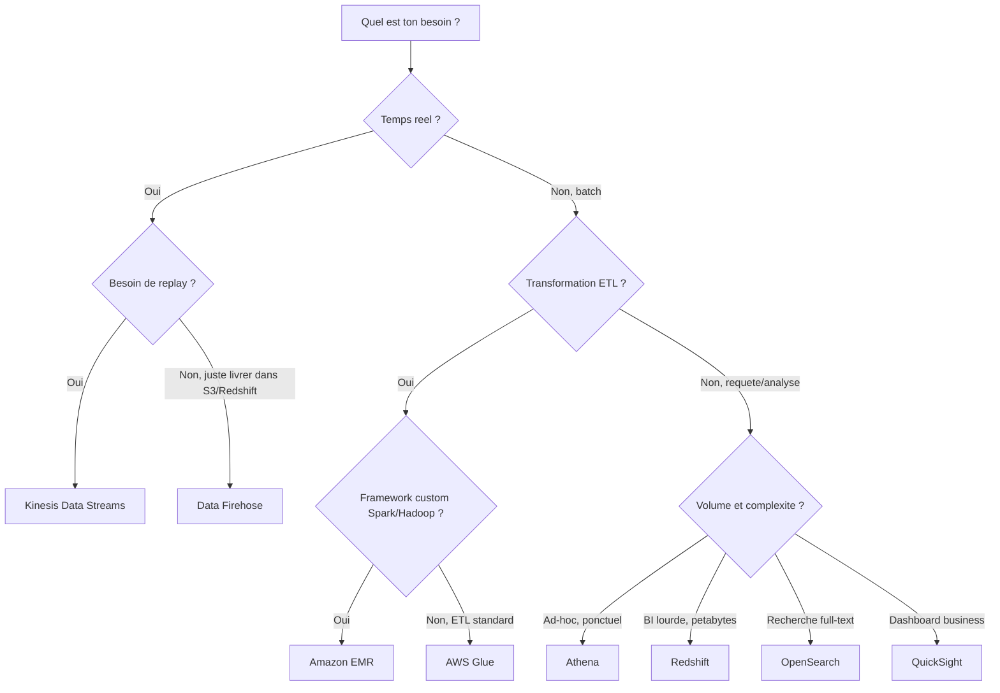
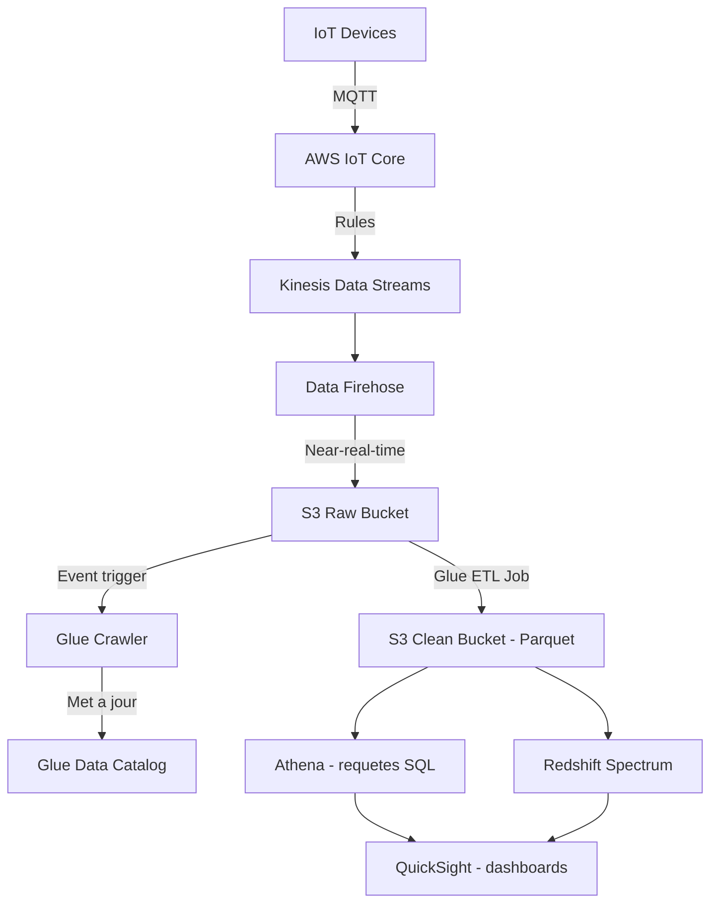

# Data & Analytics AWS — Athena, Kinesis, Redshift, Glue, Lake Formation

## Objectifs pedagogiques

- Connaitre chaque service data/analytics AWS et son role precis
- Savoir choisir le bon service selon le besoin (batch vs streaming, ad-hoc vs BI)
- Comprendre les architectures d'ingestion Big Data de bout en bout
- Maitriser les pieges SAA-C03 sur Kinesis vs SQS vs SNS
- Concevoir un data lake avec Lake Formation et Glue

## Mise en situation

Tu travailles pour une plateforme e-commerce qui genere :
- **2 To de logs** par jour dans S3
- **50 000 evenements/seconde** en temps reel (clics, achats, paniers)
- des rapports hebdomadaires pour le comite de direction

Le CTO te demande : "On veut analyser nos donnees en temps reel ET en batch, sans exploser le budget."

👉 Question SAA typique :
"Quelle combinaison de services permet d'ingerer des donnees en temps reel, les stocker dans S3, les transformer et les analyser avec SQL — le tout serverless ?"

Ce module te donne les cles pour repondre a cette question et a toutes les variantes que tu croiseras a l'examen.

---

## Vue d'ensemble — la galaxie Data AWS

Avant de plonger dans chaque service, il faut comprendre comment ils s'organisent. AWS decoupe le monde data en quatre grandes phases : **ingestion**, **stockage**, **transformation** et **analyse/visualisation**. Chaque service se positionne sur une ou plusieurs de ces phases.

💡 **Astuce SAA**
→ A l'examen, identifie d'abord la **phase** du besoin (ingestion ? transformation ? analyse ?) pour eliminer les mauvaises reponses.

---

## Amazon Athena — SQL serverless sur S3

> **SAA-C03** — Si la question mentionne…
> - "query S3 with SQL / requêter S3 avec SQL" + "serverless" + "ad hoc" → **Athena** (facturé au volume scanné)
> - "Athena slow / Athena lent" → convertir en **Parquet/ORC** (format colonnaire, predicate pushdown)
> - "data warehouse" + "complex joins / jointures complexes" + "BI / analytics" → **Redshift** (MPP, colonnes)
> - "full-text search / recherche plein texte" + "log analytics" → **OpenSearch** (ex-Elasticsearch)
> - "big data processing / traitement big data" + "Hadoop / Spark" + "cluster" → **EMR**
> - "BI dashboards / tableaux de bord" + "serverless" + "ML Insights" → **QuickSight** (moteur SPICE)
> - "ETL" + "data catalog / catalogue de données" + "crawlers" → **Glue**
> - "data lake governance / gouvernance data lake" + "column-level access / accès au niveau colonne" → **Lake Formation** (data filters)
> - "real-time streaming / streaming temps réel" + "ordered / ordonné" + "custom consumers" → **Kinesis Data Streams**
> - "deliver streaming to S3/Redshift/OpenSearch / livrer du streaming vers S3" + "near real-time" → **Data Firehose**
> - "real-time SQL on streams / SQL temps réel sur des flux" → **Kinesis Data Analytics** (Apache Flink)
> - ⛔ Athena = **requêtes ad hoc** sur S3 (serverless, pay-per-query). Redshift = **data warehouse permanent** (provisionné ou serverless). Pas interchangeables.
> - ⛔ Kinesis Data Streams = **ingestion + traitement ordonné** (tu codes les consumers). Firehose = **livraison automatique** vers des destinations (pas de code consumer). Pas la même chose.
> - ⛔ "Column-level access" sur un data lake → **Lake Formation data filters** (pas IAM policies, pas S3 bucket policies)

### Ce que c'est

Athena est un service de requete **serverless** qui te permet d'executer du SQL standard (Presto/Trino sous le capot) directement sur des fichiers stockes dans S3. Tu ne provisionnes rien, tu ne geres aucun serveur. Tu ecris une requete, tu l'executes, tu paies.

### Comment ca marche

1. Tes donnees sont dans S3 (CSV, JSON, Parquet, ORC, Avro...)
2. Tu definis un schema dans le **Glue Data Catalog** (ou directement dans Athena)
3. Tu ecris ta requete SQL
4. Athena scanne les fichiers et te renvoie le resultat

### Tarification — le piege a connaitre

Tu paies **5 $ par To de donnees scannees**. C'est la que le format des fichiers devient critique :

| Format | Taille scannee pour 1 To brut | Cout approximatif |
|--------|-------------------------------|-------------------|
| CSV non compresse | 1 To | 5 $ |
| CSV gzip | ~300 Go | 1,50 $ |
| Parquet | ~30-100 Go | 0,15 - 0,50 $ |

🧠 **Concept cle**
→ Convertir tes donnees en **Parquet** (colonaire + compresse) peut diviser tes couts Athena par **10 a 30x**. C'est la reponse a presque toute question SAA sur l'optimisation d'Athena.

### Federated Query

Athena peut aussi interroger des sources externes (DynamoDB, RDS, Redshift, on-premise) via des **connecteurs Lambda**. A l'examen, si on te parle de "requeter plusieurs sources avec un seul service SQL", pense Athena Federated Query.

### Ce qu'Athena ne fait PAS

- Athena ne **stocke** pas de donnees (c'est S3 qui stocke)
- Athena ne **transforme** pas les donnees (c'est Glue qui transforme)
- Athena n'est **pas un data warehouse** (pas de donnees persistantes cote serveur)
- Athena n'est pas fait pour des requetes **transactionnelles** a faible latence

⚠️ **Piege SAA**
→ "Quelle solution pour des requetes SQL rapides sur S3 ?" = Athena. Mais si on ajoute "avec des jointures complexes sur des petabytes et des utilisateurs concurrents BI" = Redshift.

---

## Amazon Redshift — le data warehouse

### Ce que c'est

Redshift est un **data warehouse** managé, optimise pour l'**OLAP** (Online Analytical Processing). Il stocke les donnees en colonnes, compresse automatiquement, et peut traiter des requetes analytiques sur des petabytes.

### Architecture

Redshift fonctionne avec un **cluster** : un noeud leader qui recoit les requetes et les distribue aux noeuds de calcul (compute nodes). Les donnees sont stockees sur les disques locaux des noeuds.

### Redshift Spectrum — le pont vers S3

Redshift Spectrum te permet de requeter des donnees **directement dans S3** depuis ton cluster Redshift, sans les charger. C'est le meilleur des deux mondes : les donnees chaudes dans Redshift, les donnees froides dans S3.

### Redshift Serverless

Depuis 2022, tu peux utiliser Redshift **sans provisionner de cluster**. AWS gere la capacite automatiquement. Tu paies a l'usage (RPU — Redshift Processing Units). Ideal pour des workloads intermittents.

### Snapshots et DR

Redshift supporte les snapshots automatiques et manuels. Tu peux copier un snapshot vers une autre Region pour le disaster recovery. Les snapshots sont stockes dans S3 (gere par AWS, pas ton bucket).

### Ce que Redshift ne fait PAS

- Redshift n'est **pas transactionnel** (pas un remplacement pour RDS/Aurora)
- Redshift n'est **pas temps reel** (latence de secondes a minutes pour le chargement)
- Redshift n'est **pas serverless par defaut** (il faut explicitement choisir Serverless)

💡 **Astuce SAA**
→ Si l'enonce mentionne "data warehouse", "BI", "analytics sur petabytes", "tableaux de bord pour dirigeants" → Redshift.

---

## Amazon OpenSearch (ex-ElasticSearch)

### Ce que c'est

OpenSearch est un service manage de **recherche et d'analytique** en temps reel. Il est base sur le projet open-source OpenSearch (fork d'Elasticsearch). Tu l'utilises pour de la recherche full-text, de l'analyse de logs, et des dashboards operationnels.

### Patterns courants a l'examen

1. **DynamoDB + OpenSearch** : DynamoDB pour le stockage CRUD, OpenSearch pour la recherche full-text. DynamoDB Streams alimente OpenSearch via Lambda.
2. **CloudWatch Logs + OpenSearch** : export des logs CloudWatch vers OpenSearch pour analyse avancee et dashboards Kibana/OpenSearch Dashboards.
3. **Kinesis + OpenSearch** : ingestion temps reel via Kinesis, indexation dans OpenSearch pour analyse immediate.

### Ce qu'OpenSearch ne fait PAS

- OpenSearch n'est **pas un data warehouse** (pas optimise pour les jointures SQL complexes)
- OpenSearch n'est **pas serverless par defaut** (il existe OpenSearch Serverless, mais le mode classique necessite un cluster)
- OpenSearch ne remplace **pas une base de donnees** principale (pas de transactions ACID)

⚠️ **Piege SAA**
→ "Ajouter une capacite de recherche full-text a une application DynamoDB" = OpenSearch, pas Athena.

---

## Amazon EMR — Hadoop/Spark manages

### Ce que c'est

EMR (Elastic MapReduce) est un cluster manage pour executer des frameworks Big Data : **Hadoop, Spark, Hive, Presto, HBase, Flink**. Tu l'utilises pour du traitement massif de donnees que les services serverless ne peuvent pas gerer efficacement.

### Quand utiliser EMR vs Glue

| Critere | EMR | Glue |
|---------|-----|------|
| Controle | Total (tu choisis Spark version, config...) | Limite (serverless, AWS decide) |
| Use case | Traitement custom, ML sur gros volumes | ETL standard, catalogage |
| Cout | Paye les instances EC2 | Paye les DPU a l'usage |
| Complexite | Elevee (cluster a gerer) | Faible (serverless) |

### Ce qu'EMR ne fait PAS

- EMR n'est **pas serverless** (sauf EMR Serverless, recemment lance)
- EMR n'est **pas un outil de requete ad-hoc** (utilise Athena pour ca)
- EMR n'est **pas simple** a operer (necessite des competences Spark/Hadoop)

🧠 **Concept cle**
→ A l'examen, EMR apparait quand l'enonce mentionne "Hadoop", "Spark", "cluster Big Data", ou "traitement de donnees massif avec framework open-source".

---

## Amazon QuickSight — BI serverless

### Ce que c'est

QuickSight est un service de **Business Intelligence** serverless. Il cree des dashboards interactifs, des rapports, et des visualisations. Il se connecte a Athena, Redshift, RDS, S3, et d'autres sources.

### Specificites SAA

- **SPICE** : moteur en memoire de QuickSight qui cache les donnees pour des performances rapides
- **Serverless** : pas d'infrastructure a gerer, paiement par session/utilisateur
- **ML Insights** : detection d'anomalies et previsions integrees

### Ce que QuickSight ne fait PAS

- QuickSight ne **stocke** pas de donnees (il se connecte a des sources)
- QuickSight ne **transforme** pas les donnees (utilise Glue en amont)
- QuickSight n'est **pas un outil de requete** (il visualise les resultats)

💡 **Astuce SAA**
→ Si l'enonce mentionne "dashboard", "visualisation", "rapport BI" → QuickSight.

---

## AWS Glue — ETL serverless et Data Catalog

### Ce que c'est

Glue est un service **ETL** (Extract, Transform, Load) entierement serverless. Mais Glue, c'est en realite **trois choses** :

1. **Glue Data Catalog** : metastore central qui repertorie toutes tes donnees (schemas, emplacements, formats). Athena, Redshift Spectrum et EMR utilisent tous ce catalogue.
2. **Glue Crawlers** : robots qui scannent tes sources (S3, RDS, DynamoDB) et remplissent automatiquement le Data Catalog.
3. **Glue ETL Jobs** : jobs Spark serverless qui transforment les donnees (ex. CSV → Parquet, deduplication, enrichissement).

### Glue Studio et Job Bookmarks

**Glue Studio** est l'interface visuelle pour creer des jobs ETL par drag-and-drop. Les **Job Bookmarks** gardent la trace de ce qui a deja ete traite, pour ne pas retraiter les memes donnees a chaque execution — essentiel pour les pipelines incrementaux.

### Ce que Glue ne fait PAS

- Glue ne fait **pas de requetes** (c'est Athena qui requete)
- Glue ne fait **pas de streaming temps reel** (c'est Kinesis)
- Glue n'est **pas un data warehouse** (c'est Redshift)

⚠️ **Piege SAA**
→ "Convertir automatiquement des fichiers CSV en Parquet dans S3" = Glue ETL Job, pas Athena, pas Lambda (meme si Lambda pourrait techniquement le faire, Glue est la reponse AWS).

---

## AWS Lake Formation — data lake clef en main

### Ce que c'est

Lake Formation simplifie la creation et la gestion d'un **data lake** sur S3. Il encapsule Glue, S3, et IAM dans une couche unifiee avec un systeme de **permissions fines** (fine-grained access control).

### Pourquoi Lake Formation plutot que S3 + IAM + Glue a la main ?

| Aspect | S3 + IAM brut | Lake Formation |
|--------|---------------|----------------|
| Permissions | Politiques IAM complexes, par bucket/prefix | Permissions par colonne/ligne, centralisees |
| Catalogage | Glue Crawlers manuels | Integration native Glue Data Catalog |
| Securite | Chiffrement S3 a configurer | Chiffrement et audit integres |
| Gouvernance | Pas de vue unifiee | Console centralisee, tags de securite |

### Ce que Lake Formation ne fait PAS

- Lake Formation ne **requete** pas les donnees (c'est Athena/Redshift)
- Lake Formation ne **transforme** pas les donnees (c'est Glue ETL)
- Lake Formation n'est **pas un stockage** (c'est S3 sous le capot)

🧠 **Concept cle**
→ Lake Formation = **gouvernance et securite** du data lake. Si l'enonce parle de "controle d'acces fin sur un data lake" ou "permissions par colonne" → Lake Formation.

---

## Amazon Kinesis Data Streams — streaming temps reel

### Ce que c'est

Kinesis Data Streams (KDS) est un service d'ingestion de donnees **en temps reel**. Il capture des flux de donnees (logs, clics, IoT, transactions) avec une latence de l'ordre de la **milliseconde**.

### Architecture et concepts

- **Shard** : unite de capacite. Chaque shard supporte 1 Mo/s en entree et 2 Mo/s en sortie.
- **Partition Key** : determine dans quel shard un record atterrit. Un mauvais choix de cle cree des "hot shards".
- **Retention** : 24h par defaut, extensible jusqu'a 365 jours.
- **Consumers** : applications qui lisent les donnees (Lambda, KCL, API).

### Enhanced Fan-Out

Par defaut, tous les consumers d'un shard se partagent les 2 Mo/s de sortie. Avec **Enhanced Fan-Out**, chaque consumer obtient ses propres 2 Mo/s dedies via HTTP/2 push. Indispensable quand tu as plusieurs applications qui lisent le meme stream.

### Ce que Kinesis Data Streams ne fait PAS

- KDS ne **transforme** pas les donnees (il les transporte)
- KDS ne **stocke** pas les donnees long terme (retention max 365 jours)
- KDS ne **livre** pas directement dans S3/Redshift (c'est Data Firehose)
- KDS n'est **pas serverless au sens strict** : tu provisionnes des shards (sauf en mode On-Demand)

---

## Amazon Data Firehose (ex-Kinesis Data Firehose) — livraison near-real-time

### Ce que c'est

Data Firehose est un service de **livraison** de donnees en quasi temps reel (latence de 60 secondes minimum). Il recoit des donnees et les livre automatiquement vers S3, Redshift, OpenSearch ou des endpoints HTTP.

### Difference cle avec Kinesis Data Streams

| Aspect | Kinesis Data Streams | Data Firehose |
|--------|---------------------|---------------|
| Latence | ~200 ms (temps reel) | 60s minimum (near-real-time) |
| Provisionnement | Shards (ou On-Demand) | Entierement automatique |
| Consumers custom | Oui (Lambda, KCL, API) | Non — destinations preconfigurées |
| Transformation | Non | Oui (via Lambda integre) |
| Replay | Oui (retention) | Non |
| Destinations | Tu codes le consumer | S3, Redshift, OpenSearch, HTTP |

💡 **Astuce SAA**
→ Si l'enonce dit "livrer des donnees dans S3 sans gerer d'infrastructure" → Data Firehose. Si l'enonce dit "traitement temps reel custom avec replay" → Kinesis Data Streams.

---

## Kinesis vs SQS vs SNS — le tableau decisif

> **SAA-C03** — Résumé décisionnel rapide :
> - "messages entre services / decouple" + "one consumer" → **SQS**
> - "messages dupliqués / duplicates" → passer de SQS Standard à **SQS FIFO**
> - "fan-out / distribuer à plusieurs cibles" → **SNS** (+ SQS derrière chaque cible)
> - "streaming ordonné / ordered streaming" + "replay" + "multiple consumers" → **Kinesis Data Streams**
> - "deliver to S3/Redshift / livrer vers S3" + "no custom code" → **Data Firehose**
> - "message broker legacy" + "ActiveMQ / RabbitMQ" → **Amazon MQ**

C'est **LE** sujet de confusion a l'examen. Voici le tableau a graver dans ta memoire :

| Critere | Kinesis Data Streams | SQS | SNS |
|---------|---------------------|-----|-----|
| Pattern | Streaming temps reel | File d'attente | Pub/Sub notifications |
| Ordonnancement | Par shard (garanti) | FIFO optionnel | Pas garanti |
| Consumers | Plusieurs en parallele | Un seul par message | Fan-out (tous recoivent) |
| Retention | 24h a 365 jours | 4 jours (max 14) | Pas de retention |
| Replay | Oui | Non (message supprime apres lecture) | Non |
| Throughput | Illimite (ajout de shards) | Illimite | Illimite |
| Use case | Analytics temps reel, IoT | Decouplage microservices | Alertes, notifications |

⚠️ **Piege SAA**
→ "Plusieurs consumers doivent lire les memes donnees" → Kinesis (pas SQS, car SQS supprime le message apres lecture).
→ "Decouplage entre producteur et consommateur avec retry" → SQS.
→ "Notifier plusieurs abonnes en meme temps" → SNS (ou SNS + SQS fan-out pattern).

---

## Amazon MSK — Managed Kafka

### Ce que c'est

MSK (Managed Streaming for Apache Kafka) est Kafka en tant que service. AWS gere les brokers, ZooKeeper, les patches et la replication.

### Quand choisir MSK vs Kinesis

| Critere | MSK | Kinesis Data Streams |
|---------|-----|---------------------|
| Protocole | Kafka natif | API AWS proprietaire |
| Migration | Equipes deja sur Kafka | Nouveau projet AWS-native |
| Ecosysteme | Kafka Connect, Kafka Streams | Lambda, KCL |
| Taille message | 1 Mo par defaut, configurable jusqu'a 10 Mo | 1 Mo max |
| Retention | Illimitee (disk-based) | Max 365 jours |
| Serverless | MSK Serverless disponible | On-Demand disponible |

🧠 **Concept cle**
→ A l'examen, MSK est la reponse quand l'enonce mentionne "Kafka", "migration depuis Kafka on-premise", ou "ecosysteme Kafka existant". Sinon, Kinesis est la reponse par defaut pour le streaming AWS.

---

## Arbre de decision — quel service data choisir ?

---

## Architecture Big Data Ingestion Pipeline

Voici le pattern classique que tu dois connaitre pour l'examen — il combine presque tous les services de ce module :

**Explication du flux** :
1. Les capteurs IoT envoient des donnees via MQTT a **IoT Core**
2. IoT Core applique des regles et pousse vers **Kinesis Data Streams**
3. **Data Firehose** consomme le stream et livre dans **S3** (bucket raw)
4. Un **Glue Crawler** detecte les nouveaux fichiers et met a jour le **Data Catalog**
5. Un **Glue ETL Job** transforme les fichiers CSV/JSON en **Parquet** dans un bucket clean
6. **Athena** requete les donnees propres pour l'analyse ad-hoc
7. **Redshift Spectrum** est utilise pour les analyses lourdes
8. **QuickSight** affiche les dashboards pour les equipes metier

💡 **Astuce SAA**
→ Ce pipeline est un classique de l'examen. Retiens surtout le flux IoT → Kinesis → Firehose → S3 → Glue → Athena. Chaque etape a un role precis et non-substituable.

---

## Cas reel — plateforme e-commerce

Une plateforme traitant **150 000 commandes/jour** a mis en place cette architecture :

- **Kinesis Data Streams** (8 shards) : capture les evenements clics/achats en temps reel → 50 000 events/s
- **Data Firehose** : livre dans S3 toutes les 60 secondes → **2 To/jour** de donnees brutes
- **Glue ETL** (2 jobs) : conversion CSV → Parquet + enrichissement → reduction de **85%** de la taille
- **Athena** : analyses ad-hoc par l'equipe data → **0,30 $/requete** en moyenne (grace au Parquet)
- **Redshift** (cluster dc2.large, 4 noeuds) : alimentation des dashboards BI → temps de reponse < 5s sur 3 ans de donnees
- **QuickSight** : 25 utilisateurs BI → **250 $/mois** (cout par session)
- **Lake Formation** : gouvernance, acces par equipe (marketing voit les ventes, pas les donnees techniques)

**Resultat** : cout total data ~2 500 $/mois pour 2 To/jour. Sans Parquet, le cout Athena seul aurait ete **30x plus eleve**.

---

## Bonnes pratiques

- **Toujours stocker en Parquet** (ou ORC) pour les donnees analytiques — c'est le conseil numero un
- **Partitionner les donnees S3** par date (annee/mois/jour) pour reduire les scans Athena
- **Utiliser le Glue Data Catalog** comme metastore unique partage entre Athena, Redshift Spectrum et EMR
- **Choisir Kinesis On-Demand** si tu ne sais pas predire le volume de ton stream
- **Activer Enhanced Fan-Out** des que tu as plus de 2 consumers sur un stream Kinesis
- **Preferer Data Firehose** a un consumer Lambda custom quand la destination est S3/Redshift/OpenSearch
- **Lake Formation** des le depart si tu as des exigences de gouvernance — retro-fitter la securite est penible
- **Dimensionner Redshift** avec prudence — un cluster surdimensionne coute cher 24/7 ; considere Redshift Serverless pour les workloads variables
- **Ne pas utiliser EMR** si Glue suffit — EMR demande plus d'expertise et de maintenance
- **Monitorer les couts Athena** avec les query execution metrics et configurer des limites par workgroup

---

## Resume

Athena est ta porte d'entree pour interroger S3 en SQL — serverless, rapide a mettre en place, mais optimise tes formats en Parquet pour controler les couts. Redshift est le data warehouse pour la BI lourde et les analyses sur petabytes, avec Spectrum pour atteindre S3 sans charger les donnees. OpenSearch couvre la recherche full-text et l'analyse de logs en temps reel. EMR est reserve aux cas ou tu as besoin de Spark/Hadoop avec un controle total.

Cote ingestion, Kinesis Data Streams capture le temps reel avec replay et consumers custom, tandis que Data Firehose livre les donnees dans S3/Redshift sans code. MSK est la reponse quand Kafka est deja en place.

Glue unifie l'ETL et le catalogage, Lake Formation ajoute la gouvernance et les permissions fines, et QuickSight met des dashboards entre les mains des equipes metier.

A l'examen, identifie toujours la **phase** (ingestion, transformation, analyse) et le **mode** (temps reel vs batch) — le bon service en decoule naturellement.

---

## Snippets

<!-- snippet
id: aws_athena_serverless_sql
type: command
tech: aws
level: advanced
importance: high
format: knowledge
tags: aws,athena,s3,sql,serverless
title: Requete Athena sur S3
command: aws athena start-query-execution --query-string "SELECT * FROM <TABLE> LIMIT 10" --result-configuration OutputLocation=s3://<BUCKET>/results/
example: aws athena start-query-execution --query-string "SELECT * FROM web_logs LIMIT 10" --result-configuration OutputLocation=s3://my-athena-results/output/
context: Lancer une requete SQL ad-hoc sur des donnees S3 via Athena depuis la CLI
description: Athena execute du SQL serverless sur S3 — paiement par To scanne, optimiser avec Parquet
-->

<!-- snippet
id: aws_athena_parquet_optimization
type: concept
tech: aws
level: advanced
importance: high
format: knowledge
tags: aws,athena,parquet,cost,optimization
title: Optimisation Athena avec Parquet
content: Convertir les donnees en Parquet reduit les couts Athena de 10 a 30x car le format colonaire limite les donnees scannees — reponse SAA classique
description: Optimisation cout critique pour Athena
-->

<!-- snippet
id: aws_redshift_spectrum
type: concept
tech: aws
level: advanced
importance: high
format: knowledge
tags: aws,redshift,spectrum,s3,datawarehouse
title: Redshift Spectrum pour requeter S3
content: Redshift Spectrum permet de requeter des donnees S3 depuis un cluster Redshift sans les charger — donnees chaudes dans Redshift et froides dans S3
description: Extension du data warehouse vers S3
-->

<!-- snippet
id: aws_kinesis_vs_sqs
type: concept
tech: aws
level: advanced
importance: high
format: knowledge
tags: aws,kinesis,sqs,sns,streaming,comparison
title: Kinesis vs SQS vs SNS
content: Kinesis pour le streaming temps reel avec replay et multi-consumers — SQS pour le decouplage avec suppression apres lecture — SNS pour le fan-out notification
description: Distinction critique a l'examen SAA-C03
-->

<!-- snippet
id: aws_glue_etl_catalog
type: concept
tech: aws
level: advanced
importance: high
format: knowledge
tags: aws,glue,etl,datacatalog,crawler
title: Glue Data Catalog et ETL
content: Glue combine un Data Catalog (metastore central), des Crawlers (detection auto de schemas) et des Jobs ETL Spark serverless pour transformer les donnees
description: Service ETL et catalogage unifie AWS
-->

<!-- snippet
id: aws_lake_formation_governance
type: concept
tech: aws
level: advanced
importance: high
format: knowledge
tags: aws,lake-formation,datalake,governance,security
title: Lake Formation pour la gouvernance data lake
content: Lake Formation ajoute des permissions fines par colonne et par ligne sur un data lake S3 — superieur a S3+IAM brut pour la gouvernance multi-equipe
description: Gouvernance et controle d'acces data lake
-->

<!-- snippet
id: aws_firehose_delivery
type: concept
tech: aws
level: advanced
importance: high
format: knowledge
tags: aws,firehose,kinesis,s3,delivery
title: Data Firehose livraison near-real-time
content: Data Firehose livre automatiquement des donnees vers S3, Redshift ou OpenSearch avec une latence minimum de 60 secondes — aucun code consumer necessaire
description: Livraison de donnees streaming sans gestion d'infra
-->

<!-- snippet
id: aws_kinesis_enhanced_fanout
type: concept
tech: aws
level: advanced
importance: medium
format: knowledge
tags: aws,kinesis,enhanced-fanout,streaming
title: Enhanced Fan-Out Kinesis
content: Enhanced Fan-Out donne a chaque consumer Kinesis ses propres 2 Mo/s par shard via HTTP/2 push au lieu de partager la bande passante — necessaire avec plus de 2 consumers
description: Scalabilite des consumers Kinesis
-->

<!-- snippet
id: aws_opensearch_dynamodb_pattern
type: concept
tech: aws
level: advanced
importance: medium
format: knowledge
tags: aws,opensearch,dynamodb,search,pattern
title: Pattern DynamoDB + OpenSearch
content: DynamoDB pour le CRUD et OpenSearch pour la recherche full-text — DynamoDB Streams alimente OpenSearch via Lambda pour synchroniser les donnees
description: Architecture recherche full-text sur DynamoDB
-->

<!-- snippet
id: aws_glue_csv_to_parquet
type: command
tech: aws
level: advanced
importance: medium
format: knowledge
tags: aws,glue,etl,parquet,conversion
title: Lancer un Glue Crawler sur S3
command: aws glue start-crawler --name <CRAWLER_NAME>
example: aws glue start-crawler --name ecommerce-logs-crawler
context: Declencher un Glue Crawler pour detecter automatiquement le schema de fichiers dans S3
description: Le crawler remplit le Glue Data Catalog avec les schemas detectes automatiquement
-->
