# Patterns d'architecture AWS — Etudes de cas SAA-C03

## Objectifs pedagogiques

- Reconnaitre les 12 patterns d'architecture les plus testes a l'examen SAA-C03
- Savoir dessiner mentalement l'architecture correspondant a un scenario donne
- Comprendre pourquoi chaque service est choisi (et pas un autre) dans chaque pattern
- Maitriser les strategies de caching multi-niveaux, de blocage d'IP et d'instanciation rapide
- Appliquer ces patterns a des scenarios reels d'entreprise

## Mise en situation

Tu arrives a la fin de ta preparation SAA-C03. Tu connais EC2, S3, RDS, Lambda, DynamoDB, CloudFront, Route 53, VPC, IAM... mais a l'examen, on ne te demande pas de reciter la doc d'un service. On te donne un **scenario metier** et on te demande de choisir la **meilleure architecture**.

"WhatsTheTime.com veut servir des millions d'utilisateurs sans gerer de sessions cote serveur. Quelle architecture ?"

"MyClothes.com doit conserver le panier d'achat de chaque utilisateur entre les requetes. Comment ?"

"Un site WordPress doit scaler horizontalement sans perdre les medias uploades. Quelle solution ?"

Ce module reprend les 12 cas d'etude classiques du SAA-C03. Pour chaque pattern, on pose le probleme, on construit l'architecture brique par brique, on explique chaque decision, et on identifie les pieges d'examen. C'est le module de synthese : tout ce que tu as appris converge ici.

---

## Pattern 1 — Application Web Stateless : WhatsTheTime.com

### Le probleme

WhatsTheTime.com est un site qui affiche l'heure. C'est tout. Pas de base de donnees, pas de sessions, pas de donnees utilisateur. Le site connait un succes viral et passe de 100 visiteurs par jour a 10 millions. L'equipe veut que le site reste disponible, rapide, et que l'infrastructure s'adapte automatiquement au trafic.

### Construction pas a pas

On commence avec une seule instance EC2 avec une IP Elastic. Ca fonctionne, mais si l'instance tombe, le site est mort. Si le trafic explose, une seule machine ne suffit pas.

Premiere amelioration : on ajoute un **Auto Scaling Group** pour lancer plusieurs instances. Mais comment les utilisateurs arrivent-ils sur la bonne instance ? On a besoin d'un **Application Load Balancer** devant le groupe. L'ALB distribue le trafic entre toutes les instances saines.

Deuxieme amelioration : si une AZ entiere tombe (ca arrive), on perd toutes les instances de cette zone. On deploie donc l'ASG en **Multi-AZ** — les instances sont reparties sur au moins deux zones de disponibilite. L'ALB sait router vers les instances saines des AZ restantes.

Troisieme amelioration : les utilisateurs accedent au site via un nom de domaine. On configure **Route 53** avec un alias record pointant vers l'ALB. Route 53 offre aussi le health checking et le failover automatique.

### L'architecture finale

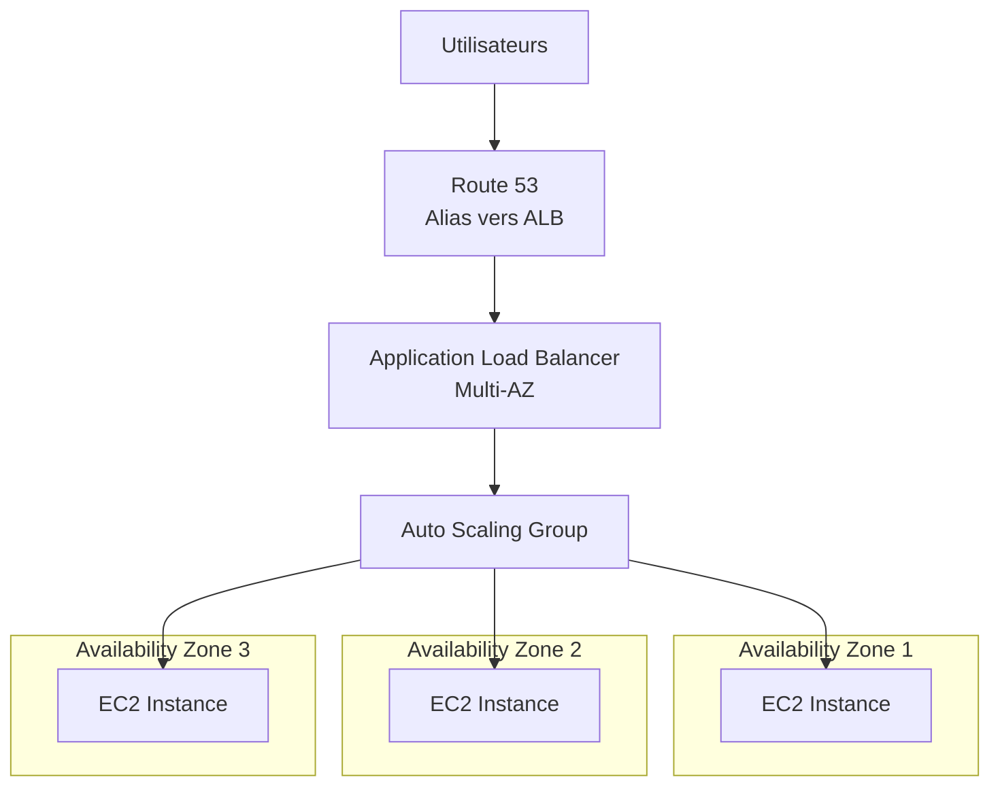

### Pourquoi ces choix

L'ALB est prefere au NLB car on traite du trafic HTTP/HTTPS — l'ALB comprend le protocole applicatif et peut faire du routage intelligent. L'ASG gere le scaling automatique : quand le CPU depasse 70%, on ajoute des instances ; quand il descend sous 30%, on en retire. Le Multi-AZ garantit que la panne d'une zone ne tue pas le site. Route 53 avec un alias evite de payer pour les requetes DNS (les alias records vers les ressources AWS sont gratuits).

Le point crucial est que l'application est **stateless** : chaque requete est independante, aucune instance ne conserve de donnee entre deux requetes. C'est ce qui rend le scaling horizontal possible — on peut ajouter ou retirer des instances sans perdre quoi que ce soit.

💡 **Astuce SAA**
→ Des que le scenario dit "pas de session", "pas de donnees utilisateur", "contenu identique pour tous" — pense pattern stateless : ALB + ASG Multi-AZ + Route 53.

---

## Pattern 2 — Application Web Stateful : MyClothes.com

### Le probleme

MyClothes.com est un site e-commerce. Chaque utilisateur a un panier d'achat qui doit persister entre les requetes. Si l'utilisateur clique sur "Ajouter au panier" puis charge une autre page, il s'attend a retrouver son panier. Mais avec un ALB qui repartit le trafic entre plusieurs instances, rien ne garantit que la deuxieme requete atterrit sur la meme instance que la premiere.

### Approche 1 — Sticky Sessions

La premiere solution est d'activer les **sticky sessions** (session affinity) sur l'ALB. Le load balancer genere un cookie qui lie un utilisateur a une instance specifique. Toutes les requetes suivantes de cet utilisateur sont envoyees a la meme instance.

Ca fonctionne, mais c'est fragile. Si l'instance tombe, le panier est perdu. Et le trafic n'est plus reparti equitablement — certaines instances sont surchargees pendant que d'autres sont sous-utilisees.

### Approche 2 — Sessions externalisees dans ElastiCache

La meilleure approche est de **sortir l'etat de l'instance**. Au lieu de stocker le panier en memoire sur l'instance EC2, on le stocke dans **ElastiCache (Redis)**. Quand l'utilisateur ajoute un article, l'instance ecrit dans Redis. Quand une autre instance doit afficher le panier, elle lit depuis Redis.

Desormais, n'importe quelle instance peut traiter n'importe quelle requete. L'application redevient "stateless du point de vue de l'instance" meme si elle gere un etat utilisateur.

### L'architecture finale

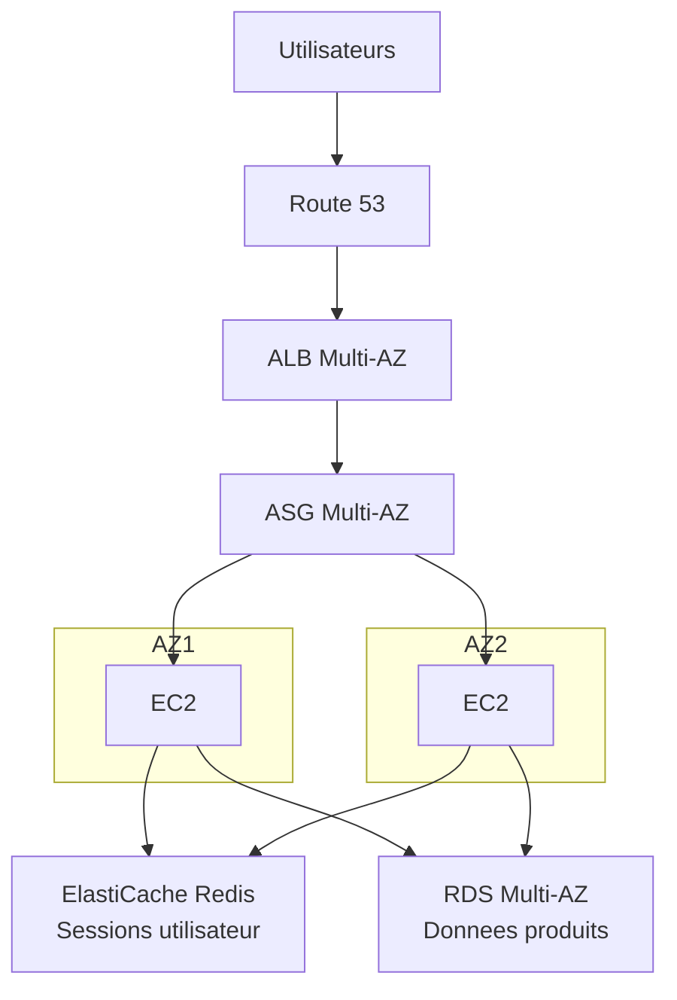

### Pourquoi ces choix

ElastiCache Redis est choisi pour les sessions car il offre une latence sous la milliseconde, la persistance optionnelle et la replication Multi-AZ. On pourrait aussi utiliser DynamoDB pour stocker les sessions (c'est un choix valide a l'examen), mais Redis est plus naturel pour des donnees ephemeres a acces rapide.

RDS Multi-AZ stocke les donnees produits, les commandes, les comptes utilisateurs — tout ce qui est persistant et relationnel. Le standby RDS dans une autre AZ prend le relais automatiquement en cas de panne.

⚠️ **Piege SAA**
→ Si le scenario mentionne "les utilisateurs perdent leur panier quand ils sont rediriges vers une autre instance", la reponse n'est PAS "activer les sticky sessions" (ca masque le probleme). La bonne reponse est "externaliser les sessions dans ElastiCache ou DynamoDB".

---

## Pattern 3 — CMS WordPress : MyWordPress.com

### Le probleme

Tu dois heberger un site WordPress qui doit scaler horizontalement. WordPress stocke ses medias (images, PDF) sur le systeme de fichiers local. Si tu lances plusieurs instances EC2, chaque instance a son propre disque — un media uploade sur l'instance A n'est pas visible depuis l'instance B.

### Pourquoi EBS ne suffit pas

Un volume EBS est attache a **une seule instance** dans **une seule AZ**. Meme avec EBS Multi-Attach (io1/io2), tu es limite a 16 instances dans la meme AZ et le filesystem doit etre cluster-aware. Ce n'est pas viable pour WordPress.

### La solution — EFS

**EFS (Elastic File System)** est un systeme de fichiers NFS manage qui peut etre monte simultanement par des centaines d'instances EC2 reparties sur plusieurs AZ. Quand une instance uploade une image dans `/var/www/html/wp-content/uploads/`, toutes les autres instances voient le fichier immediatement.

### L'architecture finale

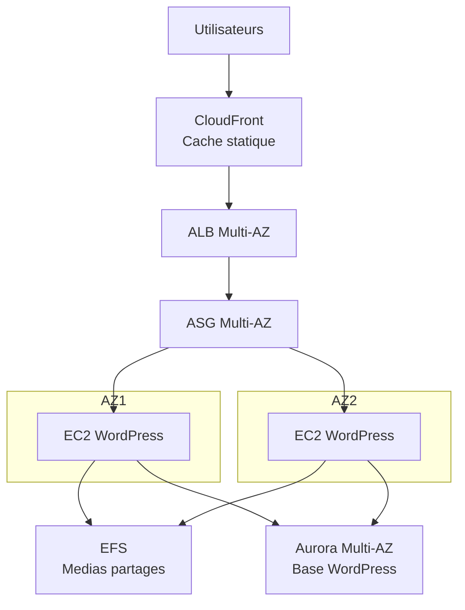

### Pourquoi ces choix

Aurora remplace le MySQL classique de WordPress car Aurora est 5x plus rapide, Multi-AZ natif avec failover automatique en 30 secondes, et propose jusqu'a 15 read replicas. EFS resout le probleme du stockage partage. CloudFront en facade cache les assets statiques (CSS, JS, images) pour reduire la charge sur les instances et ameliorer la latence mondiale.

Le cout d'EFS est plus eleve qu'EBS (environ 3x par Go), mais c'est le prix de la scalabilite horizontale. A l'examen, quand le scenario dit "stockage partage entre plusieurs instances EC2", la reponse est toujours EFS.

🧠 **Concept cle**
→ EBS = un disque pour une instance. EFS = un filesystem partage pour N instances. S3 = stockage objet (pas un filesystem montable nativement). Cette distinction est testee en boucle au SAA-C03.

---

## Pattern 4 — Site Web Serverless : MyBlog.com

### Le probleme

Tu veux creer un blog qui peut recevoir des millions de visiteurs sans gerer un seul serveur. Le contenu statique (HTML, CSS, JS) est genere cote client (Single Page Application). Les articles sont stockes dans une base de donnees. Les utilisateurs doivent pouvoir se connecter pour commenter.

### L'architecture

Le paradigme change completement par rapport aux patterns precedents. Il n'y a **aucun EC2**, aucun serveur a gerer.

Le contenu statique est heberge dans **S3** et distribue mondialement via **CloudFront**. L'application frontend (React, Vue, Angular) est servie depuis S3 et s'execute dans le navigateur de l'utilisateur.

Quand l'application a besoin de donnees (articles, commentaires), elle appelle une **API REST** exposee par **API Gateway**. Chaque endpoint declenche une **fonction Lambda** qui lit ou ecrit dans **DynamoDB**.

L'authentification est geree par **Amazon Cognito**, qui fournit le signup, le login, les tokens JWT, et l'integration avec les fournisseurs d'identite externes (Google, Facebook, SAML).

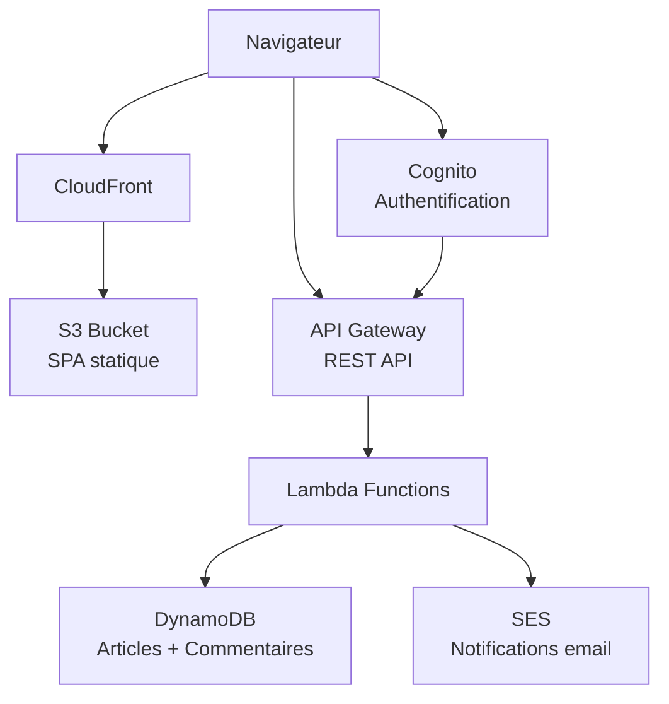

### Pourquoi ces choix

Ce pattern est entierement **serverless** : tu ne paies que ce que tu utilises, tu n'as aucune infrastructure a gerer, et ca scale automatiquement de 0 a des millions de requetes. DynamoDB est prefere a RDS car il scale horizontalement sans effort et offre des latences previsibles en millisecondes. API Gateway gere le throttling, la validation des requetes, les clefs API et la mise en cache.

Cognito est le choix naturel pour l'authentification dans un contexte serverless AWS. Il genere des tokens JWT que API Gateway peut valider directement, sans appeler Lambda — ce qui reduit le cout et la latence.

💡 **Astuce SAA**
→ Si le scenario dit "serverless", "pas de serveur a gerer", "scale a zero", "paiement a l'usage" — pense S3 + CloudFront + API Gateway + Lambda + DynamoDB. C'est le combo magique du serverless AWS.

---

## Pattern 5 — Backend Mobile : MyTodoList

### Le probleme

Tu developpes une application mobile de gestion de taches. Chaque utilisateur doit pouvoir creer, lire, modifier et supprimer ses taches. L'app doit fonctionner avec des millions d'utilisateurs, chacun n'accedant qu'a ses propres donnees. Les utilisateurs doivent pouvoir stocker des pieces jointes (photos, fichiers) dans le cloud.

### L'architecture

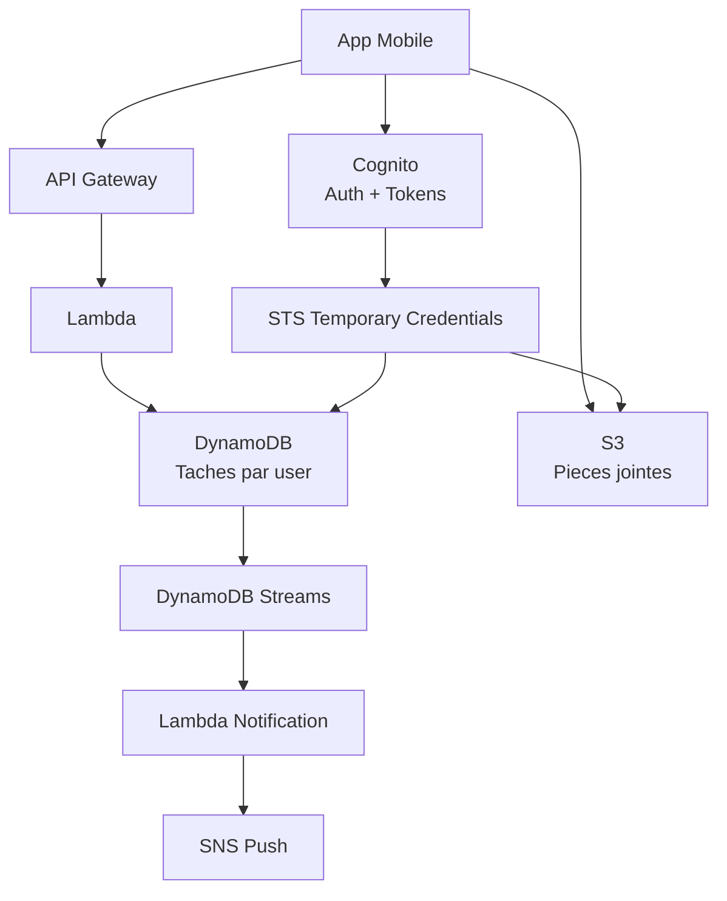

### Decisions d'architecture

Le point cle de ce pattern est **l'acces direct aux services AWS depuis le mobile**. Apres l'authentification via Cognito, l'application mobile recoit des **credentials temporaires** (via STS) qui lui permettent d'uploader directement dans S3 sans passer par Lambda. C'est plus rapide et moins cher que de faire transiter le fichier par API Gateway (qui a une limite de 10 Mo pour le payload).

Pour DynamoDB, on utilise des **fine-grained access control** via les politiques IAM associees aux roles Cognito. Chaque utilisateur ne peut lire/ecrire que les items dont la partition key correspond a son `user_id`. Pas besoin de logique d'autorisation dans Lambda — IAM s'en charge.

DynamoDB Streams permet de reagir aux changements dans la table. Quand un utilisateur cree une tache partagee, un Lambda ecoute le stream et envoie une notification push via SNS.

Pour ameliorer les performances de lecture, on peut activer le **DAX** (DynamoDB Accelerator) qui fournit un cache in-memory devant DynamoDB, avec des latences en microsecondes.

⚠️ **Piege SAA**
→ A l'examen, si on te demande "comment permettre a un utilisateur mobile d'uploader des fichiers dans S3 de facon securisee", la reponse est Cognito + credentials temporaires STS pour un acces direct a S3 — PAS "passer par API Gateway + Lambda" (trop lent, limite de taille).

---

## Pattern 6 — Microservices

### Le probleme

Tu geres une plateforme e-commerce composee de plusieurs services independants : catalogue produits, gestion des commandes, paiement, notification, expedition. Chaque equipe developpe et deploie son service independamment. Les services doivent communiquer entre eux sans couplage fort.

### L'architecture

Il existe deux formes principales d'architecture microservices sur AWS : synchrone et asynchrone.

La communication **synchrone** utilise des APIs. Chaque service expose une API REST ou gRPC derriere son propre ALB ou via API Gateway. Le service appelant connait l'endpoint de l'appele et fait un call direct. C'est simple mais cree un couplage : si le service de paiement est down, le service de commandes est bloque.

La communication **asynchrone** utilise des files de messages. Le service de commandes publie un message "nouvelle commande" dans **SQS** ou **SNS**. Les services interesses (paiement, stock, notification) consomment le message a leur rythme. Si un service est temporairement down, les messages s'accumulent dans la queue et seront traites quand il revient.

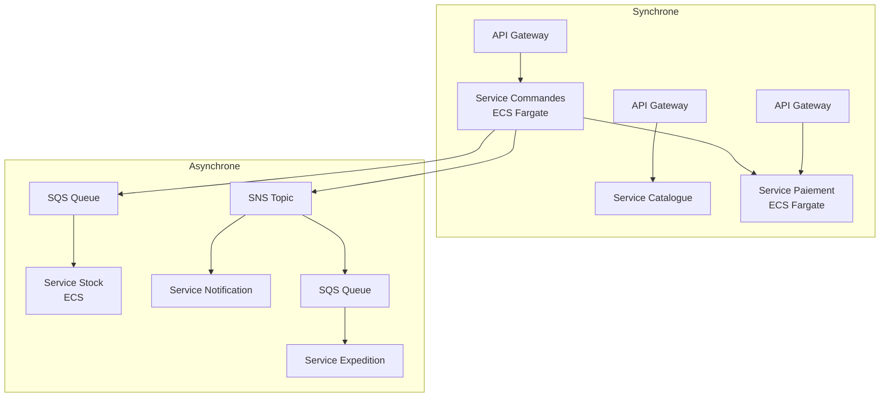

### Choix ECS/EKS vs Lambda

Pour des services avec un trafic constant et previsible, ou des traitements longs (superieur a 15 minutes), **ECS sur Fargate** est souvent prefere. Tu packages chaque service dans un container Docker, Fargate gere l'infrastructure. Pour des services event-driven avec un trafic en pics, **Lambda** est plus adapte et moins cher.

**EKS** (Kubernetes manage) entre en jeu quand l'equipe a deja une expertise Kubernetes ou quand la portabilite multi-cloud est un critere. EKS est plus complexe et plus cher a operer qu'ECS, mais offre plus de flexibilite.

Le decouplage via **SQS** ou **SNS** est fondamental. SQS est un modele point-a-point (un producteur, un consommateur). SNS est un modele publish-subscribe (un producteur, N consommateurs). On peut combiner les deux : SNS distribue a plusieurs SQS, chaque service ayant sa propre queue — c'est le pattern **fan-out**.

🧠 **Concept cle**
→ Microservices sur AWS = chaque service avec son propre ALB ou API Gateway + communication asynchrone via SQS/SNS. Le decouplage est la regle d'or — un service qui tombe ne doit pas faire tomber les autres.

---

## Pattern 7 — Distribution de mises a jour logicielles

### Le probleme

Tu distribues un logiciel desktop qui se met a jour automatiquement. Chaque release pese 500 Mo. Tu as 10 millions d'utilisateurs dans le monde qui telechargent la mise a jour en quelques heures. Sans CDN, tes serveurs d'origine seraient ecrases et la facture de bande passante serait colossale.

### L'architecture

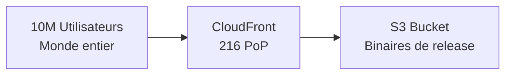

C'est le pattern le plus simple, mais il est redoutablement efficace. Tu uploades tes binaires dans S3. CloudFront les distribue depuis ses 216 points de presence (PoP) dans le monde. Le premier utilisateur dans une region donne declenche un cache miss — CloudFront va chercher le fichier dans S3 et le met en cache. Tous les utilisateurs suivants dans cette region recoivent le fichier depuis le cache CloudFront, sans toucher S3.

### Pourquoi ca marche financierement

Le cout de transfert de donnees depuis S3 vers CloudFront est **gratuit** (meme region). Tu paies uniquement le transfert CloudFront vers Internet, qui est moins cher que le transfert direct depuis S3 ou EC2. Pour 10 millions de telechargements de 500 Mo, la difference de cout est considerable.

De plus, CloudFront accepte les requetes de type **Range GET** — si un telechargement echoue a mi-chemin, le client peut reprendre ou il s'est arrete sans retelecharger depuis le debut.

💡 **Astuce SAA**
→ Si le scenario parle de "distribuer des fichiers volumineux a des utilisateurs dans le monde entier" ou "reduire le cout de bande passante pour des telechargements depuis S3", CloudFront est toujours la reponse.

---

## Pattern 8 — Traitement evenementiel (Event Processing)

### Le probleme

Tu dois reagir a des evenements en temps reel : un fichier uploade dans S3, une modification dans une base de donnees, un changement d'etat d'une instance EC2, un cron job periodique. Tu veux que chaque evenement declenche un traitement automatique sans gerer de serveur.

### Cas 1 — S3 Event Notifications

Quand un objet est cree dans S3, tu peux declencher automatiquement un Lambda, envoyer un message dans SQS ou publier dans SNS. Cas d'usage typique : un utilisateur uploade une image, Lambda la redimensionne en plusieurs tailles et stocke les miniatures dans un autre bucket.

### Cas 2 — EventBridge pour l'orchestration cross-service

**EventBridge** (anciennement CloudWatch Events) est le bus d'evenements central d'AWS. Il capture les evenements de presque tous les services AWS et permet de router chaque type d'evenement vers la cible appropriee. Tu peux ecrire des regles comme : "Quand une instance EC2 passe en etat terminated, declencher un Lambda qui met a jour l'inventaire CMDB et envoie une notification Slack."

EventBridge supporte aussi les **evenements schedules** (equivalent cron), les **evenements custom** (tes propres applications publient dans EventBridge), et le **schema registry** qui detecte automatiquement la structure des evenements.

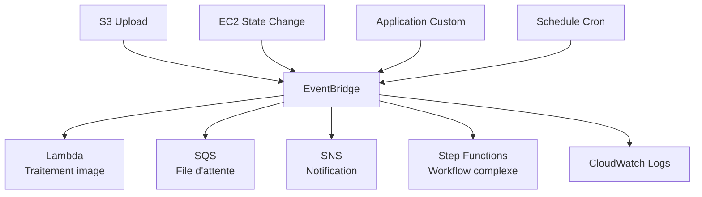

### Cas 3 — Step Functions pour les workflows complexes

Quand le traitement d'un evenement implique plusieurs etapes sequentielles ou paralleles avec de la logique conditionnelle, **Step Functions** orchestre le tout. Par exemple : recevoir un fichier, le valider, le transformer, l'enregistrer en base, envoyer une confirmation — avec gestion des erreurs et des retries a chaque etape.

⚠️ **Piege SAA**
→ S3 Event Notifications est limite a trois cibles : Lambda, SQS, SNS. Si le scenario a besoin de plus de flexibilite (router vers 10 cibles differentes selon le type d'evenement), utilise S3 → EventBridge. Depuis 2022, S3 peut publier directement dans EventBridge.

---

## Pattern 9 — Strategies de caching multi-niveaux

### Le probleme

Ton application web a une latence trop elevee et ta base de donnees est saturee. Tu veux reduire la charge et ameliorer les temps de reponse sans refactorer toute l'application.

### Les trois niveaux de cache

Le caching sur AWS s'organise en couches concentriques, de l'utilisateur vers la base de donnees :

**Niveau 1 — CloudFront (edge caching)**. Le cache le plus proche de l'utilisateur. CloudFront stocke les reponses HTTP dans ses 216 PoP. Si un utilisateur a Paris demande une page deja en cache au PoP de Paris, la reponse arrive en quelques millisecondes sans toucher ton infrastructure. Ce niveau est ideal pour le contenu statique (images, CSS, JS) et le contenu dynamique peu changeant (pages produit, articles).

**Niveau 2 — ElastiCache (application caching)**. Un cache Redis ou Memcached deploye dans ton VPC, accessible par tes instances EC2 ou tes fonctions Lambda. Quand ton application doit lire des donnees qui changent peu (profil utilisateur, catalogue produit, resultats de requetes couteuses), elle verifie d'abord le cache. Si c'est un hit, elle evite completement la base de donnees. Latence typique : moins d'une milliseconde.

**Niveau 3 — RDS Read Replicas (database caching)**. Ce n'est pas du caching au sens strict, mais ca sert le meme objectif : decharger la base principale. Tu crees des replicas en lecture seule qui absorbent les requetes SELECT. La base primaire ne gere plus que les ecritures.

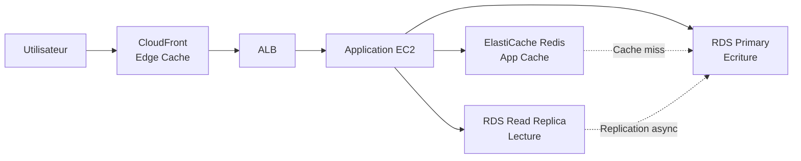

### Comment choisir le bon niveau

Si le contenu est le meme pour tous les utilisateurs et change rarement → **CloudFront**. Si le contenu est specifique a l'utilisateur ou depend de la logique metier → **ElastiCache**. Si tu veux simplement repartir la charge de lecture SQL → **Read Replicas**.

Dans la pratique et a l'examen, la meilleure architecture combine les trois niveaux. CloudFront en premiere ligne absorbe 80% du trafic statique. ElastiCache gere les donnees applicatives chaudes. Les Read Replicas etalent les requetes SQL restantes.

🧠 **Concept cle**
→ A l'examen, cherche toujours la couche de cache la plus proche de l'utilisateur. CloudFront > ElastiCache > Read Replica. Plus le cache est proche de l'utilisateur, plus le gain de performance est important.

---

## Pattern 10 — Bloquer une adresse IP : la comparaison complete

### Le probleme

Ton application subit des requetes malveillantes depuis une adresse IP specifique (ou une plage). Tu veux bloquer cette IP. AWS offre plusieurs mecanismes a differents niveaux du stack reseau. L'examen SAA-C03 teste ta capacite a choisir le bon outil selon le scenario.

### Les options

**NACL (Network ACL)** — Niveau sous-reseau. La NACL est un firewall stateless qui opere au niveau du sous-reseau VPC. Tu peux creer une regle DENY explicite pour une IP ou un CIDR. C'est le **seul** mecanisme qui permet de DENY une IP au niveau reseau. Les regles sont evaluees par numero, de la plus basse a la plus haute.

**Security Group** — Niveau instance. Le Security Group est un firewall stateful qui n'a **que des regles ALLOW**. Tu ne peux PAS bloquer une IP specifique avec un Security Group. Tu peux seulement autoriser certaines IPs ou certains Security Groups. C'est une distinction fondamentale testee a l'examen.

**WAF (Web Application Firewall)** — Niveau application (couche 7). WAF s'attache a un ALB, API Gateway ou CloudFront. Il peut bloquer des IPs via des **IP sets**, mais aussi bloquer des requetes basees sur le contenu (SQL injection, XSS, patterns HTTP). WAF est plus granulaire que NACL car il comprend le protocole HTTP.

**CloudFront Geo-Restriction** — Niveau CDN. Si tu veux bloquer tout un pays plutot qu'une IP specifique, CloudFront offre une geo-restriction native. Tu definis une whitelist ou blacklist de pays.

### Comparaison synthetique

| Critere | NACL | Security Group | WAF | CloudFront Geo |
|---------|------|---------------|-----|----------------|
| Niveau | Sous-reseau | Instance | Application (L7) | CDN |
| Peut DENY une IP | Oui | Non | Oui | Non (pays) |
| Stateful | Non | Oui | - | - |
| Comprend HTTP | Non | Non | Oui | Partiellement |
| Cout supplementaire | Non | Non | Oui | Non |
| Bloque avant l'instance | Oui | Non (au niveau instance) | Oui (avant ALB/Lambda) | Oui (avant origine) |

### Scenario avec CloudFront

Quand ton architecture inclut CloudFront, la situation change. Le trafic arrive d'abord chez CloudFront, puis passe par le WAF (si attache), puis atteint l'ALB, puis le Security Group, puis l'instance. Mais l'IP source vue par le Security Group et la NACL est celle de CloudFront, pas celle du client. Donc NACL et Security Group ne peuvent pas bloquer l'IP du client reel.

Dans ce cas, la seule option pour bloquer une IP specifique est **WAF attache a CloudFront**, car WAF inspecte l'en-tete `X-Forwarded-For` qui contient l'IP du client original.

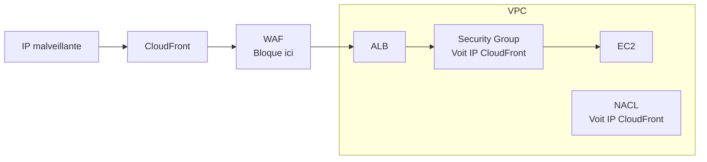

⚠️ **Piege SAA**
→ "Comment bloquer une IP quand CloudFront est devant l'ALB ?" La reponse est WAF sur CloudFront, PAS NACL. C'est un piege classique : avec CloudFront, NACL voit l'IP de CloudFront, pas celle du client.

---

## Pattern 11 — Instanciation rapide des applications

### Le probleme

Ton ASG lance de nouvelles instances quand le trafic augmente. Mais chaque instance met 10 minutes a demarrer : installation des paquets, telechargement du code, configuration de l'application. Pendant ces 10 minutes, les utilisateurs subissent une latence degradee ou des erreurs. Tu veux reduire ce temps de demarrage a moins d'une minute.

### Les solutions

**Golden AMI** — La technique la plus efficace. Au lieu d'installer les logiciels a chaque lancement, tu pre-installes tout dans une AMI custom. Tu lances une instance, tu installes ton OS, tes depots, ton runtime, ton application, tu configures tout, puis tu crees une AMI a partir de cette instance. Quand l'ASG lance une nouvelle instance avec cette Golden AMI, tout est deja installe. Le demarrage passe de 10 minutes a 30 secondes.

**User Data** — Un script Bash execute au premier boot de l'instance. Utile pour les configurations legeres : recuperer la derniere version du code, activer un service, ecrire un fichier de config dynamique. Mais si le script telecharge des centaines de paquets, ca ralentit le demarrage. La bonne pratique est de combiner Golden AMI (gros de l'installation) avec User Data (configuration dynamique).

**RDS Snapshots** — Au lieu de creer une base vide et de restaurer un dump SQL (qui peut prendre des heures pour une base volumineuse), tu restaures depuis un **snapshot RDS**. Le snapshot est une copie point-in-time du volume EBS sous-jacent. La restauration cree une nouvelle instance RDS avec toutes les donnees deja en place — c'est beaucoup plus rapide qu'un import SQL.

**EBS Snapshots** — Meme principe pour les volumes de donnees. Si ton application a besoin de 100 Go de donnees de reference au demarrage, tu stockes ces donnees sur un volume EBS, tu crees un snapshot, et tu attaches un volume cree depuis ce snapshot a chaque nouvelle instance. Avec **EBS Fast Snapshot Restore**, le volume est pleinement performant des le premier acces, sans la latence habituelle du premier read.

### La combinaison ideale

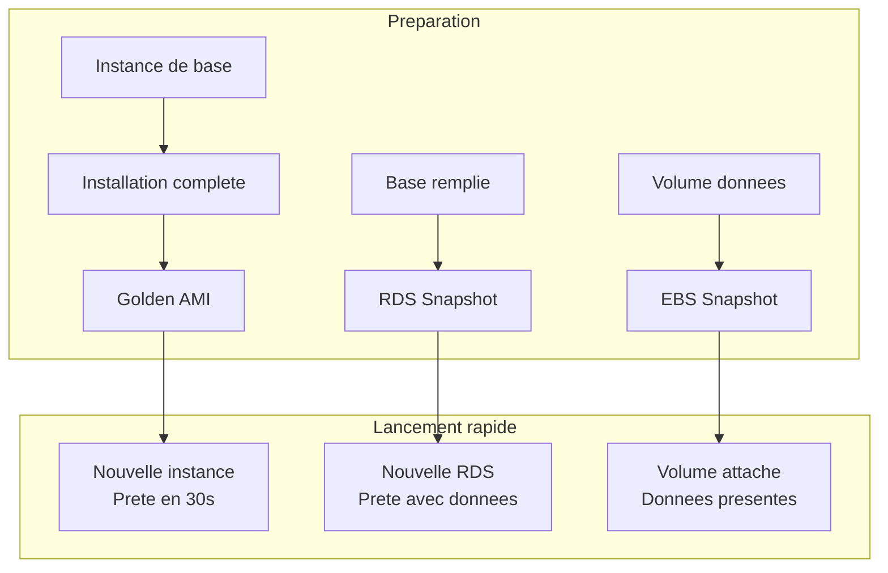

💡 **Astuce SAA**
→ "Comment reduire le temps de demarrage d'une instance EC2 dans un ASG ?" = Golden AMI. Si la question mentionne aussi des configs dynamiques = Golden AMI + User Data. Pour les bases de donnees = RDS Snapshots.

---

## Pattern 12 — Elastic Beanstalk

### Ce que c'est

Elastic Beanstalk est un service **PaaS** (Platform as a Service) qui orchestre automatiquement le provisioning d'une stack complete : EC2, ASG, ALB, RDS, CloudWatch, et plus. Tu uploades ton code, tu choisis la plateforme (Node.js, Python, Java, Docker, etc.), et Beanstalk deploie tout.

Sous le capot, Beanstalk cree des ressources CloudFormation. Tu gardes le controle total de ces ressources — tu peux les modifier via la console EC2, les fichiers `.ebextensions`, ou la CLI Beanstalk. Ce n'est pas une boite noire.

### Quand l'utiliser

Beanstalk est ideal pour les developpeurs qui veulent deployer rapidement une application web sans devenir experts en infrastructure AWS. C'est aussi un excellent choix pour les environnements de developpement et de staging. Pour la production d'un gros systeme, les equipes preferent souvent un controle plus fin avec ECS, EKS ou des stacks CloudFormation custom.

### Les modes de deploiement

Beanstalk propose plusieurs strategies de deploiement, et l'examen les teste :

**All at once** — deploie sur toutes les instances en meme temps. Rapide mais cause un downtime. Adapte aux environnements de dev.

**Rolling** — deploie par lots (batch). Pendant le deploiement, certaines instances sont sur l'ancienne version, d'autres sur la nouvelle. Pas de downtime mais capacite reduite temporairement.

**Rolling with additional batch** — comme Rolling, mais lance des instances supplementaires avant de retirer les anciennes. La capacite n'est jamais reduite. Cout supplementaire temporaire.

**Immutable** — lance un nouveau ASG complet avec la nouvelle version, puis switch le trafic. Rollback facile (il suffit de terminer le nouveau ASG). Plus lent et plus couteux mais plus sur.

**Blue/Green** — pas natif a Beanstalk (c'est un pattern externe). Tu crees un nouvel environnement Beanstalk complet, tu testes, puis tu swap les URL via Route 53 ou le swap d'environnement Beanstalk. Zero downtime et rollback instantane.

### Composants Beanstalk

Un **environment** Beanstalk peut etre de type **Web Server** (ALB + ASG + EC2 pour servir du trafic HTTP) ou **Worker** (SQS + ASG + EC2 pour traiter des messages en arriere-plan). Tu peux avoir plusieurs environments dans une meme **application**, avec un environment par stage (dev, staging, prod).

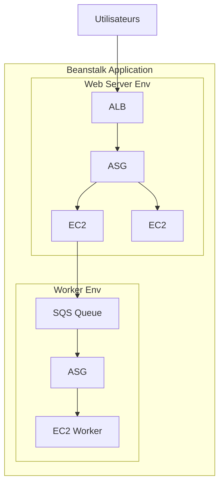

⚠️ **Piege SAA**
→ Beanstalk n'est PAS serverless. Il provisionne des EC2. Si le scenario veut "zero gestion de serveur", la reponse est Lambda/Fargate, pas Beanstalk. Beanstalk simplifie la gestion mais les serveurs existent.

---

## Bonnes pratiques transversales

Maintenant que tu connais les 12 patterns, voici les principes qui reviennent dans chaque architecture et que l'examen teste systematiquement.

**Toujours Multi-AZ.** Que ce soit pour EC2 (via ASG), RDS (standby), ElastiCache (replication) ou NAT Gateway — deploie dans au moins deux AZ. La panne d'une AZ ne doit jamais eteindre ton application.

**Decouple tout ce que tu peux.** Si deux services communiquent directement en synchrone, pose-toi la question : "Que se passe-t-il si le service appele est down ?" Si la reponse est "tout casse", insere une queue SQS entre les deux.

**Cache au bon niveau.** Ne mets pas tout dans ElastiCache par reflexe. Le contenu statique va dans CloudFront. Les sessions et les objets applicatifs vont dans ElastiCache. Les requetes SQL repetitives vont dans les Read Replicas.

**Automatise l'infrastructure.** Golden AMI pour les instances, RDS Snapshots pour les bases, CloudFormation ou Terraform pour le provisioning. Rien ne doit etre configure a la main en production.

**Securise a chaque couche.** WAF devant CloudFront ou l'ALB, Security Groups sur les instances, NACL sur les sous-reseaux, IAM pour les acces aux services. La securite est un oignon, pas un mur unique.

**Prefere le serverless quand c'est possible.** Si ton cas d'usage colle au modele evenementiel (requete-reponse, traitement de fichier, API), le serverless (Lambda + API Gateway + DynamoDB) est moins cher, plus scalable et plus simple a operer que EC2/ECS.

---

## Resume

Ce module est probablement le plus important de ta preparation SAA-C03. Les 12 patterns couvrent l'essentiel des scenarios d'architecture que tu rencontreras a l'examen :

- **Stateless** (WhatsTheTime.com) : ALB + ASG Multi-AZ + Route 53 — quand il n'y a pas d'etat.
- **Stateful** (MyClothes.com) : ElastiCache pour les sessions, pas de sticky sessions — externalise l'etat.
- **CMS/WordPress** (MyWordPress.com) : EFS pour le stockage partage, Aurora pour la base — scale horizontal.
- **Serverless** (MyBlog.com) : S3 + CloudFront + API Gateway + Lambda + DynamoDB + Cognito — zero serveur.
- **Mobile** (MyTodoList) : Cognito + STS credentials + acces direct S3 — ne pas tout faire passer par Lambda.
- **Microservices** : ECS/EKS + ALB + SQS/SNS fan-out — decouplage asynchrone.
- **Distribution logicielle** : CloudFront + S3 — simple, pas cher, mondial.
- **Event processing** : S3 Events + EventBridge + Step Functions — reagir en temps reel.
- **Caching** : CloudFront → ElastiCache → Read Replica — trois niveaux complementaires.
- **Blocage IP** : WAF si CloudFront, NACL si pas de CloudFront, Security Group ne DENY jamais.
- **Instanciation rapide** : Golden AMI + User Data + RDS/EBS Snapshots — tout pre-installer.
- **Elastic Beanstalk** : PaaS AWS, deploiement simplifie, pas serverless — connaitre les modes de deploiement.

Pour chaque question d'examen, identifie d'abord le **type de probleme** (stateless ? stateful ? serverless ? evenementiel ?), puis associe le **pattern** correspondant. Les mauvaises reponses sont souvent des services valides mais pour un autre pattern.

---

## Snippets

<!-- snippet
id: aws_arch_stateless_web
type: concept
tech: aws
level: advanced
importance: high
format: knowledge
tags: aws,architecture,alb,asg,stateless,route53,saa
title: Pattern Stateless Web App (WhatsTheTime.com)
context: Architecture pour application web sans etat ni sessions utilisateur
content: Application stateless = ALB + ASG Multi-AZ + Route 53. Chaque requete est independante, aucun etat sur l'instance. Le scaling horizontal est possible car on peut ajouter/retirer des instances sans perte de donnees.
description: Pattern fondamental SAA-C03 pour les applications web sans etat.
-->

<!-- snippet
id: aws_arch_stateful_sessions
type: concept
tech: aws
level: advanced
importance: high
format: knowledge
tags: aws,architecture,elasticache,sessions,stateful,saa
title: Pattern Stateful — Sessions dans ElastiCache
context: Gestion d'etat utilisateur (panier, session) dans une architecture scalable
content: Externaliser les sessions dans ElastiCache Redis (ou DynamoDB) plutot que d'utiliser des sticky sessions sur l'ALB. Sticky sessions = couplage instance-utilisateur, perte de session si l'instance tombe, repartition inegale du trafic.
description: L'externalisation des sessions est la reponse type aux scenarios stateful SAA-C03.
-->

<!-- snippet
id: aws_arch_efs_shared_storage
type: concept
tech: aws
level: advanced
importance: high
format: knowledge
tags: aws,efs,ebs,storage,wordpress,saa
title: EFS vs EBS pour le stockage partage multi-instance
context: Besoin de partager des fichiers entre plusieurs instances EC2 (ex: WordPress medias)
content: EBS = un volume pour une instance dans une AZ. EFS = systeme de fichiers NFS partage entre N instances sur plusieurs AZ. Pour un CMS comme WordPress qui doit scaler horizontalement, EFS est obligatoire car les medias uploades doivent etre visibles par toutes les instances.
description: Distinction EBS/EFS fondamentale pour les scenarios de stockage partage SAA-C03.
-->

<!-- snippet
id: aws_arch_serverless_website
type: concept
tech: aws
level: advanced
importance: high
format: knowledge
tags: aws,serverless,s3,cloudfront,apigateway,lambda,dynamodb,cognito,saa
title: Architecture Serverless complete (MyBlog.com)
context: Site web entierement serverless avec authentification et API
content: Pattern serverless complet = S3 + CloudFront (frontend SPA) + API Gateway + Lambda + DynamoDB (backend) + Cognito (auth). Zero serveur a gerer, scale automatiquement de 0 a des millions, paiement a l'usage uniquement.
description: Le combo serverless de reference pour l'examen SAA-C03.
-->

<!-- snippet
id: aws_arch_mobile_cognito_s3
type: tip
tech: aws
level: advanced
importance: high
format: knowledge
tags: aws,cognito,s3,mobile,sts,saa
title: Upload S3 depuis mobile via Cognito + STS
context: Permettre a une app mobile d'uploader des fichiers dans S3 de facon securisee
content: Pour l'upload mobile vers S3, utiliser Cognito pour authentifier l'utilisateur puis obtenir des credentials temporaires STS. L'app accede directement a S3 sans passer par API Gateway/Lambda (limite a 10 Mo de payload). C'est plus rapide et moins cher.
description: Pattern mobile SAA-C03 pour l'acces direct aux services AWS.
-->

<!-- snippet
id: aws_arch_block_ip_waf_nacl
type: warning
tech: aws
level: advanced
importance: high
format: knowledge
tags: aws,waf,nacl,security-group,cloudfront,ip-blocking,saa
title: Bloquer une IP — WAF vs NACL vs Security Group
context: Comparaison des mecanismes de blocage d'IP selon l'architecture
content: Security Group ne peut PAS bloquer (DENY) une IP — il n'a que des regles ALLOW. NACL peut DENY mais si CloudFront est devant, NACL voit l'IP de CloudFront pas celle du client. Avec CloudFront, seul WAF peut bloquer l'IP reelle du client via X-Forwarded-For.
description: Piege classique SAA-C03 sur le blocage d'IP avec CloudFront.
-->

<!-- snippet
id: aws_arch_golden_ami
type: concept
tech: aws
level: advanced
importance: high
format: knowledge
tags: aws,ami,ec2,asg,bootstrap,saa
title: Golden AMI pour instanciation rapide
context: Reduire le temps de demarrage des instances EC2 dans un ASG
content: Golden AMI = AMI pre-configuree avec OS, runtime, application et dependances deja installes. Reduit le temps de boot de 10+ minutes a moins de 60 secondes. Combiner avec User Data pour les configs dynamiques. Pour les bases de donnees, utiliser RDS Snapshots au lieu de restaurer un dump SQL.
description: Technique d'optimisation du temps de demarrage EC2 testee au SAA-C03.
-->

<!-- snippet
id: aws_arch_beanstalk_modes
type: concept
tech: aws
level: advanced
importance: high
format: knowledge
tags: aws,beanstalk,deployment,paas,saa
title: Elastic Beanstalk — Modes de deploiement
context: Choisir le bon mode de deploiement Beanstalk selon le contexte
content: All at once = downtime, dev only. Rolling = par lots, capacite reduite. Rolling with additional batch = capacite maintenue. Immutable = nouveau ASG complet, rollback facile. Blue/Green = swap d'environnement via Route 53, zero downtime. Beanstalk n'est PAS serverless, il provisionne des EC2.
description: Les 5 modes de deploiement Beanstalk sont testes au SAA-C03.
-->

<!-- snippet
id: aws_arch_caching_levels
type: concept
tech: aws
level: advanced
importance: high
format: knowledge
tags: aws,caching,cloudfront,elasticache,read-replica,saa
title: Trois niveaux de cache AWS
context: Strategie de caching multi-niveaux pour optimiser performance et cout
content: Niveau 1 CloudFront (edge, contenu statique/semi-statique). Niveau 2 ElastiCache Redis (application, sessions, objets metier). Niveau 3 RDS Read Replicas (decharge les lectures SQL). Toujours cacher au niveau le plus proche de l'utilisateur pour un gain maximal.
description: Strategie de caching en couches pour l'examen SAA-C03.
-->

<!-- snippet
id: aws_arch_microservices_fanout
type: concept
tech: aws
level: advanced
importance: high
format: knowledge
tags: aws,microservices,sqs,sns,ecs,decoupling,saa
title: Microservices AWS — Decouplage SQS/SNS Fan-out
context: Communication asynchrone entre microservices
content: SQS = point-a-point (1 producteur, 1 consommateur). SNS = pub/sub (1 producteur, N consommateurs). Pattern fan-out = SNS distribue vers plusieurs SQS, chaque service a sa propre queue. Un service down ne bloque pas les autres, les messages s'accumulent et seront traites au retour.
description: Pattern de decouplage microservices fondamental pour le SAA-C03.
-->
