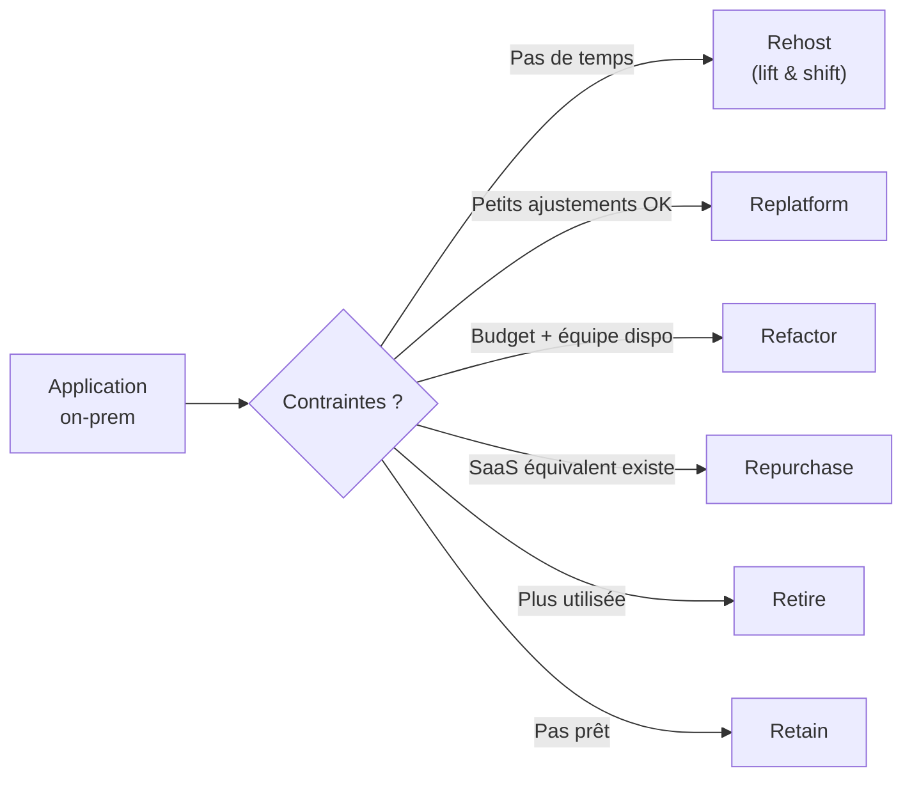
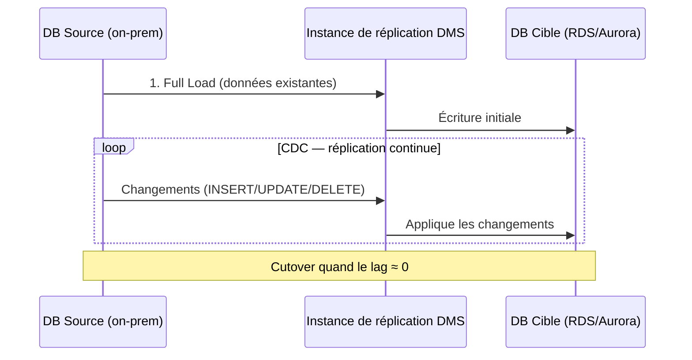
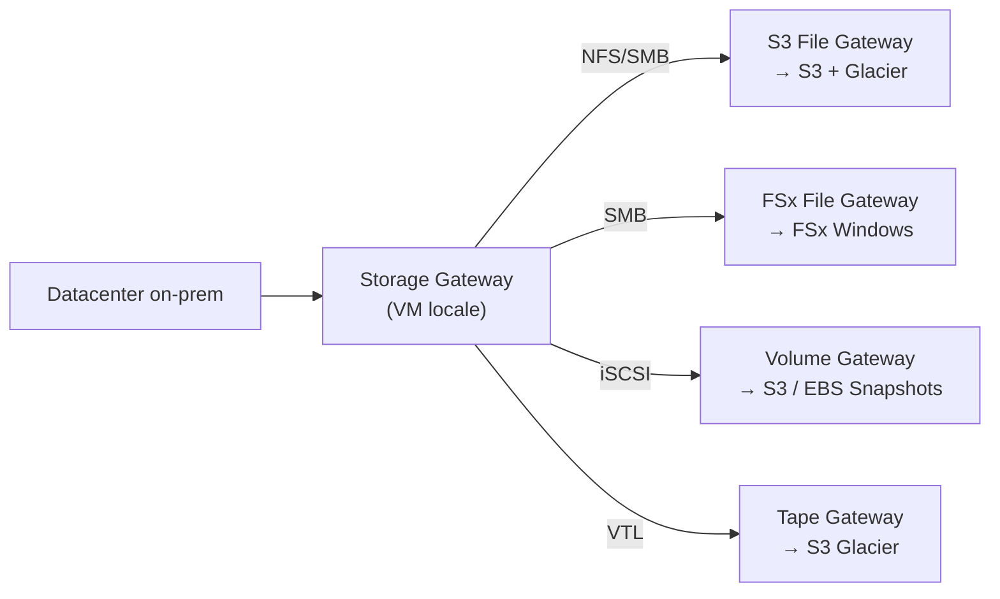
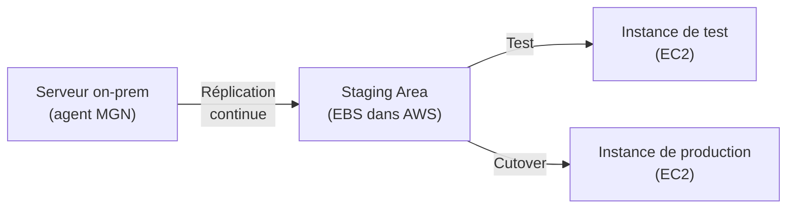
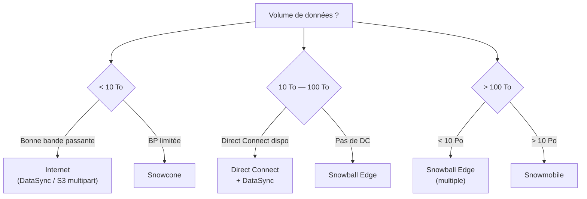

# Migration AWS — DMS, Snow Family, Storage Gateway, FSx, Backup

## Objectifs pédagogiques

À l'issue de ce module, tu seras capable de :

- Identifier la stratégie de migration adaptée à chaque workload parmi les 6R
- Configurer DMS pour migrer une base de données avec changement de moteur (hétérogène) ou sans (homogène)
- Choisir le bon appareil Snow Family selon le volume de données et les contraintes terrain
- Distinguer les quatre modes de Storage Gateway et leur usage en environnement hybride
- Concevoir un plan de transfert de données massives en combinant Internet, Direct Connect et Snow Family
- Mettre en place une politique de sauvegarde centralisée avec AWS Backup
- Décrire le fonctionnement d'Elastic Disaster Recovery pour les scénarios à faible RPO

---

## Pourquoi la migration est un sujet d'architecture, pas d'opérations

Migrer vers le cloud, ce n'est pas copier des fichiers. C'est prendre des décisions d'architecture qui engagent pour des années : quel service remplace quel composant on-prem, quel chemin emprunter pour transférer 50 To de données sans saturer la bande passante, comment maintenir la continuité de service pendant la bascule.

AWS propose une galaxie de services de migration — chacun résout un problème précis. Le piège courant en SAA-C03, c'est de confondre leurs périmètres. DMS migre des bases de données, DataSync transfère des fichiers, Snow Family déplace des volumes physiques, Storage Gateway crée un pont hybride permanent. Ce module démêle tout ça.

---

## Les 6R — stratégies de migration cloud

> **SAA-C03** — **DataSync** = transférer/migrer. **Storage Gateway** = accès hybride continu (pas interchangeables). Vault Lock **compliance** = immuable (personne ne supprime). Vault Lock **governance** = admins peuvent contourner.

Avant de choisir un outil, il faut choisir une stratégie. AWS définit six approches, connues sous le nom de 6R :

| Stratégie | Principe | Exemple |
|-----------|----------|---------|
| **Rehost** (lift & shift) | Déplacer tel quel vers le cloud | VM on-prem → EC2 via MGN |
| **Replatform** (lift & reshape) | Petits ajustements sans réécriture | MySQL on-prem → RDS MySQL |
| **Refactor** (re-architect) | Réécriture pour exploiter le cloud-native | Monolithe → microservices Lambda/ECS |
| **Repurchase** | Remplacer par un SaaS | CRM interne → Salesforce |
| **Retire** | Éteindre l'application | Outil obsolète sans utilisateurs |
| **Retain** | Garder on-prem (pas prêt / pas rentable) | Mainframe critique avec dette technique massive |

🧠 **Point SAA** — En examen, le scénario décrit souvent un contexte ("l'équipe n'a pas le temps de réécrire", "le budget est limité", "l'application doit être cloud-native"). La bonne réponse dépend de la contrainte, pas d'une préférence technique. Rehost est rapide mais ne profite pas des services managés. Refactor est optimal à long terme mais coûteux en effort initial.

<!-- snippet
id: aws_migration_6r_strategies
type: concept
tech: aws
level: advanced
importance: high
format: knowledge
tags: aws,migration,6r,strategy
title: Les 6R de migration cloud
content: Les 6R définissent six stratégies de migration : Rehost (lift & shift, rapide mais pas optimisé), Replatform (petits ajustements comme passer à RDS), Refactor (réécriture cloud-native), Repurchase (remplacer par un SaaS), Retire (éteindre) et Retain (garder on-prem). Le choix dépend des contraintes de temps, budget et compétences — pas d'une préférence technique.
description: En SAA-C03, la question teste ta capacité à choisir la bonne stratégie selon le contexte décrit dans le scénario.
-->

---

## AWS Database Migration Service (DMS)

DMS est le service managé pour migrer des bases de données vers AWS. Il fonctionne avec une **instance de réplication** (EC2 sous le capot) qui lit les données de la source, les transforme si nécessaire, et les écrit dans la cible.

### Migration homogène vs hétérogène

| Type | Source → Cible | Outil requis | Exemple |
|------|---------------|-------------|---------|
| **Homogène** | Même moteur | DMS seul | Oracle → RDS Oracle |
| **Hétérogène** | Moteur différent | SCT + DMS | Oracle → Aurora PostgreSQL |

La distinction est importante : pour une migration homogène (Oracle → Oracle sur RDS), **SCT n'est pas nécessaire** puisque le schéma reste identique. DMS seul transfère les données. Si la question propose SCT dans un scénario Oracle → Oracle, c'est un piège.

Autre piège fréquent pour Oracle sur RDS : les outils natifs Oracle comme **RMAN (Recovery Manager)** ne sont pas supportés dans RDS, car tu n'as pas accès au système de fichiers sous-jacent de l'instance. RDS gère les backups via ses propres mécanismes (snapshots automatiques vers S3). Ne pas choisir RMAN comme solution de backup ou migration vers RDS.

Pour une migration hétérogène, tu dois d'abord convertir le schéma avec **AWS Schema Conversion Tool (SCT)**. SCT analyse les procédures stockées, les vues, les types de données et produit un rapport de conversion — certains éléments se convertissent automatiquement, d'autres nécessitent une intervention manuelle.

### Continuous Data Replication (CDC)

DMS ne se limite pas à une migration ponctuelle. En mode **CDC** (Change Data Capture), il réplique en continu les changements de la source vers la cible. C'est ce qui permet une migration avec un temps d'arrêt minimal : tu lances la migration initiale (full load), puis DMS capture chaque INSERT/UPDATE/DELETE en temps réel jusqu'au moment du cutover.

💡 **Astuce SAA** — DMS ne sert pas qu'aux migrations on-prem → AWS. Il est aussi utilisé pour les migrations **intra-AWS** : par exemple, migrer d'un cluster Aurora Provisioned vers un cluster Aurora Serverless, ou d'un RDS MySQL vers Aurora. Dès qu'il faut migrer une base avec un **downtime minimal**, DMS avec CDC est la réponse — quel que soit le sens de la migration. DMS supporte aussi la migration vers S3 (export) et depuis S3 (import), un cas fréquent pour alimenter un data lake à partir d'une base transactionnelle.

⚠️ **Piège** — L'instance de réplication DMS tourne sur EC2 dans ton VPC. Si source et cible sont dans des réseaux différents, tu dois configurer le VPC peering ou un VPN. Et si la source est on-prem, il faut un Direct Connect ou un VPN site-to-site.

<!-- snippet
id: aws_dms_cdc_replication
type: concept
tech: aws
level: advanced
importance: high
format: knowledge
tags: aws,dms,migration,cdc,database
title: DMS — migration avec réplication continue (CDC)
content: AWS DMS migre des bases de données via une instance de réplication EC2. En mode CDC (Change Data Capture), DMS réplique les changements en continu après le full load initial, ce qui permet un cutover avec un temps d'arrêt minimal. Pour les migrations hétérogènes (Oracle → Aurora PostgreSQL), il faut d'abord convertir le schéma avec AWS SCT (Schema Conversion Tool).
description: DMS est la réponse SAA à toute question de migration de base de données — CDC est la clé pour les scénarios à downtime minimal.
-->

### Spécificités RDS & Aurora

Pour migrer **vers RDS MySQL** :
- **mysqldump** fonctionne pour les petites bases (< quelques Go), mais bloque la source pendant l'export
- **DMS** est préférable pour les grosses bases ou quand tu veux du CDC

Pour migrer **vers Aurora** :
- Depuis RDS MySQL/PostgreSQL : crée un **Aurora Read Replica** de ton instance RDS, puis **promote** cette replica en cluster Aurora autonome. Temps d'arrêt quasi nul.
- Depuis une base externe : utilise DMS ou un snapshot importé via S3 (Aurora MySQL uniquement)

🧠 **Point SAA** — "Migrer de RDS MySQL vers Aurora avec un minimum de downtime" → la réponse est Aurora Read Replica + promotion, pas DMS. DMS est pour les migrations depuis l'extérieur d'AWS ou entre moteurs différents.

---

## Snow Family — transfert physique de données

Quand tu as 10 To, 100 To ou 1 Po de données à migrer, Internet ne suffit plus. À 1 Gbps de bande passante, transférer 100 To prend environ 12 jours — sans compter la saturation du réseau pour le reste de l'entreprise. AWS Snow Family résout ce problème avec des appareils physiques envoyés par courrier.

| Appareil | Capacité stockage | Capacité compute | Cas d'usage principal |
|----------|-------------------|-------------------|----------------------|
| **Snowcone** | 8 To HDD / 14 To SSD | 2 vCPU, 4 Go RAM | Environnements contraints (drone, usine, terrain) |
| **Snowball Edge Storage Optimized** | 80 To | 40 vCPU, 80 Go RAM | Migration massive de données |
| **Snowball Edge Compute Optimized** | 42 To | 52 vCPU, 208 Go RAM | Traitement local avant transfert |
| **Snowmobile** | 100 Po | — | Migrations à l'échelle de l'exaoctet |

### Edge computing avec Snow

Snow Family ne sert pas qu'au transfert. Snowball Edge et Snowcone embarquent des capacités de calcul : tu peux exécuter des instances EC2 ou des fonctions Lambda directement sur l'appareil, en environnement déconnecté. C'est utilisé dans les cas suivants :

- Traitement de données IoT en usine sans connectivité fiable
- Pré-traitement vidéo sur un site de tournage isolé
- Collecte et analyse de données en zone militaire ou de catastrophe

💡 **Astuce** — Snowcone est le seul appareil assez petit pour être monté sur un drone ou glissé dans un sac à dos. Il supporte **DataSync Agent** en mode offline pour synchroniser les données une fois reconnecté.

⚠️ **Piège SAA** — Snowmobile est un camion semi-remorque. AWS le déplace physiquement vers ton datacenter. C'est réservé aux transferts > 10 Po. En dessous, plusieurs Snowball Edge sont plus pratiques.

<!-- snippet
id: aws_snow_family_capacity
type: concept
tech: aws
level: advanced
importance: high
format: knowledge
tags: aws,snow,snowball,snowcone,migration
title: Snow Family — capacités et cas d'usage
content: Snowcone (8-14 To) pour environnements contraints et edge léger, Snowball Edge Storage Optimized (80 To) pour migrations massives, Snowball Edge Compute Optimized (42 To, 52 vCPU) pour traitement local, Snowmobile (100 Po) pour les migrations à l'échelle de l'exaoctet. Tous les appareils Snow sont chiffrés (KMS) et permettent un transfert physique sécurisé quand le réseau est insuffisant.
description: La règle SAA : au-delà de quelques To avec une bande passante limitée, Snow Family est plus rapide et plus économique que le réseau.
-->

---

## AWS Storage Gateway — le pont hybride

Storage Gateway est un service qui connecte ton infrastructure on-prem aux services de stockage AWS. Tu déploies une appliance virtuelle (VM) dans ton datacenter, et cette appliance expose des protocoles standards (NFS, SMB, iSCSI, VTL) tout en stockant les données dans S3, FSx ou Glacier.

### Les quatre modes

| Mode | Protocole | Backend AWS | Cas d'usage |
|------|-----------|-------------|-------------|
| **S3 File Gateway** | NFS / SMB | S3 (+ lifecycle vers Glacier) | Partage de fichiers avec tiering automatique |
| **FSx File Gateway** | SMB | Amazon FSx for Windows | Cache local pour FSx, accès faible latence |
| **Volume Gateway — Cached** | iSCSI | S3 + snapshots EBS | Volumes block avec cache local, données dans S3 |
| **Volume Gateway — Stored** | iSCSI | S3 (backup async) | Données locales complètes, backup vers S3 |
| **Tape Gateway** | VTL (iSCSI) | S3 Glacier / Deep Archive | Remplacement de librairies de bandes physiques |

🧠 **Point SAA** — La distinction Cached vs Stored est un classique d'examen :
- **Cached** : seules les données fréquemment accédées sont en local, le reste est dans S3. Avantage : pas besoin de beaucoup de stockage local.
- **Stored** : toutes les données sont en local, avec un backup asynchrone vers S3. Avantage : accès local à faible latence pour tout le dataset.

<!-- snippet
id: aws_storage_gateway_modes
type: concept
tech: aws
level: advanced
importance: high
format: knowledge
tags: aws,storage-gateway,hybrid,s3,fsx
title: Storage Gateway — quatre modes hybrides
content: S3 File Gateway (NFS/SMB → S3 + Glacier), FSx File Gateway (SMB → FSx Windows), Volume Gateway Cached (iSCSI, cache local, données dans S3), Volume Gateway Stored (iSCSI, données locales, backup S3), Tape Gateway (VTL → S3 Glacier/Deep Archive). Le choix dépend du protocole requis et de l'emplacement souhaité des données — Storage Gateway est toujours la réponse pour un accès hybride on-prem/cloud transparent.
description: Storage Gateway = pont entre on-prem et AWS. Chaque mode cible un protocole et un pattern d'accès différent.
-->

---

## Amazon FSx — Systèmes de fichiers managés spécialisés

AWS propose quatre variantes de FSx, chacune conçue pour un type de workload et de protocole précis. Ce ne sont pas des systèmes de fichiers génériques comme EFS — ce sont des systèmes de fichiers natifs, entièrement managés, qui remplacent des solutions on-prem spécifiques.

### FSx for Windows File Server

C'est un serveur de fichiers Windows natif, entièrement managé. Il expose le protocole **SMB** et repose sur un système de fichiers **NTFS**. Tu retrouves toutes les fonctionnalités que tu connais d'un serveur de fichiers Windows classique : quotas, ACLs NTFS, shadow copies (VSS), DFS namespaces.

L'intégration avec **Active Directory** est native — tu peux joindre FSx à ton AD on-prem (via Direct Connect ou VPN) ou à un AWS Managed Microsoft AD. Les utilisateurs accèdent aux partages avec leurs credentials AD existants, exactement comme sur un serveur on-prem.

Le cas d'usage typique : **lift-and-shift de workloads Windows**. Tu as des applications qui dépendent de partages SMB (répertoires utilisateurs, dossiers partagés d'équipe, stockage applicatif), et tu veux les migrer vers AWS sans réécrire le code d'accès aux fichiers. FSx for Windows remplace ton serveur de fichiers, pas ton application.

### FSx for Lustre

Lustre est un système de fichiers parallèle haute performance, conçu pour les workloads qui ont besoin de débits massifs et d'une latence sous la milliseconde. FSx for Lustre peut atteindre des centaines de Go/s de débit et des millions d'IOPS.

Ce qui rend Lustre particulièrement puissant dans l'écosystème AWS, c'est son **intégration native avec S3**. Tu peux lier un système de fichiers Lustre à un bucket S3 : les données sont chargées **paresseusement** (lazy loading) depuis S3 quand un processus y accède pour la première fois, traitées à pleine vitesse sur Lustre, puis les résultats sont écrits directement dans S3. Tu n'as pas besoin de copier les données au préalable — Lustre les rend disponibles à la demande.

Cas d'usage : **HPC** (High Performance Computing), **entraînement de modèles de machine learning**, traitement vidéo, simulations financières — tout workload qui lit et écrit massivement en parallèle.

### FSx for NetApp ONTAP

FSx for NetApp ONTAP apporte la compatibilité la plus large. Il supporte **trois protocoles simultanément** : NFS, SMB et iSCSI. Tu peux monter le même système de fichiers depuis Linux (NFS), Windows (SMB) et des blocs iSCSI — sur la même instance FSx.

C'est la solution quand tu as un environnement hétérogène : des serveurs Linux, des postes Windows, des Mac, et tu veux un stockage partagé unique qui fonctionne avec tous. ONTAP supporte aussi les fonctionnalités avancées de NetApp : snapshots instantanés, cloning, compression, deduplication, tiering automatique.

Cas d'usage : **environnements multi-OS** avec des besoins de compatibilité large, ou migration d'un NetApp on-prem existant vers AWS.

### FSx for OpenZFS

FSx for OpenZFS est destiné aux workloads qui tournent déjà sur ZFS en on-prem. Il expose le protocole **NFS** et offre les fonctionnalités ZFS standards : snapshots, clones, compression, deduplication.

Cas d'usage : **migration de workloads ZFS on-prem** vers AWS sans changer le code applicatif ni les scripts de gestion.

### Comparaison des quatre variantes

| Variante | Protocole(s) | OS compatibles | Cas d'usage principal | Intégration S3 |
|----------|-------------|----------------|----------------------|----------------|
| **FSx for Windows** | SMB | Windows | Lift-and-shift Windows, partages AD | Non |
| **FSx for Lustre** | POSIX (Lustre client) | Linux | HPC, ML training, vidéo | Oui (lazy load + writeback) |
| **FSx for NetApp ONTAP** | NFS, SMB, iSCSI | Linux, Windows, macOS | Multi-OS, compatibilité large | Non |
| **FSx for OpenZFS** | NFS | Linux, macOS | Migration de workloads ZFS | Non |

🧠 **Points SAA** :
- "Windows shared file system" ou "partage SMB avec Active Directory" → **FSx for Windows File Server**
- "HPC", "machine learning training data" ou "high-performance parallel file system" → **FSx for Lustre**
- "Lustre + S3" → les données sont chargées **paresseusement** depuis S3 quand un processus y accède, traitées sur Lustre, puis les résultats sont écrits dans S3
- "Multi-protocol" ou "NFS + SMB sur le même stockage" → **FSx for NetApp ONTAP**
- "ZFS on-prem migration" → **FSx for OpenZFS**

<!-- snippet
id: aws_fsx_types_comparison
type: concept
tech: aws
level: advanced
importance: high
format: knowledge
tags: aws,fsx,storage,windows,lustre,ontap,zfs
title: Amazon FSx — quatre variantes de systèmes de fichiers managés
content: FSx for Windows File Server (SMB, NTFS, intégration AD) pour lift-and-shift Windows. FSx for Lustre (haute performance, intégration S3 native) pour HPC et ML training. FSx for NetApp ONTAP (NFS + SMB + iSCSI) pour environnements multi-OS. FSx for OpenZFS (NFS, ZFS) pour migration de workloads ZFS on-prem. Chaque variante cible un protocole et un cas d'usage spécifique — le choix dépend du workload source.
description: En SAA-C03, le mot-clé dans le scénario détermine la variante FSx : "Windows/SMB/AD" → Windows, "HPC/ML" → Lustre, "multi-protocole" → ONTAP, "ZFS" → OpenZFS.
-->

<!-- snippet
id: aws_fsx_lustre_s3_integration
type: tip
tech: aws
level: advanced
importance: high
format: knowledge
tags: aws,fsx,lustre,s3,hpc,ml
title: FSx for Lustre — intégration S3 avec lazy loading
content: FSx for Lustre peut être lié à un bucket S3. Les données sont chargées paresseusement (lazy loading) depuis S3 la première fois qu'un processus y accède, traitées à pleine vitesse sur le système de fichiers Lustre, puis les résultats sont écrits directement dans S3. Tu n'as pas besoin de copier les données au préalable — Lustre les rend disponibles à la demande depuis S3.
description: Pattern SAA classique : "traiter des données S3 avec haute performance" → FSx for Lustre lié au bucket, pas de copie préalable nécessaire.
-->

---

## AWS Transfer Family — SFTP/FTPS/FTP managé

Transfer Family fournit un serveur SFTP, FTPS ou FTP entièrement managé, avec un stockage backend dans S3 ou EFS. C'est la solution quand des partenaires externes envoient des fichiers via des protocoles legacy et que tu veux les recevoir directement dans S3 sans gérer de serveur FTP.

| Protocole | Port | Chiffrement | Backend supporté |
|-----------|------|-------------|-----------------|
| SFTP | 22 | SSH | S3, EFS |
| FTPS | 990 | TLS | S3, EFS |
| FTP | 21 | Aucun | S3, EFS |

💡 **Astuce** — Transfer Family supporte l'authentification par clé SSH, par Active Directory (via AWS Directory Service), ou par un provider d'identité custom (Lambda). Les utilisateurs se connectent avec leur client FTP habituel, sans savoir qu'ils écrivent dans S3.

⚠️ **Piège** — FTP (sans S ni TLS) ne chiffre rien. Il ne doit être utilisé que dans un VPC privé, jamais exposé sur Internet. L'examen teste cette distinction.

<!-- snippet
id: aws_transfer_family_protocols
type: concept
tech: aws
level: advanced
importance: medium
format: knowledge
tags: aws,transfer,sftp,ftp,s3
title: Transfer Family — SFTP/FTPS/FTP managé vers S3
content: AWS Transfer Family fournit un serveur SFTP/FTPS/FTP managé avec stockage dans S3 ou EFS. Les partenaires externes utilisent leur client FTP standard, les fichiers arrivent directement dans S3. Supporte l'authentification par clé SSH, Active Directory ou custom (Lambda). FTP non chiffré doit rester dans un VPC privé — jamais sur Internet.
description: Transfer Family est la réponse SAA pour "recevoir des fichiers de partenaires externes via SFTP sans gérer d'infrastructure".
-->

---

## AWS DataSync — transfert planifié de données

DataSync est un service de transfert de données qui automatise et accélère le déplacement de fichiers entre un stockage on-prem et AWS, ou entre services AWS.

### Fonctionnement

Tu installes un **agent DataSync** (VM) dans ton datacenter. Cet agent se connecte à ta source (NFS, SMB, HDFS, ou un stockage objet on-prem) et transfère les données vers S3, EFS, FSx ou un autre service AWS. DataSync gère la planification, la vérification d'intégrité, le chiffrement en transit et la compression.

### DataSync vs Storage Gateway

| Critère | DataSync | Storage Gateway |
|---------|----------|-----------------|
| **Objectif** | Transférer des données (one-shot ou planifié) | Accès hybride continu (monter un volume/partage) |
| **Agent** | VM DataSync | VM Storage Gateway |
| **Protocole applicatif** | Aucun (transfert pur) | NFS, SMB, iSCSI, VTL |
| **Cas d'usage** | Migration initiale, synchronisation régulière | Partage de fichiers hybride permanent |
| **AWS → AWS** | Oui (S3 → EFS, EFS → FSx, etc.) | Non |

🧠 **Point SAA** — DataSync est la réponse pour les transferts planifiés et les migrations de NAS/NFS vers S3 ou EFS. Storage Gateway est la réponse pour un accès hybride permanent. Ce sont deux services complémentaires, pas concurrents.

<!-- snippet
id: aws_datasync_vs_storage_gateway
type: concept
tech: aws
level: advanced
importance: high
format: knowledge
tags: aws,datasync,storage-gateway,migration,transfer
title: DataSync vs Storage Gateway
content: DataSync transfère des données (migration ou synchronisation planifiée) entre on-prem et AWS ou entre services AWS, via un agent VM. Storage Gateway fournit un accès hybride permanent (NFS/SMB/iSCSI) entre on-prem et S3/FSx/Glacier. DataSync = déplacer des données. Storage Gateway = monter un stockage cloud comme un disque local. Les deux nécessitent une VM dans le datacenter on-prem.
description: Question SAA classique : "transférer régulièrement" → DataSync. "Accéder en continu" → Storage Gateway.
-->

---

## Application Migration Service (MGN) — lift & shift automatisé

MGN est le service de migration lift & shift d'AWS. Il remplace l'ancien CloudEndure Migration. Son principe : installer un agent léger sur chaque serveur source (physique ou VM), qui réplique en continu les données vers AWS. Quand tu es prêt, tu lances un **cutover** — MGN crée les instances EC2 équivalentes et tu bascules le trafic.

### Comment ça fonctionne

1. **Installation de l'agent** sur le serveur source (Linux ou Windows)
2. **Réplication continue** des blocs disque vers une staging area dans AWS (EBS)
3. **Test** : lancement d'instances de test pour valider la migration
4. **Cutover** : création des instances finales, bascule du DNS/LB

💡 **Astuce** — MGN supporte la migration de serveurs physiques, VMware, Hyper-V et même d'autres clouds. C'est la réponse standard pour "migrer des VM vers EC2 avec un minimum de downtime".

---

## AWS Backup — sauvegarde centralisée

AWS Backup centralise la gestion des sauvegardes pour la quasi-totalité des services AWS : EC2, EBS, RDS, Aurora, DynamoDB, EFS, FSx, S3, Storage Gateway, et même les VM VMware Cloud.

### Concepts clés

- **Backup Plan** : règle de sauvegarde (fréquence, rétention, fenêtre de transfert vers cold storage)
- **Backup Vault** : conteneur isolé pour les sauvegardes. Tu peux avoir plusieurs vaults avec des politiques d'accès différentes.
- **Vault Lock** : verrouillage WORM (Write Once Read Many) — une fois activé, personne ne peut supprimer les sauvegardes avant l'expiration de la rétention, pas même le root account. C'est la réponse aux exigences de conformité (HIPAA, SOC2).
- **Cross-Region Backup** : copie automatique des sauvegardes vers une autre région pour la protection contre les sinistres régionaux.
- **Cross-Account Backup** : copie vers un autre compte AWS, pour isoler les sauvegardes de l'environnement de production.

⚠️ **Piège SAA** — AWS Backup gère la sauvegarde, pas la réplication en temps réel. Pour un RPO de quelques secondes, tu as besoin d'Elastic Disaster Recovery, pas d'AWS Backup.

<!-- snippet
id: aws_backup_vault_lock
type: concept
tech: aws
level: advanced
importance: high
format: knowledge
tags: aws,backup,vault,compliance,worm
title: AWS Backup Vault Lock — protection WORM
content: AWS Backup Vault Lock applique une politique WORM (Write Once Read Many) sur un vault de sauvegarde. Une fois activé en mode compliance, personne — y compris le root account — ne peut supprimer les sauvegardes avant l'expiration de la rétention définie. Vault Lock est la réponse aux exigences réglementaires (HIPAA, SOC2) qui imposent l'immutabilité des sauvegardes. Supporte cross-region et cross-account pour l'isolation complète.
description: Vault Lock = immutabilité garantie des sauvegardes. C'est la réponse SAA pour "empêcher toute suppression de backup, même par un administrateur".
-->

---

## Elastic Disaster Recovery (DRS) — réplication continue

DRS (anciennement CloudEndure Disaster Recovery) réplique en continu tes serveurs on-prem ou cloud vers une staging area AWS. En cas de sinistre, tu lances un **failover** en quelques minutes — DRS crée les instances EC2 à partir des répliques et tu bascules le trafic.

| Métrique | Valeur typique DRS |
|----------|-------------------|
| **RPO** | Quelques secondes (réplication continue) |
| **RTO** | Quelques minutes (lancement d'instances) |
| **Coût au repos** | Faible (staging area = EBS gp3 compressé) |

La différence avec MGN : MGN est pour la migration (one-way, tu éteins la source après). DRS est pour le DR (bidirectionnel, tu peux faire un failback vers la source après résolution du sinistre).

🧠 **Point SAA** — "RPO de quelques secondes" + "serveurs on-prem" → DRS. "RPO de quelques heures" → AWS Backup suffit. Le module 17 couvre les stratégies DR globales (Backup & Restore, Pilot Light, Warm Standby, Active/Active) — DRS est l'outil qui implémente concrètement Pilot Light ou Warm Standby pour des serveurs physiques ou VM.

---

## VMware Cloud on AWS — overview

VMware Cloud on AWS permet d'exécuter des workloads VMware (vSphere, vSAN, NSX) directement sur l'infrastructure bare-metal d'AWS. C'est un service opéré conjointement par VMware et AWS.

Cas d'usage principaux :
- Étendre un datacenter VMware vers AWS sans réécrire les applications
- Utiliser les services AWS natifs (S3, RDS, Lambda) depuis des VM vSphere
- DR site pour un environnement VMware on-prem

💡 **Astuce SAA** — VMware Cloud on AWS est la réponse quand le scénario mentionne explicitement "VMware" et "étendre vers AWS" ou "DR pour VMware". Ce n'est pas une solution de migration vers EC2 — les VM restent sur vSphere.

---

## Transférer des données massives — arbre de décision

Le choix du mécanisme de transfert dépend de trois facteurs : le volume de données, la bande passante disponible et la contrainte de temps.

### Calcul de référence

| Volume | Bande passante | Durée estimée |
|--------|---------------|---------------|
| 1 To | 100 Mbps | ~1 jour |
| 10 To | 1 Gbps | ~1 jour |
| 100 To | 1 Gbps | ~12 jours |
| 100 To | 10 Gbps (Direct Connect) | ~1,2 jour |
| 1 Po | Snowball Edge (x13 appareils) | ~1 semaine (livraison incluse) |

### Arbre de décision

⚠️ **Piège SAA** — L'examen donne souvent un volume et une bande passante. Fais le calcul : si le transfert réseau prend plus de 7 jours, Snow Family est probablement la bonne réponse. Si Direct Connect est déjà en place, il change la donne.

<!-- snippet
id: aws_data_transfer_decision
type: concept
tech: aws
level: advanced
importance: high
format: knowledge
tags: aws,migration,transfer,snow,directconnect
title: Transfert de données massives — arbre de décision
content: Pour choisir le bon mécanisme de transfert : calcule le temps réseau (volume / bande passante). < 10 To avec bonne BP → Internet + DataSync. 10-100 To avec Direct Connect → DC + DataSync. Sans DC ou > 100 To → Snow Family. > 10 Po → Snowmobile. Règle pratique : si le transfert réseau dépasse 7 jours, Snow Family est plus rapide et moins cher.
description: L'examen SAA-C03 donne un volume et une bande passante — le calcul de durée détermine la bonne réponse.
-->

---

## Cas réel — migration d'un e-commerce on-prem vers AWS

**Contexte** : une entreprise e-commerce héberge son infrastructure dans un datacenter privé. Elle opère :
- 15 serveurs applicatifs VMware (Java/Tomcat)
- Une base Oracle 2 To (transactionnelle)
- Un NAS de 50 To (images produits, documents)
- Des sauvegardes sur bandes LTO

**Plan de migration** :

1. **Phase 1 — Données** : installation d'un agent DataSync sur le NAS. Synchronisation planifiée toutes les nuits vers S3. Les images produits sont disponibles dans S3 en parallèle de l'ancienne infrastructure. Durée : 2 semaines.

2. **Phase 2 — Base de données** : migration Oracle → Aurora PostgreSQL via SCT (conversion du schéma) puis DMS avec CDC. La base source continue de fonctionner pendant la réplication. Cutover un dimanche soir avec 15 minutes de downtime. Durée : 4 semaines (dont 2 de tests).

3. **Phase 3 — Serveurs** : migration des 15 VM via MGN. Réplication continue pendant 2 semaines, tests de cutover le week-end, bascule finale. Durée : 3 semaines.

4. **Phase 4 — Sauvegardes** : remplacement des bandes LTO par Tape Gateway pointant vers S3 Glacier Deep Archive. Mise en place d'AWS Backup avec Vault Lock pour la conformité. Rétention de 7 ans.

5. **Phase 5 — Décommissionnement** : extinction progressive du datacenter, résiliation du bail.

**Résultat** : migration complète en 3 mois, réduction de 40 % des coûts d'infrastructure, RPO passé de 24h (sauvegarde nocturne) à quelques secondes (DRS sur les serveurs critiques).

---

## Bonnes pratiques

- **Toujours commencer par les 6R** — classifier chaque application avant de choisir un outil
- **Tester le cutover** avant la migration réelle — MGN et DMS permettent des dry runs
- **Utiliser CDC** avec DMS pour minimiser le downtime lors de la migration de bases de données
- **Chiffrer systématiquement** — Snow Family utilise KMS, DataSync chiffre en transit, AWS Backup chiffre au repos
- **Activer Vault Lock** dès que des exigences de conformité imposent l'immutabilité des sauvegardes
- **Combiner les services** — DataSync pour la migration initiale, Storage Gateway pour l'accès hybride permanent après migration
- **Monitorer la réplication DMS** — le lag de réplication doit être proche de zéro avant le cutover
- **Prévoir le failback** avec DRS — tester la bascule retour vers la source, pas seulement le failover

---

## Résumé

La migration vers AWS est un problème d'architecture qui se résout en choisissant la bonne stratégie (6R) puis les bons outils. DMS migre les bases de données avec CDC pour un downtime minimal. Snow Family déplace les données physiquement quand le réseau ne suit pas. Storage Gateway crée un pont hybride permanent entre on-prem et AWS. DataSync transfère des fichiers de façon planifiée. MGN automatise le lift & shift de serveurs. AWS Backup centralise les sauvegardes avec Vault Lock pour la conformité. DRS fournit un DR à faible RPO par réplication continue. Le choix du mécanisme de transfert de données massives dépend toujours du calcul : volume / bande passante = durée. Si la durée dépasse une semaine, Snow Family gagne.

---

## Snippets

<!-- snippet
id: aws_dms_homogeneous_vs_heterogeneous
type: concept
tech: aws
level: advanced
importance: high
format: knowledge
tags: aws,dms,sct,migration,database
title: DMS — migration homogène vs hétérogène
content: Migration homogène (même moteur, ex. Oracle → RDS Oracle) : DMS seul suffit. Migration hétérogène (moteur différent, ex. Oracle → Aurora PostgreSQL) : il faut d'abord convertir le schéma avec AWS SCT (Schema Conversion Tool) puis utiliser DMS pour transférer les données. SCT génère un rapport de conversion identifiant les éléments qui nécessitent une intervention manuelle.
description: En SAA, "changement de moteur de base de données" = SCT + DMS. "Même moteur" = DMS seul.
-->

<!-- snippet
id: aws_aurora_migration_read_replica
type: tip
tech: aws
level: advanced
importance: high
format: knowledge
tags: aws,aurora,rds,migration
title: Migration RDS → Aurora via Read Replica
content: Pour migrer de RDS MySQL/PostgreSQL vers Aurora avec un minimum de downtime : crée un Aurora Read Replica de ton instance RDS, attends la synchronisation complète, puis promote la replica en cluster Aurora autonome. Le temps d'arrêt est quasi nul. Cette méthode est préférable à DMS pour une migration intra-AWS entre RDS et Aurora du même moteur.
description: "Migrer RDS vers Aurora avec minimum de downtime" → Aurora Read Replica + promotion. C'est la réponse SAA, pas DMS.
-->

<!-- snippet
id: aws_mgn_lift_shift
type: concept
tech: aws
level: advanced
importance: medium
format: knowledge
tags: aws,mgn,migration,rehost
title: Application Migration Service (MGN) — lift & shift
content: MGN installe un agent sur chaque serveur source (physique, VMware, Hyper-V ou autre cloud) et réplique en continu les blocs disque vers une staging area AWS (EBS). Le cutover crée les instances EC2 équivalentes en quelques minutes. MGN remplace CloudEndure Migration et supporte Linux et Windows. C'est la réponse standard pour "migrer des VM vers EC2 avec un minimum de downtime".
description: MGN = migration one-way (lift & shift). DRS = disaster recovery bidirectionnel (failover + failback). Ne pas confondre.
-->
