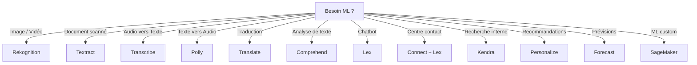

# Machine Learning AWS — Services managés (overview SAA-C03)

## Objectifs pédagogiques

- Identifier les services ML managés d'AWS et leur cas d'usage principal
- Savoir quel service choisir selon le besoin décrit dans un scénario d'examen
- Différencier les services pré-entraînés de SageMaker (ML custom)
- Connaître les services complémentaires souvent présents en SAA-C03

## Introduction

AWS propose une palette de services de Machine Learning **entièrement managés**. Pour le SAA-C03, tu n'as pas besoin de savoir construire un modèle — tu dois savoir **quel service résout quel problème**.

La logique est simple : AWS a créé un service spécialisé pour chaque grand domaine du ML (vision, langage, recherche, recommandation...). Quand l'examen décrit un besoin, tu dois reconnaître le mot-clé qui pointe vers le bon service.

---

## Services de Vision

> **SAA-C03** — Si la question mentionne…
> - "image analysis / analyse d'images" + "face detection / détection de visages" + "content moderation / modération de contenu" → **Rekognition**
> - "extract text from documents / extraire du texte de documents" + "OCR" + "forms / tables / invoices" → **Textract**
> - "speech-to-text" + "transcription" + "subtitles / sous-titres" → **Transcribe**
> - "text-to-speech" + "natural voice / voix naturelle" → **Polly**
> - "translation / traduction" + "multi-language" → **Translate**
> - "sentiment analysis / analyse de sentiments" + "NLP" + "entities / key phrases" → **Comprehend**
> - "chatbot / conversational bot" + "voice recognition / reconnaissance vocale" + "Alexa" → **Lex**
> - "custom ML model / modèle ML personnalisé" + "train / deploy / build" → **SageMaker**
> - "intelligent search / recherche intelligente" + "natural language / langage naturel" + "knowledge base" → **Kendra**
> - "personalized recommendations / recommandations personnalisées" + "like Amazon.com" → **Personalize**
> - "time-series forecasting / prévisions temporelles" + "demand planning / planification de la demande" → **Forecast**
> - "fraud detection / détection de fraude" + "online transactions" → **Fraud Detector**
> - ⛔ Pour le SAA-C03 : tu dois **reconnaître le bon service par le mot-clé**, pas construire un modèle. Chaque service = 1 cas d'usage spécifique.

### Amazon Rekognition

Rekognition analyse des **images et vidéos** sans que tu aies besoin d'entraîner un modèle. Il détecte :
- des objets et scènes
- des visages (comparaison, reconnaissance)
- du contenu inapproprié (modération)
- des célébrités
- du texte dans les images

🧠 **Trigger examen** : dès que le scénario parle d'**analyse d'image**, de **modération de contenu visuel**, ou de **reconnaissance faciale** → Rekognition.

### Amazon Textract

Textract va au-delà d'un simple OCR. Il extrait du **texte**, des **formulaires** (paires clé-valeur) et des **tableaux** à partir de documents scannés ou de PDF. Il comprend la structure du document.

🧠 **Trigger examen** : dès qu'on parle d'**extraire des données de formulaires scannés**, de **numériser des factures/reçus**, ou d'**OCR intelligent** → Textract.

---

## Services de Langage

### Amazon Transcribe

Transcribe convertit la **parole en texte** (speech-to-text). Il supporte :
- la détection automatique de la langue
- l'identification des locuteurs
- le **masquage des données personnelles** (PII redaction)
- le vocabulaire personnalisé

🧠 **Trigger examen** : dès qu'on parle de **transcrire un audio**, de **sous-titrer une vidéo**, ou de **masquer des informations sensibles dans une transcription** → Transcribe.

### Amazon Polly

Polly fait l'inverse de Transcribe : il transforme du **texte en parole** (text-to-speech). Il supporte :
- le **SSML** pour contrôler la prononciation, le débit, les pauses
- les **Lexicons** pour personnaliser la prononciation de termes spécifiques
- des voix neuronales très naturelles

🧠 **Trigger examen** : dès qu'on parle de **générer de l'audio à partir de texte** ou de **synthèse vocale** → Polly.

### Amazon Translate

Translate fournit de la **traduction automatique neuronale** entre langues, en temps réel ou en batch. Il s'intègre facilement avec d'autres services AWS.

🧠 **Trigger examen** : dès qu'on parle de **traduire du contenu** dynamiquement ou en masse → Translate.

### Amazon Comprehend

Comprehend est le service de **NLP** (Natural Language Processing) d'AWS. Il analyse du texte pour en extraire :
- le **sentiment** (positif, négatif, neutre, mixte)
- les **entités** (personnes, lieux, organisations)
- les **phrases clés**
- la **langue**
- les **données personnelles** (PII detection)

🧠 **Trigger examen** : dès qu'on parle d'**analyse de sentiment**, d'**extraction d'entités** à partir de texte, ou de **détection de PII dans du texte** → Comprehend.

### Amazon Comprehend Medical

Extension spécialisée de Comprehend pour le **domaine médical**. Il extrait des informations structurées (médicaments, conditions, dosages, résultats de tests) à partir de **texte clinique non structuré**.

🧠 **Trigger examen** : dès qu'on parle d'**extraire des informations médicales** de notes cliniques ou de dossiers patients → Comprehend Medical.

---

## Chatbots & Centre de contact

### Amazon Lex

Lex est le moteur derrière **Alexa**. Il permet de construire des **chatbots** conversationnels avec :
- **ASR** (Automatic Speech Recognition) — comprendre la voix
- **NLU** (Natural Language Understanding) — comprendre l'intention

Tu définis des **intents** (intentions) et des **slots** (paramètres), et Lex gère la conversation.

🧠 **Trigger examen** : dès qu'on parle de **chatbot**, de **bot conversationnel**, ou d'**interface vocale** → Lex.

### Amazon Connect

Connect est un **centre de contact cloud** (comme un call center virtuel). Il s'intègre nativement avec Lex pour créer des **réponses vocales interactives** (IVR) intelligentes.

🧠 **Trigger examen** : dès qu'on parle de **centre d'appels cloud**, de **service client téléphonique** → Connect (souvent couplé avec Lex).

---

## ML Custom & Recherche

### Amazon SageMaker

SageMaker est la plateforme complète pour **construire, entraîner et déployer tes propres modèles ML**. Il fournit :
- des notebooks Jupyter intégrés
- des algorithmes pré-intégrés
- l'entraînement distribué
- le déploiement en endpoints

**Quand l'utiliser vs les services pré-entraînés ?** Si aucun service spécialisé ne correspond au besoin, ou si tu as besoin d'un **modèle personnalisé** entraîné sur tes propres données → SageMaker.

🧠 **Trigger examen** : dès qu'on parle de **modèle ML custom**, d'**entraîner un modèle sur des données propriétaires**, ou qu'aucun service pré-construit ne correspond → SageMaker.

### Amazon Kendra

Kendra est un service de **recherche d'entreprise** propulsé par le ML. Il comprend les **requêtes en langage naturel** et cherche dans des sources variées (S3, RDS, SharePoint, bases de connaissances internes).

🧠 **Trigger examen** : dès qu'on parle de **moteur de recherche interne intelligent** ou de **recherche en langage naturel dans des documents d'entreprise** → Kendra.

---

## Recommandation & Prévision

### Amazon Personalize

Personalize génère des **recommandations en temps réel** — c'est la même technologie que celle utilisée sur Amazon.com. Tu fournis tes données d'interaction (clics, achats, vues) et il crée un modèle de recommandation personnalisé.

🧠 **Trigger examen** : dès qu'on parle de **recommandations personnalisées**, de **produits suggérés**, ou de **contenu adapté à l'utilisateur** → Personalize.

### Amazon Forecast

Forecast utilise le ML pour produire des **prévisions de séries temporelles** (ventes, inventaire, trafic, capacité). Tu fournis tes données historiques et il génère des prédictions.

🧠 **Trigger examen** : dès qu'on parle de **prévoir la demande**, de **planification de capacité**, ou de **forecasting** → Forecast.

---

## Tableau de synthèse — Besoin → Service AWS

| Besoin | Service AWS |
|--------|-------------|
| Analyser des images / vidéos | **Rekognition** |
| Modérer du contenu visuel | **Rekognition** |
| Reconnaissance faciale | **Rekognition** |
| Extraire texte / formulaires / tableaux de documents | **Textract** |
| Convertir parole → texte | **Transcribe** |
| Masquer PII dans une transcription audio | **Transcribe** |
| Convertir texte → parole | **Polly** |
| Traduire du texte entre langues | **Translate** |
| Analyser le sentiment d'un texte | **Comprehend** |
| Extraire entités / phrases clés d'un texte | **Comprehend** |
| Détecter PII dans du texte | **Comprehend** |
| Extraire infos médicales de notes cliniques | **Comprehend Medical** |
| Construire un chatbot | **Lex** |
| Centre d'appels cloud | **Connect** + Lex |
| Entraîner un modèle ML custom | **SageMaker** |
| Recherche d'entreprise intelligente | **Kendra** |
| Recommandations personnalisées | **Personalize** |
| Prévisions de séries temporelles | **Forecast** |

---

## Autres services utiles pour l'examen

Ces services ne sont pas du ML, mais ils reviennent régulièrement en SAA-C03.

| Service | Rôle | Trigger examen |
|---------|------|----------------|
| **AWS Trusted Advisor** | Recommandations automatiques sur coût, performance, sécurité, fault tolerance, service limits | "optimiser les coûts", "vérifier les bonnes pratiques" |
| **AWS Well-Architected Tool** | Évaluer une architecture selon les 6 piliers du Well-Architected Framework | "audit d'architecture", "évaluer selon les bonnes pratiques" |
| **Amazon SES** | Envoi d'emails transactionnels (Simple Email Service) | "envoyer des emails", "notifications par email" |
| **Amazon Pinpoint** | Communication marketing multicanal (email, SMS, push, voix) | "campagnes marketing", "segmentation utilisateurs" |
| **AWS Batch** | Exécuter des jobs batch à grande échelle sur des instances managées | "traitement batch", "calcul massif par lots" |
| **AWS Outposts** | Exécuter des services AWS dans ton datacenter on-premise | "AWS on-premise", "latence locale" |
| **AWS Amplify** | Déployer des apps web/mobile full-stack (frontend + backend) | "app mobile/web rapidement", "hébergement frontend" |
| **Amazon AppFlow** | Transfert de données sécurisé entre SaaS (Salesforce, Slack...) et AWS | "intégration SaaS", "transfert données Salesforce vers S3" |

---

## Arbre de décision

---

## Bonnes pratiques

- **Préfère toujours un service pré-entraîné** quand il correspond au besoin — c'est moins cher et plus rapide que SageMaker
- **SageMaker = dernier recours** quand aucun service spécialisé ne couvre le cas d'usage
- **Combine les services** : Transcribe → Comprehend → Translate est un pipeline classique pour analyser des appels clients multilingues
- **Sécurité** : les services ML respectent le modèle IAM standard — utilise des rôles IAM, pas des clés d'accès
- **Chiffrement** : les données au repos et en transit sont chiffrées par défaut sur tous les services ML
- **Coût** : la facturation est à l'usage (par image, par minute audio, par caractère) — pas de serveur à provisionner

---

## Résumé

AWS propose un service ML managé pour chaque grand domaine : vision (Rekognition, Textract), langage (Transcribe, Polly, Translate, Comprehend), chatbots (Lex + Connect), recherche (Kendra), recommandations (Personalize), prévisions (Forecast) et ML custom (SageMaker).

Pour le SAA-C03, retiens la règle : **un besoin = un service**. L'examen teste ta capacité à associer un scénario au bon service, pas ta capacité à configurer un modèle.

En complément, garde en tête les services "utilitaires" comme Trusted Advisor, Well-Architected Tool, SES, Pinpoint, Batch, Outposts, Amplify et AppFlow qui apparaissent régulièrement dans les questions.

---

## Snippets

<!-- snippet
id: aws_ml_rekognition_usage
type: concept
tech: aws
level: advanced
importance: high
format: knowledge
tags: aws,ml,rekognition,vision
title: Rekognition — analyse image/vidéo
content: Amazon Rekognition analyse images et vidéos pour détecter objets, visages, contenu inapproprié et célébrités sans entraîner de modèle
description: Service vision ML AWS
-->

<!-- snippet
id: aws_ml_transcribe_usage
type: concept
tech: aws
level: advanced
importance: high
format: knowledge
tags: aws,ml,transcribe,speech
title: Transcribe — speech-to-text
content: Amazon Transcribe convertit la parole en texte avec détection automatique de langue et masquage PII
description: Service transcription audio AWS
-->

<!-- snippet
id: aws_ml_comprehend_usage
type: concept
tech: aws
level: advanced
importance: high
format: knowledge
tags: aws,ml,comprehend,nlp
title: Comprehend — NLP et sentiment
content: Amazon Comprehend analyse du texte pour extraire sentiment, entités, phrases clés et détecter les données personnelles (PII)
description: Service NLP AWS
-->

<!-- snippet
id: aws_ml_lex_connect
type: concept
tech: aws
level: advanced
importance: high
format: knowledge
tags: aws,ml,lex,connect,chatbot
title: Lex + Connect — chatbot et centre contact
content: Amazon Lex construit des chatbots (même tech qu Alexa) et s intègre avec Amazon Connect pour créer un centre de contact cloud intelligent
description: Chatbot et call center AWS
-->

<!-- snippet
id: aws_ml_sagemaker_custom
type: concept
tech: aws
level: advanced
importance: high
format: knowledge
tags: aws,ml,sagemaker
title: SageMaker — ML custom
content: Amazon SageMaker permet de construire, entraîner et déployer des modèles ML personnalisés quand aucun service pré-entraîné ne correspond au besoin
description: Plateforme ML custom AWS
-->

<!-- snippet
id: aws_ml_textract_ocr
type: concept
tech: aws
level: advanced
importance: high
format: knowledge
tags: aws,ml,textract,ocr
title: Textract — OCR intelligent
content: Amazon Textract extrait texte, formulaires et tableaux de documents scannés, allant bien au-delà d un simple OCR
description: Extraction documents AWS
-->

<!-- snippet
id: aws_ml_personalize_forecast
type: concept
tech: aws
level: advanced
importance: medium
format: knowledge
tags: aws,ml,personalize,forecast
title: Personalize et Forecast
content: Amazon Personalize génère des recommandations en temps réel, Amazon Forecast prédit des séries temporelles — tous deux utilisent tes données historiques
description: Recommandation et prévision AWS
-->

<!-- snippet
id: aws_ml_service_choice_warning
type: warning
tech: aws
level: advanced
importance: high
format: knowledge
tags: aws,ml,sagemaker,exam
title: Ne pas choisir SageMaker par défaut
content: En SAA-C03, préfère toujours un service ML pré-entraîné spécialisé avant de penser à SageMaker — SageMaker est pour le ML custom uniquement
description: Piège examen ML AWS
-->
