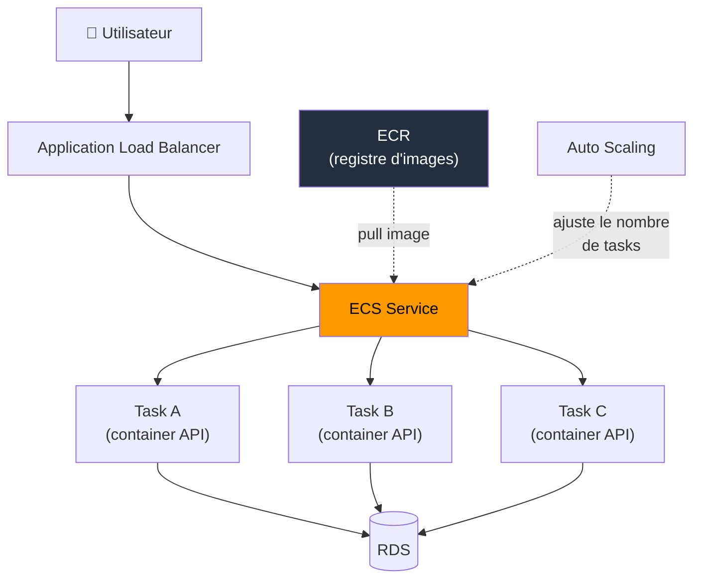

# Containers avancé — Auto Scaling, ALB, Migration microservices

Ce module prolonge le module Containers (ECS, EKS, Fargate). On aborde ici le scaling automatique, l'intégration avec un Application Load Balancer, et les patterns de migration.

---

## ECS Auto Scaling — Adapter la capacité à la charge

ECS propose deux niveaux de scaling indépendants :

**Service Auto Scaling** — Ajuste le nombre de tasks dans un service selon des métriques CloudWatch. C'est l'équivalent de l'ASG pour les containers. Trois modes disponibles : Target Tracking (maintenir CPU moyen à 60%), Step Scaling (règles conditionnelles), et Scheduled Scaling (pics prévisibles).

**Cluster Auto Scaling** (EC2 launch type uniquement) — Ajuste le nombre d'instances EC2 dans le cluster pour accueillir les tasks demandées. Utilise un Capacity Provider qui coordonne le scaling du cluster avec le scaling des services.

Avec Fargate, seul le Service Auto Scaling existe — AWS gère la capacité infrastructure automatiquement.

🧠 En examen, si l'énoncé demande "scaling automatique des containers sans gérer de serveurs", la réponse combine **ECS + Fargate + Service Auto Scaling**.

---

## Intégration ALB — routing et health checks

Le service ECS s'enregistre auprès d'un target group ALB pour recevoir du trafic. L'ALB distribue les requêtes entre les tasks actives du service.

Avec le path-based routing, un même ALB peut router vers plusieurs services ECS selon le chemin de la requête : `/api/*` vers un service, `/payments/*` vers un autre. Chaque service a son propre target group.

Le target group doit pointer vers un endpoint applicatif (`/health`) qui vérifie les dépendances critiques (base de données, cache). Un container qui répond sur le port mais dont l'application est plantée doit être détecté.

---

## Cas réel : migration d'un monolithe vers des microservices conteneurisés

**Contexte** : une plateforme SaaS B2B (30 développeurs, 150 000 utilisateurs actifs) tourne sur 6 instances EC2 derrière un ALB. Le déploiement prend 45 minutes avec 5 à 10 minutes de downtime à chaque release. Trois équipes travaillent sur le même codebase, et chaque merge crée des conflits de dépendances.

**Décision architecturale** : l'équipe choisit ECS avec Fargate — pas EKS, parce que personne dans l'équipe ne connaît Kubernetes et que l'infrastructure est 100% AWS. Le monolithe est découpé en 4 services : API publique, service de paiement, service de notification, worker de traitement asynchrone.

**Architecture mise en place** :
- 1 cluster ECS par environnement (`prod`, `staging`)
- 4 services ECS, chacun avec sa task definition et son repository ECR
- ALB avec path-based routing : `/api/*` → service API, `/payments/*` → service paiement
- Fargate launch type — zéro instance EC2 à gérer
- Service Auto Scaling sur CPU moyen (cible 60%) pour l'API et le worker
- Pipeline CodePipeline : push sur `main` → build image → push ECR → update service ECS (rolling deployment)

**Résultats après 3 mois** :
- Déploiement : de 45 minutes à **8 minutes**, zéro downtime (rolling update)
- Chaque équipe déploie son service indépendamment — de 1 release/semaine à **3-4 releases/jour**
- Coût compute : +12% par rapport aux EC2 (surcoût Fargate), mais -2 jours/mois d'ops économisés
- Incident isolation : une régression dans le service notification n'impacte plus l'API publique

L'erreur initiale de l'équipe : avoir voulu découper en 12 microservices dès le départ. Après 2 semaines de complexité réseau et de debugging distribué, ils sont revenus à 4 services — le bon niveau de granularité pour leur taille d'équipe.

---

## Bonnes pratiques

**Health checks ALB → container, pas juste TCP.** Le target group doit pointer vers un endpoint applicatif (`/health`) qui vérifie les dépendances critiques (base de données, cache). Un container qui répond sur le port mais dont l'application est plantée doit être détecté.

**Limiter le nombre de microservices à la taille de l'équipe.** Deux pizzas, deux services. Un service par développeur est un anti-pattern qui noie l'équipe dans la complexité opérationnelle. Mieux vaut 4 services bien découpés que 15 mal maintenus.

**Activer les Container Insights pour le monitoring.** CloudWatch Container Insights collecte les métriques CPU, mémoire et réseau au niveau task et service. Sans ça, diagnostiquer un problème de performance dans un cluster de 30 tasks revient à chercher une aiguille dans une botte de foin.

---

## Résumé

Le scaling automatique des services ECS repose sur Service Auto Scaling (ajuste le nombre de tasks) et, pour le launch type EC2, sur Cluster Auto Scaling (ajuste le nombre d'instances). L'intégration avec un ALB permet le path-based routing entre microservices et des health checks applicatifs. La migration d'un monolithe vers des containers doit se faire progressivement — commencer par 3-4 services bien découpés, pas 15.

---

<!-- snippet
id: aws_ecs_microservices_warning
type: warning
tech: aws
level: intermediate
importance: medium
format: knowledge
tags: aws,ecs,microservices,architecture
title: Trop de microservices tue les microservices
content: Découper un monolithe en 15 microservices pour une équipe de 8 développeurs noie l'équipe dans la complexité opérationnelle (debugging distribué, latence inter-services, configuration réseau). Règle pratique : le nombre de services ne doit pas dépasser le nombre d'équipes autonomes. Mieux vaut 4 services bien découpés que 15 mal maintenus.
description: Le nombre de microservices doit refléter la taille de l'équipe, pas la granularité du domaine métier.
-->
