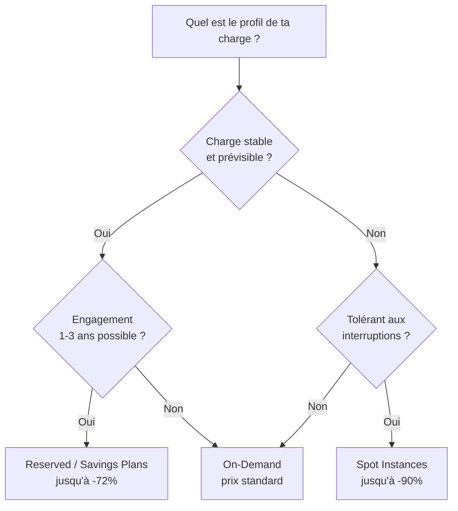

# Pricing 101 — Comprendre la facturation AWS

## Objectifs pédagogiques

À l'issue de ce module, tu seras capable de :

- Expliquer le modèle pay-as-you-go et ce qu'il change par rapport à un hébergement traditionnel
- Distinguer les trois modèles de tarification AWS (On-Demand, Reserved/Savings Plans, Spot) et savoir quand utiliser chacun
- Identifier les pièges de coût les plus fréquents (data transfer, NAT Gateway, ressources oubliées)
- Décrire les trois types de Free Tier et les services couverts
- Adopter le réflexe "vérifier le prix avant de lancer" avec les bons outils

---

## Le modèle pay-as-you-go

En hébergement traditionnel, tu paies un serveur dédié à l'avance — qu'il tourne à 5% ou à 100% de sa capacité, la facture est la même. Tu prévois pour le pic maximal, et le reste du temps tu paies pour du vide.

AWS inverse cette logique : tu paies uniquement ce que tu consommes, à la granularité la plus fine possible.

| Service | Unité de facturation | Exemple concret |
|---------|---------------------|-----------------|
| **EC2** | Par seconde (Linux) ou par heure (Windows) | Une instance `t3.micro` à ~0.0104 $/h |
| **S3** | Par Go stocké + par requête | 100 Go stockés = ~2.30 $/mois |
| **Lambda** | Par requête + par ms d'exécution | 1 million de requêtes = ~0.20 $ |
| **RDS** | Par heure d'instance + stockage | Un `db.t3.micro` à ~0.017 $/h |

Concrètement, ça signifie :

- **Pas d'investissement initial** : tu ne paies rien tant que tu n'utilises rien.
- **Pas d'engagement** (en On-Demand) : tu peux arrêter une instance à tout moment, la facturation s'arrête.
- **Granularité fine** : sur EC2 Linux, la facturation est à la seconde après la première minute. Tu lances une instance pendant 3 minutes, tu paies 3 minutes.

> **Piège mental** : le pay-as-you-go ne signifie pas "peu cher". Il signifie "proportionnel à l'usage". Si tu laisses tourner des ressources que personne n'utilise, le compteur tourne quand même — et la facture en fin de mois peut surprendre.

---

## Les trois modèles de tarification

AWS propose trois modèles de prix pour le compute. Chacun répond à un profil d'usage différent.

### On-Demand — la flexibilité totale

C'est le tarif par défaut. Tu lances une instance, tu paies au prix standard, tu l'arrêtes quand tu veux. Aucun engagement, aucune remise.

**Quand l'utiliser** : développement, tests, charges imprévisibles, projets courts.

### Reserved Instances / Savings Plans — l'engagement récompensé

Tu t'engages sur 1 ou 3 ans d'utilisation en échange d'une remise pouvant atteindre **72%** par rapport au tarif On-Demand.

- **Reserved Instances (RI)** : tu réserves un type d'instance spécifique dans une région.
- **Savings Plans** : plus flexible — tu t'engages sur un montant horaire de dépense compute, quel que soit le type d'instance.

**Quand l'utiliser** : charges stables et prévisibles en production (serveur d'API, base de données, backend applicatif).

### Spot Instances — le prix discount avec contrepartie

AWS loue sa capacité inutilisée à prix réduit (jusqu'à **90% de réduction**). En contrepartie, AWS peut reprendre l'instance avec un préavis de 2 minutes si la capacité est requise ailleurs.

**Quand l'utiliser** : traitements batch, CI/CD, calculs distribués — tout ce qui tolère une interruption.

### Arbre de décision

### Comparatif rapide

| Modèle | Remise | Engagement | Interruption | Cas d'usage type |
|--------|--------|------------|--------------|-----------------|
| **On-Demand** | 0% | Aucun | Non | Dev, tests, pics |
| **Reserved / Savings Plans** | Jusqu'à 72% | 1 ou 3 ans | Non | Production stable |
| **Spot** | Jusqu'à 90% | Aucun | Oui (2 min) | Batch, CI/CD |

> **Exam SAA-C03** : on te demandera régulièrement de choisir le bon modèle selon un scénario. La clé : identifier si la charge est prévisible (Reserved) ou interruptible (Spot). Si aucun des deux, c'est On-Demand.

---

## Les pièges de coût classiques

Certains postes de coût AWS sont contre-intuitifs. Les connaître avant de commencer évite les mauvaises surprises.

### Data Transfer — l'ingress est gratuit, l'egress paie

Envoyer des données **vers** AWS (ingress) est gratuit. Envoyer des données **depuis** AWS vers Internet (egress) est facturé — environ **0.09 $/Go** pour les premiers 10 To mensuels.

Ça paraît peu, mais :
- Un site qui sert 1 To de contenu statique par mois depuis S3 = ~90 $/mois juste en transfert.
- Un backup quotidien de 50 Go téléchargé vers un datacenter on-premise = ~135 $/mois.

> Le trafic **entre AZ** dans une même région est aussi facturé (~0.01 $/Go dans chaque direction). C'est un coût invisible qui s'accumule dans les architectures multi-AZ intensives.

### NAT Gateway — le péage silencieux

Un NAT Gateway permet aux instances privées d'accéder à Internet. Il est facturé en double : un coût horaire (~0.045 $/h = ~33 $/mois) **plus** un coût au Go de données traitées (~0.045 $/Go).

Une architecture avec un NAT Gateway par AZ (bonne pratique haute disponibilité) dans 3 AZ = ~100 $/mois avant même de transférer un seul octet.

### Ressources oubliées

Le classique : tu lances une instance EC2 pour un test, tu fermes ton navigateur, tu oublies de la terminer. L'instance tourne. Le volume EBS attaché aussi. La facture court.

Autres ressources qui coûtent même quand elles sont "inutilisées" :
- **Elastic IP non attachée** : 0.005 $/h (~3.60 $/mois) — AWS te facture pour gaspiller une IP publique
- **Snapshots EBS** : 0.05 $/Go/mois — s'accumulent silencieusement si tu ne les nettoies jamais
- **Load Balancer sans cible** : un ALB (Application Load Balancer) vide coûte ~16 $/mois

---

## AWS Free Tier

AWS propose un Free Tier généreux, qui se décline en **trois catégories** :

### 1. Always Free — sans limite de durée

Certains services restent gratuits indéfiniment, dans certaines limites :

| Service | Limite mensuelle gratuite |
|---------|--------------------------|
| **Lambda** | 1 million de requêtes + 400 000 Go-secondes |
| **DynamoDB** | 25 Go de stockage + 25 unités de lecture/écriture |
| **CloudWatch** | 10 métriques personnalisées + 10 alarmes |
| **SNS** | 1 million de publications |
| **SQS** | 1 million de requêtes |

### 2. 12 mois gratuits — après création du compte

Pendant les 12 premiers mois de ton compte AWS, tu as accès à :

| Service | Limite mensuelle gratuite |
|---------|--------------------------|
| **EC2** | 750 h d'instance `t2.micro` (ou `t3.micro` selon la région) |
| **S3** | 5 Go de stockage standard |
| **RDS** | 750 h d'instance `db.t2.micro` (mono-AZ) |
| **CloudFront** | 1 To de transfert sortant |
| **EBS** | 30 Go de stockage SSD (gp2) |

> **Attention** : les 750 heures mensuelles EC2 couvrent **une** instance `t2.micro` en continu (24h x 31 jours = 744h). Si tu lances deux instances `t2.micro` en parallèle, tu dépasses le quota et tu paies la différence.

### 3. Essais gratuits — ponctuels

Certains services offrent un essai limité dans le temps (30 ou 60 jours) ou en volume — indépendamment des 12 mois. Exemples : Amazon Redshift (2 mois), Amazon Inspector (90 jours).

> **Exam SAA-C03** : les questions sur le Free Tier sont rares, mais savoir que Lambda est "Always Free" (dans les limites) et que EC2 `t2.micro` est gratuit 12 mois est un prérequis implicite.

---

## Le réflexe coût — vérifier avant de lancer

Le meilleur moyen d'éviter une facture surprise, c'est de vérifier le prix **avant** de créer une ressource. AWS fournit trois outils pour ça :

### AWS Pricing Calculator

Un outil web gratuit ([calculator.aws](https://calculator.aws)) qui te permet de simuler le coût mensuel d'une architecture complète. Tu sélectionnes les services, tu configures les paramètres (type d'instance, volume de stockage, trafic estimé), et tu obtiens une estimation.

**Réflexe** : avant de lancer une nouvelle architecture, fais une estimation dans le Pricing Calculator. Ça prend 10 minutes et ça évite des semaines de surprises.

### AWS Cost Explorer

Un tableau de bord intégré à la console AWS qui montre tes dépenses passées et actuelles, avec des filtres par service, région, tag, etc. Disponible dans chaque compte AWS.

### AWS Budgets

Un système d'alertes qui t'envoie une notification quand tes dépenses dépassent un seuil défini. Tu peux configurer un budget mensuel et recevoir un email à 80% et 100% du seuil.

**Première action sur un nouveau compte AWS** : configurer un budget avec alerte. Même si tu es dans le Free Tier, ça te protège contre les dépassements involontaires.

> Le module FinOps (plus loin dans le parcours) détaillera les techniques d'optimisation : rightsizing, schedulers, audit des ressources orphelines. Ici, l'objectif est d'avoir le réflexe coût avant de commencer à construire.

---

## Cas réel : première facture AWS d'un étudiant — 83 € au lieu de 0 €

**Contexte** — Un étudiant crée un compte AWS pour suivre un cours cloud. Il lance une instance EC2 `t2.micro` (Free Tier) pour tester un déploiement. Il crée aussi une base RDS `db.t3.small` pour tester une connexion applicative. Après le TP, il ferme son navigateur et passe à autre chose.

**Ce qui s'est passé** :

- L'instance EC2 `t2.micro` était couverte par le Free Tier → **0 €**
- La base RDS `db.t3.small` n'est **pas** dans le Free Tier (seul `db.t2.micro` l'est) → **~50 €/mois**
- Un volume EBS de 100 Go créé par erreur (au lieu de 8 Go par défaut) → **~10 €/mois**
- Un NAT Gateway créé pour un test VPC et jamais supprimé → **~33 €/mois**

**Leçon** :

- Toujours vérifier que le type d'instance est éligible Free Tier **avant** de le lancer
- Configurer un budget avec alerte dès la création du compte — il aurait reçu un email à 10 €
- Lister les ressources actives avant de quitter la console : EC2, RDS, VPC, EBS

> Ce scénario est le plus fréquent chez les débutants. La bonne nouvelle : il est entièrement évitable avec les réflexes décrits ci-dessous.

---

## Bonnes pratiques fondamentales

**1. Estimer avant de provisionner**
Ne lance jamais une architecture sans avoir fait une estimation dans le Pricing Calculator. Même approximative, elle te donne un ordre de grandeur.

**2. Configurer les alertes budget dès le jour 1**
Un budget AWS avec alerte à 80% et 100% du seuil prévu. Ça prend 2 minutes, ça évite les factures de 500 euros.

**3. Éteindre ce qui ne sert pas**
Les instances de dev n'ont pas besoin de tourner la nuit ni le week-end. Un arrêt automatique (scheduler ou Lambda) peut diviser la facture dev par 3.

**4. Choisir le bon modèle de tarification**
On-Demand par défaut, puis convertir en Reserved/Savings Plans les charges stables après 1-2 mois d'observation.

**5. Surveiller le data transfer**
Si ton architecture transfère beaucoup de données entre régions ou vers Internet, c'est un poste de coût à optimiser en priorité (CloudFront, VPC Endpoints).

---

## Résumé

La facturation AWS repose sur le pay-as-you-go : tu paies ce que tu consommes, à la seconde ou à la requête. Cette flexibilité est un avantage énorme par rapport au datacenter, mais elle impose une vigilance constante — parce que le compteur ne s'arrête jamais tout seul.

Trois modèles de tarification coexistent (On-Demand, Reserved/Savings Plans, Spot), chacun adapté à un profil de charge différent. Les pièges de coût classiques (data transfer, NAT Gateway, ressources oubliées) sont prévisibles si tu les connais à l'avance. Et le Free Tier te donne un terrain d'expérimentation généreux pour apprendre sans risque financier.

Le module FinOps (plus loin dans le parcours) détaillera les techniques d'optimisation : rightsizing, schedulers, audit des ressources orphelines.

<!-- snippet
id: aws_pricing_pay_as_you_go
type: concept
tech: aws
level: beginner
importance: high
format: knowledge
tags: aws,pricing,cost,pay-as-you-go
title: Pay-as-you-go — le modèle de facturation AWS
content: AWS facture à l'usage : à la seconde (EC2 Linux), à la requête (Lambda, S3), au Go stocké (S3, EBS). Pas d'investissement initial, pas d'engagement en On-Demand. Le compteur tourne tant que la ressource existe — même si personne ne l'utilise.
description: Comprendre le modèle pay-as-you-go est le prérequis à toute décision d'architecture sur AWS.
-->

<!-- snippet
id: aws_pricing_three_models
type: concept
tech: aws
level: beginner
importance: high
format: knowledge
tags: aws,pricing,on-demand,reserved,spot
title: Les 3 modèles de tarification AWS
content: On-Demand = prix standard sans engagement (dev, tests). Reserved / Savings Plans = engagement 1-3 ans, jusqu'à -72% (production stable). Spot = capacité inutilisée, jusqu'à -90%, interruptible avec 2 min de préavis (batch, CI/CD).
description: Choisir le bon modèle selon le profil de charge est le premier levier d'optimisation des coûts AWS.
-->

<!-- snippet
id: aws_pricing_data_transfer_warning
type: warning
tech: aws
level: beginner
importance: high
format: knowledge
tags: aws,pricing,data-transfer,egress,nat-gateway
title: Data transfer — l'ingress est gratuit, l'egress coûte cher
content: |
  - Données entrantes (ingress) vers AWS : gratuit
  - Données sortantes (egress) vers Internet : ~0.09 $/Go
  - Trafic inter-AZ dans une même région : ~0.01 $/Go par direction
  - NAT Gateway : 0.045 $/h + 0.045 $/Go de données traitées
description: Le data transfer est le poste de coût le plus souvent sous-estimé dans les architectures AWS débutantes.
-->

<!-- snippet
id: aws_pricing_free_tier_tip
type: tip
tech: aws
level: beginner
importance: medium
format: knowledge
tags: aws,free-tier,ec2,lambda,s3
title: Free Tier — 3 catégories à connaître
content: Always Free (Lambda 1M req/mois, DynamoDB 25 Go). 12 mois gratuits (EC2 t2.micro 750h, S3 5 Go, RDS db.t2.micro 750h). Essais ponctuels (Redshift 2 mois, Inspector 90 jours). Attention : 750h EC2 = une seule instance t2.micro en continu, deux instances en parallèle dépassent le quota.
description: Exploiter le Free Tier pour apprendre sans risque financier, en restant vigilant sur les limites.
-->

<!-- snippet
id: aws_pricing_budget_alert_tip
type: tip
tech: aws
level: beginner
importance: high
format: knowledge
tags: aws,budgets,alerting,cost
title: Budget AWS — configurer une alerte dès le jour 1
content: Première action sur un nouveau compte AWS : créer un budget mensuel avec alerte email à 80% et 100% du seuil. Même dans le Free Tier, un NAT Gateway ou une instance hors quota peut générer une facture inattendue. La configuration prend 2 minutes dans la console Billing.
description: Un budget avec alerte est la protection minimale contre les factures surprises — à configurer avant tout le reste.
-->

<!-- snippet
id: aws_pricing_calculator_tip
type: tip
tech: aws
level: beginner
importance: medium
format: knowledge
tags: aws,pricing,calculator,estimation
title: AWS Pricing Calculator — estimer avant de lancer
content: Avant de provisionner une architecture, simuler le coût mensuel dans le Pricing Calculator (calculator.aws). Sélectionner les services, configurer les paramètres (type d'instance, stockage, trafic estimé). Une estimation même approximative évite les surprises en fin de mois. Prend 10 minutes et peut économiser des centaines d'euros.
description: Le Pricing Calculator est le réflexe à avoir avant chaque nouveau déploiement — 10 minutes pour éviter des mois de surprises.
-->
