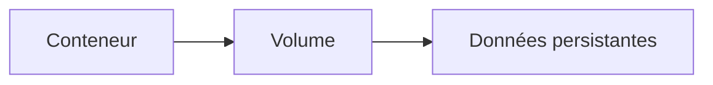

# Persister les données (volumes)

## Objectifs pédagogiques

- Comprendre pourquoi les données disparaissent dans Docker  
- Comprendre ce qu’est un volume  
- Utiliser les volumes pour conserver des données  
- Faire la différence entre conteneur et stockage  

---

## Contexte et problématique

Quand tu utilises Docker, tu peux lancer une application qui stocke des données.

Exemple :

- base de données  
- fichiers  
- logs  

👉 Problème :

Si tu supprimes le conteneur…

👉 **toutes les données disparaissent**

---

## Définition

### Persistance*

La persistance signifie :

👉 conserver des données même après arrêt ou suppression

---

### Volume*

Un volume est un espace de stockage externe au conteneur.

👉 Il permet de conserver les données indépendamment du conteneur

---

## Fonctionnement

Voici comment fonctionne un volume :



👉 Le conteneur utilise le volume  
👉 Les données restent même si le conteneur disparaît  

---

## Commandes essentielles

### Lancer un conteneur avec volume

```bash
docker run -d -v mon-volume:/data nginx
```

👉 Explication :

- `-v` = volume  
- `mon-volume` = nom du volume  
- `/data` = chemin dans le conteneur  

---

### Voir les volumes

```bash
docker volume ls
```

---

### Inspecter un volume

```bash
docker volume inspect mon-volume
```

---

### Supprimer un volume

```bash
docker volume rm mon-volume
```

---

## Fonctionnement interne

💡 Astuce  
Les volumes sont stockés par Docker sur ta machine.

⚠️ Erreur fréquente  
Penser que les données sont dans le conteneur.

💣 Piège classique  
Supprimer un conteneur et perdre ses données sans volume.

🧠 Concept clé  
Le conteneur est temporaire, le volume est durable.

---

## Cas réel

Tu lances une base de données :

```bash
docker run -d -v db-data:/var/lib/postgresql/data postgres
```

👉 Même si tu supprimes le conteneur :

- les données restent  
- tu peux recréer un conteneur et les retrouver  

---

## Bonnes pratiques

- Toujours utiliser des volumes pour les données importantes  
- Nommer ses volumes clairement  
- Nettoyer les volumes inutilisés  

---

## Résumé

Les volumes permettent de :

- conserver les données  
- séparer stockage et application  

👉 Sans volume = perte de données  

---

## Notes

*Persistance : capacité à conserver des données dans le temps
*Volume : espace de stockage indépendant du conteneur

---

<!-- snippet
id: docker_volume_definition
type: concept
tech: docker
level: beginner
importance: high
format: knowledge
tags: docker,volume,persistance,stockage
title: Définition d'un volume Docker
content: Un volume est un espace de stockage externe au conteneur, géré par Docker. Il permet de conserver des données indépendamment du cycle de vie du conteneur.
description: Les volumes sont stockés par Docker sur la machine hôte, dans un répertoire géré par Docker Engine.
-->

<!-- snippet
id: docker_donnees_disparaissent_warning
type: warning
tech: docker
level: beginner
importance: high
format: knowledge
tags: docker,donnees,conteneur,suppression
title: Attention : les données disparaissent sans volume
content: Par défaut, toutes les données créées dans un conteneur (fichiers, base de données, logs) sont perdues dès que le conteneur est supprimé. Il faut utiliser des volumes pour persister les données.
-->

<!-- snippet
id: docker_run_volume
type: command
tech: docker
level: beginner
importance: high
format: knowledge
tags: docker,run,volume,-v
title: Lancer un conteneur avec un volume
command: docker run -d -v <NOM>:/data nginx
description: -v monte le volume nommé sur le chemin /data dans le conteneur. Les données y sont conservées après suppression du conteneur.
-->

<!-- snippet
id: docker_volume_ls
type: command
tech: docker
level: beginner
importance: medium
format: knowledge
tags: docker,volume,liste
title: Lister les volumes
command: docker volume ls
description: Affiche la liste de tous les volumes gérés par Docker sur la machine hôte.
-->

<!-- snippet
id: docker_volume_inspect
type: command
tech: docker
level: beginner
importance: medium
format: knowledge
tags: docker,volume,inspecter
title: Inspecter un volume
command: docker volume inspect <NOM>
description: Affiche les détails d'un volume : emplacement sur la machine hôte, date de création, etc.
-->

<!-- snippet
id: docker_volume_rm
type: command
tech: docker
level: beginner
importance: medium
format: knowledge
tags: docker,volume,suppression
title: Supprimer un volume
command: docker volume rm <NOM>
description: Supprime définitivement un volume et les données qu'il contient. À utiliser avec précaution.
-->

<!-- snippet
id: docker_volume_postgres_exemple
type: command
tech: docker
level: beginner
importance: medium
format: knowledge
tags: docker,volume,postgres,base-de-donnees
title: Persister les données d'une base PostgreSQL
command: docker run -d -v db-data:/var/lib/postgresql/data postgres
description: Monte un volume sur le répertoire de données de PostgreSQL. Les données survivent à la suppression et recréation du conteneur.
-->

<!-- snippet
id: docker_volume_piege
type: warning
tech: docker
level: beginner
importance: high
format: knowledge
tags: docker,volume,donnees,conteneur
title: Piège : confondre données dans le conteneur et dans le volume
content: Les données ne sont PAS dans le conteneur, elles sont dans le volume externe. Supprimer le conteneur ne supprime pas le volume. En revanche, supprimer le volume supprime définitivement les données.
-->
