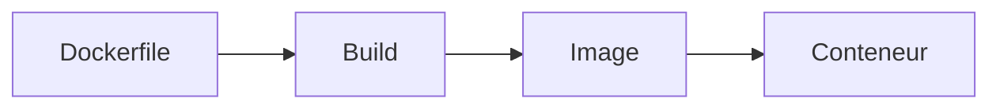

# Introduction au Dockerfile

## Objectifs pédagogiques

- Comprendre pourquoi utiliser un Dockerfile  
- Comprendre ce qu’est une image personnalisée  
- Comprendre le lien entre Dockerfile, image et conteneur  
- Construire sa première image  

---

## Contexte et problématique

Dans le module précédent, tu as utilisé des images existantes :

```bash
docker run nginx
docker run postgres
```

👉 Mais dans la réalité :

- tu as ton propre code  
- ton propre projet  
- ta propre configuration  

👉 Tu ne peux pas dépendre uniquement d’images existantes

---

## Définition

### Dockerfile*

Un Dockerfile est un fichier texte qui permet de :

👉 **décrire comment construire une image Docker**

Il contient une suite d’instructions :

- installer des dépendances  
- copier des fichiers  
- configurer une application  

---

## Architecture

Composant | Rôle | Exemple
----------|------|--------
Dockerfile | recette | instructions de build
Image | résultat | application prête
Conteneur | exécution | application lancée



---

## Commandes essentielles

### Construire une image

```bash
docker build -t mon-app .
```

👉 Explication :

- `build` = construire une image  
- `-t` = nom de l’image  
- `.` = dossier courant  

---

### Lancer l’image construite

```bash
docker run mon-app
```

---

## Exemple simple

Créer un fichier `Dockerfile` :

```Dockerfile
FROM nginx
COPY index.html /usr/share/nginx/html/index.html
```

👉 Explication :

- `FROM` = image de base  
- `COPY` = copie un fichier  

---

## Fonctionnement interne

💡 Astuce  
Chaque ligne du Dockerfile crée une “couche” (layer)

⚠️ Erreur fréquente  
Modifier un conteneur au lieu de modifier le Dockerfile

💣 Piège classique  
Modifier directement un conteneur pour corriger un problème, puis oublier de reproduire ces modifications dans le Dockerfile.  
👉 Résultat : dès que le conteneur est supprimé ou recréé, toutes les modifications sont perdues.  
👉 En pratique, cela crée des comportements incohérents entre environnements et rend le déploiement instable.

🧠 Concept clé  
Le Dockerfile est la source de vérité de ton application

---

## Cas réel en entreprise

Un développeur veut déployer son application web :

- il écrit un Dockerfile  
- il construit une image  
- il la déploie  

👉 Résultat :

- même comportement partout  
- déploiement simplifié  
- moins d’erreurs  

---

## Bonnes pratiques

- Toujours versionner son Dockerfile  
- Ne jamais modifier directement un conteneur  
- Rebuild après chaque modification  

---

## Résumé

Le Dockerfile permet de :

- créer ses propres images  
- automatiser le build  
- standardiser les applications  

👉 C’est l’outil central de Docker en production  

---

## Notes

*Dockerfile : fichier décrivant les étapes pour construire une image Docker

---

<!-- snippet
id: docker_build_tag_dot
type: command
tech: docker
level: beginner
importance: high
format: knowledge
tags: dockerfile,build,image
title: Construire une image depuis un Dockerfile
command: docker build -t <IMAGE> .
example: docker build -t mon-api .
description: Le point final désigne le dossier courant comme contexte de build. -t définit le nom de l'image.
-->

<!-- snippet
id: docker_run_image_custom
type: command
tech: docker
level: beginner
importance: medium
format: knowledge
tags: dockerfile,run,image
title: Lancer une image construite localement
command: docker run <IMAGE>
example: docker run mon-api
description: Lance un conteneur depuis une image construite localement avec docker build.
-->

<!-- snippet
id: docker_dockerfile_definition
type: concept
tech: docker
level: beginner
importance: high
format: knowledge
tags: dockerfile,image,concept
title: Définition du Dockerfile
content: Un Dockerfile est un fichier texte décrivant comment construire une image Docker. Il contient les instructions pour installer des dépendances, copier des fichiers et configurer une application.
-->

<!-- snippet
id: docker_layer_per_instruction
type: concept
tech: docker
level: beginner
importance: medium
format: knowledge
tags: dockerfile,layers,cache
title: Chaque instruction Dockerfile crée une couche réutilisable
content: Chaque ligne du Dockerfile crée une "couche" (layer). Docker réutilise les couches inchangées lors des rebuilds, ce qui accélère les builds.
-->

<!-- snippet
id: docker_piege_modifier_conteneur
type: warning
tech: docker
level: beginner
importance: high
format: knowledge
tags: dockerfile,conteneur,bonne-pratique
title: Ne jamais modifier un conteneur directement
content: Modifier directement un conteneur au lieu du Dockerfile entraîne la perte des changements dès que le conteneur est supprimé. Le Dockerfile doit toujours rester la source de vérité.
-->

<!-- snippet
id: docker_dockerfile_source_verite
type: concept
tech: docker
level: beginner
importance: high
format: knowledge
tags: dockerfile,architecture,bonne-pratique
title: Le Dockerfile est la source de vérité de l'application
content: Le Dockerfile est la source de vérité de ton application : toute configuration, dépendance ou modification doit y être reflétée.
-->
