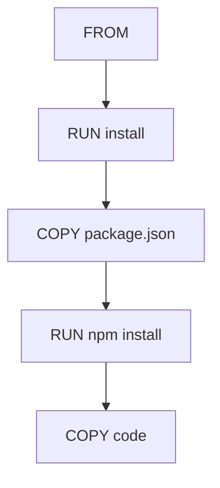

# Optimiser les images (layers et cache)

## Objectifs pédagogiques

- Comprendre ce qu’est un layer (couche)  
- Comprendre le cache Docker  
- Optimiser l’ordre des instructions  
- Réduire le temps de build et la taille des images  

---

## Contexte et problématique

Tu sais maintenant construire une image.

👉 Mais en pratique :

- les builds peuvent être lents  
- les images peuvent être lourdes  
- chaque modification peut tout reconstruire  

👉 Il faut donc optimiser.

---

## Définition

### Layer*

Chaque instruction du Dockerfile crée une couche (layer).

👉 Une image Docker est un empilement de couches.

---

### Cache Docker*

Docker réutilise les couches déjà construites si rien n’a changé.

👉 Cela permet d’accélérer les builds.

---

## Architecture



👉 Chaque étape = une couche

---

## Fonctionnement

Docker lit le Dockerfile ligne par ligne :

- si une instruction n’a pas changé → cache utilisé  
- sinon → reconstruction  

---

## Exemple non optimisé

```Dockerfile
FROM node:18

COPY . .

RUN npm install
```

👉 Problème :

- à chaque modification du code  
- `npm install` est relancé  

---

## Exemple optimisé

```Dockerfile
FROM node:18

WORKDIR /app

COPY package.json .

RUN npm install

COPY . .
```

👉 Résultat :

- cache conservé pour les dépendances  
- build beaucoup plus rapide  

---

## Fonctionnement interne

💡 Astuce  
Toujours placer les éléments qui changent le moins en haut.

⚠️ Erreur fréquente  
Mettre `COPY . .` trop tôt dans le Dockerfile.

💣 Piège classique  
Ne pas comprendre pourquoi le cache ne fonctionne pas.  
👉 Si une ligne change, toutes les couches suivantes sont reconstruites.  
👉 Cela peut multiplier le temps de build par 10.  
👉 Il faut donc organiser les instructions intelligemment.

🧠 Concept clé  
L’ordre des instructions impacte directement la performance.

---

## Cas réel

Projet Node.js :

- dépendances changent rarement  
- code change souvent  

👉 Solution :

- installer dépendances en premier  
- copier le code ensuite  

---

## Bonnes pratiques

- Optimiser l’ordre des instructions  
- Minimiser les changements dans les premières couches  
- Utiliser `.dockerignore`  
- Éviter les fichiers inutiles  

---

## Résumé

Optimiser une image permet de :

- accélérer les builds  
- réduire la taille  
- améliorer la performance  

👉 Le cache Docker est un élément clé  

---

## Notes

*Layer : couche créée à chaque instruction  
*Cache : mécanisme de réutilisation des couches
