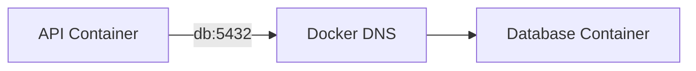

# Communication entre conteneurs (approfondie)

## Objectifs pédagogiques

- Comprendre comment Docker gère la communication interne  
- Comprendre le DNS Docker*  
- Comprendre la différence entre ports internes et externes  
- Mettre en place une communication réelle API ↔ base de données  

---

## Contexte et problématique

Dans le chapitre précédent, tu as connecté des conteneurs via un réseau.

👉 Mais en pratique, il reste plusieurs zones de confusion :

- Comment un conteneur “trouve” un autre ?  
- Faut-il exposer les ports ?  
- Pourquoi localhost ne fonctionne pas ?  

---

## Définition

### DNS Docker*

Docker possède un système DNS interne.

👉 Il permet de résoudre automatiquement :

- le nom d’un conteneur  
- en adresse réseau  

---

## Architecture



👉 Le conteneur API appelle “db”  
👉 Docker traduit automatiquement en adresse IP  

---

## Ports internes vs externes

| Type | Utilisation | Exemple |
|------|------------|--------|
| Port interne | communication entre conteneurs | 5432 |
| Port externe | accès depuis ton PC | 8080 |

---

👉 Exemple :

```bash
docker run -d --name db --network mon-reseau postgres
```

👉 Ici :
- port 5432 est accessible **dans le réseau Docker**
- pas besoin de `-p`

---

## Commandes essentielles

### Exemple complet

Créer un réseau :

```bash
docker network create app-net
```

Lancer la base :

```bash
docker run -d --name db --network app-net postgres
```

Lancer une app :

```bash
docker run -d --name api --network app-net mon-api
```

---

## Fonctionnement interne

💡 Astuce  
Le nom du conteneur devient automatiquement un hostname.

⚠️ Erreur fréquente  
Utiliser `localhost` dans la config.

💣 Piège classique  
Exposer un port inutilement pour communication interne.  
👉 Entre conteneurs, il ne faut PAS utiliser `-p`.  
👉 Le réseau Docker suffit.  
👉 Exposer un port sert uniquement à accéder depuis l’extérieur (navigateur, PC).

🧠 Concept clé  
Communication interne ≠ communication externe  

---

## Cas réel

Configuration API :

```env
DB_HOST=db
DB_PORT=5432
```

👉 L’API se connecte directement au conteneur “db”

---

## Bonnes pratiques

- Utiliser des réseaux dédiés par application  
- Utiliser les noms de conteneurs  
- Ne pas exposer inutilement les ports  
- Séparer trafic interne / externe  

---

## Résumé

Docker permet une communication simple entre conteneurs :

- via un réseau  
- via un DNS interne  
- sans configuration complexe  

👉 C’est la base des architectures modernes  

---

## Notes

*DNS Docker : système interne de résolution de noms entre conteneurs
