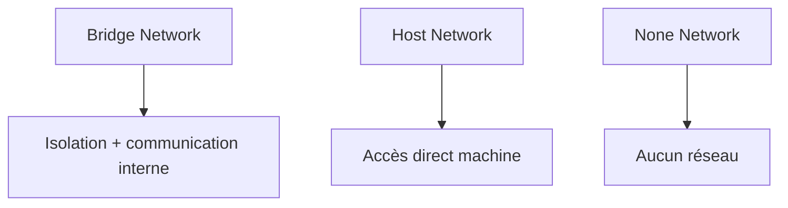

# Types de réseaux Docker

## Objectifs pédagogiques

- Comprendre les différents types de réseaux Docker  
- Savoir quand utiliser chaque type  
- Comprendre leurs différences  
- Éviter les erreurs de configuration  

---

## Contexte et problématique

Jusqu’ici, tu as utilisé un réseau Docker sans vraiment voir les différences.

👉 Mais Docker propose plusieurs types de réseaux.

👉 Chaque type a un usage spécifique.

---

## Définition

Docker propose plusieurs types de réseaux :

- bridge (par défaut)  
- host  
- none  

---

## Architecture



---

## Types de réseaux

### 1 — Bridge (par défaut)

👉 Le plus utilisé

- conteneurs isolés  
- communication possible  
- nécessite un réseau partagé  

---

### 2 — Host

```bash
docker run --network host nginx
```

👉 Le conteneur utilise directement le réseau de la machine

- pas d’isolation  
- performance maximale  

---

### 3 — None

```bash
docker run --network none nginx
```

👉 Aucun accès réseau

- conteneur isolé totalement  

---

## Fonctionnement interne

💡 Astuce  
Le mode bridge est suffisant dans 90% des cas.

⚠️ Erreur fréquente  
Utiliser host sans comprendre les impacts.

💣 Piège classique  
Utiliser le mode host en pensant que c’est plus simple.  
👉 Cela supprime l’isolation réseau.  
👉 Peut créer des conflits de ports et des problèmes de sécurité.  
👉 À utiliser uniquement dans des cas spécifiques.

🧠 Concept clé  
Chaque type de réseau correspond à un niveau d’isolation

---

## Cas réel

- API + DB → bridge  
- performance extrême → host  
- sécurité maximale → none  

---

## Bonnes pratiques

- utiliser bridge par défaut  
- éviter host sauf besoin spécifique  
- isoler les services sensibles  

---

## Résumé

Docker propose plusieurs types de réseaux :

- bridge → standard  
- host → performance  
- none → isolation  

👉 Le bon choix dépend du contexte  

---

## Notes

*Bridge : réseau par défaut avec isolation  
*Host : réseau partagé avec la machine  
*None : aucun réseau
