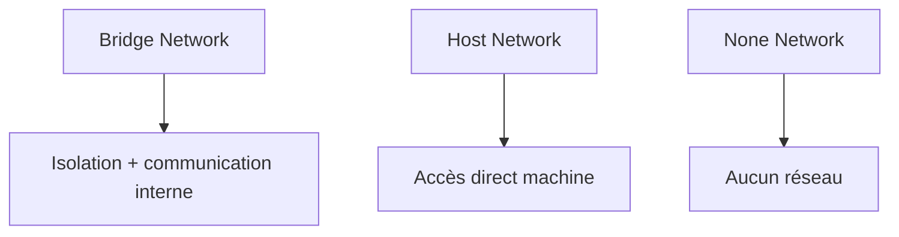

# Types de réseaux Docker

## Objectifs pédagogiques

- Comprendre les différents types de réseaux Docker  
- Savoir quand utiliser chaque type  
- Comprendre leurs différences  
- Éviter les erreurs de configuration  

---

## Contexte et problématique

Jusqu’ici, tu as utilisé un réseau Docker sans vraiment voir les différences.

👉 Mais Docker propose plusieurs types de réseaux.

👉 Chaque type a un usage spécifique.

---

## Définition

Docker propose plusieurs types de réseaux :

- bridge (par défaut)  
- host  
- none  

---

## Architecture



---

## Types de réseaux

### 1 — Bridge (par défaut)

👉 Le plus utilisé

- conteneurs isolés  
- communication possible  
- nécessite un réseau partagé  

---

### 2 — Host

```bash
docker run --network host nginx
```

👉 Le conteneur utilise directement le réseau de la machine

- pas d’isolation  
- performance maximale  

---

### 3 — None

```bash
docker run --network none nginx
```

👉 Aucun accès réseau

- conteneur isolé totalement  

---

## Fonctionnement interne

💡 Astuce  
Le mode bridge est suffisant dans 90% des cas.

⚠️ Erreur fréquente  
Utiliser host sans comprendre les impacts.

💣 Piège classique  
Utiliser le mode host en pensant que c’est plus simple.  
👉 Cela supprime l’isolation réseau.  
👉 Peut créer des conflits de ports et des problèmes de sécurité.  
👉 À utiliser uniquement dans des cas spécifiques.

🧠 Concept clé  
Chaque type de réseau correspond à un niveau d’isolation

---

## Cas réel

- API + DB → bridge  
- performance extrême → host  
- sécurité maximale → none  

---

## Bonnes pratiques

- utiliser bridge par défaut  
- éviter host sauf besoin spécifique  
- isoler les services sensibles  

---

## Résumé

Docker propose plusieurs types de réseaux :

- bridge → standard  
- host → performance  
- none → isolation  

👉 Le bon choix dépend du contexte  

---

## Notes

*Bridge : réseau par défaut avec isolation
*Host : réseau partagé avec la machine
*None : aucun réseau

---

<!-- snippet
id: docker_network_type_bridge_concept
type: concept
tech: docker
level: intermediate
importance: medium
format: knowledge
tags: reseau,bridge,isolation,type
title: Réseau bridge — type par défaut avec isolation
content: Le réseau bridge est le type de réseau Docker le plus utilisé. Les conteneurs sont isolés entre eux sauf s'ils partagent un réseau. C'est le choix recommandé dans la majorité des cas.
-->

<!-- snippet
id: docker_network_host_run
type: command
tech: docker
level: intermediate
importance: medium
format: knowledge
tags: reseau,host,performance,run
title: Lancer un conteneur avec le réseau host
command: docker run --network host <IMAGE>
example: docker run --network host nginx
description: Lance un conteneur en partageant directement le réseau de la machine hôte. Il n'y a aucune isolation réseau : les ports du conteneur sont directement accessibles sur la machine.
-->

<!-- snippet
id: docker_network_none_run
type: command
tech: docker
level: intermediate
importance: medium
format: knowledge
tags: reseau,none,isolation,run
title: Lancer un conteneur sans réseau
command: docker run --network none <IMAGE>
example: docker run --network none alpine
description: Lance un conteneur sans aucune interface réseau. Le conteneur ne peut ni envoyer ni recevoir de trafic réseau, ce qui offre une isolation totale.
-->

<!-- snippet
id: docker_network_host_warning
type: warning
tech: docker
level: intermediate
importance: medium
format: knowledge
tags: reseau,host,isolation,securite,piege
title: Le mode host supprime l'isolation réseau
content: Utiliser --network host supprime complètement l'isolation réseau du conteneur. Cela peut créer des conflits de ports et des problèmes de sécurité. À utiliser uniquement dans des cas spécifiques.
-->

<!-- snippet
id: docker_network_bridge_defaut
type: concept
tech: docker
level: intermediate
importance: medium
format: knowledge
tags: reseau,bridge,conseil,defaut
title: Le mode bridge est suffisant dans 90% des cas
content: Sauf besoin de performance extrême (host) ou d'isolation totale (none), le mode bridge couvre la quasi-totalité des besoins courants en architecture Docker.
-->

<!-- snippet
id: docker_network_niveau_isolation
type: concept
tech: docker
level: intermediate
importance: medium
format: knowledge
tags: reseau,type,isolation,bridge,host
title: Chaque type de réseau correspond à un niveau d'isolation
content: Bridge offre isolation avec communication possible, host partage le réseau de la machine (aucune isolation), none isole totalement le conteneur de tout réseau.
-->
