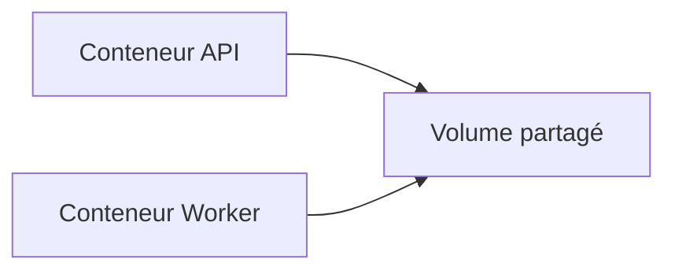

# Partage de données entre conteneurs

## Objectifs pédagogiques

- Comprendre comment partager des données entre conteneurs  
- Utiliser un volume commun  
- Comprendre les limites du partage  
- Identifier les risques liés à l’accès concurrent  

---

## Contexte et problématique

Dans une architecture réelle, plusieurs conteneurs peuvent avoir besoin :

- d’accéder aux mêmes fichiers  
- de lire/écrire des données communes  

👉 Exemple :

- une API écrit des fichiers  
- un worker les traite  

---

## Définition

### Volume partagé*

Un volume peut être monté dans plusieurs conteneurs.

👉 Cela permet de partager des données

---

## Architecture



👉 Les deux conteneurs accèdent aux mêmes données

---

## Commandes essentielles

### Créer un volume

```bash
docker volume create shared-data
```

---

### Lancer deux conteneurs avec le même volume

```bash
docker run -d --name api -v shared-data:/data nginx
```

```bash
docker run -d --name worker -v shared-data:/data ubuntu
```

---

## Fonctionnement interne

💡 Astuce  
Les données sont immédiatement visibles par tous les conteneurs.

⚠️ Erreur fréquente  
Penser que chaque conteneur a ses propres données.

💣 Piège classique  
Écriture simultanée sans coordination.  
👉 Si plusieurs conteneurs écrivent en même temps, des conflits peuvent apparaître.  
👉 Cela peut corrompre les données ou produire des résultats incohérents.  
👉 Il faut prévoir des mécanismes de gestion (verrou, file, base de données).

🧠 Concept clé  
Un volume partagé = une source de vérité commune

---

## Cas réel

Une application web :

- API → écrit des fichiers  
- Worker → traite les fichiers  

👉 Les deux utilisent :

```bash
-v shared-data:/app/data
```

---

## Bonnes pratiques

- Utiliser des volumes pour le partage  
- Éviter les écritures concurrentes non contrôlées  
- Utiliser une base de données si besoin de cohérence forte  
- Structurer les dossiers  

---

## Résumé

Le partage de données permet de :

- connecter plusieurs services  
- centraliser les fichiers  
- simplifier certaines architectures  

👉 Mais nécessite de la rigueur  

---

## Notes

*Volume partagé : volume utilisé par plusieurs conteneurs

---
[← Module précédent](docker_ch3_4.md) | [Module suivant →](docker_ch3_6.md)
---
