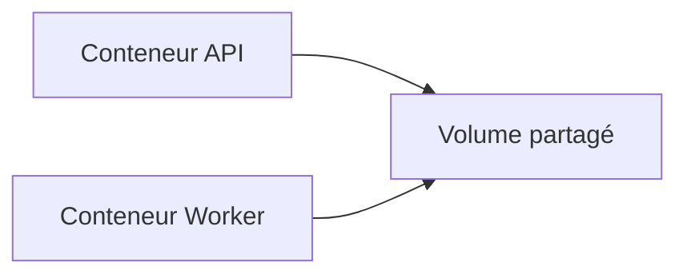

# Partage de données entre conteneurs

## Objectifs pédagogiques

- Comprendre comment partager des données entre conteneurs  
- Utiliser un volume commun  
- Comprendre les limites du partage  
- Identifier les risques liés à l’accès concurrent  

---

## Contexte et problématique

Dans une architecture réelle, plusieurs conteneurs peuvent avoir besoin :

- d’accéder aux mêmes fichiers  
- de lire/écrire des données communes  

👉 Exemple :

- une API écrit des fichiers  
- un worker les traite  

---

## Définition

### Volume partagé*

Un volume peut être monté dans plusieurs conteneurs.

👉 Cela permet de partager des données

---

## Architecture



👉 Les deux conteneurs accèdent aux mêmes données

---

## Commandes essentielles

### Créer un volume

```bash
docker volume create shared-data
```

---

### Lancer deux conteneurs avec le même volume

```bash
docker run -d --name api -v shared-data:/data nginx
```

```bash
docker run -d --name worker -v shared-data:/data ubuntu
```

---

## Fonctionnement interne

💡 Astuce  
Les données sont immédiatement visibles par tous les conteneurs.

⚠️ Erreur fréquente  
Penser que chaque conteneur a ses propres données.

💣 Piège classique  
Écriture simultanée sans coordination.  
👉 Si plusieurs conteneurs écrivent en même temps, des conflits peuvent apparaître.  
👉 Cela peut corrompre les données ou produire des résultats incohérents.  
👉 Il faut prévoir des mécanismes de gestion (verrou, file, base de données).

🧠 Concept clé  
Un volume partagé = une source de vérité commune

---

## Cas réel

Une application web :

- API → écrit des fichiers  
- Worker → traite les fichiers  

👉 Les deux utilisent :

```bash
-v shared-data:/app/data
```

---

## Bonnes pratiques

- Utiliser des volumes pour le partage  
- Éviter les écritures concurrentes non contrôlées  
- Utiliser une base de données si besoin de cohérence forte  
- Structurer les dossiers  

---

## Résumé

Le partage de données permet de :

- connecter plusieurs services  
- centraliser les fichiers  
- simplifier certaines architectures  

👉 Mais nécessite de la rigueur  

---

## Notes

*Volume partagé : volume utilisé par plusieurs conteneurs

---

<!-- snippet
id: docker_volume_create_shared
type: command
tech: docker
level: intermediate
importance: medium
format: knowledge
tags: volume,partage,creation
title: Créer un volume partagé entre conteneurs
command: docker volume create shared-data
description: Crée un volume Docker nommé "shared-data" qui peut ensuite être monté simultanément dans plusieurs conteneurs pour partager des fichiers entre eux.
-->

<!-- snippet
id: docker_run_volume_shared_api
type: command
tech: docker
level: intermediate
importance: medium
format: knowledge
tags: volume,partage,run,multi-conteneur
title: Monter un volume partagé dans un conteneur API
command: docker run -d --name <NOM> -v shared-data:/data <IMAGE>
example: docker run -d --name api-server -v shared-data:/data node:18
description: Lance un conteneur et monte le volume shared-data dans /data, permettant à d'autres conteneurs d'accéder aux mêmes fichiers.
-->

<!-- snippet
id: docker_run_volume_shared_worker
type: command
tech: docker
level: intermediate
importance: medium
format: knowledge
tags: volume,partage,run,worker
title: Monter le même volume partagé dans un second conteneur
command: docker run -d --name <NOM> -v shared-data:/data <IMAGE>
example: docker run -d --name data-processor -v shared-data:/data python:3.11
description: Lance un second conteneur en montant le même volume shared-data dans /data pour lire ou traiter les fichiers écrits par le premier conteneur.
-->

<!-- snippet
id: docker_volume_partage_concept
type: concept
tech: docker
level: intermediate
importance: medium
format: knowledge
tags: volume,partage,multi-conteneur,source-de-verite
title: Un volume partagé est une source de vérité commune
content: Un volume Docker peut être monté simultanément dans plusieurs conteneurs. Toutes les modifications sont immédiatement visibles par tous les conteneurs qui montent ce volume.
-->

<!-- snippet
id: docker_volume_ecriture_concurrente_piege
type: concept
tech: docker
level: intermediate
importance: medium
format: knowledge
tags: volume,partage,concurrence,corruption,piege
title: L'écriture simultanée sur un volume partagé peut corrompre les données
content: Si plusieurs conteneurs écrivent en même temps sur le même volume sans coordination, des conflits peuvent corrompre les données.
-->

<!-- snippet
id: docker_volume_ecriture_concurrente_piege_b
type: concept
tech: docker
level: intermediate
importance: medium
format: knowledge
tags: volume,partage,concurrence,coordination
title: Prévoir un mécanisme de coordination pour les écritures concurrentes
content: Il faut prévoir des mécanismes de coordination (verrou, file d'attente, base de données) pour gérer les écritures concurrentes sur un volume partagé.
-->

<!-- snippet
id: docker_volume_partage_tip
type: tip
tech: docker
level: intermediate
importance: low
format: knowledge
tags: volume,partage,visibilite,temps-reel
title: Les données d'un volume partagé sont immédiatement visibles
content: Contrairement à une copie de fichiers, un volume partagé garantit que chaque modification est instantanément accessible à tous les conteneurs qui le montent.
description: Cas typique : un conteneur générateur écrit dans un volume partagé, un conteneur Nginx sert immédiatement les fichiers générés — sans redéploiement ni synchronisation manuelle.
-->
