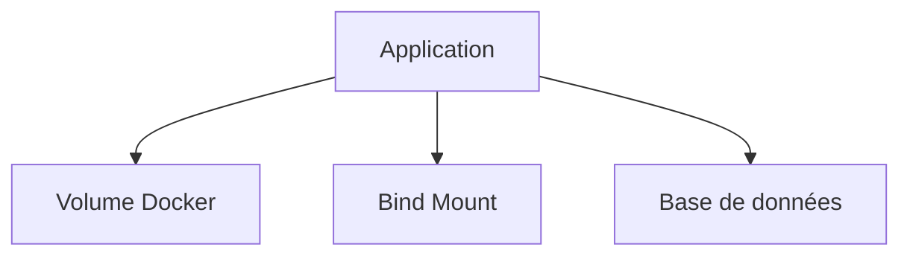

# Stratégies de stockage

## Objectifs pédagogiques

- Comprendre les différentes stratégies de stockage  
- Savoir choisir entre volume, bind mount et base de données  
- Identifier les erreurs d’architecture  
- Mettre en place un stockage adapté au contexte  

---

## Contexte et problématique

Tu sais maintenant :

- utiliser des volumes  
- utiliser des bind mounts  
- partager des données  

👉 Mais une question essentielle reste :

👉 **quelle solution choisir ?**

---

## Définition

Une stratégie de stockage correspond au choix de :

👉 **où et comment stocker les données d’une application**

---

## Architecture

---

## Les différentes stratégies

### 1 — Volume Docker

👉 Utilisation :

- données persistantes  
- bases de données  
- production  

✔️ Avantages :
- isolé  
- sécurisé  
- portable  

❌ Inconvénients :
- moins visible côté utilisateur  

---

### 2 — Bind mount

👉 Utilisation :

- développement  
- accès direct aux fichiers  

✔️ Avantages :
- modification en temps réel  
- facile à utiliser  

❌ Inconvénients :
- dépend du système local  
- moins sécurisé  

---

### 3 — Base de données

👉 Utilisation :

- données structurées  
- applications complexes  

✔️ Avantages :
- gestion avancée  
- cohérence  

❌ Inconvénients :
- plus complexe  
- nécessite un service dédié  

---

## Fonctionnement interne

💡 Astuce  
Chaque type de stockage répond à un besoin différent.

⚠️ Erreur fréquente  
Utiliser des bind mounts en production.

💣 Piège classique  
Stocker des données critiques dans le conteneur lui-même.  
👉 Les données sont alors perdues dès que le conteneur est supprimé.  
👉 Cela peut entraîner une perte totale d’information en production.  
👉 Toujours externaliser les données importantes.

🧠 Concept clé  
Le stockage doit être indépendant du conteneur

---

## Cas réel

Application web complète :

- API → conteneur  
- DB → volume Docker  
- code → bind mount (dev)  

👉 Chaque type de stockage a un rôle précis

---

## Bonnes pratiques

- utiliser volumes pour données persistantes  
- utiliser bind mounts uniquement en dev  
- utiliser des bases de données pour données critiques  
- séparer clairement code et données  

---

## Résumé

Une bonne stratégie de stockage permet de :

- sécuriser les données  
- améliorer la performance  
- éviter les pertes  

👉 Le choix dépend du contexte  

---

## Notes

*Stratégie de stockage : manière de gérer les données d’une application

---

<!-- snippet
id: docker_stockage_strategie_concept
type: concept
tech: docker
level: intermediate
importance: high
format: knowledge
tags: stockage,strategie,architecture,volume,bind-mount
title: Choisir la bonne stratégie de stockage selon le contexte
content: Une stratégie de stockage Docker définit où et comment les données sont conservées. Le choix entre volume, bind mount et base de données dépend du contexte : production, développement ou données critiques structurées.
-->

<!-- snippet
id: docker_stockage_volume_avantages
type: concept
tech: docker
level: intermediate
importance: medium
format: knowledge
tags: stockage,volume,production,securite,portable
title: Volume Docker — isolé, sécurisé, portable
content: Le volume Docker est recommandé pour les données persistantes en production (bases de données, fichiers applicatifs). Il est isolé du système hôte, portable et géré par Docker.
-->

<!-- snippet
id: docker_stockage_bind_mount_inconvenients
type: concept
tech: docker
level: intermediate
importance: medium
format: knowledge
tags: stockage,bind-mount,production,securite
title: Ne pas utiliser des bind mounts en production
content: Les bind mounts dépendent du système local et exposent l’application à des problèmes de portabilité et de sécurité.
-->

<!-- snippet
id: docker_stockage_bind_mount_inconvenients_b
type: concept
tech: docker
level: intermediate
importance: medium
format: knowledge
tags: stockage,bind-mount,production,dev
title: Réserver les bind mounts au développement uniquement
content: Les bind mounts sont réservés au développement pour modifier le code en temps réel. En production, utiliser des volumes Docker.
-->

<!-- snippet
id: docker_stockage_donnees_dans_conteneur_piege
type: warning
tech: docker
level: intermediate
importance: high
format: knowledge
tags: stockage,conteneur,persistance,perte-donnees,piege
title: Ne jamais stocker des données critiques dans le conteneur
content: Les données stockées directement dans le conteneur (sans volume) sont perdues dès que le conteneur est supprimé.
-->

<!-- snippet
id: docker_stockage_donnees_dans_conteneur_piege_b
type: concept
tech: docker
level: intermediate
importance: high
format: knowledge
tags: stockage,conteneur,persistance,perte-donnees
title: Toujours externaliser les données importantes
content: Toujours externaliser les données importantes via des volumes ou une base de données pour survivre au cycle de vie du conteneur.
-->

<!-- snippet
id: docker_stockage_independance_conteneur
type: concept
tech: docker
level: intermediate
importance: high
format: knowledge
tags: stockage,persistance,architecture,independance
title: Le stockage doit être indépendant du conteneur
content: Un conteneur est éphémère. Le stockage durable doit exister en dehors de son cycle de vie pour garantir la persistance des données.
-->

<!-- snippet
id: docker_stockage_choix_contexte
type: concept
tech: docker
level: intermediate
importance: medium
format: knowledge
tags: stockage,strategie,choix,volume,bind-mount
title: Volume pour la production, bind mount pour le dev
content: Volume Docker pour les données persistantes en production, bind mount pour le développement avec modifications en temps réel.
-->

<!-- snippet
id: docker_stockage_choix_contexte_b
type: concept
tech: docker
level: intermediate
importance: medium
format: knowledge
tags: stockage,strategie,database,donnees-critiques
title: Base de données pour les données structurées et critiques
content: Pour les données structurées nécessitant cohérence et transactions, une base de données est préférable à un volume Docker.
-->
