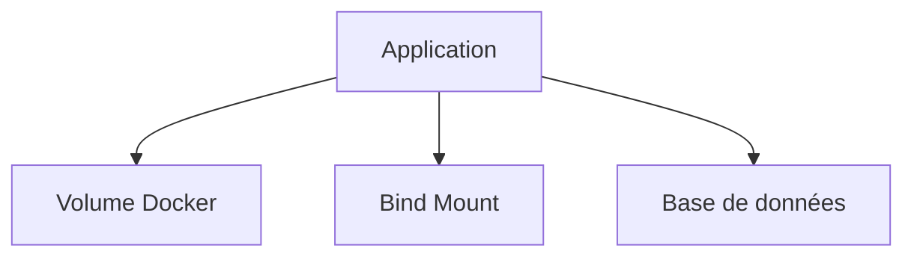

# Stratégies de stockage

## Objectifs pédagogiques

- Comprendre les différentes stratégies de stockage  
- Savoir choisir entre volume, bind mount et base de données  
- Identifier les erreurs d’architecture  
- Mettre en place un stockage adapté au contexte  

---

## Contexte et problématique

Tu sais maintenant :

- utiliser des volumes  
- utiliser des bind mounts  
- partager des données  

👉 Mais une question essentielle reste :

👉 **quelle solution choisir ?**

---

## Définition

Une stratégie de stockage correspond au choix de :

👉 **où et comment stocker les données d’une application**

---

## Architecture

---

## Les différentes stratégies

### 1 — Volume Docker

👉 Utilisation :

- données persistantes  
- bases de données  
- production  

✔️ Avantages :
- isolé  
- sécurisé  
- portable  

❌ Inconvénients :
- moins visible côté utilisateur  

---

### 2 — Bind mount

👉 Utilisation :

- développement  
- accès direct aux fichiers  

✔️ Avantages :
- modification en temps réel  
- facile à utiliser  

❌ Inconvénients :
- dépend du système local  
- moins sécurisé  

---

### 3 — Base de données

👉 Utilisation :

- données structurées  
- applications complexes  

✔️ Avantages :
- gestion avancée  
- cohérence  

❌ Inconvénients :
- plus complexe  
- nécessite un service dédié  

---

## Fonctionnement interne

💡 Astuce  
Chaque type de stockage répond à un besoin différent.

⚠️ Erreur fréquente  
Utiliser des bind mounts en production.

💣 Piège classique  
Stocker des données critiques dans le conteneur lui-même.  
👉 Les données sont alors perdues dès que le conteneur est supprimé.  
👉 Cela peut entraîner une perte totale d’information en production.  
👉 Toujours externaliser les données importantes.

🧠 Concept clé  
Le stockage doit être indépendant du conteneur

---

## Cas réel

Application web complète :

- API → conteneur  
- DB → volume Docker  
- code → bind mount (dev)  

👉 Chaque type de stockage a un rôle précis

---

## Bonnes pratiques

- utiliser volumes pour données persistantes  
- utiliser bind mounts uniquement en dev  
- utiliser des bases de données pour données critiques  
- séparer clairement code et données  

---

## Résumé

Une bonne stratégie de stockage permet de :

- sécuriser les données  
- améliorer la performance  
- éviter les pertes  

👉 Le choix dépend du contexte  

---

## Notes

*Stratégie de stockage : manière de gérer les données d’une application
