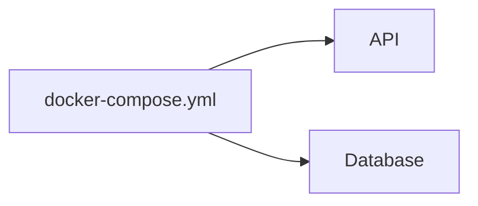

# Docker Compose — Introduction par un projet réel

## Objectifs pédagogiques

- Comprendre pourquoi Docker Compose est nécessaire  
- Lancer plusieurs conteneurs avec un seul fichier  
- Comprendre la structure d’un fichier docker-compose.yml  
- Mettre en place une stack simple (API + DB)  

---

## Contexte et problématique

Jusqu’ici, tu faisais :

```bash
docker network create app-net

docker run -d --name db --network app-net postgres

docker run -d --name api --network app-net mon-api
```

👉 Problèmes :

- long à écrire  
- difficile à maintenir  
- non reproductible facilement  

---

## Définition

### Docker Compose*

Docker Compose permet de :

👉 **définir et lancer plusieurs conteneurs avec un seul fichier**

---

## Architecture



👉 Un seul fichier → toute l’architecture

---

## Exemple concret

Créer un fichier `docker-compose.yml` :

```yaml
version: "3"

services:
  db:
    image: postgres
    container_name: db

  api:
    image: mon-api
    container_name: api
```

---

## Commandes essentielles

### Lancer la stack

```bash
docker compose up
```

---

### Mode détaché

```bash
docker compose up -d
```

---

### Arrêter la stack

```bash
docker compose down
```

---

## Fonctionnement interne

💡 Astuce  
Compose recrée automatiquement le réseau entre services.

⚠️ Erreur fréquente  
Penser qu’il faut créer le réseau manuellement.

💣 Piège classique  
Modifier les conteneurs manuellement au lieu de modifier le fichier compose.  
👉 Cela casse la cohérence du projet.  
👉 Le fichier compose doit rester la source de vérité.

🧠 Concept clé  
Compose = description déclarative de ton architecture

---

## Cas réel

Projet classique :

- API  
- base de données  
- éventuellement un frontend  

👉 Tout est défini dans un seul fichier

---

## Bonnes pratiques

- Toujours utiliser docker-compose pour multi-conteneurs  
- Versionner le fichier YAML  
- Ne pas modifier les conteneurs à la main  
- Garder une structure claire  

---

## Résumé

Docker Compose permet de :

- simplifier les commandes  
- structurer une architecture  
- lancer plusieurs services facilement  

👉 C’est indispensable pour les projets réels  

---

## Notes

*Docker Compose : outil permettant de gérer plusieurs conteneurs avec un fichier YAML

---

<!-- snippet
id: docker_compose_up_detached
type: command
tech: docker
level: intermediate
importance: high
format: knowledge
tags: compose,stack,daemon
title: Lancer une stack Compose en arrière-plan
command: docker compose up -d
description: Lance tous les services définis dans docker-compose.yml en mode détaché (arrière-plan).
-->

<!-- snippet
id: docker_compose_down
type: command
tech: docker
level: intermediate
importance: high
format: knowledge
tags: compose,stack,cleanup
title: Arrêter et supprimer une stack Compose
command: docker compose down
description: Arrête les conteneurs et supprime les réseaux créés par Compose.
-->

<!-- snippet
id: docker_compose_definition
type: concept
tech: docker
level: intermediate
importance: high
format: knowledge
tags: compose,orchestration
title: Docker Compose — définir et lancer plusieurs conteneurs
content: Outil permettant de définir et lancer plusieurs conteneurs avec un seul fichier YAML (docker-compose.yml). Chaque service = un conteneur.
-->

<!-- snippet
id: docker_compose_source_of_truth
type: warning
tech: docker
level: intermediate
importance: medium
format: knowledge
tags: compose,bonnes-pratiques
title: Ne jamais modifier les conteneurs à la main
content: Modifier un conteneur manuellement casse la cohérence avec le fichier Compose. Le fichier docker-compose.yml doit rester la seule source de vérité.
-->

<!-- snippet
id: docker_compose_auto_network
type: tip
tech: docker
level: intermediate
importance: medium
format: knowledge
tags: compose,reseau
title: Réseau automatique entre services Compose
content: Compose crée automatiquement un réseau partagé entre tous les services. Pas besoin de docker network create manuellement.
-->
